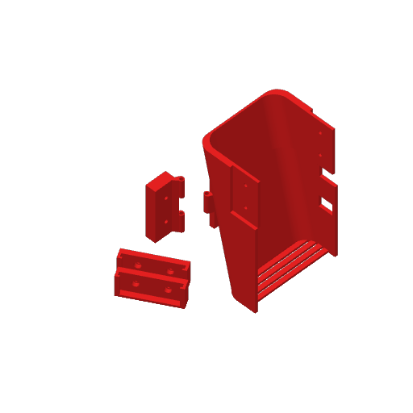

# 3D models

[`BlueWave_main_body_v2.3mf`](BlueWave_main_body_v2.3mf) is our print project for the body shell and the sensor brackets, version 2. It is a Bambu Studio 02.01.01.52 project saved on 20 November 2025, with five parts on one plate.

*Plate preview stored in the project file.*

The raised "AUMers" lettering and the logo on this body are from AUMers, the name our club and team used before we competed as Blue Wave. The design is ours; the same lettering shows on the printed shell in `docs/components.jpg`.

## Parts in the file

Sizes are the bounding boxes of the meshes stored in the file, in each part's own axes.

| Part name in the file | Copies | Bounding box (mm) | Triangles | Part |
|---|---|---|---|---|
| `wro main body v2.step` | 1 | 79.0 × 123.0 × 58.0 | 52,418 | Body shell |
| `us bracket wro v2.step` | 2 | 32.7 × 47.4 × 19.0 | 7,256 each | Ultrasonic sensor bracket |
| `us brackeetXpixy v2.step` | 1 | 49.3 × 15.3 × 23.5 | 8,344 | Ultrasonic sensor and Pixy2 bracket |
| `pixy bracket wro.step` | 1 | 49.3 × 6.7 × 29.7 | 3,008 | Pixy2 bracket |

The two ultrasonic brackets and the combined bracket give three ultrasonic mounts, the same count as the HC-SR04 sensors on the car. Where each sensor points is in [docs/02-power-and-sensors.md](../docs/02-power-and-sensors.md).

## Print settings

These are the values saved in `Metadata/project_settings.config`. Supports are the only setting we changed from the Bambu preset.

| Setting | Value |
|---|---|
| Printer | Bambu Lab X1 Carbon, 0.4 mm nozzle |
| Process preset | 0.24mm Draft @BBL X1C |
| Layer height | 0.24 mm, first layer 0.20 mm |
| Walls | 2 loops, 4 top and 3 bottom shell layers |
| Sparse infill | 15 %, grid pattern |
| Supports | On, tree (auto), 35° overhang threshold |
| Build plate | Textured PEI, auto brim 5 mm |
| Filament | Generic PETG, 1.75 mm, colour #F72323 |
| Temperatures | Nozzle 255 °C, plate 70 °C |

## Opening the file

Bambu Studio 02.01.01.52 or newer opens the project with the plate and the settings above. A `.3mf` is a zip archive with the meshes in `3D/Objects/object_1.model` to `object_4.model`, so any 3MF reader opens the geometry; only Bambu Studio reads the print settings. The saved filament colour is red, and the car we race has an orange body ([Mobility](../docs/01-mobility.md#what-changed-since-june)).
