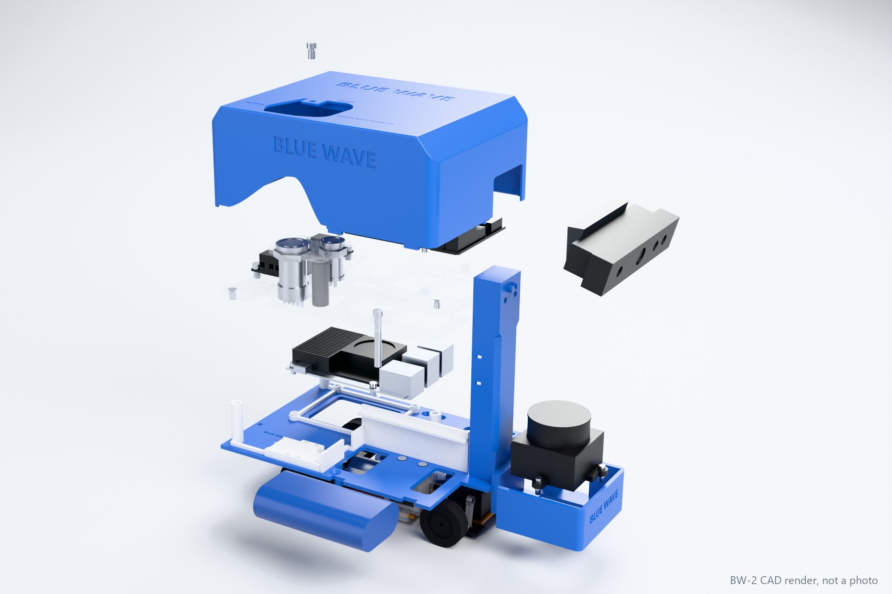

# 3D models: the BW-2 body

The body of our car is BW-2, designed by the team for the WLtoys 1:28 chassis and the MentorPi electronics, and printed
in PETG. Five printed parts are on the car. GitHub shows each STL file in a 3D viewer when you open it.

  
   CAD render, not a photo.

## Printed parts on the car

Material PETG, 0.4 mm nozzle. Print times and masses are slicer estimates. The colour is the one we printed; the file
names keep the colour of the CAD model so that they still match the SHA-256 hashes we recorded for each printed file.

| File | Part | Printed colour | Layer / walls / infill | Supports | Time | Mass |
|---|---|---|---|---|---|---|
| `01_D1_deck_darkgrey.stl` | deck that mounts on the chassis; unchanged from our first body version | blue | | | | 40.9 g |
| `02_L1_frame_battery_tray_darkgrey.stl` | frame and battery tray, with the Pi 5 bosses and the battery bay | white | 0.2 mm / 4 / 40 % | none | 42 min | 14.0 g |
| `04_tower_blue.stl` | tower: camera mast and lidar bay in one print, with 4 lapped datum pads | blue | 0.2 mm / 4 / 40 %, 5 mm brim | enforcer under the foot; blockers in the bores and the cable channel | 115 min | 33.3 g |
| `05_shell_blue.stl` | shell: one print, flat roof, 1.2 mm skin | blue | 0.2 mm / 3 lines of 0.40 mm / 15 % | none | 164 min | 60.6 g |
| `07_cam_wedge_16deg_darkgrey.stl` | camera wedge, 16° | dark grey | 0.12 mm / 5 / 50 % | none | 32 min | 7.9 g |

Total: 157 g of PETG; 353 min of printing for parts 02, 04, 05 and 07.

## What the parts set

| Feature | Value | Set by |
|---|---|---|
| Lidar scan plane | 50.0 mm above the mat, below the top of the 100 mm walls | tower (lidar bay) |
| Lidar position | centre line, 152.0 mm ahead of the rear axle | tower |
| Camera lens | 149.4 mm ahead of the rear axle, 138.28 mm above the mat | tower (mast) |
| Camera pitch | 16° in the model; 19.61° measured on the car | wedge on the mast |
| Overall size | 224.8 × 111.0 × 157.2 mm | whole body |

All values are from the CAD model except the measured pitch. Why these positions: [Mobility](../docs/01-mobility.md#the-bw-2-body)
and [Power and sensors](../docs/02-power-and-sensors.md#sensors).

## Design checks

Run on the full CAD assembly on 2026-09-25 before printing:

| Check | Result |
|---|---|
| Clearance between parts | 91 part pairs, no violation; tightest gap 0.35 mm |
| Contacts | 93 contacts, no part floating |
| Print files | every file a closed single solid |
| Camera view | clear of the body by 22.1 mm |
| Cable routes | 18 of 18 clear |
| Screw access | every screw head reachable in build order |
| Size rule 11.1 | 224.8 × 111.0 × 157.2 mm against 300 × 200 × 300 mm |

## Rule we keep for printed files

A file that has been printed is never edited. A changed part is a new file with a new name, printed and recorded
again. This keeps every printed part traceable to the exact file it came from.

[Back to the README](../README.md)
