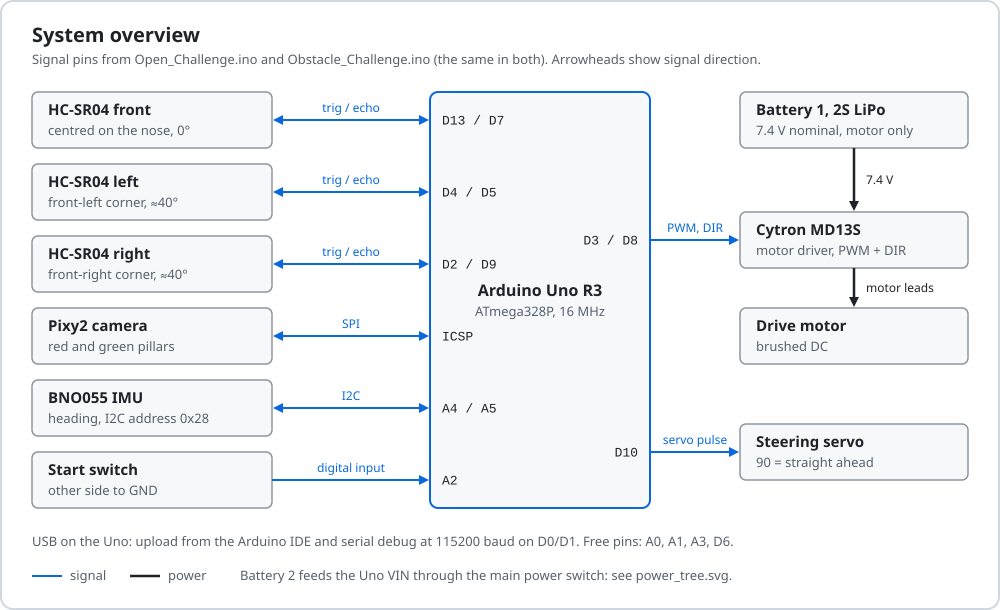
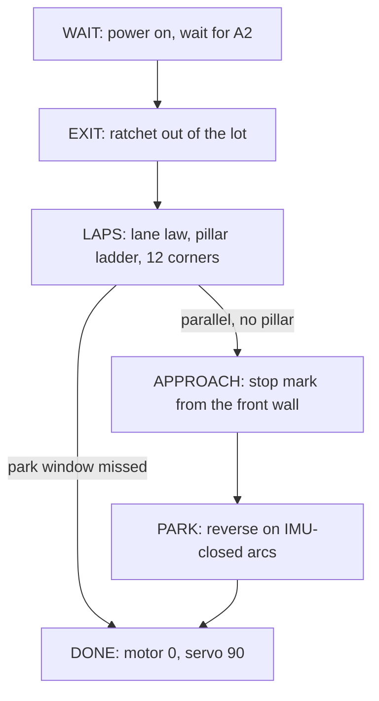

<p align="center">
  
</p>
<p align="center"><sub>Exploded view of the Blue Wave car</sub></p>

<h1 align="center">Blue Wave - WRO Future Engineers 2026</h1>

<p align="center">Team from Kuwait, 1st at the 2026 Kuwait national round, going to the WRO 2026 Asia final in India.</p>

<p align="center">
  
  
  
</p>

We are Fawaz Alasousi and Dawood AlEneezi, coached by Shinu Mathew. Our car is a 1:28-class RC chassis, about 200 × 125 mm, with Ackermann steering and one brushed DC motor. One Arduino Uno R3 reads three HC-SR04 ultrasonic sensors, a BNO055 IMU and a Pixy2 camera, and runs a separate sketch for each challenge.

## Documentation by Appendix C criterion

Appendix C of the [2026 rules](https://wro-association.org/wp-content/uploads/WRO-2026-Future-Engineers-Self-Driving-Cars-General-Rules.pdf) (p.44-54) scores the documentation on five criteria, 0, 2, 4 or 6 points each, for 30 of the 122 points (rule 10.2, p.21).

| Criterion | Page | What it holds |
|---|---|---|
| 1. Mobility | [Mobility and mechanical design](docs/01-mobility.md) | Size and lot geometry, break-away test (PWM 15, 18, 25), speed fitted to a real 23 s run, steering geometry, what is still unmeasured |
| 2. Power and sensors | [Power and sensor architecture](docs/02-power-and-sensors.md) | Power tree, current estimate, the 40-degree side sonars and their effects, Pixy2 range constants, calibration, failure handling |
| 3. Software and obstacle strategy | [Software architecture and obstacle strategy](docs/03-software-and-strategy.md) | Module maps, Open flowchart, Obstacle state machine, pillar ladder, front-wall park, edge cases, origin of every constant |
| 4. Systems thinking and decisions | [Systems thinking and engineering decisions](docs/04-engineering-decisions.md) | Constraints, decision log, version history, what failed, risks, next steps |
| 5. Reproducibility and GitHub quality | [Build, test and reproduce](docs/05-build-test-reproduce.md) | Parts, library versions, flash sizes, bench checklist, mat and simulation results, how to repeat each number |

## The car

| Item | Value | Source |
|---|---|---|
| Size | About 200 × 125 mm; rule limit 300 × 200 × 300 mm, 1.5 kg (rules 11.1, 11.2) | Team measurement, 14 Sep 2026 |
| Chassis | WLtoys 1:28-class RC chassis, four wheels | Team |
| Controller | Arduino Uno R3: ATmega328P, 32,256 B flash, 2,048 B RAM | Datasheet |
| Drive | One brushed DC motor, Cytron MD13S driver (PWM D3, direction D8), race setting PWM 30 | Firmware |
| Steering | Servo on D10, Ackermann front axle; 30-160 while driving, 10 and 170 when parking | Firmware |
| Distance | 3 × HC-SR04: front straight ahead; left and right on the nose corners, about 40° from the axis | Team drawing, 14 Sep 2026 |
| Heading | BNO055 IMU on I2C (A4, A5) | Firmware |
| Camera | Pixy2 on SPI (ICSP header): signature 1 red pillar, 2 green pillar | Firmware |
| Battery | 2S LiPo, 7.4 V nominal | Team |
| Start | Waits for a change on A2 after power-on (rules 9.10, 9.11) | Firmware |
| Speed at PWM 30 | About 998 mm/s, fitted to one timed 23 s three-lap Open run | Simulator fit to a real run |
| Code | Open: 283 lines, 15,136 B flash. Obstacle: 1,103 lines, 29,604 B | Arduino IDE compiler, 15 Sep 2026 |

<p align="center">
  
</p>

## Strategy in brief

### Open Challenge

A PD law on the left minus right side sonars keeps the lane at PWM 30: servo = 90 + 0.6·e + 0.05·Δe. At 48 cm from the front wall the car slows to PWM 25 and turns, reaching full servo travel at 18 cm. When the two side readings agree within 3 cm, a vote of the corners already driven picks the side. The BNO055 counts 12 corners, each at 70 of its 90 degrees, then the car stops on the front range in the start straight. Straights that stayed calm in lap 1 run at PWM 38 in laps 2 and 3.

### Obstacle Challenge



We start in the lot for 7 points (item 1.8.1, p.21). The shorter side reading picks the outer wall and the direction, and the car ratchets out until its heading is 50 degrees out. On the laps, the nearest red or green Pixy2 block within 900 mm sets the servo from a six-step ladder: 40 to 78 passes a red pillar on its right, 102 to 140 passes a green pillar on its left. With no pillar in view the Open law drives. In laps 2 and 3 the left minus right set-point shifts by 20 cm toward the side the lap-1 pillar map needs. If the front reads 15 cm or less and the heading has not moved 3 degrees in 0.7 s, the car reverses at opposite lock.

### Parking

After 12 corners, parallel and with no pillar in view, the car stops at a front-wall range of 820 mm (lot on the right) or 1,520 mm (lot on the left). Those marks come from our measurements of 1.0 m and 1.7 m from that wall to the downstream limiter. The car measures its real step length, solves an entry angle between 36 and 64 degrees, and reverses in on arcs closed on the IMU heading. Each move is first checked against a model of the lot with a 12 mm margin. The park has run only in simulation, and four items in the sketch header are marked MEASURE.

### Code modules and the parts they use

| Module | Functions | Parts |
|---|---|---|
| Start and fault code (both sketches) | `waitStart()`, `signalServo()` | Start switch on A2; servo wiggle codes |
| Sensing and motor output (both) | `getStableDistance()`, `runMotor()` | 3 × HC-SR04; Cytron MD13S and motor |
| Heading and corner count | `readYaw()`, `lapsCount()`; inline in Open's `loop()` | BNO055 |
| Lap law: lane, corners, pillars, map, stuck recovery | `lapStep()`; Open's `loop()` without pillars | HC-SR04s, Pixy2, servo, MD13S |
| Pillar range, limiter rejection | `signDistance()`, `looksLikeBarrier()` | Pixy2 |
| Outer wall and lot exit | `parkPickSide()`, `startTick()` | Side HC-SR04s, servo, MD13S, BNO055 |
| Approach and park | `approachStep()`, `parkRun()`, `parkArcTo()`, `parkStep()`, `bayClear()` | Front and wall-side HC-SR04, BNO055, servo, MD13S |

State diagrams, flowcharts and constants: [Software and strategy](docs/03-software-and-strategy.md) and [`src/README.md`](src/README.md).

## Results

We placed 1st at the WRO Future Engineers 2026 Kuwait national round in June 2026.

### On the mat since then

| Date | Code | What happened |
|---|---|---|
| 2 Sep 2026 | `obstacle_kuwait`, as listed in our notes | Three full Obstacle laps, one light touch on one pillar |
| 6 Sep 2026 | 6 September parking build | Lot exit worked. No park: the lap total was zeroed at the handover (fixed as fix 26) |
| By 11 Sep 2026 | `open_kuwait`, PWM 30 | Three Open laps in about 23 s |
| 14 Sep 2026 | Finals build of that day | The car did not move; four causes found and fixed ([version history](docs/04-engineering-decisions.md#version-history)) |
| 15 Sep 2026 | v20 sketches in `src/` | Not yet run on the mat |

### In simulation

> Our `real2` simulator runs the unchanged sketches against a model of this car. It fails two of its three fidelity gates: `obstacle_kuwait`, listed in our notes as the national-round code, finishes three laps in 1 of 60 simulated rounds. We use these numbers only to compare code versions.

| Sketch | Test | Result in simulation |
|---|---|---|
| Open v20 | Paired with `open_kuwait` on the same seeds | 37/40 against 21/40 |
| Open v20 | Final file, 40 fresh seeds | 36/40, lap-3 median 25.6 s |
| Open v20 | All 32 draw cells, 320 runs | 287/320 scored 30/30 |
| Obstacle v20 | 120 starts in the lot | Exit 119/120, three laps 12/120, 3 partial parks, 0 full |
| Obstacle v20 | Park only, from the lap-3 handover pose, 16 runs | 4 full parks, limiter touched in about half |

### In India

We will run the two sketches in `src/` with `PRACTICE 0`, start the Obstacle round in the lot and attempt the parallel park. Rule 9.9 forbids calibration in preparation time, so we train the Pixy2 signatures and set the park constants in the practice rounds. Our fallback if the Obstacle sketch fails in practice is in the [risk table](docs/04-engineering-decisions.md#risks-and-mitigations).

Our current videos are from June 2026, before the v20 sketches: [Open Challenge](https://youtube.com/shorts/_rmwh_EwI1A) (about 39 s of autonomous driving) and [Obstacle Challenge](https://youtube.com/shorts/2quu5O000I0) (about 32 s). Clip lengths and local copies are in [`videos/`](videos/).

## Repository map

```text
.
├── README.md
├── docs/               criterion pages 01 to 05
│   ├── diagrams/       system, sensors, wiring, power
│   ├── arena/          3D model of the 2026 field
│   ├── images/         exploded view of the car
│   └── team_photos/    work sessions, June 2026
├── src/                the two competition sketches
├── Models/             print project: v2 body, brackets
├── Schemes/            June 2026 wiring PDF
├── Vehicle_Photos/     file list for the six views
└── videos/             June 2026 clips and links
```

## Build and upload

1. **Board.** Install Arduino IDE 2.3.10 and the *Arduino AVR Boards* core 1.8.8. Select *Arduino Uno* (`arduino:avr:uno`).
2. **Libraries.** From the Library Manager: Adafruit BNO055 1.6.4, Adafruit Unified Sensor 1.1.15, Adafruit BusIO 1.17.4, NewPing 1.9.7, Servo 1.3.0. Add the Pixy2 Arduino library by hand (it has no version metadata), then rename `ZumoBuzzer.cpp` and `ZumoMotors.cpp` in its folder to `.cpp.bak`. Neither sketch uses them, and they add 1,674 B to each build.
3. **Start mode.** Check for `#define PRACTICE 0`: line 36 in `src/Open_Challenge/Open_Challenge.ino`, line 62 in `src/Obstacle_Challenge/Obstacle_Challenge.ino`. `PRACTICE 1` also starts the car 3 s after power-up, which breaks rule 9.11.
4. **Verify and upload** over USB. Expected flash: 15,136 B for Open and 29,604 B for Obstacle, of 32,256 B. Without the rename in step 2: 16,810 B and 31,278 B. The same build from a terminal:
   ```sh
   arduino-cli compile --fqbn arduino:avr:uno src/Obstacle_Challenge
   arduino-cli upload -p <port> --fqbn arduino:avr:uno src/Obstacle_Challenge
   ```
5. **Pixy2 and power-on check.** In PixyMon, train signature 1 on a red pillar, 2 on a green pillar and 3 on a magenta limiter, under the venue light. Switch on: one servo wiggle means ready, two wiggles repeating means the BNO055 is not answering. With `PRACTICE 0` the car must stay still until the A2 switch changes.

Serial checks at 115200 baud, the bench checklist and the testing workflow: [Build, test and reproduce](docs/05-build-test-reproduce.md).

## Team

- Fawaz Alasousi (فواز العسعوسي)
- Dawood AlEneezi (داود العنزي)

Coach: Shinu Mathew

## Team checklist

- [ ] Six photos of the car as it competes, a team photo, and a parts photo of this car to replace `docs/components.jpg` (file names in [`Vehicle_Photos/`](Vehicle_Photos/README.md))
- [ ] Mat batch on v20 (10 Open, 20 Obstacle runs, one serial log) and two YouTube videos with `PRACTICE 0`, each with at least 30 s of autonomous driving
- [ ] Measure height, mass, wheelbase, track, wheel diameter, turning radius at both locks, battery capacity and current draw
- [ ] Measure the park constants on a mat: `LOT_RIGHT_MM`, `R_PARK_MM`, `CAR_NOSE_MM`, `PARK_LANE_MM` and the side-sonar fits
- [ ] Confirm the chassis model, driven axles, motor and servo models, Pixy2 version, Uno power path and the start switch on A2
- [ ] Write down the reasons we chose this chassis, an Arduino-only design, HC-SR04 sonars and a Pixy2
- [ ] Pick the backup sketch for India, give it the A2 start and commit it (rule 7)
- [ ] STEP or STL exports of the body parts, and the engineering journal (Appendix C.2)
- [ ] National-round scores, Asia final dates and documentation deadline; turn on GitHub Pages for `docs/arena/`
