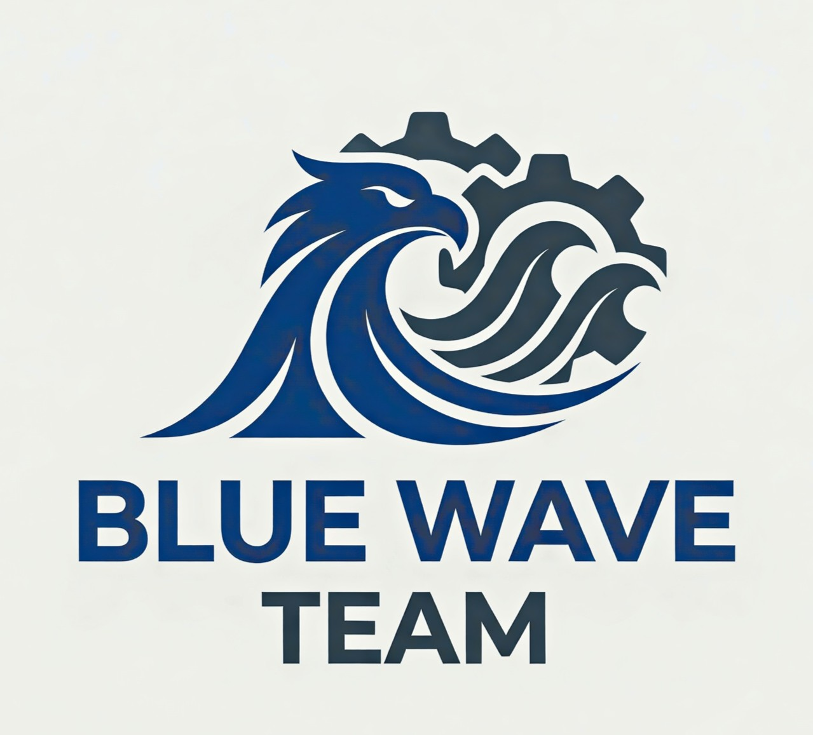
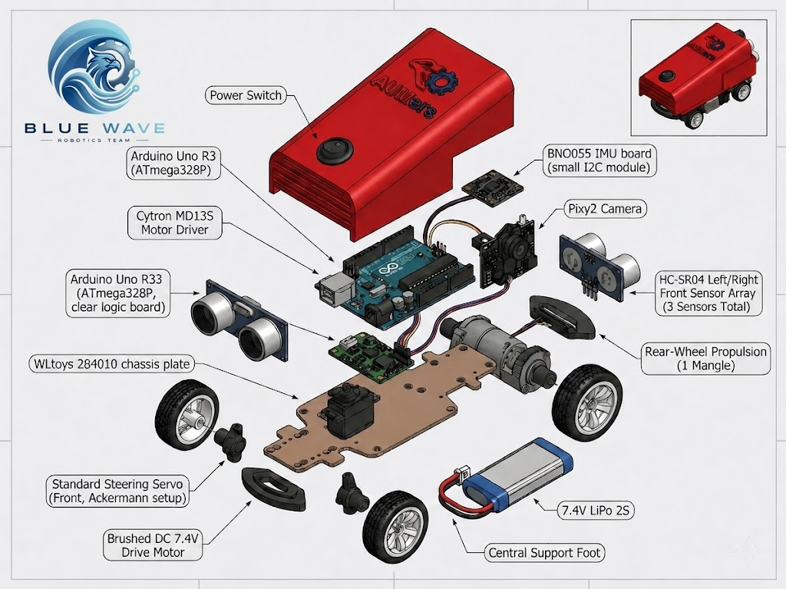
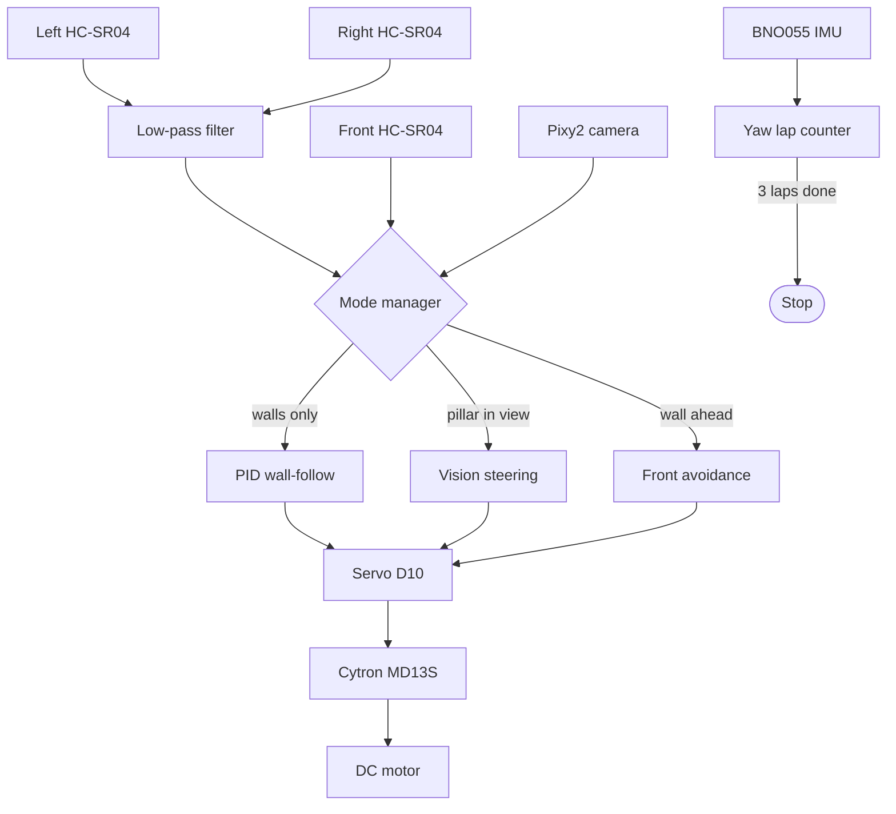
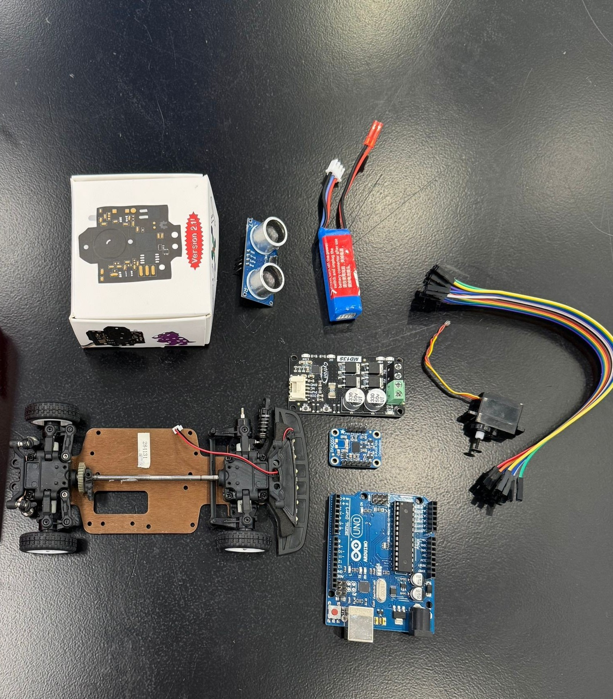
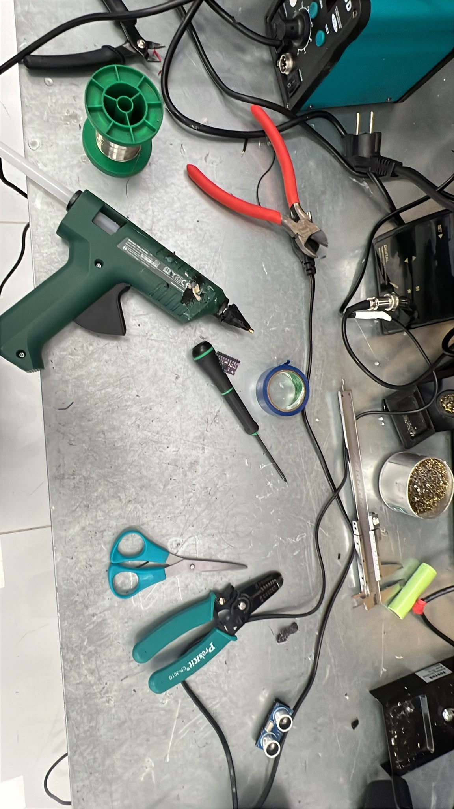

<div align="center">



# T R A C E R

**a self-driving robot car by Blue Wave Robotics**
WRO Future Engineers · Kuwait National Round · 4 June 2026

> *Trace the line · hold the center · never stop.*

`Arduino Uno` &nbsp;·&nbsp; `3× HC-SR04` &nbsp;·&nbsp; `Pixy2` &nbsp;·&nbsp; `BNO055` &nbsp;·&nbsp; `Cytron MD13S` &nbsp;·&nbsp; `C / C++`



</div>

<p align="center">
<a href="#1-meet-tracer">Meet Tracer</a> &nbsp;•&nbsp;
<a href="#2-how-tracer-drives">Driving</a> &nbsp;•&nbsp;
<a href="#3-how-tracer-sees">Sensing</a> &nbsp;•&nbsp;
<a href="#4-the-decision-loop">Decision Loop</a> &nbsp;•&nbsp;
<a href="#5-build-and-wiring">Build</a> &nbsp;•&nbsp;
<a href="#6-tested-on-the-track">Testing</a> &nbsp;•&nbsp;
<a href="#7-see-it-run">Video</a> &nbsp;•&nbsp;
<a href="#8-behind-tracer">Team</a>
</p>

<br/>

## 1. Meet Tracer

Tracer is a small, fully autonomous model car. Drop it on a closed track, press one button, and it drives three complete laps on its own — staying centered between the walls, reading randomly placed red and green pillars, and never touching a thing.

We named it **Tracer** because that is the whole idea: *trace* the cleanest possible line, lap after lap. It darts between the walls, slips past every pillar on the correct side, and snaps straight again the instant the path is clear.

Everything on the car answers to one tiny brain — an Arduino Uno — that fuses three ultrasonic sensors, an IMU, and a Pixy2 vision camera sixty-something times a second to decide exactly how much to steer.

| At a glance | |
|---|---|
| **Brain** | Arduino Uno (ATmega328P · 16 MHz) |
| **Drive** | Brushed DC motor + Cytron MD13S, rear-wheel drive |
| **Steering** | Front servo, Ackermann geometry |
| **Senses** | 3× HC-SR04 ultrasonic · BNO055 IMU · Pixy2 camera |
| **Power** | 7.4 V 2S LiPo |
| **Size / mass** | ~17 × 9 × 7 cm · ~0.5 kg — well inside the 30×20×30 cm / 1.5 kg limits |
| **Code** | C / C++ on Arduino IDE |

<br/>

## 2. How Tracer Drives

The car keeps itself centered with a **PID wall-follower**. Every cycle it compares the left and right wall distances; the difference is the steering error. A proportional term reacts to where the car is now, a derivative term anticipates where it is heading, and a clamped integral term trims any constant drift.

```text
error      = leftDistance − rightDistance        (after low-pass filtering)
integral   = clamp( integral + error, ±I_MAX )
derivative = error − lastError
output     = KP·error + KI·integral + KD·derivative
servoAngle = 90° + output                         (clamped to 30°…160°)
```

What keeps it smooth and crash-resistant on a real track:

- **Filtered distances** — a light low-pass filter (α = 0.9) takes the jitter out of the ultrasonic readings before they ever reach the controller.
- **Integral clamp (±80)** — stops the I-term from winding up on long straights.
- **Slew-limited steering (6°/step)** — the servo eases into vision corrections instead of snapping, which kills oscillation.
- **Never-stop front avoidance** — if the front sensor sees a wall closer than 28 cm, Tracer doesn't brake; it slows and turns toward whichever side has more room, then resumes.
- **Lost-echo fallback** — if one side sensor returns nothing (an angled or dark wall), the controller borrows the opposite side or the last good reading instead of freezing.

<br/>

## 3. How Tracer Sees

Three jobs — *stay centered*, *don't hit the wall ahead*, and *read the pillars* — are split across purpose-placed sensors.

| Sensor | Where it sits | Why it's there |
|---|---|---|
| HC-SR04 (left & right) | flat on each side | the two distances that feed the wall-following error |
| HC-SR04 (front) | facing forward | catches the wall at the end of a straight so the car turns in time |
| BNO055 IMU | on the chassis tray | integrates yaw to count exactly three laps, then stops the motor |
| Pixy2 camera | raised above the body | spots red and green pillars by trained color signature |

**Reading the pillars.** The Pixy2 is trained on two signatures under real arena lighting — red as signature 2, green as signature 1. For every frame Tracer takes the largest valid block and decides a side to pass on:

| Pillar | Rule | What the car does |
|---|---|---|
| 🟢 Green (sig 1) | keep the pillar on the **right** | steer **left**, toward servo 140° |
| 🔴 Red (sig 2) | keep the pillar on the **left** | steer **right**, toward servo 40° |

The pillar's horizontal position in the frame is read every cycle, so the steering can be eased as the pillar slides toward the edge — the car passes it and straightens out instead of circling it.

<br/>

## 4. The Decision Loop

Both challenge programs share one control core. A **mode manager** decides, every cycle, who is allowed to steer: the wall-follower, the vision avoider, or the front-avoidance routine — with hysteresis so it never flickers between them.



**Mode-switching rules**

- Hands control to **vision** after **2** consecutive valid pillar detections.
- Returns to **wall-follow** after **3** consecutive misses.
- A **280 ms** minimum hold time blocks rapid back-and-forth.
- A pillar only counts if its blob area ≥ **200 px²** and sits inside the trusted X band of the frame.

**The numbers that make it work**

| Knob | Value | What it does |
|---|---|---|
| `KP` / `KD` / `KI` | 0.6 / 0.05 / 0.0 | wall-following gains (I disabled, D light) |
| `I_MAX` | 80 | integral wind-up clamp |
| `MOTOR_SPEED` | 30 | cruising PWM |
| `MOTOR_SPEED_AVOID` | 20 | PWM while squeezing past an obstacle |
| `FRONT_AVOID_CM` | 28 | distance that triggers front avoidance |
| `CENTER_ANGLE` | 90° | servo straight-ahead |
| `MIN…MAX_SERVO_ANGLE` | 30°…160° | full right … full left |
| `ALPHA` | 0.9 | side-distance filter strength |
| `SERVO_SLEW_DEG_PER_STEP` | 6° | how fast vision corrections build up |

<br/>

## 5. Build and Wiring

The platform is a WLtoys 284010 (1:28 RC chassis) wearing a custom 3D-printed shell, electronics tray, and sensor mounts.

| Part | Choice | Job |
|---|---|---|
| Microcontroller | Arduino Uno (ATmega328P) | runs the whole control loop |
| Motor driver | Cytron MD13S | speed + direction for the DC motor |
| Drive motor | brushed DC, 7.4 V | rear-wheel propulsion |
| Steering | standard servo | front Ackermann steering |
| Distance | 3× HC-SR04 | left / right / front |
| Heading | BNO055 IMU | yaw → lap counting |
| Vision | Pixy2 (SPI) | red / green pillar detection |
| Battery | 7.4 V 2S LiPo | single power source |

<div align="center">

<br/><sub>Every part before assembly — 3D-printed body, RC chassis, Arduino Uno, Cytron MD13S, Pixy2, BNO055, HC-SR04, servo, and the 2S LiPo.</sub>
</div>

**Power path**

```text
LiPo 7.4 V ─┬─→ Cytron MD13S  →  DC motor
            └─→ Arduino Vin  →  5 V rail  →  servo · 3× HC-SR04 · Pixy2 · BNO055 (3.3 V)
```

**Pin map**

| Connection | Pins |
|---|---|
| HC-SR04 left | TRIG D4 · ECHO D5 |
| HC-SR04 right | TRIG D2 · ECHO D9 |
| HC-SR04 front | TRIG D6 · ECHO D7 |
| Steering servo | SIG D10 |
| Cytron MD13S | PWM D3 · DIR D8 |
| Pixy2 | SPI over the ICSP header |
| BNO055 | I2C — SDA A4 · SCL A5 |

Full schematic: [`Schemes/`](Schemes/) · printable models: [`Models/`](Models/)

<div align="center">

<br/><sub>Where Tracer comes together — soldering iron, glue gun, cutters, and a bench full of sensors.</sub>
</div>

```text
repo
├── src/Open_Challenge        wall-following build
├── src/Obstacle_Challenge     wall-following + vision build
├── Vehicle_Photos             six-angle gallery
├── Models                     3D body + mounts (.3mf)
├── Schemes                    wiring schematic
├── videos                     run footage
└── docs                       logo + team photos
```

<br/>

## 6. Tested on the Track

Tuning happened on the real mat, one variable at a time:

- **Servo center** — found the true 90° that drives dead straight.
- **Motor dead-zone** — found the lowest PWM the wheels actually move at.
- **Side-filter (α) + slew rate** — dialed until the wall-following stopped zig-zagging.
- **KP then KD** — raised P for response, added just enough D to settle it.
- **Pixy color training** — trained red and green under the arena's own lighting.
- **Front-avoidance distance** — set the 28 cm trigger from repeated corner runs.
- **Full runs** — three clean laps for the open track, then every red/green pillar position for the obstacle track.

**Where it landed**

| Check | Result |
|---|---|
| Three autonomous laps | completed, consistent times ✅ |
| Centering on straights | under ~2 cm deviation ✅ |
| Pillar recognition | >95% under arena lighting ✅ |
| Obstacle passing | clean, no contact ✅ |
| Mode switching | no flicker between wall-follow and vision ✅ |

<br/>

## 7. See It Run

<div align="center">
<table>
  <tr>
    <td align="center">
      <a href="https://youtube.com/shorts/_rmwh_EwI1A"></a><br/>
      <b>Open Challenge</b><br/><sub>three-lap wall-following run</sub>
    </td>
    <td align="center">
      <a href="https://youtube.com/shorts/2quu5O000I0"></a><br/>
      <b>Obstacle Challenge</b><br/><sub>pillar detection + avoidance</sub>
    </td>
  </tr>
</table>
</div>

<sub>Tap a thumbnail to watch on YouTube — raw clips also live in [`videos/`](videos/).</sub>

<br/>

## 8. Behind Tracer

<div align="center">
<table>
  <tr>
    <td align="center"></td>
    <td align="center"></td>
    <td align="center"></td>
  </tr>
  <tr><td colspan="3" align="center"><sub>Blue Wave on the arena, mid-build</sub></td></tr>
</table>
</div>

<div align="center">

### The Crew

<table>
  <tr>
    <td align="center" width="280">
      <b>Fawaz Alasousi</b><br/>
      <sub>فواز العسعوسي</sub>
      <br/><br/>
      <sub>Chassis &amp; hardware · Control algorithm<br/>System integration · Repository</sub>
    </td>
    <td align="center" width="280">
      <b>Bassam Al-Azmi</b><br/>
      <sub>بسام العازمي</sub>
      <br/><br/>
      <sub>Software · Pixy2 vision pipeline<br/>Testing &amp; calibration</sub>
    </td>
  </tr>
</table>

<br/>

🏆 &nbsp; **C O A C H** &nbsp; 🏆

## Prof. Mohammad Sharsheer

*Every clean lap traces back to his guidance —*
*the sharpest, most generous mentor a team could build under.*

<br/>

—

**Blue Wave Robotics · Kuwait 2026**
*small car · clean lines · no excuses*

</div>
