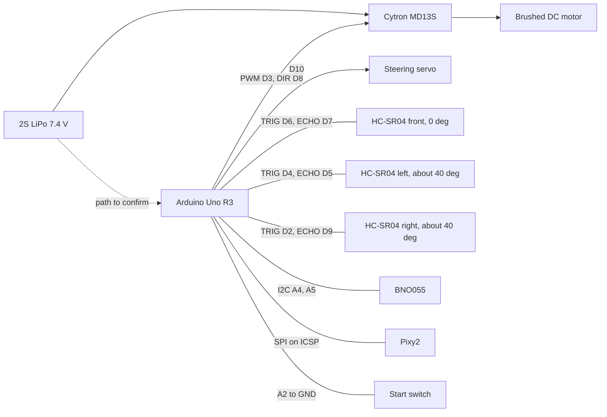
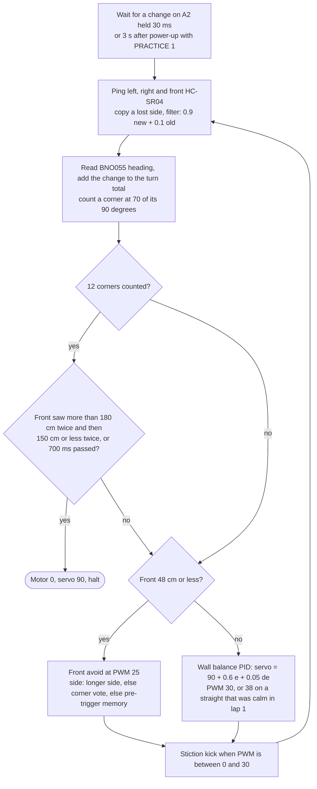
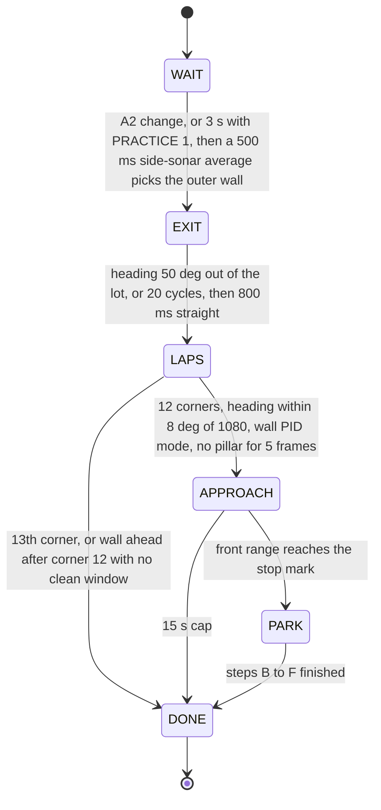
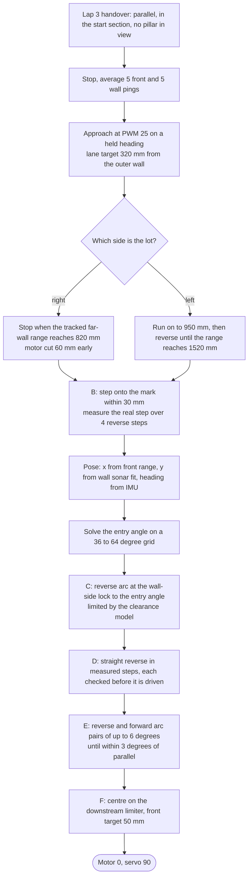

<p align="center">
  
</p>

<p align="center">
  
</p>

<h1 align="center">Blue Wave - WRO Future Engineers 2026</h1>

<p align="center"><b>1st place - WRO Future Engineers 2026 Kuwait National Round - Asia Final, India</b></p>

<p align="center">
  
  
  
</p>

<p align="center"><sub>The top image is a labelled illustration of our orange car, not a photograph or a CAD export. Photographs of the car from all six sides belong in <a href="Vehicle_Photos/">Vehicle_Photos/</a>.</sub></p>

<!-- TODO(team): confirm whether MAVERICK, the lettering on the body, is the official robot name. Until then this README calls it "the orange car". -->
<!-- TODO(team): three labels in the illustration are not verified against the car: "WLtoys 284010 chassis plate", "Rear-Wheel Propulsion (1 Motor)" and "Central Support Foot". -->

We are Blue Wave from Kuwait: Fawaz Alasousi and Dawood AlEneezi, coached by Shinu Mathew. The car we take to the Asia final is the orange car that won the Kuwait national round in June 2026. It is a 1:28-class RC chassis, about 200 × 125 mm, with Ackermann steering and one brushed DC motor on a Cytron MD13S driver. A single Arduino Uno R3 reads three HC-SR04 ultrasonic sensors, a BNO055 IMU and a Pixy2 camera.

The car holds its lane by balancing the left and right sonar distances. It counts laps on the IMU heading, 12 corners with each one counted at 70 of its 90 degrees, and it passes pillars using Pixy2 colour signatures. For the final we built `open_v20` and `obstacle_v20` on top of our national-round code. The Obstacle sketch adds a lot exit at the start and a parallel park that finds the lot from the distance to the wall ahead.

Every number below says where it comes from: measured on the car, read from the firmware, taken from a datasheet, or produced by our simulator. Anything we have not measured yet is marked **TODO**.

## Contents

1. [Where to find each scoring criterion](#1-where-to-find-each-scoring-criterion)
2. [The car at a glance](#2-the-car-at-a-glance)
3. [Mobility management](#3-mobility-management)
4. [Power and sense management](#4-power-and-sense-management)
5. [Obstacle management](#5-obstacle-management)
6. [Software architecture](#6-software-architecture)
7. [Build, compile and upload](#7-build-compile-and-upload)
8. [Testing and validation](#8-testing-and-validation)
9. [Engineering log](#9-engineering-log)
10. [Team](#10-team)
11. [Results](#11-results)
12. [Future design study](#12-future-design-study)
13. [Team TODO checklist](#13-team-todo-checklist)
14. [Credits and references](#14-credits-and-references)

## 1. Where to find each scoring criterion

Appendix C of the 2026 rules (p.44-54) scores the documentation on five criteria, each worth 0, 2, 4 or 6 points, for 30 of the 122 points (rule 10.2, p.21). This table points each criterion to its evidence.

| Criterion (Appendix C) | Sections | Main evidence |
|---|---|---|
| 1. Mobility and mechanical design | [2](#2-the-car-at-a-glance), [3](#3-mobility-management) | Spec table with a source column, steering limits, break-away PWM test, speed fit from a real run, list of what is still unmeasured |
| 2. Power and sensor architecture | [4](#4-power-and-sense-management) | Pin map, system diagram, current estimate, 40-degree sonar geometry and its consequences, calibration steps, failure handling |
| 3. Software and obstacle strategy | [5](#5-obstacle-management), [6](#6-software-architecture) | Open flowchart, Obstacle state machine, pillar ladder, parking sequence, module-to-hardware map, control priority |
| 4. Systems thinking | [9](#9-engineering-log) | Constraints, version history, changes that did not work, risk table, open problems |
| 5. Reproducibility and GitHub quality | [7](#7-build-compile-and-upload), [8](#8-testing-and-validation), [9.6](#96-repository-history) | Library versions, flash sizes, upload steps, start switch and rule 9.11, testing workflow, repository history |

## 2. The car at a glance

| Item | Value | Source |
|---|---|---|
| Length × width | about 200 × 125 mm | Team measurement, 14 Sep 2026 |
| Height, mass | **TODO: measure** | Not measured |
| Rule envelope | at most 300 × 200 × 300 mm and 1.5 kg (rules 11.1, 11.2, p.23) | Rulebook |
| Chassis | WLtoys 1:28-class RC chassis. **TODO: confirm the model number** | Team |
| Drive | One brushed DC motor through the chassis gearbox, one driven axle. **TODO: confirm which axle is driven** | Team spec |
| Motor driver | Cytron MD13S, PWM on D3, direction on D8 | Firmware |
| Steering | Hobby servo on D10, Ackermann front axle. Driving range servo 30-160, parking locks 10 and 170 | Firmware |
| Wheelbase, track, turning radius | **TODO: measure.** The park code assumes a 170 mm radius and marks it "MEASURE" | Not measured |
| Controller | Arduino Uno R3: ATmega328P, 16 MHz, 32,256 B usable flash, 2,048 B RAM | Datasheet |
| Distance sensors | 3 × HC-SR04. Front: straight ahead. Left and right: on the slanted nose corners, about 40 degrees from the nose axis | Team drawing, 14 Sep 2026 |
| Camera | Pixy2 on SPI through the ICSP header. **TODO: confirm version 2.0 or 2.1** | Firmware |
| IMU | BNO055 breakout on I2C (A4/A5), heading only | Firmware |
| Battery | 2S LiPo, 7.4 V nominal. **TODO: capacity from the label** | Team |
| Start input | Switch or button from A2 to GND. **TODO: confirm it is fitted** | Firmware |
| Speed at race PWM 30 | about 998 mm/s (band 867-1176 mm/s), fitted to a real 23 s three-lap Open run | Simulator fit to a real run |
| Code | `open_v20` (283 lines) and `obstacle_v20` (1,103 lines), Arduino C++ | Firmware |

### Bill of materials

| Qty | Part | Job | Price and supplier |
|---|---|---|---|
| 1 | Arduino Uno R3 | Runs both challenge programs | TODO |
| 1 | Cytron MD13S | Drives the motor from PWM + DIR | TODO |
| 1 | Brushed DC motor, part number **TODO** | Propulsion | TODO |
| 1 | Hobby steering servo, model **TODO** | Ackermann steering | TODO |
| 1 | WLtoys 1:28-class RC chassis with wheels and gearbox | Frame, steering linkage, drivetrain | TODO |
| 3 | HC-SR04 ultrasonic sensor | Front, left and right distance | TODO |
| 1 | Pixy2 camera | Pillar colour and position | TODO |
| 1 | BNO055 IMU breakout | Heading for corners and parking arcs | TODO |
| 1 | 2S LiPo battery | Power | TODO |
| 1 | Main power switch, type **TODO** | Rule 9.10: one switch turns the car on | TODO |
| 1 | Start button or switch on A2 | Rule 9.11: one start button | TODO |
| - | Printed body and sensor mounts, files **TODO** | Mounting | TODO |

<p align="center">
  
</p>
<p align="center"><sub>Parts photographed in June 2026, before assembly. The red printed shell in this photo is discussed in section 12.</sub></p>

## 3. Mobility management

### 3.1 Chassis

The car is about 200 mm long and 125 mm wide, so it sits 100 mm inside the 300 mm length limit and 75 mm inside the 200 mm width limit (rule 11.1, p.23). The length also fixes our parking lot. The lot is 1.5 × the robot length and 200 mm wide (p.8), which gives us a 300 mm lot, 50 mm of room at each end when the car is centred, and 75 mm across.

Because the lot scales with the car, a shorter car gets no extra room at the ends: the end clearance is always a quarter of the car length. The width is what we control. At 125 mm the car fills 62.5 % of the 200 mm lot depth.

The RC chassis gives us four wheels, a gearbox and a steering linkage that already match rule 11.3 (p.23): four wheels, one driving axle and one steering actuator. What we lose is information. The chassis has no wheel encoder, and we do not know the motor part number or the gear ratio, so everything we know about speed is indirect (section 3.2).

TODO(team): write down why we chose this chassis over a scratch-built one. Our June notes name the chassis as a WLtoys 284010, but the sticker on the chassis plate in `docs/components.jpg` reads 284131, so the model number needs checking.

### 3.2 Drive, speed and break-away

One brushed DC motor drives the car through the chassis gearbox. The Cytron MD13S takes a PWM signal on D3 and a direction level on D8, with DIR HIGH as forward. The Uno's `analogWrite` is 8-bit, so our race setting of PWM 30 is 30/255 = 11.8 % duty.

**Break-away, measured on this car:** PWM 15 does not move the car from rest, PWM 18 creeps and PWM 25 always moves it. That test changed the code twice:

- the avoid speed went from 15 to 25 in `obstacle_kuwait` (its fix 4);
- both finals sketches add a stiction kick. Whenever the commanded PWM is above 0 and below 30, the motor gets PWM 55 for the first 70 ms, then 70 ms of PWM 55 every 500 ms.

**Speed:** we have no encoder. The only real speed anchor is a stopwatch time: the car drove the three Open laps in about 23 s with `open_kuwait` at PWM 30. Our simulator had assumed 520 mm/s at PWM 30 and predicted 40-48 s for that round. Refitted to the real run, it gives v(PWM 30) ≈ 998 mm/s, band 867-1176 mm/s. That is a fit to one timed run, not a direct measurement.

**Speed against reliability** (simulation): running the whole Open round at PWM 37 finished in about 20 s but succeeded in 28 of 40 rounds, against 34 of 40 at PWM 30. So `open_v20` only speeds up (PWM 38) on straights that stayed calm in lap 1. It drops back to PWM 30 while the next corner is still more than 150 cm away, so every corner starts from the speed proven on the mat.

**Torque:** we cannot give a torque figure yet, because the mass, the gear ratio and the motor part number are all unknown. The break-away test above is the only force-related data we have. TODO(team): weigh the car, identify the motor and gear ratio, and time 1 m runs at PWM 18, 25, 30 and 55 in both directions.

### 3.3 Steering

The steering servo is on D10, driven by the Arduino Servo library. Servo 90 is straight ahead, above 90 steers left and below 90 steers right. While driving, the code limits the servo to 30-160: 70 degrees of servo travel to the left and 60 to the right. The front-avoid law uses exactly those spans (90 + 70 × urgency to the left, 90 - 60 × urgency to the right). The parking code goes past them to full lock at 10 and 170. These servo limits are recorded as checked on the car in our spec file.

In pillar mode the servo moves at most 6 degrees per control loop toward its target, so a new pillar command builds up over several loops instead of jumping.

The road-wheel angle and the turning radius are **not measured**. The park code assumes a rear-axle radius of 170 mm at full lock. Our simulator uses 240 mm at servo 160 and 30. Those are two different unmeasured values, and every parking arc is planned with this number. The measurement takes five minutes: set the servo to 170, push the car slowly around a full circle, mark the path of the rear-axle centre, halve the diameter, then repeat at 10.

### 3.4 Still unmeasured

Height, mass, centre of mass, wheelbase, track, wheel diameter, turning radius at both locks, gear ratio, and the mechanical changes made since June. All are in the [TODO checklist](#13-team-todo-checklist). We list them here because the park constants in section 5.3 are only as good as these numbers.

## 4. Power and sense management

### 4.1 Power

The car runs from a 2S LiPo, 7.4 V nominal. We have not recorded its capacity (TODO: read the label).

**The power path needs confirming before we publish it.** Our two June documents disagree:

- the old README drew LiPo → MD13S and LiPo → Uno Vin;
- `Schemes/README.md` drew LiPo → 5 V buck converter → Uno Vin.

Feeding 5 V into Vin would pass through the Uno's own 5 V regulator, so we will measure the 5 V rail on the car and publish one path (TODO).

The Pixy2 takes its 5 V from the Uno through the ICSP header, because the Pixy2 library's SPI link uses only that header. Our June wiring notes power the three HC-SR04s and the servo from 5 V as well. The BNO055 supply pin is not recorded, and which rail feeds the servo on the orange car is part of the same TODO.

**Current estimate (not measured):**

| Load | Estimate | Basis |
|---|---|---|
| Pixy2 | about 140 mA | Estimate in our audit notes |
| Arduino Uno logic | about 50 mA | Estimate in our audit notes |
| 3 × HC-SR04 | about 15 mA each while pinging | Estimate in our audit notes |
| BNO055 breakout | not estimated | TODO |
| Steering servo | not measured, peaks at lock | TODO |
| Drive motor | not measured | TODO |
| **Logic and sensors before servo and motor** | **about 235 mA** | Sum of the rows above |

TODO(team): measure the battery current with a meter in four states: standing, cruising at PWM 30, break-away, and servo held at full lock. Also record how speed changes as the battery drains. Our simulator assumes the car is 1.3-2.2 times faster on a full battery than on a flat one, and nobody has checked that.

**A wiring rule we learned the hard way:** the battery negative must not return through the Arduino header. We once connected a black lead near the Uno power header and got heat and a burnt component. Our wiring rule since then: motor current never returns through the Uno, only signal ground goes to it, and after a wiring fault we check the 5 V to GND resistance with the power off before switching on again.

**Switches (rules 9.10 and 9.11, p.17):** one switch turns the car on, then the car waits for a single start button. Both sketches read the start input on A2 with the internal pull-up.

### 4.2 Pin map and system diagram

| Function | Uno pin | Mode |
|---|---|---|
| HC-SR04 left TRIG / ECHO | D4 / D5 | NewPing |
| HC-SR04 right TRIG / ECHO | D2 / D9 | NewPing |
| HC-SR04 front TRIG / ECHO | D6 / D7 | NewPing, 400 cm limit |
| Steering servo signal | D10 | Servo library |
| MD13S PWM / DIR | D3 / D8 (DIR HIGH = forward) | analogWrite / digitalWrite |
| Start switch | A2 to GND | INPUT_PULLUP |
| BNO055 SDA / SCL | A4 / A5 | I2C, 25 ms bus timeout with reset |
| Pixy2 | ICSP header (MOSI D11, MISO D12, SCK D13) | SPI |
| Serial debug | D0 / D1 | 115200 baud |
| Free | A0, A1, A3 | - |

The June Fritzing diagram in [`Schemes/`](Schemes/) is incomplete for this car (details in that folder). Until the team redraws it, the pin table above is the reference.



### 4.3 Sensors: what each one is for

| Sensor | Mounting | Pointing | Used for |
|---|---|---|---|
| HC-SR04 front | Centred on the nose | Straight ahead | Corner trigger at 48 cm, finish stop, parking stop mark, confirming pillar range, stuck detection |
| HC-SR04 left | Slanted front-left corner | About 40 degrees left of the nose axis (drawn at 39) | Lane balance (left minus right), outer-wall pick at the start, wall distance while parking |
| HC-SR04 right | Slanted front-right corner | About 40 degrees right of the nose axis (drawn at 41) | Same as left |
| BNO055 | On the chassis, heading must grow when the car turns clockwise | - | Corner and lap count, U-turn guard, closing every parking arc |
| Pixy2 | Forward-facing; exact pose on the car not measured | Forward | Red and green pillars by colour signature |

**What the 40-degree cant does to us.** The side sensors are not flank sensors. Four consequences shaped the code:

1. **Corner ties.** At the 48 cm front trigger both side units see the same front wall, so left minus right is close to zero and its sign flips from loop to loop. Our national-round Open code broke ties by turning right, which made the direction a coin toss. `open_v20` decides the turn from a vote of the corners already driven (section 5.1).
2. **Drift toward the outer wall** (simulation). Across a 1000 mm corridor the inner unit meets the wall at about 50 degrees incidence and often returns no echo. The code then copies the other side's reading, so the error becomes zero and the car rides about 250-300 mm off the outer wall instead of centred.
3. **Late pillar sighting** (simulation). After a corner that drift puts the first pillar at a 55-65 degree bearing, outside the Pixy2's 60-degree horizontal view, until it is close. This is the main reason our Obstacle code still misses inner-row pillars (section 9.5).
4. **Parking needs a separate fit per side** (simulation). Near a parallel wall the two units map to wall distance differently, so the park code keeps its own linear fit for each: `mm = A × cm + B`, with A 5.16 / B 202.5 on the left and A 13.02 / B -50.2 on the right. Both fits come from the simulator and must be measured on the car.

**Why we keep the cant.** The law that won on the mat, a PID on left minus right, does not care about the bearing: equal readings mean centred at any angle. Before we had a drawing of the nose, we tuned laws in simulation for 90-degree flank sonars. On the real car those laws drove into the walls, while the L-R law had already won the national round with the canted sensors.

**Sensor numbers the code depends on**

- **HC-SR04.** 40 kHz, 8-cycle burst, which puts the minimum range near 34 mm. Readings come in whole centimetres. NewPing converts at 57 µs/cm, which reads about 2.3 % long at 20 °C. A ping to the 400 cm limit can wait about 23 ms for a missing echo. The code fires the three units one after another, with a 3 ms pause before each. We have not measured crosstalk between units fired that close together.
- **Pixy2.** The colour-connected-components frame is 316 × 208 px. Bearing ≈ (x - 158) × 0.19 degrees. Pillar range in mm = min(13683 / width px, 28574 / height px), derived from a 50 mm wide, 100 mm tall pillar. In a simulator probe this range read about 5 % short straight ahead and up to 37 % short for oblique pillars. When the pillar is within 45 px of the image centre, the front sonar may replace the camera range if it reads no more than 60 mm further and less than 400 mm nearer. It is there to make a pillar nearer, not further: a ping can miss a 50 mm pillar a few degrees off the axis and return the wall behind it, which would make the pillar look far and weaken the steering just before the pass.
- **BNO055.** The Adafruit library's `begin()` starts the chip in NDOF fusion mode, which uses the magnetometer. We read only the Euler heading and never read the calibration status. A heading jump while the magnetometer calibrates is a risk we have not measured (section 9.4).

### 4.4 Calibration

Rule 9.9 (p.17) forbids sensor calibration during preparation time, and rule 13.18 (p.27) gives teams the testing rounds to tune to the venue colours. So all of this happens in practice time.

1. **Pixy2 signatures.** Train them in PixyMon under the venue lights: signature 1 red, signature 2 green, signature 3 magenta for the parking limiters.
2. **IMU direction.** With the Obstacle sketch waiting, turn the car clockwise by hand. The `yaw` value on the serial monitor must increase. If it decreases, the BNO055 is mounted the other way up.
3. **Front range.** Compare the `F` value printed while waiting with a tape measure to the wall.
4. **Outer wall pick.** After the start the Obstacle sketch prints `outer wall = LEFT` or `RIGHT`. Check that it matches the real outer wall. Place the car about 40 mm from the outer wall every time; in simulation the pick was right in 30 of 30 starts at that gap.
5. **Parking constants** (section 5.3): `LOT_RIGHT_MM`, `R_PARK_MM` at both locks, `PARK_LANE_MM` and the per-side sonar fits. The sketch header gives the procedures, for example the sonar fit from two parallel distances of 300 mm and 400 mm, with A = 100 / (cm400 - cm300) and B = 300 - A × cm300.

### 4.5 Failure handling in the sensing layer

| Failure | How the code notices | What it does |
|---|---|---|
| One side sonar returns no echo | NewPing returns 0 | Copies the other side's reading; if both are silent, keeps the last filtered value, or 60 cm at the start. Side effect: the drift in 4.3 |
| I2C read fails | Heading reads exactly 0.0 while the previous heading was more than 20 degrees from 0 | Keeps the previous heading. `Wire.setWireTimeout(25000, true)` resets a stuck bus |
| BNO055 missing at power-up | `bno.begin()` fails 3 times, 300 ms apart | The servo wiggles twice, repeatedly, and the car never drives. One wiggle means ready |
| IMU mounted upside down | Obstacle only: the sign of the exit rotation, if it is 20 degrees or more | Flips `headingSign` so corners and parking arcs keep the right sense |
| Pillar cut off at the frame edge reads far | x outside 20-300 px is ignored | Range scaling has a 0.35 floor, and the front sonar can shorten the range |
| Parking limiter seen as a pillar | Width/height ≥ 1.4 with area ≥ 600 px | Block rejected; only signatures 1 and 2 are used for pillars |
| Limiter tip echo while approaching the lot | Reading far from the predicted wall distance | Rejected by the far-wall tracker; two readings of 250 mm or less force a reverse onto the mark |

## 5. Obstacle management

### 5.1 Open Challenge: `open_v20`

`open_v20` keeps the lane law and the 48 cm corner of `open_kuwait`. Our notes record `open_kuwait` as the national-round Open code, and it drove three laps on the mat in about 23 s at PWM 30. `open_v20` changes three things: how the corner direction is decided, how laps are counted and where the car stops, and which straights may run faster.



**Lane keeping.** The error is e = left - right in centimetres, after the filter. The servo command is 90 + 0.6·e + 0.05·Δe, limited to 30-160. The integral gain is 0, so the 80-unit integral clamp has no effect. Equal side readings mean the car is centred whatever the sensor angle, which is why this law works with the 40-degree units.

**Corner and its direction.** When the front reads 48 cm or less the car slows to PWM 25 and turns. The turn grows with urgency = (48 - front) / (48 - 18), clamped between 0.25 and 1, so the car reaches full servo travel at 18 cm. The direction is decided in this order:

1. if |left - right| is more than 3 cm, the longer side;
2. otherwise the majority of the corners already counted this round;
3. before the first corner, the sign of a slow left-minus-right average taken in the loops before the trigger, if it is at least 4 cm;
4. otherwise right.

A U-turn guard holds the servo straight once the car has turned 100 degrees inside one avoid. In our simulator the vote took Open from 21 to 37 successful rounds out of 40 against `open_kuwait`.

**Laps and the finish.** Each loop the heading change, wrapped to ±180 degrees, is added to a total that is never reset. Corner n+1 counts when |total| reaches 90·n + 70 degrees, 20 degrees before the corner is complete, which leaves that much margin for heading drift. After corner 12 the car keeps driving with the same law. Once the front has read more than 180 cm twice (it is looking down the start straight), it stops at the first two readings of 150 cm or less, which puts the nose in the middle of the start straight. A 700 ms backstop after corner 12 stops the car anyway. Our national-round code closed a lap at every 360 degrees instead, and in simulation it sometimes closed lap 3 only at corner 13.

**Faster straights.** In lap 1 the car records, for each straight, the largest |e| seen mid-straight: more than 700 ms after the corner, with the front reading over 150 cm. In laps 2 and 3, a straight whose lap-1 maximum stayed under 25 cm runs at PWM 38 while the car is centred now (|e| < 18 cm) and the front reads over 150 cm. Nothing is dead-reckoned; the car always slows on a front reading.

**Main constants** (from `open_v20.ino`): race PWM 30, avoid 25, fast 38, kick 55 for 70 ms every 500 ms, corner trigger 48 cm, full urgency 18 cm, KP 0.6, KD 0.05, KI 0, servo 30-160, filter 0.9, default side 60 cm, U-turn limit 100 degrees, finish 150 cm, backstop 700 ms.

### 5.2 Obstacle Challenge: `obstacle_v20`

`obstacle_v20` is built on the 6 September parking build, which is `obstacle_kuwait` plus fixes 15-17. On the mat that build gave our best Obstacle driving so far, with light scrapes, and a lot exit the team rated "excellent". v20 keeps its driving law and wraps it in a six-state machine.



| State | Why it exists |
|---|---|
| WAIT | Rules 9.10 and 9.11: power on, then wait for the start input. Prints `WAIT L .. R .. F .. yaw ..` every 400 ms for the pre-run checks |
| EXIT | We start inside the lot for 7 extra points (item 1.8.1, p.21), so the car first has to leave the 300 mm lot |
| LAPS | The lane, pillar and corner law from the proven build, plus the lap-1 pillar map |
| APPROACH | Hands over only when the car is parallel and clear of pillars, so the park starts from a known pose |
| PARK | The parallel park, worth 15 points for a full park or 7 for a partial one (items 1.8.2 and 1.8.3, p.21) |
| DONE | Motor 0, servo 90. If the park window is missed the car stops in the start section and never starts a fourth lap |

**Start and outer-wall pick.** Standing still for 500 ms, the car averages both side sonars. The shorter side is the outer wall, and that also seeds the corner vote: outer wall on the left means the round is clockwise and the corners turn right.

**Lot exit.** One ratchet cycle is: pause 220 ms with the wheels at full lock toward the wall, reverse 200 ms at PWM 18, pause 220 ms at the opposite lock, forward 200 ms at PWM 18. Cycles repeat until the heading is 50 degrees out, or 20 cycles have run, then the car drives straight for 800 ms at PWM 18. PWM 18 is only a creep in our motor test, but it is the value of the 6 September build whose exit worked on the mat, so we did not change it. The exit's rotation is carried into the lap total.

On 6 September the old build exited well but never parked, because its lap counter was zeroed at the handover with the car still about 50 degrees rotated. The straightening then counted as -50 degrees, lap 3 never closed, and the park never armed. That was our fix 26.

**Pillars.** Each loop reads up to 8 Pixy2 blocks. A block counts as a pillar only if:

- its signature is 1 (red) or 2 (green);
- it is not shaped like a magenta limiter;
- its area is at least 200 px and its x position is between 20 and 300.

Its range comes from its size (section 4.3), and only pillars within 900 mm steer the car. The nearest pillar wins, and the colour lock switches only if the other colour is at least 250 mm nearer. Red means keep to the right of the lane and green to the left (p.6), so the car passes a red pillar on the pillar's right and a green one on its left.

| Pillar | Position in the 316 px frame | Servo target |
|---|---|---|
| Green | x < 120 | 140 (hard left) |
| Green | 120 ≤ x < 170 | 120 |
| Green | x ≥ 170 | 102 (soft left) |
| Red | x > 200 | 40 (hard right) |
| Red | 150 < x ≤ 200 | 60 |
| Red | x ≤ 150 | 78 (soft right) |

A green pillar on the left of the frame needs the hardest left turn, because the car has to get to its left side. A green pillar already right of centre needs only a soft left to keep it there. Beyond 550 mm the target is pulled toward 90 by (900 - range) / 350, never below 0.35 of the full command. We removed that floor once, in fix 25, and the car stopped avoiding pillars altogether: a pillar clipped by the frame edge reads far away, and without a floor that scaled the turn to nothing.

The mode manager enters pillar mode after 2 good frames, when 280 ms have passed since the last mode change or the pillar is within 550 mm, and leaves after 3 missed frames and 280 ms. In pillar mode:

- the servo slews 6 degrees per loop toward the target;
- a front reading of 25 cm or less snaps it to full lock on the target side;
- if the side sonar toward the turn reads under 25 cm, the command is capped at 90 + (target - 90) × (side - 16) / 9, which limits how hard the car steers toward a wall it is already close to.

**Lap-1 map.** In lap 1 the car stores the colours of the first two pillars that put it into pillar mode on each straight. In laps 2 and 3, for up to 1.6 s after a corner and once the heading is within 12 degrees of the new straight, it shifts the lane set-point 20 cm toward the side the first mapped pillar needs. The camera then takes over. A straight that showed no pillar in lap 1 runs at PWM 36 while the front reads over 130 cm and the car is within 20 cm of centre. With the lot on the right, the start straight is never mapped, because its pillars are behind the camera when the car leaves the lot.

**Other rules in the lap law.**

- **Corners** use the same urgency law as Open. A side difference over 3 cm picks the side, otherwise the vote decides. After a 100-degree turn inside one avoid, the car drives straight for 400 ms and starts a new avoid reference.
- **Scan weave.** When no pillar is seen and the car is within 6 cm of centre, a ±5 degree sine with a 1.3 s period sweeps the camera across the frame edges.
- **Stuck recovery.** If the last front reading is 15 cm or less and the heading has not moved 3 degrees in 0.7 s, the car sets opposite lock and reverses: PWM 55 for 70 ms, then PWM 30 for 450 ms. It then stops for 120 ms. The national-round law never reversed, so a nose-on contact ended the round.

### 5.3 Parking: the front-wall method

After three laps the front HC-SR04 measures the wall at the end of the start straight, at near-normal incidence. The car stops at a mark computed from that distance, then reverses into the lot on IMU-closed arcs and measured straight steps.

**Why the front wall.** We measured the distance from the far wall to the downstream limiter: about 1.0 m with the lot on the car's right, and about 1.7 m with it on the left. That matches the rulebook, where the right limiter sits next to the dotted line (p.8). The front unit reads that wall head-on. Inside the bay the side units are close to their 34 mm minimum range and lose the echo at oblique angles, and the camera faces forward, away from the lot the car is reversing into. So while the car manoeuvres, the IMU heading is the only reading we trust. Our earlier parks that ended each leg on a sensor reading (versions 14-16) stalled or drove into the limiter.



**The stop mark.** mark = lot distance - car length - margin = lot distance - 200 - (-40). With `LOT_RIGHT_MM` 980 the mark is 820 mm for a lot on the right. The lot-left distance is 3000 - 340 - 980 = 1680 mm, so its mark is 1520 mm. During the approach a far-wall tracker predicts the next range from the closing speed. It rejects the limiter-tip echoes that the front sonar's cone picks up, which read about 900 mm short, so they cannot stop the car early. A side-wall reading that jumps more than 80 mm is ignored unless five in a row agree.

**The manoeuvre.**

- **Steps.** A step is 25 ms at PWM 55, 25 ms at PWM 22, then 380 ms to settle. The car measures its real step length from four reverse steps (default 45 mm) before it relies on it.
- **Arcs.** Every arc runs at PWM 18 and is closed on the IMU heading. The motor is cut early by the turn rate × 150 ms, because the car keeps turning while it coasts, and the heading is read again once the car is at rest. Arcs are capped at 2.6 s. A 60 ms kick at PWM 55 fires if the heading has changed by less than 0.3 degrees after 150 ms.
- **Clearance check.** Before each arc in C and E and each straight step in D, a clearance model of the 200 × 125 mm car outline is checked against both limiters and the wall, with a 12 mm margin.

**Status: simulation only.** The park has not been tried on the mat. Four of its constants are marked MEASURE in the source: `R_PARK_MM`, `CAR_NOSE_MM` (168 mm, fitted to the real exit in simulation), the per-side sonar fits, and `LOT_RIGHT_MM`. An earlier simulator model found that the park only succeeds when its counter-steer leg starts inside a window about 37 mm wide, while open-loop positioning scattered with a standard deviation of about 24 mm. v20 answers part of that with measured steps and a solved entry angle. The physical fix that model pointed to, a rear-facing sonar, is not on the car (section 9.5).

## 6. Software architecture

### 6.1 Which code is where

| Code | Location | Status |
|---|---|---|
| June 2026 sketch | [`src/Open_Challenge/`](src/Open_Challenge/) and [`src/Obstacle_Challenge/`](src/Obstacle_Challenge/) | Committed on 4 June 2026. The two folders hold the same file. Left unchanged on this branch |
| Finals code, Open | `open_v20.ino`, 283 lines | Kept in our development workspace. **TODO: commit the frozen version to `src/`** |
| Finals code, Obstacle | `obstacle_v20.ino`, 1,103 lines | Same. A v21 is in development |
| Backups named in our test-day plan | `open_kuwait.ino`, `obstacle_kuwait.ino`, the 6 September parking build | Rule 7 (p.9) requires all code that may run at the event. **TODO: commit any backup that may run** |

Both finals sketches are single `.ino` files with no local libraries, because the team uploads from the Arduino IDE (section 7).

### 6.2 `open_v20` module map

| Module | Functions | Hardware | Job |
|---|---|---|---|
| Start | `waitStart()` | Start switch on A2 | Starts on any level change held 30 ms; with `PRACTICE 1` also 3 s after power-up |
| Setup | `setup()`, `signalServo()` | BNO055, Pixy2, servo, MD13S | Motor off, servo 90, I2C timeout, IMU start with 3 retries, servo wiggle codes |
| Sensing | `getStableDistance()`, top of `loop()` | 3 × HC-SR04 | Pings, lost-echo copy, 0.9 filter |
| Heading and laps | top of `loop()`, `wrap180()` | BNO055 | Turn total, corner count at 70 of 90 degrees, zero-read guard |
| Finish | `loop()` | Front HC-SR04, MD13S | Stop after 12 corners on the front-range rule or the 700 ms backstop |
| Front avoid | `loop()` | Front HC-SR04, servo | Urgency law, direction vote, U-turn guard |
| Wall PID and map | `loop()` | Side HC-SR04s, servo, MD13S | Lane law, lap-1 calm-straight record, PWM 38 in laps 2-3 |
| Motor output | `runMotor()`, kick block | MD13S | Direction and PWM, stiction kick |
| Debug | end of `loop()` | Serial | Prints `L R F servo yaw corners PID/AVOID/FAST` every loop |

`open_v20` also calls `pixy.ccc.getBlocks()` every loop without using the result. The Open code it is based on did the same, and we kept the call so the loop timing matches the build that ran on the mat.

### 6.3 `obstacle_v20` module map

| Module | Functions | Hardware | Job |
|---|---|---|---|
| State machine | `loop()` | - | WAIT, EXIT, LAPS, APPROACH, PARK, DONE |
| Start and side pick | `waitStart()`, `parkPickSide()` | A2, side HC-SR04s | Start input, 500 ms outer-wall average, vote seed |
| Lot exit | `startTick()` | Servo, MD13S, BNO055 | Ratchet out to 50 degrees, IMU sign check, lap-total seed |
| Heading and laps | `readYaw()`, `lapsCount()` | BNO055 | Zero-read guard, never-reset turn total, corner count |
| Lap law | `lapStep()` | All sensors, servo, MD13S | Sensing, lap-1 map, pillar filter and ladder, mode manager, park handover, avoid, PID, scan weave, fast straights, kick, stuck recovery |
| Pillar geometry | `signDistance()`, `looksLikeBarrier()` | Pixy2 | Range from blob size, limiter rejection |
| Approach | `approachStep()`, `laneHeading()`, `lotMm()`, `markMm()` | Front and wall HC-SR04, BNO055, servo, MD13S | Held-heading lane, far-wall tracker, stop mark |
| Park geometry | `bayClear()`, `segLimClear()`, `maxLeg()`, `arcUpdate()`, `lotFar()` | - | Car outline against both limiters and the wall; largest safe arc |
| Park motion | `parkRun()`, `parkArcTo()`, `parkStep()`, `frontMeanMm()`, `wallMeanMm()`, `sideToWallMm()` | Front and wall HC-SR04, BNO055, servo, MD13S | Steps B to F |

**Control priority inside `lapStep()`, highest first:**

1. park handover, or a stop if the window is missed;
2. pillar mode, with the 25 cm full lock and the wall veto;
3. front avoid at 48 cm;
4. wall PID with map bias, scan weave and fast straights;
5. stiction kick on the chosen PWM;
6. stuck recovery, which overrides everything above for 640 ms.

In pillar mode the front sonar still acts: at 48 cm or less it slows the car to PWM 25, and at 25 cm or less it forces full lock on the pillar's side.

**Loop timing.** Each loop pings three sonars with a 3 ms pause before each, reads the IMU over I2C and polls the Pixy2 over SPI. We have not measured the loop period on the car (TODO: log `millis()` per loop on the serial monitor).

### 6.4 Repository layout

```text
.
├── README.md                 this file
├── src/
│   ├── Open_Challenge/       June 2026 sketch (same file in both folders)
│   └── Obstacle_Challenge/
├── docs/
│   ├── images/               exploded-view illustration of the orange car
│   ├── arena/                3D arena page (index.html) and its README
│   ├── team_photos/          June 2026 work-session photos; team photo TODO
│   ├── components.jpg        parts photo, June 2026
│   ├── workshop_tools.jpg
│   └── logo.png
├── Vehicle_Photos/           six-side photo gallery (files TODO)
├── videos/                   YouTube links and June 2026 clips
├── Schemes/                  June 2026 wiring diagram and pin notes
└── Models/                   future design study, not the competing car
```

## 7. Build, compile and upload

The team uploads from the **Arduino IDE**, so the IDE is our reference toolchain. An earlier parking build fitted in flash under PlatformIO but not in the IDE until we added compiler flags (section 9.2).

**1. Install the board core.** Arduino AVR Boards **1.8.8**. Board: *Arduino Uno* (`arduino:avr:uno`).

**2. Install the libraries** (versions installed on our development PC on 15 September 2026):

| Library | Version | Used for |
|---|---|---|
| Servo | 1.3.0 | Steering servo |
| Wire | bundled with the core | I2C to the BNO055 |
| Adafruit BNO055 | 1.6.4 | IMU |
| Adafruit Unified Sensor | 1.1.15 | Required by Adafruit BNO055 |
| Adafruit BusIO | 1.17.4 | Installed with the Adafruit libraries |
| NewPing | 1.9.7 | HC-SR04 timing |
| Pixy2 | no version metadata | Pixy2 over SPI; installed manually |

TODO(team): record the IDE version, and confirm that the upload laptop has the same library versions.

**3. Set the start mode.** Open the sketch and find `#define PRACTICE`:

- `open_v20.ino`, line 36;
- `obstacle_v20.ino`, line 62.

Both files currently ship with `PRACTICE 1`, which also starts the car 3 s after power-up. That breaks rule 9.11 (p.17), so **set `#define PRACTICE 0` before any official round** and re-upload. With `PRACTICE 0` the car must not move until the A2 switch changes. Test that before the round.

**4. Verify and upload.** Connect the Uno over USB, select the port, then *Verify* and *Upload*. Expected sizes on our PC:

| Sketch | Flash | RAM (globals) |
|---|---|---|
| `open_v20` | 14,688 B (45 %); 15,194 B (47 %) with stock compiler flags | 725 B |
| `obstacle_v20` | 28,758 B (89 %); 29,680 B (92 %) with stock compiler flags | 822 B |

About `platform.local.txt`: our development PC has this file in `Arduino15/packages/arduino/hardware/avr/1.8.8/`, adding `-mcall-prologues -mrelax`. An earlier parking build needed those flags: it used 31,724 of 32,256 B with them and did not fit without. **`obstacle_v20` does not need the file**, since it is 92 % full with stock flags. If a later build reports more than 32,256 B on another PC, check for this file first.

**5. Pixy2.** In PixyMon, train signature 1 on a red pillar, 2 on a green pillar and 3 on a magenta limiter, under the lighting where the car will run.

**6. Power-on check.** Switch the car on:

- one servo wiggle means ready;
- two wiggles repeating means the BNO055 is not answering, and the car will not drive.

Then run the serial checks from section 4.4 at 115200 baud. For the Obstacle round place the car in the lot, about 40 mm from the outer wall, facing the driving direction.

## 8. Testing and validation

### 8.1 Workflow

Our testing of the finals code follows four steps, in this order:

1. **Bench checks** on the serial monitor (section 4.4).
2. **Seeded batches in our real-car simulator**, `real2`. A change must name the mechanism it fixes and is compared against the previous version on the same seeds.
3. **Webots replays** of selected simulated runs, to watch a failure in 3D.
4. **The mat.** Our test-day plan says: try `obstacle_v20` in practice; if it drives the wrong way or hits pillars twice, go back to the backup immediately.

The simulator and the Webots replays are in our development workspace, not in this repository. TODO(team): decide whether to publish them in a separate `tools/` folder.

### 8.2 Real-car results

| Date | Code | What happened |
|---|---|---|
| June 2026 | National-round code | **1st place, Kuwait national round.** TODO: scores and times |
| Up to 11 Sep 2026 | `open_kuwait`, PWM 30 | Open Challenge: three laps in about 23 s, reliable |
| 2 Sep 2026 | Orange car; our notes list `obstacle_kuwait` as its Obstacle firmware | Three full Obstacle laps with one light touch on one pillar |
| 6 Sep 2026 | 6 September parking build | Lot exit "excellent"; best Obstacle driving so far, with light scrapes; did not park (lap counter bug, fixed as fix 26) |
| 14 Sep 2026 | Finals build of that day | The car did not move. We found four causes: start logic, a PWM below break-away, a build flag, a silent IMU hang (section 9.2) |
| - | Motor test | PWM 15 does not start from rest, 18 creeps, 25 always moves |
| - | `open_v20`, `obstacle_v20` | **Not yet run on the mat** |

None of the calibration tests in our spec file has a recorded result yet. That is the biggest gap in this section, and the [TODO checklist](#13-team-todo-checklist) lists the measurements.

### 8.3 Simulator results

> **SIMULATION RESULTS. The simulator's fidelity gates are NOT met.** Use these numbers to compare code versions with each other, not as predictions for the real car.

`real2` compiles the **unchanged** `.ino` with a PC compiler (only `while(1);` is rewritten to a halt) and runs it against a model of our car: 200 × 125 mm, side sonars at 39 and 41 degrees, HC-SR04 acoustics including the 38-60 ms no-echo hold, Pixy2 at 60 fps, a BNO055 with drift and noise, serial-port time cost, tyre grip and wall contact. Each seed randomises turning radius (±15 %), speed (±12 %), break-away (PWM 16-18), servo speed, start pose and sonar dropout. The wheelbase, turning radius, servo speed and camera pose in the model are unmeasured guesses.

**Fidelity gates** (calibration F3, 60 seeds) test whether the model reproduces what the real car did.

| Gate | Real car | Target | Simulator | Verdict |
|---|---|---|---|---|
| `open_kuwait`, 3 laps | reliable | ≥ 80 % | 33/60 = 55 % (clockwise 77 %, counter-clockwise 24 %) | **FAIL** |
| `obstacle_kuwait`, 3 laps, no pillar moved | won the national round | ≥ 60 % | 1/60 = 2 % | **FAIL** |
| 6 September build, lot exit | "excellent" | ≥ 80 % | 58/60 = 97 % | PASS, but only with two unmeasured placement values |

The simulator is harsher than the mat, most of all in the Obstacle Challenge, where it gives our national-winning code 2 %.

**The v20 sketches in the simulator:**

| Sketch | Test | Result |
|---|---|---|
| `open_v20` | Paired comparison against `open_kuwait` | 37/40 against 21/40 |
| `open_v20` | Final file, fresh seeds (9,100,000+) | 36/40; lap-3 median 25.6 s; 0.1 wall grazes per run |
| `open_v20` | All 32 draw cells (16 corridor combinations × 2 directions), 320 runs | 287/320 = 90 % scored 30/30; lap-3 median 26.0 s; 0.14 grazes per run |
| `open_v20` | Calibration F3, 60 seeds | 55/60 = 92 % |
| `obstacle_v20` | 60 lot starts (9,200,000+) | Exit 60/60; three laps 1/60 |
| `obstacle_v20` | 120 lot starts (10,500,000+), F3 | Exit 119/120; three laps 12/120; of those, 3 partial parks and 0 full |
| `obstacle_v20` | Park only, from the lap-3 handover pose, 16 runs | 4 full parks; limiter touched in about half |

The 37/40 comes from the paired comparison with `open_kuwait` during development. When we re-tested the final file on fresh seeds it scored 36/40, and that is the number we quote for v20. The difference between 1/60 and 12/120 three-lap Obstacle rounds comes from the seed blocks, not from the calibration.

**Where `open_v20` fails** (33 of 320 runs): 11 wall crashes mid-round, 8 wrong turn direction, 6 at the first corner (5 stuck), 6 completed three laps but stopped outside the start section, 2 other. The weakest cells were corridors 600-1000-1000-600 counter-clockwise (7/11), 600-1000-1000-1000 clockwise (7/10) and 600-1000-600-1000 counter-clockwise (8/11).

### 8.4 Webots replays

Webots draws the rulebook field and moves the car along a path logged by `real2`. It is a **kinematic replay with no physics**, and the verdict on screen is copied from our arena scorer. The seven v20 replays:

1. Open, clockwise (seed 7100007)
2. Open, counter-clockwise (seed 7100003)
3. Obstacle, three laps, no park, counter-clockwise (seed 6200015)
4. Obstacle, three laps, no park, clockwise (seed 6200035)
5. Obstacle, the typical failure: inner-row pillar right after a corner (seed 6100004)
6. Park only, full park, clockwise (seed 8100000)
7. Park only, partial park, counter-clockwise (seed 8100007)

TODO(team): record short screen captures of replays 5 and 6 and link them here as simulation footage.

### 8.5 3D arena page

[`docs/arena/`](docs/arena/) holds an interactive model of the 2026 field with the rulebook draw procedures and every dimension cited to its page. Once GitHub Pages is enabled it opens at https://blluewave.github.io/WRO-Future-Engineers-2026/docs/arena/. It is a planning aid, not a test result.

## 9. Engineering log

### 9.1 Constraints

| Constraint | Number | Effect on the design |
|---|---|---|
| Vehicle size and mass | ≤ 300 × 200 × 300 mm, ≤ 1.5 kg (11.1, 11.2, p.23) | Our 200 × 125 mm car fits with room; mass TODO |
| Drivetrain | 4 wheels, one driving axle, one steering actuator (11.3, p.23) | RC chassis with Ackermann steering |
| Parking lot | 1.5 × car length × 200 mm (p.8) | 300 mm lot: 50 mm per end, 75 mm across |
| Flash memory | 32,256 B on the Uno | `obstacle_v20` uses 89-92 %; a new feature may have to replace debug print text |
| RAM | 2,048 B | `obstacle_v20` globals use 822 B |
| Camera field of view | 60 degrees horizontal (Pixy2 2.0 figure) | First pillar after a corner can sit outside the view |
| Side sonar geometry | about 40 degrees from the nose | L-R balance law only; corner ties need a vote |
| Start procedure | one power switch, one start button (9.10, 9.11, p.17) | A2 start input; `PRACTICE 0` for official rounds |
| Calibration | no sensor calibration in preparation time (9.9, p.17) | All calibration in practice time |
| Toolchain | the team uploads from the Arduino IDE | One `.ino` per challenge; sizes checked with the IDE's compiler |

### 9.2 Version history

We did not commit this work to git while we did it (section 9.6), so this table was written in September 2026 from our firmware folders and dated notes. We give dates only where a note records one.

| When | Version | Problem found | Change | Result |
|---|---|---|---|---|
| June 2026 | National-round code | - | - | 1st place at the Kuwait national round. TODO(team): confirm which files ran that day |
| Before Sep 2026 | Fixes in `obstacle_kuwait` | Pillar area `w × h` overflowed a 16-bit `int` on the Uno: a serial log printed `area=-9646`, so a pillar filling the frame at about 30 cm was thrown away | Area computed as `long` | Kept in v20 |
| Before Sep 2026 | Same | The car passed pillars on the wrong side: the steering sent green left and red right, but signature 1 had been trained on red | Signature numbers swapped to red 1, green 2. The June sketch in `src/` still uses green 1, red 2 | Same mapping in v20 |
| Before Sep 2026 | Same | `blocks[0]` is the largest Pixy2 blob, not the nearest pillar | v20 computes the range of every block and steers on the nearest within 900 mm | - |
| Before Sep 2026 | Same | Avoid speed PWM 15 (5.9 % duty) kept a rolling car rolling but could not restart a stopped one; a push by hand restarted it | Avoid PWM 25 plus a 70 ms kick at PWM 55 | PWM 25 always moves the car in our motor test |
| Before Sep 2026 | Versions 8-17 | All ten were worse on the mat and were reverted | Rule: no change without a named mechanism (inputs → state → value → wrong action) | Applied to every later change |
| Before Sep 2026 | Parking versions 14-16 | Parks whose legs ended on sensor readings stalled or drove into the limiter | Timed legs closed on the IMU heading | Became the park architecture |
| 6 Sep 2026 | 6 September parking build | Exit excellent but no park: lap total zeroed while the car was 50 degrees rotated | Fix 26: never-reset turn total, exit rotation seeded | Lap 3 can close; park can arm |
| 11 Sep 2026 | Simulator | Model car 1.9 times too slow; lap times 40-48 s against the real 23 s | Speed refitted to the real run | All later simulator results use the fitted speed |
| 14 Sep 2026 | Team drawing of the nose | Laws tuned for 90-degree side sonars hit the walls on the real car | Side units modelled at 39 and 41 degrees; only the L-R law kept | Simulator uses the drawn geometry |
| 14 Sep 2026 | Finals build of that day | Car did not move: waited for press-then-release (a toggle never started it), exit PWM below 25, a park that fitted only with PlatformIO flags, silent `while(1)` on IMU failure | Start on any A2 change; PWM floor of 25 outside the park; IDE build; servo wiggle fault code | v20 keeps the start logic and the fault code, and fits the IDE build without extra flags. Its exit keeps PWM 18 from the 6 September build |
| 15 Sep 2026 | `open_v20` | Corner direction a coin toss at the 48 cm trigger; lap 3 sometimes closed at corner 13 (simulation) | Corner vote; 12 counted corners, then a front-range stop | 37/40 against 21/40 in simulation |
| 15 Sep 2026 | `obstacle_v20` | The 6 September build had no park and no start input; corner ties always turned right; a nose-on contact ended the round | Front-wall park with a solved entry angle, lap-1 map, corner vote, stuck recovery, A2 start | Exit 119/120, three laps 12/120 in simulation; not yet on the mat |
| In progress | `open_v21` | The four `open_v20` failure types in 8.3 | Fixed path at each corner, stronger direction choice, mid-straight stop locked on the front sensor | Not finished; not documented as done |

### 9.3 Changes that did not work

- **Early corner cue (Open, simulation).** Starting the turn from raw side readings as the inner side opened took one batch from 22 to 5 successful rounds out of 30. We removed it.
- **Scaling pillar steering without a floor (fix 25, on the mat).** It stopped the car avoiding pillars whose image was clipped, because a clipped pillar reads far away. We went back to fix 15 with its 0.35 floor.
- **Reusing a variable across subsystems (fix 13, on the mat).** We wrote the limiter distance into `frontDist`. A different rule uses `frontDist` to slam the servo to full lock, so a limiter 20 cm away with a green pillar in view steered the car into the wall. Now each measurement gets its own variable.
- **Unreachable code (version 15).** A start-in-the-lot mode was printed on the serial monitor but its arming line was never written. We now search the file for the call site after every edit.
- **Obstacle inner-pillar failure (simulation, 60 seeds each).** None of these moved the success rate:
  - an inward sweep after corners;
  - earlier corner triggers at 60, 70 and 80 cm;
  - engaging pillars from 1200 mm;
  - faster pillar-mode entry;
  - a 0.7 floor instead of 0.35;
  - a stronger steering ladder;
  - a bearing-offset tracking law;
  - treating a silent side as long;
  - disabling the fix-16 wall clamp.

  The failure needs a corner-exit plan, not another constant.

### 9.4 Risks and mitigations

| Risk | What we would see | Mitigation | Status |
|---|---|---|---|
| `PRACTICE 1` left in an official round | Car moves 3 s after power-up, breaking rule 9.11 | Set `PRACTICE 0`; test that the car waits | Checklist item before every round |
| Start switch not wired to A2 | Car never starts with `PRACTICE 0` | Test in practice with `PRACTICE 0` | TODO: confirm it is fitted |
| BNO055 not answering | Servo wiggles twice, repeatedly | Visible fault code instead of a silent hang | In v20 |
| IMU mounted the other way up | Corners counted the wrong way | Clockwise hand-turn check; Obstacle auto-detects the sign during the exit | In v20 |
| Magnetometer calibration moves the heading | Phantom or missed corner | None specific; the corner threshold leaves 20 degrees of margin | Not measured on the car |
| Wrong outer-wall pick | Car exits the wrong way | Place the car about 40 mm from the outer wall; check the printout | Procedure |
| Inner sonar silent in a 1000 mm corridor | Car rides 250-300 mm off the outer wall and misses the next pillar | None yet | Open problem (9.5) |
| Park constants tuned only in simulation | Park too shallow, too deep or touching a limiter | Measure four constants on the mat | TODO |
| Park window missed | Car would start lap 4 | Stops at the next corner in the start section | In v20 |
| Battery charge changes speed | Timed legs and kick behave differently on a flat battery | Arcs and steps closed on IMU and front range, not on time alone | Speed effect not measured |
| Flash near the limit | New feature does not fit | Size checked with the IDE's compiler before upload | 89-92 % used |
| Battery negative through the Uno header | Heat, burnt parts | Motor current kept off the Uno; 5 V to GND resistance checked with power off after a wiring fault | Wiring rule |

### 9.5 Open problems

- **Obstacle: the first pillar after a corner.** In 23 of 24 wrong-side passes we traced in simulation, the pillar needed an inner pass (green counter-clockwise, red clockwise). Most were in the inner row, first in the straight. The mechanism is the drift in section 4.3. The next step is a corner-exit lane plan, taken from the lap-1 map or from the camera during the turn.
- **Parking accuracy.** The earlier model showed a window of about 37 mm against a positioning scatter of about 24 mm. A rear-facing HC-SR04 would let the reverse leg end on a measurement instead of dead reckoning. That is a hardware change we have not made.
- **The simulator itself.** It gives our national-winning Obstacle code 2 % while the real car won, so a real serial log of a counter-clockwise Open round and single-sonar wall readings at 150-800 mm are needed before its numbers can be trusted.

### 9.6 Repository history

The 22 earlier commits in this repository are all dated 1-4 June 2026. The work described in sections 5, 8 and 9, from the June national round to the v20 sketches of 15 September 2026, was done in our local workspace outside git. It is published here in September 2026 on the `india-final` branch. We have not changed any commit dates.

TODO(team): tag the 4 June commit `87508ae` as the national-round version and the frozen finals commit as the Asia-final version, each with short release notes.

## 10. Team

<!-- TODO(team): add the official team photo as docs/team_photos/team_photo.jpg (see Vehicle_Photos/README.md) and embed it here. -->

| Member | Role |
|---|---|
| **Fawaz Alasousi** (فواز العسعوسي) | Chassis and hardware, control algorithm, system integration, repository |
| **Dawood AlEneezi** (داود العنزي) | TODO(team): role |

**Coach:** Shinu Mathew

<p align="center">
  
  
  
</p>
<p align="center"><sub>Work sessions on the mat, photos committed on 1 June 2026. They are not the official team photo.</sub></p>

## 11. Results

| Event | Date | Result |
|---|---|---|
| WRO Future Engineers 2026, Kuwait national round | June 2026 | **1st place.** TODO(team): round scores and times |
| WRO 2026 Asia final, India | TODO(team): dates from the organiser | Upcoming |

**Videos.** Rule 7 (p.9) asks for one YouTube video per challenge with at least 30 s of autonomous driving. Our current links are from June 2026, before the v20 code:

| Challenge | YouTube | Clip length | Autonomous driving |
|---|---|---|---|
| Open Challenge | https://youtube.com/shorts/_rmwh_EwI1A | 46.8 s | about 39 s |
| Obstacle Challenge | https://youtube.com/shorts/2quu5O000I0 | 37.0 s | about 32 s |

The lengths were measured on the copies in [`videos/`](videos/). The Obstacle clip ends while the car is still driving and does not show parking. TODO(team): record both challenges again on the finals code, with the start switch and `PRACTICE 0`, and time the driving part with a stopwatch.

## 12. Future design study

The red body in [`Models/`](Models/) is a different design from the orange car and **is not the car that competes**. We keep its files in the repository as a design study; `Models/README.md` lists what the files contain.

TODO(team): confirm the authorship and origin of `Models/WRO_AUMers_main_body_3D_Design_v2.3mf` and of the red printed shell in `docs/components.jpg` before the scored commit, and keep them only if they are the team's own work (rule 3.7, p.4).

## 13. Team TODO checklist

**Photos and videos**
- [ ] Six photos of the orange car in competition configuration: `Vehicle_Photos/front.jpg`, `back.jpg`, `left.jpg`, `right.jpg`, `top.jpg`, `bottom.jpg`
- [ ] Official team photo of the current members: `docs/team_photos/team_photo.jpg`
- [ ] Two new YouTube videos on the finals code, each with at least 30 s of autonomous driving; update section 11 and `videos/README.md`

**Code**
- [ ] Commit the frozen finals sketches to `src/`, and any backup sketch that may run in India
- [ ] Set `#define PRACTICE 0` in the competition copies and test that the car waits for A2
- [ ] Confirm which sketch ran at the June national round

**Measurements**
- [ ] Height, mass, wheelbase, track, wheel diameter, centre of mass
- [ ] Turning radius at servo 170 and at servo 10
- [ ] Park constants on the mat: `LOT_RIGHT_MM`, `R_PARK_MM`, `PARK_LANE_MM`, per-side sonar fits
- [ ] Battery label (cells, capacity) and current draw in four states (section 4.1)
- [ ] Loop period on the serial monitor
- [ ] Speed over 1 m at PWM 18, 25, 30 and 55

**Facts to confirm**
- [ ] Chassis model number (our notes say 284010, the plate sticker reads 284131)
- [ ] Which axle is driven
- [ ] Pixy2 version 2.0 or 2.1
- [ ] Real power path and power switch type; start switch fitted on A2
- [ ] Official robot name (the body reads MAVERICK) and the three unverified labels in the top illustration
- [ ] Dawood AlEneezi's role
- [ ] Why we chose this chassis, the Arduino-only design, HC-SR04 and Pixy2
- [ ] Authorship and origin of the `.3mf` file and the red shell (section 12)

**Repository**
- [ ] Redraw the wiring diagram with all three sonars, Pixy2, BNO055, start switch and the real power path
- [ ] Translate the control labels of `docs/arena/index.html` to English
- [ ] Enable GitHub Pages (`main`, root) so the arena link works
- [ ] Tags and release notes for the national-round and Asia-final versions
- [ ] Choose a license
- [ ] Get the Asia final dates and the documentation deadline in writing from the organiser
- [ ] Print the hard copy for the final (rule 7, p.9)

## 14. Credits and references

- *WRO Future Engineers Category - Game Rules 2026*, World Robot Olympiad Association: https://wro-association.org/wp-content/uploads/WRO-2026-Future-Engineers-Self-Driving-Cars-General-Rules.pdf
- Arduino AVR Boards core and the Arduino Servo and Wire libraries
- Adafruit BNO055 and Adafruit Unified Sensor libraries
- NewPing library for the HC-SR04
- Pixy2 Arduino library
- WRO Future Engineers repository template: https://github.com/World-Robot-Olympiad-Association/wro2022-fe-template
