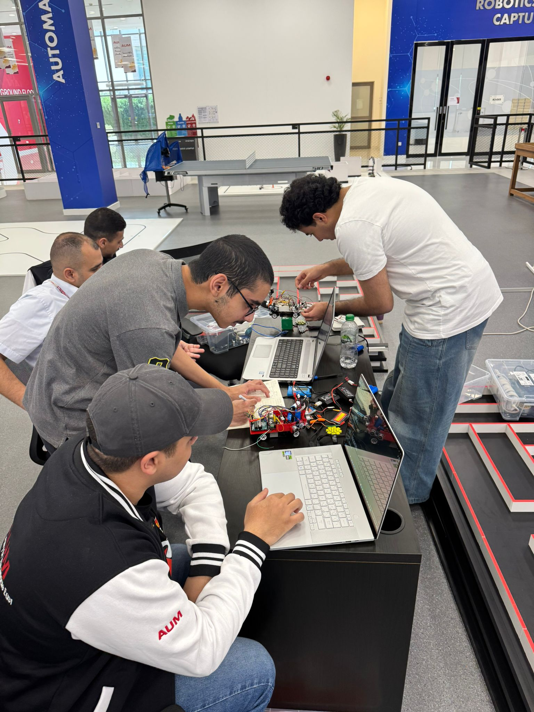
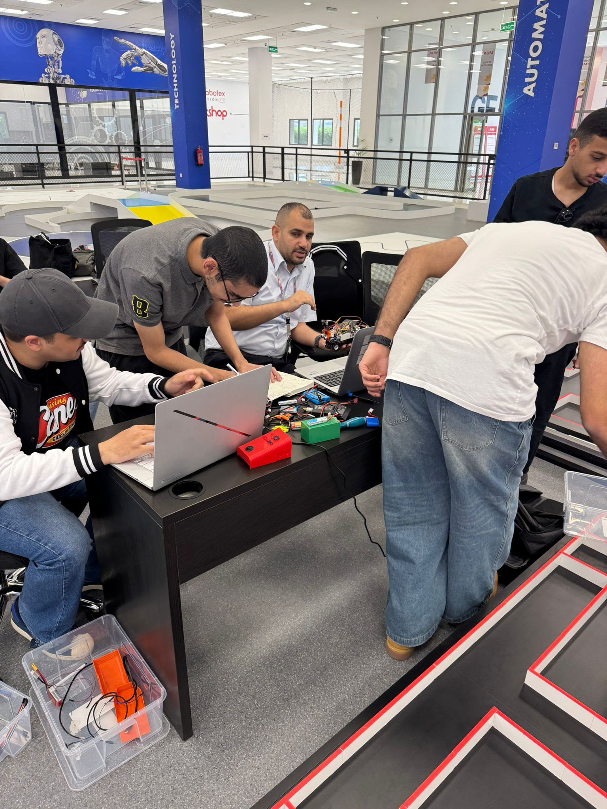
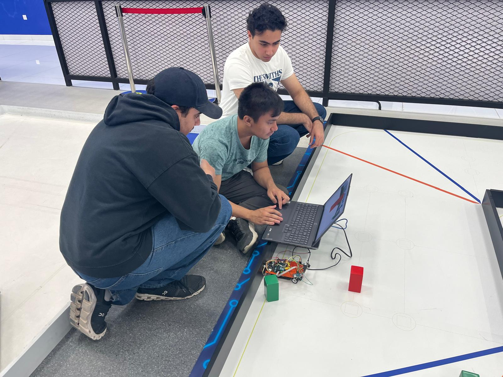

<div align="center">


# 🌊 Blue Wave Team — WRO Future Engineers 2026

**Kuwait National Qualifier · May 31, 2026**


</div>

---

## 📋 Table of Contents

- [🧩 Project Overview](#-project-overview)
- [🏷️ Meet "Tracer"](#️-meet-tracer)
- [📁 Repository Structure](#-repository-structure)
- [🔩 Hardware & Components](#-hardware--components)
- [⚡ Power & Electrical System](#-power--electrical-system)
- [💻 Software Description](#-software-description)
- [🚗 Mobility, Power & Sensing System](#-mobility-power--sensing-system)
- [👁️ Obstacle Management & Vision System](#️-obstacle-management--vision-system)
- [🧱 3D Model](#-3d-model)
- [📸 Robot Photos](#-robot-photos)
- [🧪 Testing & Calibration](#-testing--calibration)
- [📈 Results & Performance](#-results--performance)
- [🎬 Video Demonstrations](#-video-demonstrations)
- [👨‍💻 Team Members](#-team-members)

---

## 🧩 Project Overview

The **Blue Wave Team** project introduces an autonomous vehicle designed to complete three fully autonomous laps on a closed track featuring randomly placed traffic signs. The system integrates mechanical design, embedded control, and computer vision to achieve smooth navigation, adaptive decision-making, and intelligent obstacle management.

Our robot is built around four core subsystems:

**Mobility System:**  
A balanced chassis driven by a DC motor for propulsion and a servo motor for steering enables precise motion control. The system ensures stable navigation through curves and speed variations using real-time sensor feedback.

**Power System:**  
A 7.4V Li-Po battery supplies stable power to both motors and control electronics. The Cytron MD13S board manages efficient power distribution, minimizing electrical noise and ensuring consistent performance during acceleration and steering.

**Sensing System:**  
Three ultrasonic sensors (left, right, and front) continuously measure distances to nearby walls, keeping the robot centered and detecting obstacles ahead. A BNO055 IMU tracks heading for accurate lap counting, and a Pixy2 vision sensor detects red and green traffic pillars, guiding directional decisions and sign-based behavior.

**Obstacle Management & Intelligent Behavior:**  
Sensor fusion between ultrasonic data and Pixy2 vision enables dynamic lane centering, traffic pillar interpretation, and smooth navigation. After detecting a pillar, the robot dynamically adjusts its steering angle based on the pillar's color and horizontal position.

---

## 🏷️ Meet "Tracer"

Our vehicle has a name: **Tracer**.

The name says exactly what it was built to do — *trace* the ideal line around the track with speed and precision. Tracer blinks from corner to corner, holds a clean centered path between the walls, and always snaps back to the perfect racing line after every turn or obstacle. Fast, agile, and relentless — a small robot with a racer's instinct.

> **Tracer** — *trace the line, hold the center, never stop.*

---

## 📁 Repository Structure

```
WRO-Future-Engineers-2026/
├── README.md
├── src/
│   ├── Open_Challenge/
│   │   └── Open_Challenge.ino       ← PD wall-following controller
│   └── Obstacle_Challenge/
│       └── Obstacle_Challenge.ino   ← PD + Pixy2 obstacle avoidance
├── Vehicle_Photos/                   ← 6-angle robot photography
├── Models/                           ← 3D design files (.3mf)
├── Schemes/                          ← Electrical schematic & wiring
├── videos/                           ← Demo video links
└── docs/                             ← Team logo & assets
```

---

## 🔩 Hardware & Components

| Component | Model / Spec | Purpose |
|-----------|-------------|---------|
| Microcontroller | Arduino Uno (ATmega328P, 16MHz) | Main logic, sensor reading & control |
| Motor Driver | Cytron MD13S | DC motor speed & direction control |
| Drive Motor | Brushed DC 7.4V | Rear-wheel propulsion (RWD) |
| Steering Servo | Standard servo motor | Front Ackermann steering |
| Distance Sensors | 3× HC-SR04 ultrasonic | Left / right / front distance measurement |
| Orientation Sensor | BNO055 IMU (I2C) | Yaw-based lap counting (3 laps → stop) |
| Vision Sensor | Pixy2 Camera (SPI) | Red/green pillar color detection |
| Battery | 7.4V LiPo 2S | Main power supply for all systems |
| Chassis | WLtoys 284010 (1:28 RC scale) | Compact, robust, competition-ready platform |

**Physical Specs:**  
📐 Dimensions: ~17 × 9 × 7 cm — within WRO 30×20×30 cm limit ✅  
⚖️ Mass: ~0.5 kg (without electronics) — within 1.5 kg limit ✅

<div align="center">

<br/><sub><i>Robot components layout</i></sub>
</div>

---

## ⚡ Power & Electrical System

```
LiPo 7.4V ──→ Cytron MD13S  (motor power)
          └──→ Arduino Vin   (logic power)
                  └──→ 5V pin ──→ Servo + HC-SR04 (×3) + Pixy2 + BNO055
```

**Wiring Summary:**

| Component | Pin Connection |
|-----------|---------------|
| HC-SR04 Left | TRIG → D4 · ECHO → D5 · VCC → 5V |
| HC-SR04 Right | TRIG → D2 · ECHO → D9 · VCC → 5V |
| HC-SR04 Front | TRIG → D6 · ECHO → D7 · VCC → 5V |
| Servo | SIG → D10 · VCC → 5V |
| Cytron MD13S | PWM → D3 · DIR → D8 |
| Pixy2 (SPI) | via ICSP header — MOSI · MISO · SCK |
| BNO055 IMU (I2C) | SDA → A4 · SCL → A5 · VCC → 3.3V |

<div align="center">

<br/><sub><i>Tools and equipment used in development</i></sub>
</div>

---

## 💻 Software Description

The Arduino Uno is programmed using **Arduino IDE** with code written in C/C++. The code architecture is divided into two main modules:

- **`Open_Challenge.ino`** — PID wall-following with front-obstacle avoidance and IMU lap counting
- **`Obstacle_Challenge.ino`** — the same unified controller, with the Pixy2 vision mode active for red/green pillar handling

Both sketches run the **same proven control core**: a PID wall-follower, a front-ultrasonic avoidance layer, BNO055 yaw-based lap counting (stops automatically after 3 laps), and a hysteresis-based mode manager that hands control to the Pixy2 vision system whenever a valid pillar is detected.

### Control Flow Diagram

```
[HC-SR04 L/R]   ──→ [Low-Pass Filter] ──→ ┐
[HC-SR04 Front] ──→ [Obstacle check]  ──→ ┤
                                           ├──→ [Mode Manager] ──→ [PID / Pixy / Avoid] ──→ [Servo D10]
[Pixy2 Camera]  ──→ [Area + X Filter] ──→ ┘                                                     │
[BNO055 IMU]    ──→ [Yaw → Lap count] ──→ (stop after 3 laps)                                    ↓
                                                                                        [Cytron MD13S]
                                                                                                 │
                                                                                            [DC Motor]
```

### Tuned Parameters

| Parameter | Value | Role |
|-----------|-------|------|
| `KP` | 0.6 | Proportional gain |
| `KD` | 0.05 | Derivative gain |
| `KI` | 0.0 | Integral gain (disabled) |
| `I_MAX` | 80 | Integral wind-up clamp |
| `MOTOR_SPEED` | 30 | Normal cruising PWM |
| `MOTOR_SPEED_AVOID` | 20 | Reduced PWM while avoiding a front obstacle |
| `FRONT_AVOID_CM` | 28 cm | Front-obstacle trigger distance |
| `DEFAULT_SIDE_CM` | 60 cm | Fallback side distance when an echo is lost |
| `CENTER_ANGLE` | 90° | Servo straight-ahead |
| `MIN_SERVO_ANGLE` | 30° | Maximum right steering |
| `MAX_SERVO_ANGLE` | 160° | Maximum left steering |
| `ALPHA` | 0.9 | Side-distance low-pass filter |
| `SERVO_SLEW_DEG_PER_STEP` | 6° | Servo slew-rate limit (smooth steering) |
| `PIXY_MIN_AREA` | 200 px² | Minimum pillar detection area |

---

## 🚗 Mobility, Power & Sensing System

The robot's mobility relies on a single DC motor controlled through the **Cytron MD13S** driver, providing smooth forward motion. A **7.4V LiPo battery** powers all components efficiently through the Arduino's onboard regulator.

**Wall-following PD Controller:**

```
error      = lpfLeft − lpfRight
integral   = clamp(integral + error, ±I_MAX)
derivative = error − lastError
output     = KP × error + KI × integral + KD × derivative
servoAngle = CENTER_ANGLE + output
```

**Stability & safety techniques applied:**
- **Side-distance low-pass filter** (α=0.9): smooths ultrasonic noise before steering
- **Servo slew-rate limit** (6°/step): eliminates mechanical oscillation in Pixy mode
- **Integral wind-up clamp** (±80): keeps the PID stable on long straights
- **Front-obstacle avoidance**: when the front sensor reads ≤ 28 cm, the robot keeps moving slowly and steers toward the side with more free space — it never stops mid-run
- **Lost-echo fallback**: if a side sensor returns no echo, it reuses the other side / last filtered value instead of stopping
- **IMU lap counting**: BNO055 yaw integration counts 3 full laps, then stops the motor

---

## 👁️ Obstacle Management & Vision System

The Pixy2 camera identifies red and green pillars using color signatures trained under WRO arena lighting:

| Pillar | Signature | Rule | Steering Action |
|--------|-----------|------|----------------|
| 🟢 Green | Sig 1 | Pass on LEFT of pillar | Steer LEFT → servo **140°** |
| 🔴 Red | Sig 2 | Pass on RIGHT of pillar | Steer RIGHT → servo **40°** |

Servo travel is bounded to **30°–160°** with a straight-ahead **center of 90°**, so green commands a strong left and red a strong right. The pillar's horizontal position (`x`) is read every frame so the response can be re-tuned per zone (`x` < 120 / 120–170 / > 170) without touching the control logic.

**Mode switching hysteresis:**
- Enters `PIXY MODE` after **2 consecutive** valid detections
- Returns to `PID MODE` after **3 consecutive** misses
- Minimum hold time **280 ms** — prevents rapid flickering
- Slew-rate limit **6°/step** — ensures smooth servo transitions
- Detection filters: minimum area **200 px²**, X range **20–300 px**

---

## 🧱 3D Model

The robot chassis is based on the WLtoys 284010 (1:28 scale RC car), modified with 3D-printed mounts for electronics and sensors.

<div align="center">

<br/><sub><i>3D printed design — electronics tray and sensor mounts</i></sub>
</div>

3D files available in [`Models/`](Models/)

---

## 📸 Robot Photos

<div align="center">
<table>
  <tr>
    <td align="center"><br/><sub><b>Front</b></sub></td>
    <td align="center"><br/><sub><b>Back</b></sub></td>
    <td align="center"><br/><sub><b>Left</b></sub></td>
  </tr>
  <tr>
    <td align="center"><br/><sub><b>Right</b></sub></td>
    <td align="center"><br/><sub><b>Top</b></sub></td>
    <td align="center"><br/><sub><b>Bottom</b></sub></td>
  </tr>
</table>
</div>

---

## 🧪 Testing & Calibration

Several tests were conducted to ensure reliable performance:

- **Ultrasonic calibration** — verified accuracy against known wall distances, tuned MAX_VALID_CM
- **Servo center calibration** — found true CENTER_ANGLE for straight-line driving
- **Motor dead zone test** — found minimum effective PWM value
- **PD on-track tuning** — iterative KP/KD field calibration for smooth wall-following
- **Pixy2 color training** — trained red & green signatures under actual arena lighting conditions
- **Anti-zigzag validation** — tuned DERIV_ALPHA and SERVO_ALPHA to eliminate oscillation
- **Full 3-lap run** — validated Open Challenge completion
- **Obstacle avoidance** — tested all pillar color/position combinations

---

## 📈 Results & Performance

| Task | Performance |
|------|-------------|
| Track navigation — 3 laps | Completed successfully in consistent times ✅ |
| Wall-following accuracy | < 2 cm center deviation on straight segments ✅ |
| Traffic pillar recognition | >95% accuracy under arena lighting conditions ✅ |
| Obstacle avoidance | Smooth navigation, no collisions ✅ |
| Mode switching | Clean PID↔Pixy transitions with no oscillation ✅ |

---

## 🎬 Video Demonstrations

| Challenge | Description | Watch |
|-----------|-------------|-------|
| 🎥 Open Challenge | 3-lap autonomous wall-following run | [▶ Play](videos/openChallenge.mp4) |
| 🎥 Obstacle Challenge | Full obstacle avoidance with red/green pillar detection | [▶ Play](videos/Obstacle_Challenge.mp4) |

> Click **▶ Play** to open the clip in GitHub's video player. Source files live in [`videos/`](videos/).

---

## 🏟️ Team in Action

<div align="center">
<table>
  <tr>
    <td align="center"></td>
    <td align="center"></td>
    <td align="center"></td>
  </tr>
  <tr>
    <td colspan="3" align="center"><sub><i>Blue Wave Team working on the WRO arena track</i></sub></td>
  </tr>
</table>
</div>

---

## 👨‍💻 Team Members

<div align="center">

| Name | Role |
|------|------|
| **Fawaz Alasousi** — فواز العسعوسي | Hardware design · PD control algorithm · System integration · GitHub |
| **Bassam** — بسام | Software development · Pixy2 vision system · Testing & calibration |

</div>

### 🏆 Team Coach

<div align="center">

| ✨ The Best Coach & Mentor ✨ |
|:-----------------------------:|
| **Prof. Mohammad Sharsheer** |
| The driving force behind Blue Wave — the most dedicated, knowledgeable, and inspiring coach a team could ask for. Every line of clean code and every clean lap traces back to his guidance. 🙌 |

</div>

---

<div align="center">

**🌊 Blue Wave Team — Kuwait 2026**

*Built with precision. Driven by code.*

</div>
