<p align="center">
  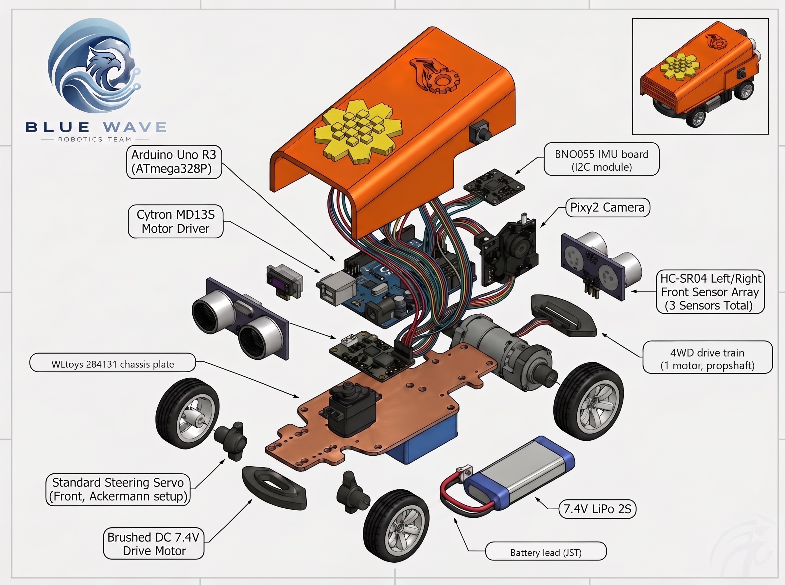
</p>

<h1 align="center">Blue Wave</h1>

<p align="center"><b>WRO Future Engineers 2026</b><br>Kuwait national round: 1st place, 61 points<br>Next: WRO 2026 Asia final, India</p>

<p align="center">
  
  
  
</p>

Our car is a 1:28-class RC chassis, about 200 × 125 mm, with Ackermann steering and one brushed DC motor. One Arduino Uno R3 reads three HC-SR04 ultrasonic sensors, a BNO055 IMU and a Pixy2 camera, and runs a separate sketch for each challenge.

## Contents

| Appendix C criterion | Page | What it covers |
|---|---|---|
| 1. Mobility | [Mobility and mechanical design](docs/01-mobility.md) | Chassis choice, size and lot geometry, break-away test at PWM 15, 18 and 25, speed fitted to a real 23 s run, steering geometry |
| 2. Power and sensors | [Power and sensor architecture](docs/02-power-and-sensors.md) | Power tree, current budget, why HC-SR04 and Pixy2, the 40° side sonars, Pixy2 range constants, calibration, failure handling |
| 3. Software and obstacle strategy | [Software architecture and obstacle strategy](docs/03-software-and-strategy.md) | Module maps, Open flowchart, Obstacle state machine, pillar ladder, front-wall park, edge cases, where every constant comes from |
| 4. Systems thinking and decisions | [Systems thinking and engineering decisions](docs/04-engineering-decisions.md) | Why we chose each part, constraints, decision log, version history, risks |
| 5. Reproducibility | [Build, test and reproduce](docs/05-build-test-reproduce.md) | Parts list, library versions, flash sizes, bench check, test results, how to repeat each number |

Engineering journal: [Blue_Wave_Engineering_Journal.pdf](docs/journal/Blue_Wave_Engineering_Journal.pdf)

Scoring reference: Appendix C of the [2026 rules](https://wro-association.org/wp-content/uploads/WRO-2026-Future-Engineers-Self-Driving-Cars-General-Rules.pdf) (p.44-54).

## The car

| Item | Value |
|---|---|
| Size | 200 × 125 mm, about 129 mm high (rule limit 300 × 200 × 300 mm, rules 11.1 and 11.2) |
| Mass | About 360 g (limit 1.5 kg) |
| Chassis | WLtoys 284131, 1:28, four-wheel drive through a propshaft, Ackermann front axle; wheelbase about 97 mm, track about 70 mm, wheels about 28 mm |
| Controller | Arduino Uno R3: ATmega328P, 32,256 B flash, 2,048 B RAM |
| Drive | One 130-size brushed DC motor on a Cytron MD13S driver (PWM on D3, direction on D8), race setting PWM 30 |
| Steering | Servo on D10; 30-160 while driving, 10 and 170 when parking |
| Distance | 3 × HC-SR04: one straight ahead, one on each nose corner at about 40° from the axis |
| Heading | BNO055 IMU on I2C (A4, A5) |
| Camera | Pixy2 on SPI (ICSP header): signature 1 red pillar, 2 green pillar, 3 magenta limiter |
| Power | Two 2S LiPo 7.4 V 400 mAh packs: one feeds the Cytron MD13S for the drive motor; the other feeds the Uno's VIN through the main power switch |
| Start | Waits for the start switch on A2 after power-on (rules 9.10, 9.11) |
| Speed at PWM 30 | About 1 m/s |
| Code | Open: 283 lines, 15,136 B flash. Obstacle: 1,103 lines, 29,604 B flash |

<p align="center">
  <a href="Vehicle_Photos/README.md">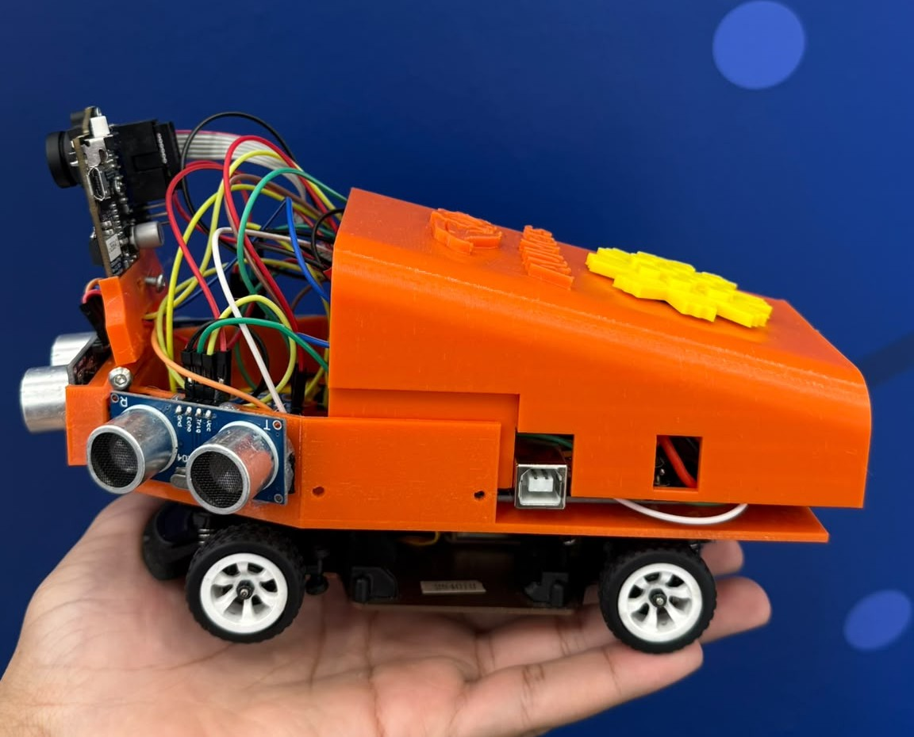</a>
  <a href="Vehicle_Photos/README.md">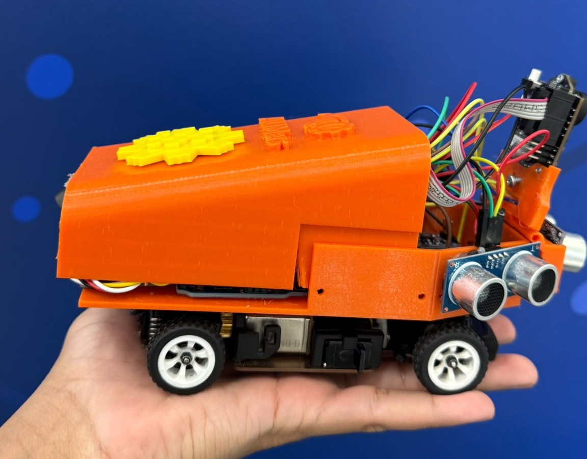</a>
</p>
<p align="center">
  <a href="Vehicle_Photos/README.md">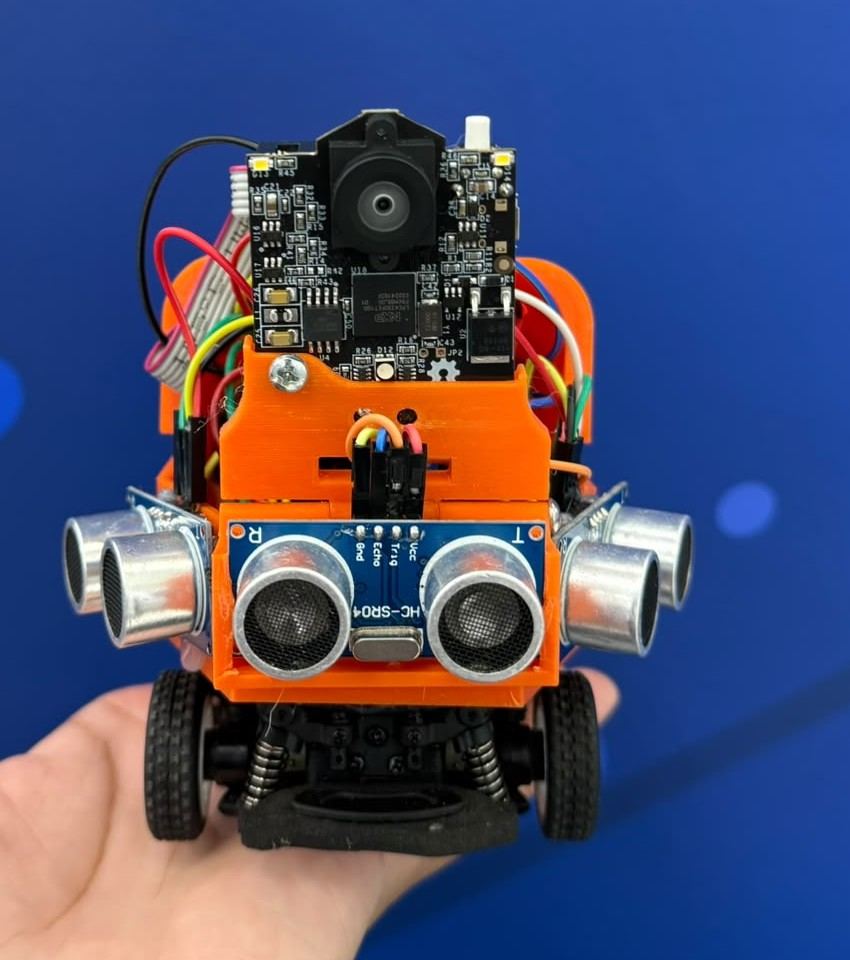</a>
  <a href="Vehicle_Photos/README.md">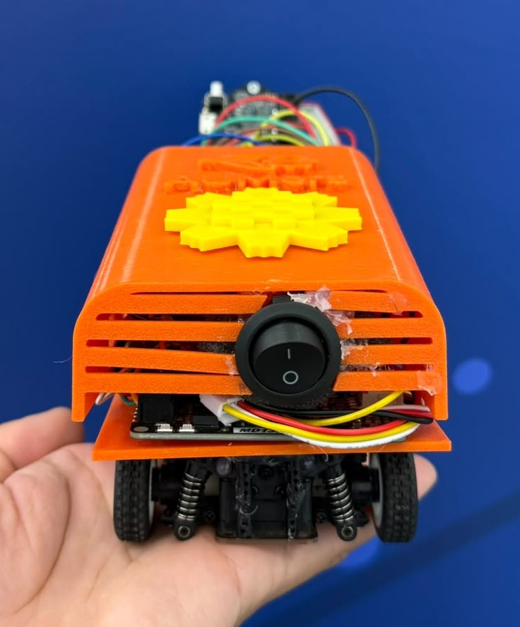</a>
  <a href="Vehicle_Photos/README.md">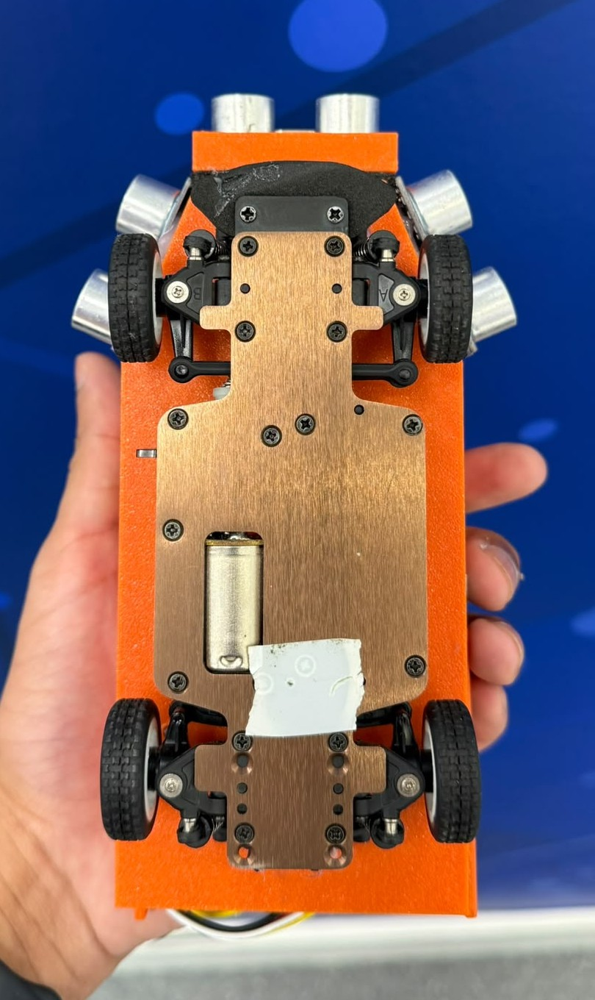</a>
</p>

<p align="center">
  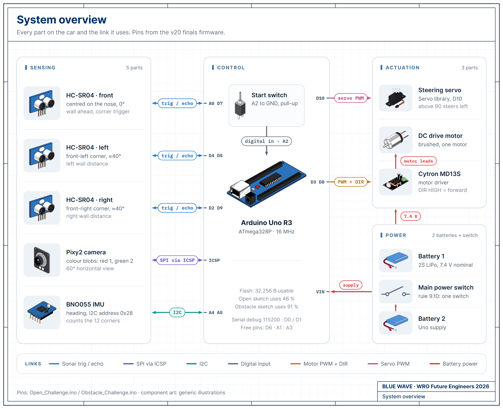
</p>

<p align="center">
  <a href="Schemes/README.md">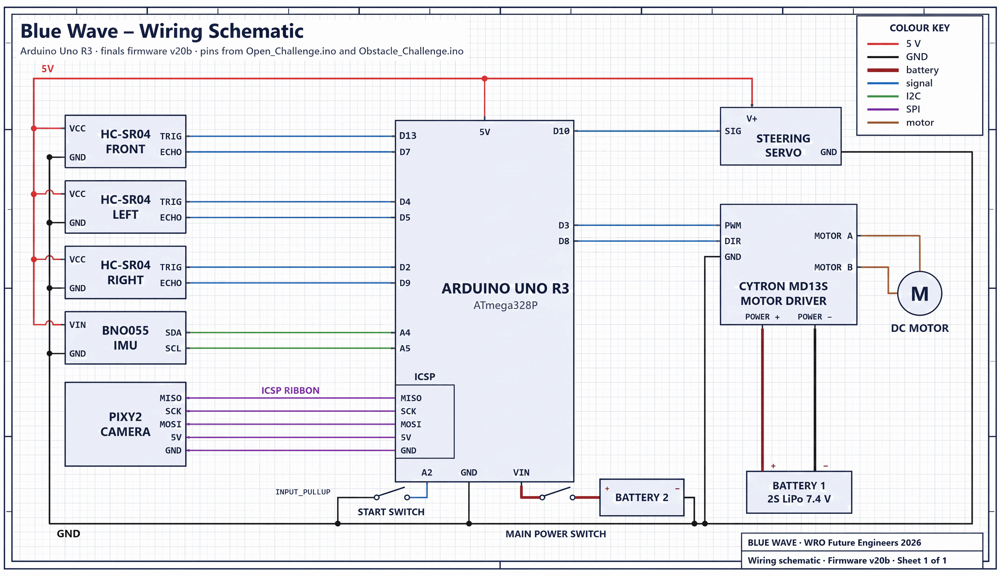</a>
</p>

<p align="center">
  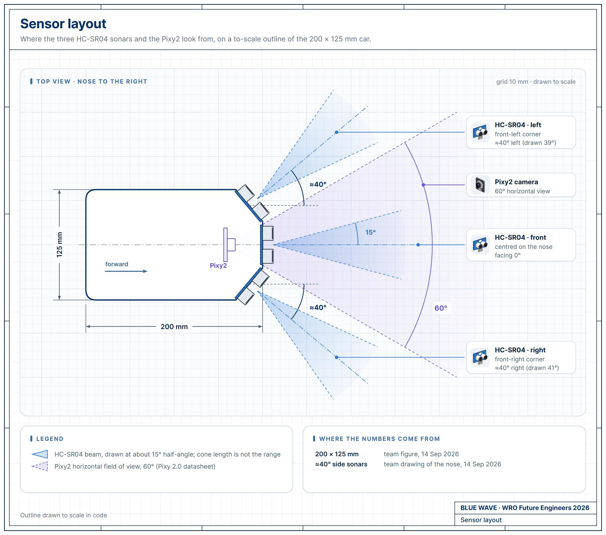
  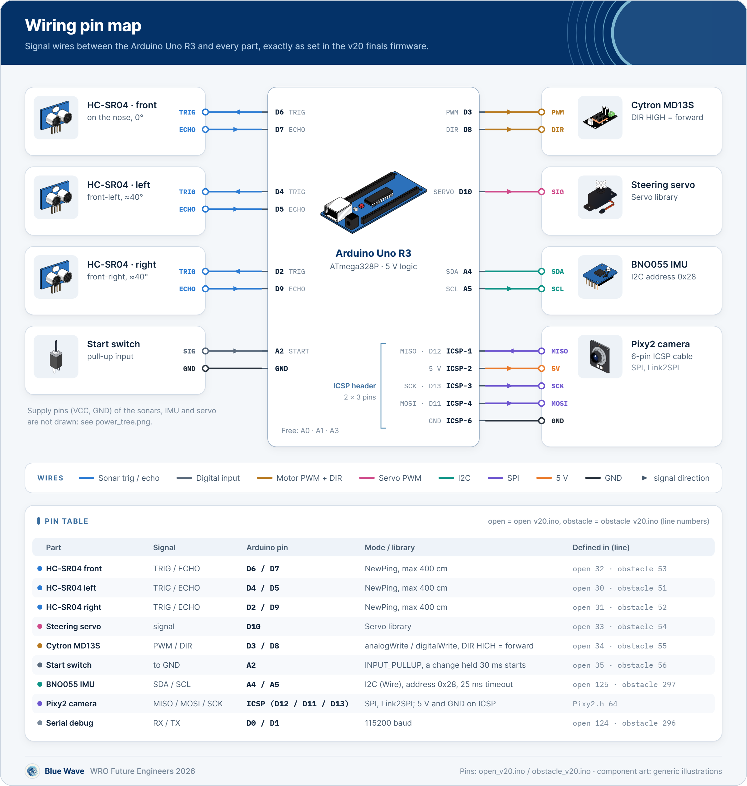
</p>

## Why these parts

| Part | Why we chose it |
|---|---|
| 1:28 RC chassis | At about 200 × 125 mm it fits the 300 mm parking lot (1.5 × car length) and turns inside the 600 mm Open corridors. Front Ackermann steering and one drive motor meet rules 11.3 and 11.5. |
| Arduino Uno only | One board runs each challenge in a fixed loop, starts the moment it is powered, uploads from the Arduino IDE in seconds, and has a library for every sensor we use. |
| HC-SR04 sonars | They measure the distance to the black walls whatever the colour or light. Three units cover the front and both front corners; the corner units at about 40° see the wall ahead and beside. |
| Pixy2 | It finds the red, green and magenta signatures on its own processor and sends only block position and size over SPI, so the Uno never handles images. A pillar's block grows as it gets closer, which gives its distance. |
| BNO055 | It gives the heading we use to count the 12 corners and to end each parking arc on an angle instead of a timer. |
| Two batteries | The motor draws its current from its own battery, so the current dips when it starts or stalls never pull down the Uno's supply. The cost is a second battery to charge and check before every round. |

More detail and the trade-offs: [Systems thinking and engineering decisions](docs/04-engineering-decisions.md).

## Strategy in brief

### Open Challenge

A PD law on the left minus right side sonars keeps the lane at PWM 30: servo = 90 + 0.6·e + 0.05·Δe. At 48 cm from the front wall the car slows to PWM 25 and turns, reaching full servo travel at 18 cm. When the two side readings agree within 3 cm, a vote of the corners already driven picks the side. The BNO055 counts 12 corners, then the car stops on the front range in the start straight. Straights that stayed calm in lap 1 run at PWM 38 in laps 2 and 3.

### Obstacle Challenge

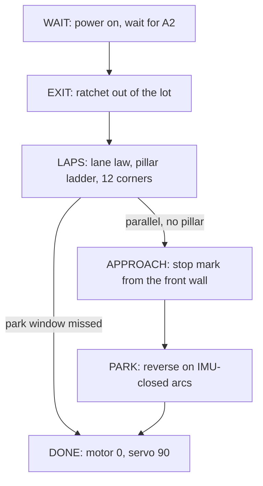

We start in the lot for 7 points (item 1.8.1, p.21). The shorter side reading picks the outer wall and the direction, and the car ratchets out until its heading is 50° out. On the laps, the nearest red or green Pixy2 block within 900 mm sets the servo from a six-step ladder: 40 to 78 passes a red pillar on its right, 102 to 140 passes a green pillar on its left. With no pillar in view the Open law drives. In laps 2 and 3 the lane set-point shifts by 20 cm toward the side the lap-1 pillar map needs. If the front reads 15 cm or less and the heading has not moved 3° in 0.7 s, the car reverses at opposite lock.

### Parking

After 12 corners, parallel and with no pillar in view, the car stops at a front-wall range of 820 mm (lot on the right) or 1,520 mm (lot on the left). Those marks come from our measurements of 1.0 m and 1.7 m from that wall to the downstream limiter. The car measures its real step length, solves an entry angle between 36° and 64°, and reverses in on arcs closed on the IMU heading. Each move is checked first against a model of the lot with a 12 mm margin.

### Code modules and the parts they use

| Module | Functions | Parts |
|---|---|---|
| Start and fault codes | `waitStart()`, `signalServo()` | Start switch on A2, servo |
| Sensing and motor output | `getStableDistance()`, `runMotor()` | 3 × HC-SR04, Cytron MD13S and motor |
| Heading and corner count | `readYaw()`, `lapsCount()` | BNO055 |
| Lap law: lane, corners, pillars, map, recovery | `lapStep()` | HC-SR04s, Pixy2, servo, MD13S |
| Pillar range, limiter rejection | `signDistance()`, `looksLikeBarrier()` | Pixy2 |
| Outer wall and lot exit | `parkPickSide()`, `startTick()` | Side HC-SR04s, servo, MD13S, BNO055 |
| Approach and park | `approachStep()`, `parkRun()`, `parkArcTo()`, `parkStep()`, `bayClear()` | Front and wall-side HC-SR04, BNO055, servo, MD13S |

State diagrams, flowcharts and constants: [Software and strategy](docs/03-software-and-strategy.md) and [`src/README.md`](src/README.md).

## Results

| Event | Result |
|---|---|
| WRO Future Engineers 2026, Kuwait national round, June 2026 | **1st place, 61 points** |
| Open Challenge on our practice mat, PWM 30 | Three laps in about 23 s |
| Open sketch in simulation, all 32 corridor and direction combinations, 320 runs | 287 runs scored 30/30 |

Simulation results compare code versions against each other; full test records are in [Build, test and reproduce](docs/05-build-test-reproduce.md).

Videos: [Open Challenge](https://www.youtube.com/shorts/v20ntV0ojf4) and [Obstacle Challenge](https://youtube.com/shorts/2quu5O000I0). More in [`videos/`](videos/).

## Repository map

```text
.
├── README.md
├── docs/               criterion pages 01 to 05
│   ├── diagrams/       system, sensors, wiring, power
│   ├── arena/          3D model of the 2026 field
│   ├── images/         exploded view of the car
│   └── team_photos/    work sessions
├── src/                the two competition sketches
├── Models/             3D print project: body and sensor brackets
├── Schemes/            wiring schematic, source SVG, June drawing archive
├── Vehicle_Photos/     photos of the car
└── videos/             challenge videos
```

## Build and upload

1. **Board.** Install Arduino IDE 2.3.10 and the *Arduino AVR Boards* core 1.8.8. Select *Arduino Uno* (`arduino:avr:uno`).
2. **Libraries.** From the Library Manager: Adafruit BNO055 1.6.4, Adafruit Unified Sensor 1.1.15, Adafruit BusIO 1.17.4, NewPing 1.9.7, Servo 1.3.0. Add the Pixy2 Arduino library by hand, then rename `ZumoBuzzer.cpp` and `ZumoMotors.cpp` in its folder to `.cpp.bak`. Neither sketch uses them, and they add 1,674 B to each build.
3. **Start mode.** Keep `#define PRACTICE 0` (line 36 in `src/Open_Challenge/Open_Challenge.ino`, line 62 in `src/Obstacle_Challenge/Obstacle_Challenge.ino`). `PRACTICE 1` also starts the car 3 s after power-up, which rule 9.11 does not allow.
4. **Verify and upload** over USB. Expected flash: 15,136 B for Open and 29,604 B for Obstacle, of 32,256 B. From a terminal:
   ```sh
   arduino-cli compile --fqbn arduino:avr:uno src/Obstacle_Challenge
   arduino-cli upload -p <port> --fqbn arduino:avr:uno src/Obstacle_Challenge
   ```
5. **Pixy2 and power-on check.** In PixyMon, train signature 1 on a red pillar, 2 on a green pillar and 3 on a magenta limiter under the venue light. At power-on, one servo wiggle means ready; two wiggles repeating means the BNO055 is not answering. With `PRACTICE 0` the car stays still until the start switch on A2 changes.

Serial checks at 115200 baud and the bench check: [Build, test and reproduce](docs/05-build-test-reproduce.md).

## Team

<table align="center">
  <tr>
    <td align="center" width="230"><b>Fawaz Alasousi</b><br><sub>Team member</sub></td>
    <td align="center" width="230"><b>Dawood AlEneezi</b><br><sub>Team member</sub></td>
    <td align="center" width="230"><b>Shinu Mathew</b><br><sub>Coach</sub></td>
  </tr>
</table>

<p align="center">
  
  
  
</p>

<p align="center"><sub>Blue Wave · Kuwait · WRO Future Engineers 2026</sub></p>
