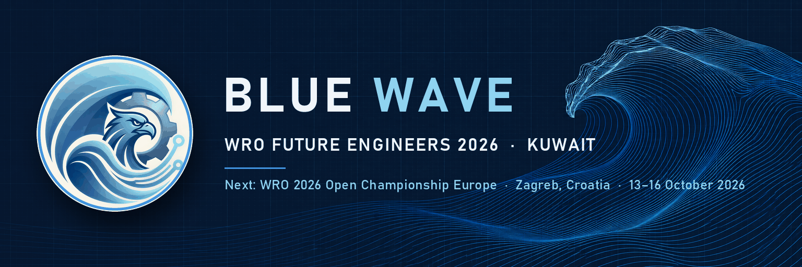
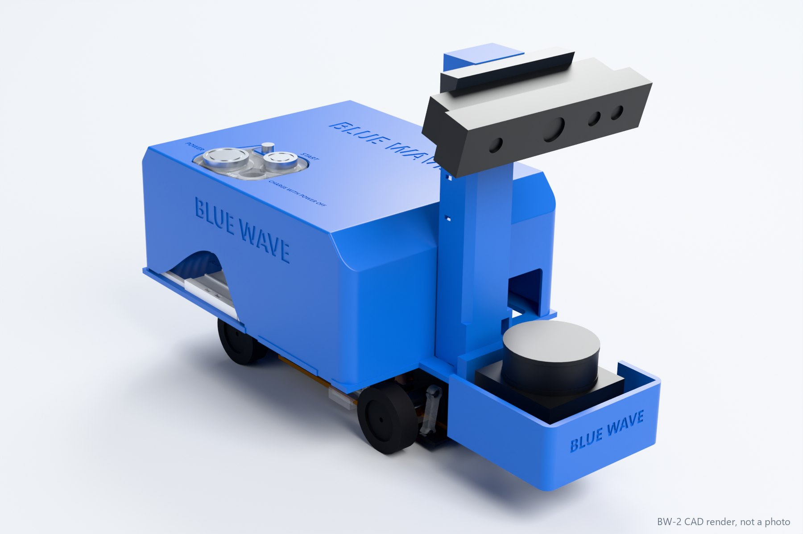
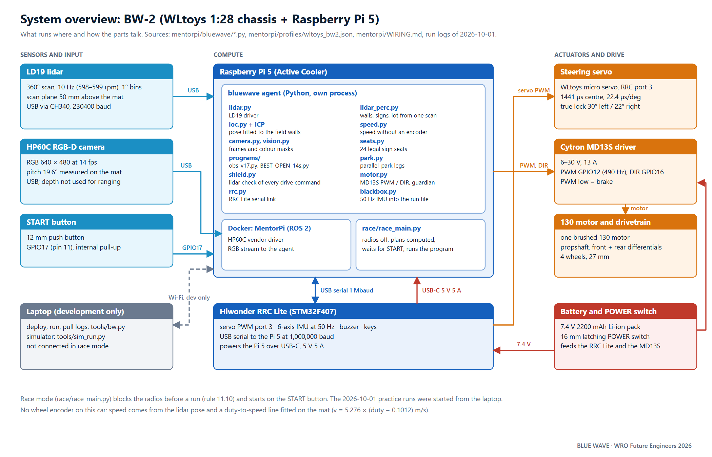
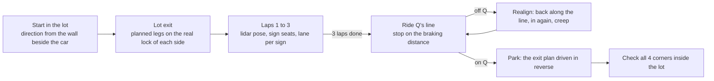
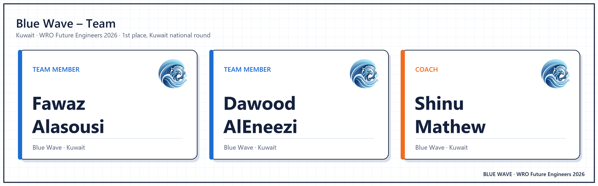
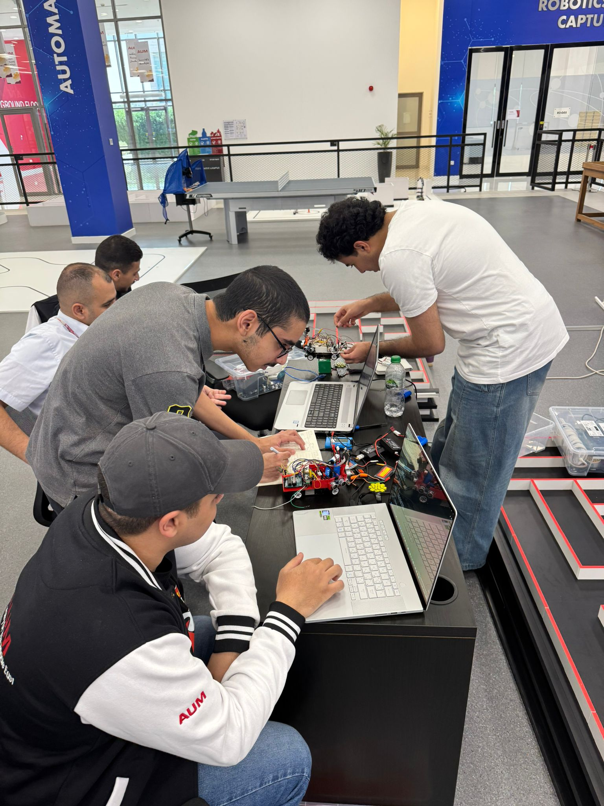
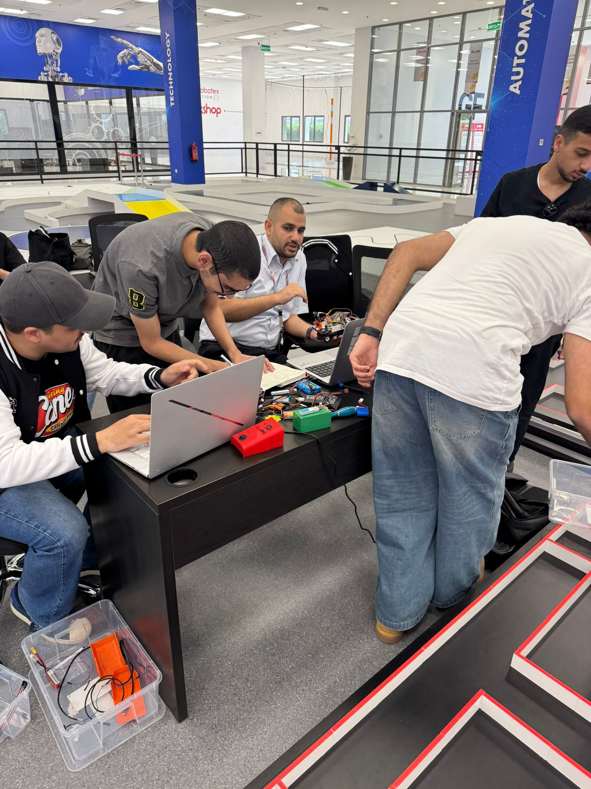

<p align="center">
  
</p>

<h1 align="center">BLUE WAVE</h1>

<p align="center"><b>WRO Future Engineers 2026 · Kuwait</b><br>Kuwait national round: 1st place, 61 points<br>Next: WRO 2026 Open Championship Europe, Zagreb, Croatia, 13–16 October 2026</p>

<p align="center">
  
  
  
  
  
</p>

Our car is a WLtoys 1:28 four-wheel-drive chassis (one brushed motor, propshaft, front and rear differentials, Ackermann steering) carrying a Raspberry Pi 5, a Hiwonder RRC Lite controller board, an LDROBOT LD19 lidar, an Angstrong HP60C camera and a Cytron MD13S motor driver, inside a body we designed and printed in PETG (BW-2). The car has no wheel encoder. It finds its position from the lidar, which scans 50 mm above the mat so that it sees the 100 mm field walls and the traffic signs, and from the IMU. The camera only tells red from green and finds the magenta parking limitations. All planning and control run in Python on the Pi 5.

Every number on these pages comes from a run log of the car, a calibration file or the CAD model, and the pages say which. **MAT** = measured on the car on our practice mat. **CAD** = read from the body model, not yet measured on the car. **SIM** = our simulator, which is calibrated to the mat but is not the judge.

## Results

| Event or run | Result | Source |
|---|---|---|
| WRO Future Engineers 2026, Kuwait national round, June 2026 | **1st place, 61 points**, won with our first car (Arduino Uno), which stays in the history at tag [`v1.0-june-2026`](https://github.com/BllueWave/WRO-Future-Engineers-2026/tree/v1.0-june-2026) | competition result |
| Open Challenge, practice mat, 2026-10-01 (MAT) | **14.7 s** for 3 laps, 12 of 12 corners driven without stopping, stop inside the start section, no contact, counter-clockwise, pack 8.05 V | run `20261001-161301.412-open_v7`, program `BEST_OPEN_14s` |
| Obstacle Challenge, practice mat, 2026-10-01 (MAT) | **55.8 s**: start in the parking lot, 3 laps with all 6 signs passed on the correct side in every lap, parallel park with all 4 corners inside the lot, counter-clockwise, pack 8.25 V | run `20261001-222840.106-obs_v17`, program `obs_v17` |

All corridors on that mat were 1000 mm wide. Both runs are counter-clockwise; the clockwise runs of these two programs are SIM so far. The full list of mat runs, with the pack voltage of each, is in [Build, test and reproduce](docs/05-build-test-reproduce.md#results-on-the-mat).

## Contents

| Appendix C criterion | Page | What it covers |
|---|---|---|
| 1. Mobility | [Mobility and mechanical design](docs/01-mobility.md) | Why this chassis, size and parking-lot length, drive train and the fitted speed model, braking, steering trim and the unequal steering lock, understeer against speed, the BW-2 body |
| 2. Power and sensors | [Power and sensor architecture](docs/02-power-and-sensors.md) | Power tree and budget, pin map, why a 50 mm lidar plane, camera field of view and pitch, IMU, speed without an encoder, calibration, failure handling |
| 3. Software and obstacle strategy | [Software architecture and obstacle strategy](docs/03-software-and-strategy.md) | Where each module runs, race mode, the Open racing line, the Obstacle pose, sign map and path, the lot exit and the parallel park, constants and their sources |
| 4. Systems thinking and decisions | [Systems thinking and engineering decisions](docs/04-engineering-decisions.md) | Constraints, decision log, the measured lessons (steering trim, battery compensation, the Q stop, the camera's field of view), version history, risks |
| 5. Reproducibility | [Build, test and reproduce](docs/05-build-test-reproduce.md) | Parts list, printed parts, software set-up, race mode, bench check, test method, mat and SIM results, how to repeat each number |

Other folders: [vehicle photos](Vehicle_Photos/README.md) · [wiring](Schemes/README.md) · [3D models](Models/README.md) · [videos](videos/README.md) · [source code](src/README.md) · [test sheet](docs/test-sheet.md)

Scoring reference: section 7 and Appendix C of the [2026 Future Engineers rules](https://wro-association.org/wp-content/uploads/WRO-2026-Future-Engineers-Self-Driving-Cars-General-Rules.pdf).

## The car

<p align="center">
  
  <br><sub>CAD render of the BW-2 model, not a photo. Photos of the car: <a href="Vehicle_Photos/README.md">Vehicle_Photos</a>.</sub>
</p>

| Item | Value | Tag |
|---|---|---|
| Size | 224.8 × 111.0 × 157.2 mm (rule 11.1 limit 300 × 200 × 300 mm) | CAD |
| Mass | 721–737 g estimated from the CAD solids and the part list; this model still includes three printed parts that are not on the car, so the car is lighter; not yet weighed (rule 11.2 limit 1.5 kg) | CAD |
| Chassis | WLtoys 1:28, model 284131: one 130-size brushed motor, propshaft, front and rear differentials, Ackermann front axle; wheelbase 98.0 mm, track 64.24 mm, wheel 27.0 mm | CAD |
| Computer | Raspberry Pi 5 with Active Cooler: perception, planning, control | |
| Controller board | Hiwonder RRC Lite (STM32F407), stock firmware: steering servo pulses, 6-axis IMU at 50 Hz, buzzer, keys; powers the Pi over USB-C | MAT (IMU rate) |
| Drive | Cytron MD13S on Pi GPIO12 (PWM, 490 Hz) and GPIO16 (direction); PWM low = brake | MAT |
| Speed | v = 5.276 m/s × (duty − 0.1012), fitted on 1599 lidar speed samples, rms error 0.075 m/s; 1.39 m/s top speed seen in the 14.7 s run | MAT |
| Steering | stock micro servo on RRC PWM port 3; 30° left and 22° right at the wheels; full-lock left radius 237 mm at 0.2 m/s | MAT |
| Lidar | LDROBOT LD19, 360°, about 10 Hz, scan plane 50 mm above the mat (walls are 100 mm) | CAD (height), MAT (rate) |
| Camera | Angstrong HP60C RGB-D, colour 640 × 480 at 14 frames/s, ±29.3° horizontal field of view, pitch 19.61° down | MAT |
| Power | 7.4 V 2200 mAh pack (2 × 18650), one 16 mm latching power switch | |
| Start | one 12 mm start button on GPIO17 (rules 9.10 and 9.11) | |

<p align="center">
  
</p>

### Why these parts

| Part | Why |
|---|---|
| WLtoys chassis | One drive motor through mechanical differentials and one steering servo, as rules 11.3, 11.5 and 11.13 ask. The robot kit we took the electronics from drives each rear wheel with its own motor, which those rules do not allow. |
| LD19 lidar at 50 mm | On the kit's own mount the lidar scanned above the 100 mm walls and signs and read the room behind the field. At 50 mm every wall and sign within 2.2 m is in the scan, which gives the car an absolute position about ten times a second without an encoder. |
| HP60C colour camera | The lidar finds where a sign stands; the camera only has to say red or green, and where the magenta limitations are. Its depth stream gave no returns from the white mat and over-read a sign at 1.25 m as 1.43 m, so we do not use it for range. |
| Raspberry Pi 5 | Lidar fitting, the colour masks, the path planner and the simulator-compatible robot interface all run in Python at a 40 Hz control loop (p99 loop time 32.0 ms, MAT). |
| Cytron MD13S | The controller board's motor ports close a speed loop on an encoder this car does not have. The MD13S takes plain PWM and direction from the Pi, and PWM low shorts the motor, which brakes at 2.08 m/s² (fit over the mat runs). |

More detail and the trade-offs: [Systems thinking and engineering decisions](docs/04-engineering-decisions.md).

## How it works

### Open Challenge (`BEST_OPEN_14s`)

The lidar scan is rotated by the gyro heading into the corridor frame. From it the car reads the wall ahead, both side walls and the inner corner of the island, which gives the width of the next corridor about 1.3 m before the corner. The driving direction is chosen at the start from the gap at the corner. Every corner is one constant-radius 90° arc from this corridor's lane to the next one's, with the radius as large as a 180 mm clearance to the island allows, and the arc speed √(a·R) with a = 2.6 m/s². Lap 1 measures every corridor; laps 2 and 3 plan each corner from that map before it is in sight. The car brakes to the arc speed with a constant-deceleration plan on a speed observer (the fitted duty line corrected by the lidar), steers each arc with the effective wheelbase measured at that speed, and stops inside the start section after 12 corners. A lidar shield checks every drive command against the walls.

### Obstacle Challenge (`obs_v17`)


```mermaid
flowchart LR
    A["Start in the lot<br>direction from the wall beside the car"] --> B["Lot exit<br>planned legs on the real lock of each side"]
    B --> C["Laps 1 to 3<br>lidar pose, sign seats, lane per sign"]
    C -->|"3 laps done"| D["Ride Q's line<br>stop on the braking distance"]
    D -->|"off Q"| E["Realign: back along the line, in again, creep"]
    E --> D
    D -->|"on Q"| F["Park: the exit plan driven in reverse"]
    F --> G["Check all 4 corners inside the lot"]
```

The pose comes from fitting each lidar scan's wall points to the field walls (outer square, island, the lot's limitations), starting from the gyro and the speed observer. Sign pillars found by the lidar are snapped to the 24 positions the rules allow, and each gets its colour from the camera by bearing. Red is passed on its right, green on its left. A sign the lidar has found but the camera has not read is looked at on purpose: the nose turns toward it, and the program counts pixels where the map projects it into the frame. The path is a lane per sign with planned corner radii, followed by pure pursuit from the rear axle with a swept-footprint guard. After three laps the car rides the line to the point Q where the lot exit ended, stops there, and drives the exit plan in reverse into the lot. The run counts as parked only when all four corners of the car are inside.

Full description, state machines and constants: [Software and strategy](docs/03-software-and-strategy.md).

### Code modules and the parts they use

| Module (in `src/`) | What it does | Parts |
|---|---|---|
| `bluewave/hw.py` | the `Robot` object: one interface on the car and in the simulator | all |
| `bluewave/rrc.py` | serial driver of the RRC Lite (1,000,000 baud): servo pulses, IMU, buzzer, keys | RRC Lite, steering servo, IMU |
| `bluewave/motor.py`, `bluewave/speed.py` | PWM and direction to the MD13S with a stop guardian; speed from the lidar pose and the duty model | MD13S, 130 motor, LD19 |
| `bluewave/lidar.py`, `bluewave/lidar_perc.py` | LD19 driver; walls, pillars and parking limitations from one revolution | LD19 |
| `bluewave/camera.py`, `bluewave/vision.py` | frame grabber and colour masks for red, green and magenta | HP60C |
| `bluewave/field.py`, `bluewave/loc.py` | the field map with the 24 sign seats; localisation | LD19, IMU |
| `bluewave/park.py` | lot exit and parallel park legs on the car's true footprint | all drive parts |
| `bluewave/shield.py` | lidar safety layer that checks every drive command | LD19, MD13S |
| `programs/BEST_OPEN_14s.py` | Open Challenge program | all |
| `programs/obs_v17.py` | Obstacle Challenge program with the parallel park | all |
| `race/race_main.py` | race mode: radios off, READY beeps, waits for the start button, runs the chosen program | start button, buzzer |

## Build and run

1. **Car.** Fit the parts in [Build, test and reproduce](docs/05-build-test-reproduce.md#bill-of-materials) and wire them as in [Schemes](Schemes/README.md). The RRC Lite keeps Hiwonder's firmware; nothing is flashed to it.
2. **Pi 5, once.** On a fresh Raspberry Pi OS Lite (64-bit) card run `src/os/setup_bluewave_os.sh`; it installs `python3-numpy`, `python3-opencv`, `python3-serial` and `python3-lgpio`, the udev rule and the services. On Hiwonder's stock card use `src/os/install_on_stock.sh`, which keeps the vendor container that holds the HP60C driver.
3. **Code.** From the laptop, `py -3 tools/bw.py deploy` (run in `src/`) copies the code to the car. There is nothing to compile: the programs are Python and load at the start of a run.
4. **Calibration file.** `py -3 tools/bw.py body wltoys_bw2` applies the car's numbers from `profiles/wltoys_bw2.json`; the motor and steering fit used by the programs and the simulator is `profiles/plant_mat1001.json`.
5. **Before each round.** Pack at 7.4 V or more, car still: `py -3 tools/bw.py preflight pitch` with one sign 500 mm ahead must answer GO.
6. **Race mode.** Set `race.programs.open=BEST_OPEN_14s`, `race.programs.obstacle=obs_v17` and `race.challenge` for the round, then `py -3 tools/bw.py mode race` and power-cycle the car. At boot every radio is blocked before the race program starts (rule 11.10); two beeps mean READY; the car does not move before the start button.

Step-by-step commands, the bench check and the simulator: [Build, test and reproduce](docs/05-build-test-reproduce.md) and [src/README.md](src/README.md).

## Rules the car must meet

| Rule | Requirement | This car |
|---|---|---|
| 11.1 | at most 300 × 200 × 300 mm | 224.8 × 111.0 × 157.2 mm (CAD); the car keeps one shape at the start, in the lot exit and in the park |
| 11.2 | at most 1.5 kg | 721–737 g (CAD estimate that includes three printed parts not on the car; not yet weighed) |
| 11.3 | four wheels, one driving axle, one steering actuator | one motor through a propshaft and two differentials; one steering servo |
| 11.5, 11.13 | drive motors may not be connected to wheels independently | one drive motor |
| 11.10 | no wireless communication during a round | race mode runs `rfkill block all` before the program starts |
| 9.10 | one power switch | one 16 mm latching switch on the pack's positive lead |
| 9.11 | one start button, the car waits for it | `race_main.py` waits for the one start button before the car moves |

## Repository map

```text
.
├── README.md            this page
├── docs/                criterion pages 01 to 05, test sheet
│   ├── diagrams/        system, wiring, power, sensors, dimensions, run traces
│   ├── images/          header, CAD renders, team cards
│   ├── arena/           3D model of the 2026 field
│   └── team_photos/     work sessions
├── src/                 the code that runs on the Pi 5 (see src/README.md)
├── Models/              printed parts of the BW-2 body (STL)
├── Schemes/             wiring schematic and pin table
├── Vehicle_Photos/      six views of the car
└── videos/              challenge videos
```

| WRO template folder | This repository |
|---|---|
| `t-photos` | `docs/team_photos/` |
| `v-photos` | `Vehicle_Photos/` |
| `video` | `videos/` |
| `schemes` | `Schemes/` |
| `src` | `src/` |
| `models` | `Models/` |
| `other` | `docs/` |

## Team

<p align="center"></p>

| Name | Role |
|---|---|
| Fawaz Alasousi | team member |
| Dawood AlEneezi | team member |
| Shinu Mathew | coach |

<p align="center">
  
  
</p>

<p align="center"><sub>BLUE WAVE · Kuwait · WRO Future Engineers 2026</sub></p>
