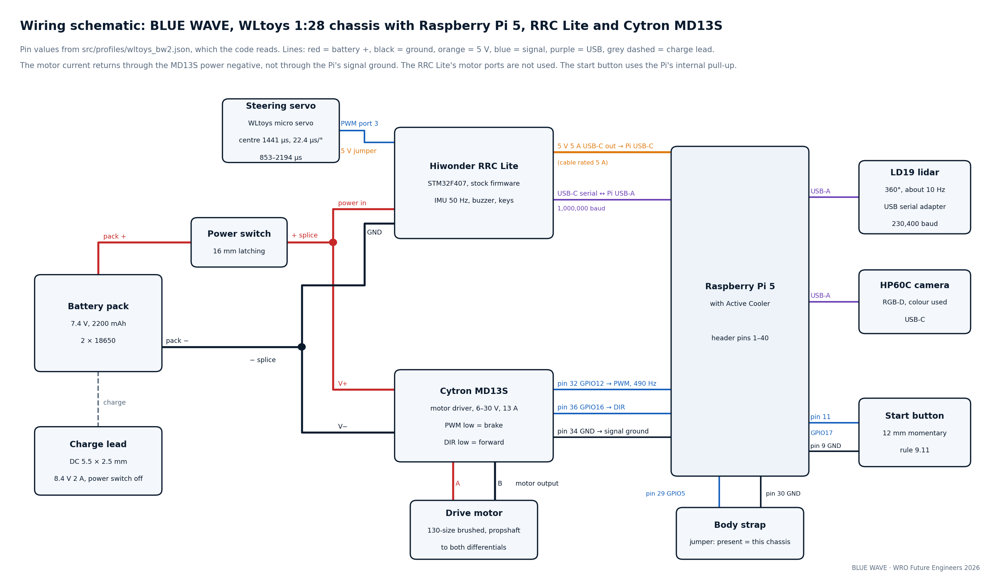

# Wiring

  

Every electrical connection of the car: power, signal and ground, between the battery, the power switch, the RRC Lite
board, the Raspberry Pi 5, the Cytron MD13S motor driver, the drive motor, the steering servo, the LD19 lidar, the
HP60C camera, the start button and the body strap. The pin values are the ones in the car's calibration file
`src/profiles/wltoys_bw2.json`, which the code reads.

The drawing's source is [`wiring_schematic.svg`](wiring_schematic.svg). Other views of the same wiring: [pin map](../docs/diagrams/wiring_pinmap.png), [power tree](../docs/diagrams/power_tree.png),
[system overview](../docs/diagrams/system_overview.png).

## Power

| From | To | Notes |
|---|---|---|
| Pack + (7.4 V, 2200 mAh) | 16 mm latching power switch | the only power switch (rule 9.10) |
| Power switch | positive splice → RRC Lite power input and MD13S V+ | |
| Pack − | negative splice → RRC Lite ground and MD13S V− | one negative point for both |
| RRC Lite 5 V 5 A USB-C output | Raspberry Pi 5 USB-C | use a cable rated 5 A: a 3 A cable cut the Pi's USB ports to 0.6 A |
| Pi 5 USB-A | LD19 (through its USB serial adapter), HP60C | powered by the Pi |
| Charge lead (DC 5.5 × 2.5 mm) | pack | charge at 8.4 V 2 A with the power switch off |

The motor current returns through the MD13S power negative, not through the Pi's signal ground. Do not unplug the MD13S
negative alone while the signal cable is connected.

## Signals

Pin numbers are the Raspberry Pi 5 header pins (1–40).

| Component | Connection | Setting in the calibration file |
|---|---|---|
| Cytron MD13S PWM | Pi pin 32, GPIO12 | 490 Hz software PWM |
| Cytron MD13S DIR | Pi pin 36, GPIO16 | low = forward |
| Cytron MD13S signal ground | Pi pin 34 | |
| Drive motor | MD13S motor output | PWM low = brake |
| Start button (12 mm, momentary) | Pi pin 11, GPIO17, and pin 9, GND | internal pull-up; press and release |
| Body strap (jumper) | Pi pin 29, GPIO5, and pin 30, GND | present = this chassis |
| Steering servo | RRC Lite PWM port 3, supply jumper at 5 V | centre 1441 µs, 22.4 µs per degree, 853–2194 µs |
| RRC Lite | Pi USB-A to the board's USB-C serial port | 1,000,000 baud |
| LD19 lidar | Pi USB-A through the lidar's USB serial adapter | 230,400 baud |
| HP60C camera | Pi USB-A to the camera's USB-C | |

## Wiring rules we keep

- Every stop in the code sets the PWM to zero and then drives DIR low.
- The servo port's supply jumper must be at 5 V; measure 4.8–5.2 V before plugging the servo.
- The RRC Lite's motor ports are not used: they expect a motor with an encoder.

[Back to the README](../README.md)
