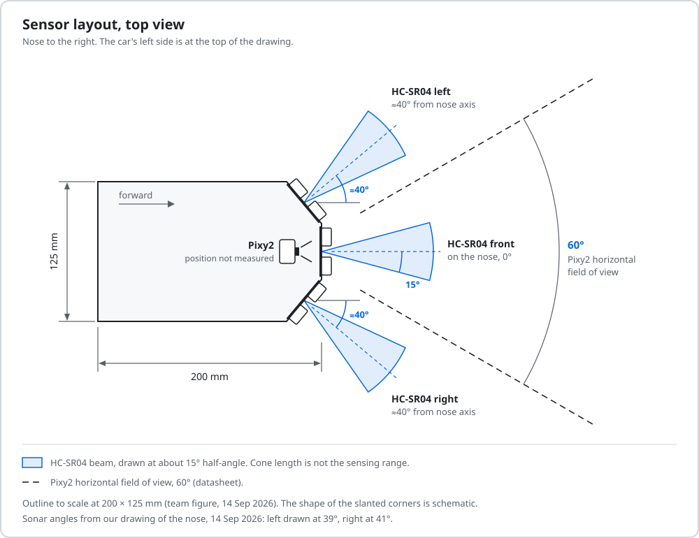

# Mobility and mechanical design

Our car is a 1:28-class RC chassis with Ackermann steering, one brushed DC motor on a Cytron MD13S driver, and a printed body of our own design.
It has no wheel encoder, so every speed figure on this page comes from a break-away test on the car and one timed 23 s Open run.

[Back to the README](../README.md) · Criterion 1 of 5 · Next: [Power and sensors](02-power-and-sensors.md)

## Evidence

| Claim | Where to check |
|---|---|
| The car is 200 × 125 mm, 100 mm and 75 mm inside the rule limits | Team measurement, 14 Sep 2026; `CAR_LEN_MM`, `CAR_WID_MM` in [Obstacle_Challenge.ino line 128](../src/Obstacle_Challenge/Obstacle_Challenge.ino#L128) |
| PWM 15 does not start the car from rest, PWM 25 always does | Motor test on the car; avoid speed and kick in [Open_Challenge.ino lines 41-46](../src/Open_Challenge/Open_Challenge.ino#L41-L46) |
| About 998 mm/s at PWM 30 | Simulator speed fitted to a real 23 s run, see [Speed](#speed) |
| Servo 30-160 while driving, 10 and 170 when parking | [Obstacle_Challenge.ino line 88](../src/Obstacle_Challenge/Obstacle_Challenge.ino#L88) and [line 107](../src/Obstacle_Challenge/Obstacle_Challenge.ino#L107) |
| The 170 mm park radius is not measured | `R_PARK_MM`, [line 127](../src/Obstacle_Challenge/Obstacle_Challenge.ino#L127), marked MEASURE in the source |
| Body and sensor brackets | [`Models/BlueWave_main_body_v2.3mf`](../Models/BlueWave_main_body_v2.3mf) |

## Mass and dimensions

| Quantity | Value | Source |
|---|---|---|
| Length × width | 200 × 125 mm | Measured on the car, 14 Sep 2026 |
| Height | not measured | - |
| Mass | not measured | - |
| Wheelbase, track, wheel diameter | not measured | - |
| Centre of mass | not measured | - |
| Rear axle to nose | 168 mm in the park code | Simulator fit to the real lot exit (`CAR_NOSE_MM`, [line 129](../src/Obstacle_Challenge/Obstacle_Challenge.ino#L129)) |
| Rear-axle turning radius at full lock | 170 mm in the park code; our simulator has used 170-240 mm | Neither value is measured |
| Rule envelope | 300 × 200 × 300 mm, 1.5 kg | Rules 11.1 and 11.2 (p.23) |

The procedure for each unmeasured value is in [How to reproduce every number](05-build-test-reproduce.md#how-to-reproduce-every-number).

  

### What the size does to the parking lot

The lot is 1.5 × the robot length and 200 mm wide (p.8). For our 200 mm car that is a 300 mm lot. Centred, the car has 50 mm at each end and 75 mm across.

The end clearance is always (1.5 L - L) / 2 = 0.25 L. Because the lot scales with car length, a shorter car gains no end clearance. Only width changes the side clearance: at 125 mm the car fills 62.5 % of the 200 mm depth.

## Chassis and drive train

| Part | What we know | Source |
|---|---|---|
| Chassis | WLtoys 1:28-class RC chassis: four wheels, gearbox, steering linkage. Model number to confirm: our June notes say 284010, the plate sticker in the June parts photo reads 284131 | Team notes, photo |
| Drive | One brushed DC motor through the chassis gearbox. Rear axle only or both axles is not confirmed | Team notes |
| Motor | Part number and gear ratio not recorded | - |
| Driver | Cytron MD13S, sign-magnitude: speed on PWM D3, direction on D8, DIR HIGH = forward | [Obstacle_Challenge.ino line 55](../src/Obstacle_Challenge/Obstacle_Challenge.ino#L55) |

The chassis already meets rule 11.3 (p.23): four wheels, one driving axle, one steering actuator. Rule 11.3 allows front, rear or four-wheel drive, so either drive layout is legal. One motor through a gearbox also meets the p.5 note that drive wheels must be physically connected.

The RC chassis has no encoder, and we have no motor part number or gear ratio, so we cannot compute speed or torque from first principles.

### Why a PWM plus direction driver fits this board

The Uno R3 has PWM on D3, D5, D6, D9, D10 and D11. In our pin map D5, D6 and D9 are sonar lines, and D11 is SPI MOSI for the Pixy2. The Servo library runs on Timer1, which disables `analogWrite` on D9 and D10. That leaves D3 as the only free PWM pin.

The MD13S needs exactly one PWM line and one digital line for one motor. A driver that takes speed on two PWM inputs would need a second PWM pin that we do not have.

`analogWrite` is 8-bit, so our race setting PWM 30 is 30 / 255 = 11.8 % duty.

### Break-away and the stiction kick

We tested break-away on this car: PWM 15 does not move it from rest, PWM 18 creeps, PWM 25 always moves it. At our old avoid speed of PWM 15, a car that had stopped stayed stopped until we pushed it by hand.

That test became fix 4 in `obstacle_kuwait`, and both finals sketches keep it:

- the avoid speed is PWM 25;
- whenever the commanded PWM is above 0 and below 30, the motor gets PWM 55 for the first 70 ms, then 70 ms of PWM 55 every 500 ms ([Open_Challenge.ino lines 264-273](../src/Open_Challenge/Open_Challenge.ino#L264-L273)).

Two slow manoeuvres still run below the break-away value. The lot exit ratchets at PWM 18, the value of the 6 September build whose exit worked on the mat. Park arcs run at PWM 18 and fire a 60 ms kick at PWM 55 if the heading has moved less than 0.3 degrees after 150 ms.

### Speed

We have one real speed anchor: the car drove the three Open laps in about 23 s with `open_kuwait` at PWM 30, timed with a stopwatch. Our simulator had assumed 520 mm/s at PWM 30 and predicted 40-48 s for that round. Refitted to the real run, it gives v(PWM 30) ≈ 998 mm/s, band 867-1176 mm/s.

A rough check: with all corridors at 1000 mm, a lap along the corridor centre line is a 2 m square, 8 m. Three laps in 23 s would be 1.04 m/s. The corridor draw of that run was not recorded, so this only shows the fit is plausible.

At about 1 m/s the car would cover the 300 mm between the 48 cm corner trigger and the 18 cm point where the corner law reaches full servo travel in about 0.3 s. The corner runs at PWM 25, which stretches that time by an amount we have not measured.

### Speed against reliability (simulation)

Running the whole Open round at PWM 37 finished in about 20 s but succeeded in 28 of 40 simulated rounds, against 34 of 40 at PWM 30. So the finals Open sketch speeds up to PWM 38 only on straights that stayed calm in lap 1, and drops back to PWM 30 as soon as the front reads 150 cm or less. The Obstacle sketch runs PWM 36 only on straights that showed no pillar in lap 1, while the front reads over 130 cm.

### Torque

We cannot give a torque figure: the mass, the gear ratio and the motor part number are unknown. The break-away test is our only force-related data. Weighing the car and timing 1 m runs at PWM 18, 25, 30 and 55 in both directions would turn one stopwatch anchor into a speed curve ([procedure](05-build-test-reproduce.md#how-to-reproduce-every-number)).

## Steering and Ackermann geometry

A hobby servo on D10 moves the chassis's Ackermann linkage. Servo 90 is straight ahead, above 90 steers left, below 90 steers right.

| Setting | Servo value | Where |
|---|---|---|
| Driving limits | 30-160: 70 degrees of servo travel left, 60 right | [line 88](../src/Obstacle_Challenge/Obstacle_Challenge.ino#L88) |
| Front avoid | 90 + 70 × urgency left, 90 - 60 × urgency right | [line 638](../src/Obstacle_Challenge/Obstacle_Challenge.ino#L638) |
| Pillar mode slew | at most 6 degrees per control loop | [line 99](../src/Obstacle_Challenge/Obstacle_Challenge.ino#L99) |
| Parking full lock | 10 (right) and 170 (left) | [line 107](../src/Obstacle_Challenge/Obstacle_Challenge.ino#L107) |

Our spec file records these servo values as checked on the car. The road-wheel angles they produce are not measured.

An ideal Ackermann linkage turns the inner front wheel more than the outer one, so both front wheel axes meet on the line of the rear axle. The rear-axle centre then follows a circle of radius R = L / tan δ, where L is the wheelbase and δ the equivalent front-wheel angle. We have measured neither L nor δ, so the park uses an estimated R of 170 mm.

The park code models every arc about a point on the rear-axle line ([`arcUpdate()`, line 860](../src/Obstacle_Challenge/Obstacle_Challenge.ino#L860)). An arc of angle θ moves the rear axle R·sin θ along the lot and R·(1 - cos θ) across it. At the nominal 50-degree entry that is 0.77 R along and 0.36 R across: 130 mm and 61 mm with R = 170 mm.

Every 10 mm of error in R moves the end of that arc about 8 mm along and 4 mm across. The final heading does not change, because the arc is closed on the IMU. A 30 mm error in R moves the end about 24 mm along the 300 mm lot.

## What changed since June

The June sketch in this repository (commit `87508ae`, both folders held the same file) and the finals sketches in `src/` share the race speed PWM 30, the servo limits and the gains KP 0.6, KD 0.05. They differ here:

| Item | June sketch | Finals sketches |
|---|---|---|
| Corner trigger | `FRONT_AVOID_CM` 28 | 48 |
| Avoid speed | `MOTOR_SPEED_AVOID` 20, no kick | 25, plus the PWM 55 kick |
| Pillar ladder | one step: servo 140 for green, 40 for red | three steps per colour: 140/120/102 and 40/60/78 |
| Start | drives on power-up | waits for a change on A2 |
| Lot exit and park | none | ratchet exit, front-wall park |

Which sketch ran at the June national round is not confirmed. Our notes name `open_kuwait` and `obstacle_kuwait`. Both already have the 48 cm trigger and PWM 25 with the kick. Only `obstacle_kuwait` has the three-step ladder; `open_kuwait` steers 140 or 40 on the largest Pixy2 block. Both drive off on power-up, and neither parks.

We did not keep a dated log of mechanical changes. The saved print settings in our body file are red PETG, and the car we race has an orange body. We have no record of when the orange body replaced the red one, or what else changed.

## The body

[`Models/BlueWave_main_body_v2.3mf`](../Models/BlueWave_main_body_v2.3mf) is our body design, saved as a Bambu Studio 02.01.01.52 project created on 20 November 2025. It holds five parts:

| Object name in the file | Part |
|---|---|
| `wro main body v2.step` | Main body shell |
| `us bracket wro v2.step` (2 copies) | Ultrasonic sensor brackets |
| `us brackeetXpixy v2.step` | Combined ultrasonic and Pixy2 bracket |
| `pixy bracket wro.step` | Pixy2 bracket |

| Setting saved in the project | Value |
|---|---|
| Printer profile | Bambu Lab X1 Carbon |
| Process | 0.24 mm Draft, 0.24 mm layers |
| Sparse infill | 15 % |
| Filament | Generic PETG, colour #F72323 |

The print settings open only in Bambu Studio. STEP or STL exports of the five parts and a dimensioned top and side drawing are still to do.

## About the exploded view

The image at the top of the README is an illustration of our car. It is not a photograph and not a CAD export. Four of its labels are not checked against the car:

| Label in the illustration | What our records say |
|---|---|
| "WLtoys 284010 chassis plate" | Our June notes say 284010; the sticker on the chassis plate in `docs/components.jpg` reads 284131 |
| "Rear-Wheel Propulsion (1 Motor)" | One motor is certain. The parts photo shows a steel shaft running toward both axle housings, so rear-only drive is not confirmed |
| "Brushed DC 7.4V Drive Motor" | No motor part number or voltage rating is recorded |
| "Central Support Foot" | No such part is recorded. Rule 11.4 (p.23) bans ball casters and spherical wheels, so we check the car against this label before vehicle inspection |
| Sensor positions in the top-right inset | Not drawn from our measurements. The placement reference is the sensor layout diagram above |

The lettering on the illustrated body is not a confirmed robot name.

[Back to the README](../README.md) · Next: [Power and sensors](02-power-and-sensors.md)
