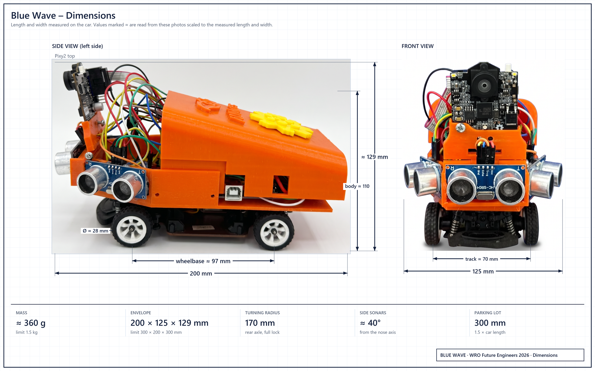

# Mobility and mechanical design

Our car is a 1:28-class RC chassis with Ackermann steering, one brushed DC motor on a Cytron MD13S driver, and a printed body of our own design.
Our speed figures rest on two tests on the car: a break-away test and one stopwatch-timed 23 s Open run.

[Back to the README](../README.md) · Criterion 1 of 5 · Next: [Power and sensors](02-power-and-sensors.md)

## Evidence

| Claim | Where to check |
|---|---|
| The car is 200 × 125 mm, 100 mm and 75 mm inside the rule limits | Team measurement, 14 Sep 2026; `CAR_LEN_MM`, `CAR_WID_MM` in [Obstacle_Challenge.ino line 128](https://github.com/BllueWave/WRO-Future-Engineers-2026/blob/v2.0-asia-final/src/Obstacle_Challenge/Obstacle_Challenge.ino#L128) |
| PWM 15 does not start the car from rest, PWM 25 always does | Motor test on the car; avoid speed and kick in [Open_Challenge.ino lines 41-46](../src/Open_Challenge/Open_Challenge.ino#L41-L46) |
| About 998 mm/s at PWM 30 | Simulator speed fitted to a real 23 s run, see [Speed](#speed) |
| Servo 30-160 while driving, 10 and 170 when parking | [Obstacle_Challenge.ino line 88](https://github.com/BllueWave/WRO-Future-Engineers-2026/blob/v2.0-asia-final/src/Obstacle_Challenge/Obstacle_Challenge.ino#L88) and [line 107](https://github.com/BllueWave/WRO-Future-Engineers-2026/blob/v2.0-asia-final/src/Obstacle_Challenge/Obstacle_Challenge.ino#L107) |
| The park code uses a 170 mm turning radius | `R_PARK_MM`, [line 127](https://github.com/BllueWave/WRO-Future-Engineers-2026/blob/v2.0-asia-final/src/Obstacle_Challenge/Obstacle_Challenge.ino#L127) |
| Body and sensor brackets | [`Models/BlueWave_main_body_v2.3mf`](../Models/BlueWave_main_body_v2.3mf) |

## Why this chassis

We picked a ready-made 1:28-class RC chassis for three reasons.

- **Size.** The car is about 200 × 125 mm, inside the 300 × 200 mm limit of rule 11.1 (p.23). The parking lot is 1.5 × the car length (p.8), so our lot is 300 mm long and the car fits it with 50 mm to spare at each end. At 125 mm wide the car leaves 475 mm of free width in a 600 mm Open corridor, the narrow width in the rules (p.11).
- **Rules.** The chassis has four wheels, front Ackermann steering moved by one servo, and one motor that drives the wheels through the chassis gearbox. That is one steering actuator and no motor per side, as rules 11.3 and 11.5 (p.23) ask, and the drive wheels are physically connected, as the note on p.5 asks.
- **Time.** The chassis came with its wheels, gearbox and steering linkage already built. Our own work went into the printed body, the sensors and the code.

## Mass and dimensions

  

| Quantity | Value | Basis |
|---|---|---|
| Length × width | 200 × 125 mm | Measured on the car, 14 Sep 2026 |
| Height to the top of the Pixy2 | about 129 mm | Side photo scaled to the measured 200 mm length |
| Height to the top of the body | about 110 mm | Side photo scaled to the measured 200 mm length |
| Wheelbase | about 97 mm | Side photo scaled to the measured 200 mm length |
| Track | about 70 mm | Stock 284131 width over the tyres (80 mm) less one tyre width |
| Wheel diameter | about 28 mm | Side photo scaled to the measured 200 mm length |
| Sonar centre above the floor | about 45 mm | Side photo; walls and pillars are 100 mm high, so every sonar sees them |
| Mass | about 360 g, 24 % of the 1.5 kg limit | [Mass budget](#mass-budget) |
| Rear axle to nose | 168 mm in the park code | `CAR_NOSE_MM`, [line 129](https://github.com/BllueWave/WRO-Future-Engineers-2026/blob/v2.0-asia-final/src/Obstacle_Challenge/Obstacle_Challenge.ino#L129), fitted to the real lot exit in our simulator |
| Rear-axle turning radius at full lock | 170 mm in the park code | `R_PARK_MM`, [line 127](https://github.com/BllueWave/WRO-Future-Engineers-2026/blob/v2.0-asia-final/src/Obstacle_Challenge/Obstacle_Challenge.ino#L127) |
| Rule envelope | 300 × 200 × 300 mm, 1.5 kg | Rules 11.1 and 11.2 (p.23) |

### Mass budget

| Part | Mass | Basis |
|---|---|---|
| WLtoys 284131 rolling chassis with its 130 motor and gearbox | about 125 g | Stock car 181 g with body, battery and receiver (manufacturer), less those parts |
| Printed body and four brackets, PETG | about 75 g | 69 cm³ of material in our 3MF × 1.27 g/cm³ × 0.85 print fill |
| Arduino Uno R3 | about 25 g | Board |
| Cytron MD13S | about 20 g | Board with terminal blocks |
| 3 × HC-SR04 | about 26 g | 8.5 g each |
| Pixy2 | about 10 g | Pixy2 datasheet |
| BNO055 breakout | about 3 g | Board |
| Steering servo, 9 g class | about 9 g | Servo class |
| Battery 1 and battery 2, 2S LiPo 400 mAh | about 50 g | About 25 g per pack |
| Wires, switches, screws | about 20 g | Estimate |
| **Total** | **about 360 g** | |

The heavy parts, the chassis, both batteries and the boards, sit low between the axles. Only the Pixy2 and its bracket are high, and they weigh about 15 g.

  

### What the size does to the parking lot

The lot is 1.5 × the robot length and 200 mm wide (p.8). For our 200 mm car that is a 300 mm lot. Centred, the car has 50 mm at each end and 75 mm across.

The end clearance is always (1.5 L - L) / 2 = 0.25 L. Because the lot scales with car length, a shorter car gains no end clearance. Only width changes the side clearance: at 125 mm the car fills 62.5 % of the 200 mm depth.

## Chassis and drive train

| Part | What it is | Source |
|---|---|---|
| Chassis | WLtoys 284131, 1:28, four-wheel drive: one motor, a propshaft to the front and rear differentials, Ackermann front steering | Sticker on the chassis plate in the [parts photo](components.jpg); manufacturer page |
| Drive motor | 130-size brushed DC motor, the chassis's own | Manufacturer page |
| Gearing | 17-tooth pinion on a 29-tooth spur (1.71 : 1), then the differentials | Published review of the 284131 |
| Driver | Cytron MD13S, sign-magnitude: speed on PWM D3, direction on D8, DIR HIGH = forward | [Obstacle_Challenge.ino line 55](https://github.com/BllueWave/WRO-Future-Engineers-2026/blob/v2.0-asia-final/src/Obstacle_Challenge/Obstacle_Challenge.ino#L55) |

  
  

### Why a PWM plus direction driver fits this board

The Uno R3 has PWM on D3, D5, D6, D9, D10 and D11. When we chose the driver, D5, D6 and D9 were sonar lines, and D11 is SPI MOSI for the Pixy2. The Servo library runs on Timer1, which disables `analogWrite` on D9 and D10. That left D3 as the only free PWM pin. The front trigger has since moved from D6 to D13 ([why](02-power-and-sensors.md#what-each-sensor-gives-the-uno)).

The MD13S needs exactly one PWM line and one digital line for one motor. A driver that takes speed on two PWM inputs would have needed a second PWM pin that we did not have.

`analogWrite` is 8-bit, so our race setting PWM 30 is 30 / 255 = 11.8 % duty.

### Torque and speed (estimate)

| Step | Value |
|---|---|
| Mass | about 0.36 kg |
| Rolling resistance on the mat, coefficient about 0.04 | 0.36 × 9.81 × 0.04 ≈ 0.14 N |
| Reach 1 m/s in 0.5 s | 0.36 × 2 ≈ 0.72 N |
| Force needed at the tyres | ≈ 0.86 N |
| Wheel torque at a 14 mm radius | ≈ 12 mN·m, shared by four wheels |
| Power at 1 m/s | ≈ 0.9 W |

A 130 motor on 7.4 V gives several watts, and a published test of the stock 284131 measured about 22 km/h (6 m/s). Our race speed is 1 m/s, so the drive has several times the force the round needs. What limits this car is low duty: at PWM 15 (6 % duty) the average motor voltage cannot overcome static friction, which the break-away test below shows and the PWM 55 kick fixes.

In a corner at PWM 25 (about 0.8 m/s) on the 170 mm park radius, the side acceleration is v²/R ≈ 3.8 m/s². With a 70 mm track and the centre of mass about 45 mm high, the car would tip only above g × 35 / 45 ≈ 7.6 m/s², twice that value.

### Break-away and the stiction kick

A stopped car needs more torque to start than to keep rolling, and this test measures that in PWM steps. We tested break-away on this car: PWM 15 does not move it from rest, PWM 18 creeps, PWM 25 always moves it. At our old avoid speed of PWM 15, a car that had stopped stayed stopped until we pushed it by hand.

That test became fix 4 in `obstacle_kuwait`, and both finals sketches keep it:

- the avoid speed is PWM 25;
- whenever the commanded PWM is above 0 and below 30, the motor gets PWM 55 for the first 70 ms, then 70 ms of PWM 55 every 500 ms ([Open_Challenge.ino lines 264-273](../src/Open_Challenge/Open_Challenge.ino#L264-L273)).

Two slow manoeuvres still run below the break-away value. The lot exit ratchets at PWM 18, the value of the 6 September build whose exit worked on the mat. Park arcs run at PWM 18 and fire a 60 ms kick at PWM 55 if the heading has moved less than 0.3 degrees after 150 ms.

### Speed

Our speed anchor is a real run: the car drove the three Open laps in about 23 s with `open_kuwait` at PWM 30, timed with a stopwatch. Our simulator had assumed 520 mm/s at PWM 30 and predicted 40-48 s for that round. Refitted to the real run, it gives v(PWM 30) ≈ 998 mm/s, band 867-1176 mm/s.

A rough check: with all corridors at 1000 mm, a lap along the corridor centre line is a 2 m square, 8 m. Three laps in 23 s would be 1.04 m/s, close to the fitted value.

At about 1 m/s the car covers the 300 mm between the 48 cm corner trigger and the 18 cm point where the corner law reaches full servo travel in about 0.3 s. The corner itself runs at PWM 25, below the race speed.

### Speed against reliability (simulation)

Running the whole Open round at PWM 37 finished in about 20 s but succeeded in 28 of 40 simulated rounds, against 34 of 40 at PWM 30. So the finals Open sketch speeds up to PWM 38 only on straights that stayed calm in lap 1, and drops back to PWM 30 as soon as the front reads 150 cm or less. The Obstacle sketch runs PWM 36 only on straights that showed no pillar in lap 1, while the front reads over 130 cm.

## Steering and Ackermann geometry

A hobby servo on D10 moves the chassis's Ackermann linkage. Servo 90 is straight ahead, above 90 steers left, below 90 steers right.

| Setting | Servo value | Where |
|---|---|---|
| Driving limits | 30-160: 70 degrees of servo travel left, 60 right | [line 88](https://github.com/BllueWave/WRO-Future-Engineers-2026/blob/v2.0-asia-final/src/Obstacle_Challenge/Obstacle_Challenge.ino#L88) |
| Front avoid | 90 + 70 × urgency left, 90 - 60 × urgency right | [line 638](https://github.com/BllueWave/WRO-Future-Engineers-2026/blob/v2.0-asia-final/src/Obstacle_Challenge/Obstacle_Challenge.ino#L638) |
| Pillar mode slew | at most 6 degrees per control loop | [line 99](https://github.com/BllueWave/WRO-Future-Engineers-2026/blob/v2.0-asia-final/src/Obstacle_Challenge/Obstacle_Challenge.ino#L99) |
| Parking full lock | 10 (right) and 170 (left) | [line 107](https://github.com/BllueWave/WRO-Future-Engineers-2026/blob/v2.0-asia-final/src/Obstacle_Challenge/Obstacle_Challenge.ino#L107) |

Our spec file records these servo values as checked on the car.

An ideal Ackermann linkage turns the inner front wheel more than the outer one, so both front wheel axes meet on the line of the rear axle. The rear-axle centre then follows a circle of radius R = L / tan δ, where L is the wheelbase and δ the equivalent front-wheel angle. The park code uses R = 170 mm (`R_PARK_MM`).

The park code models every arc about a point on the rear-axle line ([`arcUpdate()`, line 860](https://github.com/BllueWave/WRO-Future-Engineers-2026/blob/v2.0-asia-final/src/Obstacle_Challenge/Obstacle_Challenge.ino#L860)). An arc of angle θ moves the rear axle R·sin θ along the lot and R·(1 - cos θ) across it. At the nominal 50-degree entry that is 0.77 R along and 0.36 R across: 130 mm and 61 mm with R = 170 mm.

Every 10 mm of error in R moves the end of that arc about 8 mm along and 4 mm across. The final heading does not change, because the arc is closed on the IMU. A 30 mm error in R moves the end about 24 mm along the 300 mm lot.

## What changed since June

The June sketch in this repository (commit `87508ae`, both folders held the same file) and the finals sketches in `src/` share the race speed PWM 30, the servo limits and the gains KP 0.6, KD 0.05. They differ here:

| Item | June sketch | Finals sketches |
|---|---|---|
| Corner trigger | `FRONT_AVOID_CM` 28 | 48 |
| Avoid speed | `MOTOR_SPEED_AVOID` 20, no kick | 25, plus the PWM 55 kick |
| Pillar ladder | one step: servo 140 for green, 40 for red | three steps per colour: 140/120/102 and 40/60/78 |
| Start | drives on power-up | waits for a change on A2 |
| Lot exit and park | none | ratchet exit, front-wall park |

The finals sketches are built on `open_kuwait` and `obstacle_kuwait`. Both already have the 48 cm trigger and PWM 25 with the kick. Only `obstacle_kuwait` has the three-step ladder; `open_kuwait` steers 140 or 40 on the largest Pixy2 block. Both drive off on power-up, and neither parks.

The saved print settings in our body file are red PETG, and the car we race has an orange body.

## The body

[`Models/BlueWave_main_body_v2.3mf`](../Models/BlueWave_main_body_v2.3mf) is our body design, saved as a Bambu Studio 02.01.01.52 project created on 20 November 2025. It holds five parts:

| Object name in the file | Part |
|---|---|
| `wro main body v2.step` | Main body shell |
| `us bracket wro v2.step` (2 copies) | Ultrasonic sensor brackets |
| `us brackeetXpixy v2.step` | Combined ultrasonic and Pixy2 bracket |
| `pixy bracket wro.step` | Pixy2 bracket |

| Setting saved in the project | Value |
|---|---|
| Printer profile | Bambu Lab X1 Carbon |
| Process | 0.24 mm Draft, 0.24 mm layers |
| Sparse infill | 15 % |
| Filament | Generic PETG, colour #F72323 |

The print settings open only in Bambu Studio.

The lettering and logo on the body come from AUMers, the name our club and team used before we competed as Blue Wave. The body is our own design (see [Models](../Models/README.md)).

## About the exploded view

The image at the top of the README is an illustration of our car. It is not a photograph and not a CAD export; the photographs are in [Vehicle photos](../Vehicle_Photos/README.md). For part names, sizes and sensor angles, this page and the [sensor layout diagram](diagrams/sensor_layout.png) are the reference. The car runs on the four wheels of its chassis.

[Back to the README](../README.md) · Next: [Power and sensors](02-power-and-sensors.md)
