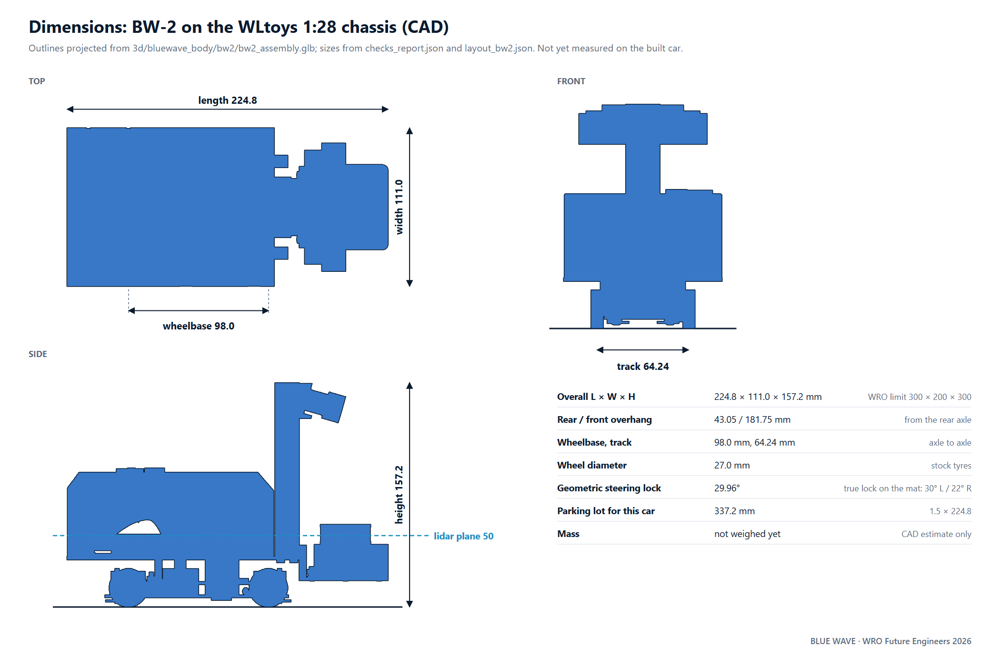
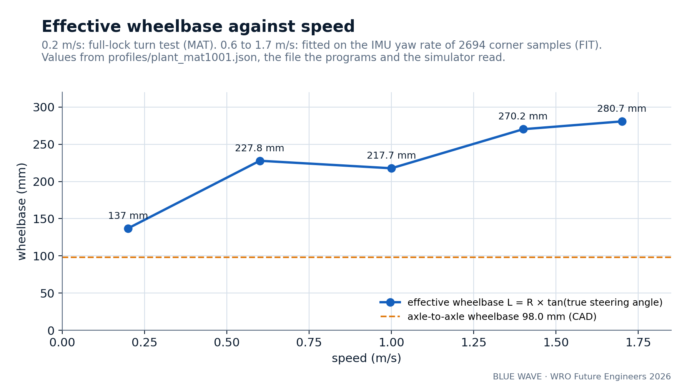

# Mobility and mechanical design

Appendix C criterion 1. How the car moves, what limits it, and the numbers we measured on it.

Tags: **MAT** measured on the car on our practice mat; **FIT** fitted from the mat run logs; **CAD** read from the body
model, not measured on the car; **EST** an estimate or a datasheet value; **SIM** our calibrated simulator.

## Summary

- WLtoys 1:28 chassis 284131: one 130-size brushed motor drives all four wheels through a propshaft and front and rear
  differentials; Ackermann front axle on one micro servo.
- The motor runs on a Cytron MD13S from the Pi 5 (PWM and direction). Speed follows the duty on one fitted line,
  v = 5.276 × (duty − 0.1012) m/s, with no measurable effect of the pack voltage (FIT, 1599 samples, rms 0.075 m/s).
- The steering reaches 30° to the left and only 22° to the right at the wheels (MAT). Both programs plan every turn
  with the lock of its own side.
- The car understeers more as it goes faster: the effective wheelbase R × tan(steering angle) grows from 137 mm at
  0.2 m/s to 281 mm at 1.7 m/s (FIT, 2694 corner samples). The programs steer with the value for the current speed.
- The printed BW-2 body holds the lidar with its scan plane 50 mm above the mat and the camera on a 16° wedge.

## Sources for this page

| Source | What it holds |
|---|---|
| `src/profiles/wltoys_bw2.json` | the car's calibration: pins, servo pulses, motor start duty, lidar mounting, the notes of each mat measurement |
| `src/profiles/plant_mat1001.json` | motor, brake and steering model fitted to 20 mat run logs of 2026-09-30 and 2026-10-01 |
| run `20261001-161301.412-open_v7` | the 14.7 s Open run (speeds, accelerations, loop timing) |
| run `20261001-222840.106-obs_v17` | the 55.8 s Obstacle run |
| BW-2 body model (`Models/`) | dimensions, mass estimate, part layout |

## Why this chassis

The electronics come from a Hiwonder MentorPi A1 robot kit. That kit drives each rear wheel with its own motor and sets
their speeds separately. Rules 11.5 and 11.13 do not allow drive motors connected to the wheels independently, and
equal speeds in software do not change that. On 2026-09-23 we moved the electronics onto a WLtoys 1:28 chassis: one
motor, one propshaft, mechanical differentials front and rear (four-wheel drive) and one steering servo, which meets
rule 11.3 as built.

What we gave up: the kit's motors have encoders, the WLtoys motor has none. The car's speed and travel therefore come
from the lidar (an absolute position about ten times a second) and from a fitted model of the motor, described below
and in [Power and sensors](02-power-and-sensors.md#speed-without-an-encoder).

## Size, mass and the parking lot

  

| Quantity | Value | Tag |
|---|---|---|
| Length | 224.8 mm: from 43.05 mm behind the rear axle to 181.75 mm ahead of it | CAD |
| Width | 111.0 mm | CAD |
| Height | 157.2 mm, set by the camera on the tower | CAD |
| Wheelbase, axle to axle | 98.0 mm | CAD |
| Track | 64.24 mm | CAD |
| Wheel diameter | 27.0 mm | CAD |
| Mass | 721.3 g (infill estimate) to 737.1 g (solid bound) for the full CAD model, which still includes three printed parts that are not on the car: E-deck 27.1 g, servo cradle 6.0 g, four lock struts 0.3 g each (CAD). Not yet weighed | CAD, EST |
| Centre of gravity | 59.5 mm ahead of the rear axle, 56.3 mm above the mat, for the same full CAD model | CAD, EST |
| Parking-lot length for this car | 337.2 mm = 1.5 × 224.8 mm | CAD |

Rule 11.1 allows 300 × 200 × 300 mm and rule 11.2 1.5 kg, so the car is inside both with room to spare. The car has no
moving body parts, so its size is the same at the start, during the lot exit and in the park (Q&A ruling of
2026-08-11). A Q&A ruling of 2026-09-18 says the lot length counts only the part of the car within 10 cm of the mat
that can touch the magenta walls. The Obstacle program's lot model is 337.4 mm, 1.5 × (43.1 + 181.8) mm with the
overhangs as rounded in the layout file the programs read, and the program corrects the lot's position from the
limitations the lidar sees on the last lap.

The static stability factor, track / (2 × CG height), is 0.571, which puts the rigid tipping point at a lateral
acceleration of 5.60 m/s² (EST from the CAD centre of gravity of the full model). The chassis rides on its stock springs, and body roll
lowers that point: the Open program's notes put it at 3.83–4.54 m/s² (EST). This is why the fastest Open preset we
tried in SIM (3.4 m/s² planned in corners) was never run on the mat.

## Drive train

| Element | Detail | Tag |
|---|---|---|
| Motor | WLtoys stock 130-size brushed motor, the only drive motor | |
| Transmission | propshaft to front and rear differentials, all four wheels driven | |
| Driver | Cytron MD13S (6–30 V, 13 A): PWM on Pi GPIO12 (header pin 32), direction on GPIO16 (pin 36), signal ground on pin 34 | |
| PWM | 490 Hz, software PWM through `lgpio`: the Pi 5's hardware PWM channel returned an error on this pin | MAT |
| Direction | DIR low = forward (checked on the mat 2026-09-30; an older wiring note said the opposite) | MAT |
| Brake | PWM low with DIR held: the MD13S shorts the motor | MAT |

Safety in the drive code: every stop sets PWM to zero, then DIR low; a 200 ms watchdog stops the motor if commands stop
arriving; a guardian zeroes the PWM if the program dies; the motor is cut after 0.8 s of stall.

### Speed model

We fitted the motor on the mat logs rather than on a bench, because the mat is where the car must be right.

| Quantity | Value | How | Tag |
|---|---|---|---|
| Start from standstill | breakaway duty 0.1362; a kick of duty 0.1558 for 60 ms; dead band 0.1187 | duty sweep test, 2026-09-30 | MAT |
| Steady speed | v = 5.276 m/s × (duty − 0.1012) | 1599 lidar speeds on straights, rms 0.075 m/s; the previous line (4.49, 0.1187) had rms 0.271 m/s | FIT |
| Pack voltage | no measurable effect on speed per duty (exponent 0.0) | same fit, 20 runs on different packs | FIT |
| Speed-up lag | time constant 0.56 s | same fit | FIT |
| Braking, PWM low | 2.08 m/s² over all runs; at least 1.6 m/s² measured from 0.48 m/s | same fit; stop test | FIT, MAT |
| Coasting stop from 0.25 m/s | 80–180 mm | coast test | MAT |
| Fastest seen | 1.39 m/s, peak duty 0.438, in the 14.7 s Open run | lidar speed, run `20261001-161301.412-open_v7` | MAT |

The voltage result changed a program: see [battery compensation](04-engineering-decisions.md#battery-compensation-that-over-corrected).

## Steering

| Quantity | Value | Tag |
|---|---|---|
| Servo | WLtoys stock micro servo on the RRC Lite PWM port 3 | |
| Pulse map | centre 1441 µs, 22.4 µs per degree, limits 853–2194 µs | MAT |
| Straight ahead | at servo −4°: every program adds a trim of −4° to each command | MAT |
| Servo command range | ±26° | MAT |
| True wheel angle at full lock | 30° left, 22° right | MAT |
| Geometric lock of the linkage | 29.96° | CAD |
| Servo speed | 85.6°/s, 0.35 s from centre to lock; 0.05 s from servo to yaw | MAT, FIT |
| Full-lock radius at 0.2 m/s | left 237 mm (turn test); right 339 mm (22° on the 137 mm effective wheelbase) | MAT, calculation |

The trim and the unequal lock have the same cause: with the servo centred, the wheels point about 4° to the left. A
±26° servo command on top of the −4° trim gives 30° on the left and 22° on the right. Counter-clockwise runs hid the
trim, because left turns still reached their radius; clockwise runs lost about half of each right turn. The story and
the run IDs are in [Engineering decisions](04-engineering-decisions.md#steering-trim-and-the-unequal-lock).

Mechanical fix not yet made: re-centring the servo horn would give roughly the same lock on both sides.
We have not done it because both main programs are tuned on the present geometry.

### Understeer against speed

At 0.2 m/s the car turns at full left lock on a 237 mm radius. With the 98 mm axle-to-axle wheelbase, Ackermann geometry would predict 98 / tan 30° = 170 mm. The effective wheelbase L = R × tan(true steering angle) fits the car
better, and it grows with speed:

  

| Speed (m/s) | 0.2 | 0.6 | 1.0 | 1.4 | 1.7 |
|---|---|---|---|---|---|
| Effective wheelbase (mm) | 137 | 227.8 | 217.7 | 270.2 | 280.7 |

FIT on the IMU yaw rate of 2694 corner samples at 0.5 m/s or more (yaw-rate rms 0.124 rad/s); the 0.2 m/s point is the
turn test. The same fit found a steering bias of +4.05° in corners at 0.6–1.2 m/s, the trim above.

Each program asks for the steering angle atan(L(v) / R) with L taken at the present speed. Before this curve we used one
value, 210 mm, measured at 0.8–1.0 m/s. In the calibrated simulator every arc at 1.3–1.5 m/s then came out about 30 %
too wide. The parking legs run slowly, on the 137 mm value.

### Corner speed

The Open program sets each arc's speed to √(a × R), with a = 2.6 m/s² in the preset of the 14.7 s run, and brakes
before the arc at a planned 1.8 m/s². The Obstacle program plans at 1.1 m/s², 0.50 m/s in lap 1 and 0.80 m/s in laps
2 and 3. The highest horizontal acceleration the IMU logged was 0.56 g in the Open run and 0.42 g in the Obstacle run,
with no contact in either (MAT).

## The BW-2 body

We designed the body around three rules for this car: the lidar's scan plane must sit below the top of the 100 mm
walls; the camera's pitch must not change when the car is handled; and the battery must come out without tools. The
body sits on the chassis on a printed deck (D1).

  
   CAD render, not a photo.

Printed parts on the car (PETG, 0.4 mm nozzle). The colours are the ones we printed; the file names keep the colour of
the CAD model so that they match our recorded file hashes.

| File | Part | Printed colour | Layer / walls / infill | Print time, mass (EST) |
|---|---|---|---|---|
| `01_D1_deck_darkgrey.stl` | deck that mounts on the chassis | blue | from the first body | 40.9 g |
| `02_L1_frame_battery_tray_darkgrey.stl` | frame and battery tray, Pi 5 bosses | white | 0.2 mm / 4 / 40 % | 42 min, 14.0 g |
| `04_tower_blue.stl` | tower: camera mast and lidar bay in one print, 4 datum pads | blue | 0.2 mm / 4 / 40 %, 5 mm brim | 115 min, 33.3 g |
| `05_shell_blue.stl` | shell: flat roof, 1.2 mm skin | blue | 0.2 mm / 3 lines of 0.40 mm / 15 % | 164 min, 60.6 g |
| `07_cam_wedge_16deg_darkgrey.stl` | camera wedge, 16° | dark grey | 0.12 mm / 5 / 50 % | 32 min, 7.9 g |

| Feature | Value | Tag |
|---|---|---|
| Lidar position | on the centre line, 152.0 mm ahead of the rear axle | CAD |
| Lidar scan plane | 50.0 mm above the mat (field walls are 100 mm high) | CAD |
| Lidar sector blocked by the tower | 132.35°–227.7° (rear) | CAD |
| Camera lens | 149.4 mm ahead of the rear axle, 138.28 mm above the mat | CAD |
| Camera pitch | 16° from the wedge in the model; 19.61° measured on the car on 2026-10-01 | CAD, MAT |

The programs use the measured 19.61°. The difference from the 16° wedge is not explained yet; the pitch check before
every session (see [Power and sensors](02-power-and-sensors.md#calibration)) catches any change.

Design checks on the full CAD assembly (2026-09-25): 91 part pairs with no clearance violation (tightest gap 0.35 mm),
93 contacts with no part floating, every print file a closed single solid, the camera's view clear of the body by
22.1 mm, 18 of 18 cable routes clear, and every screw head reachable in build order.

[Back to the README](../README.md)
