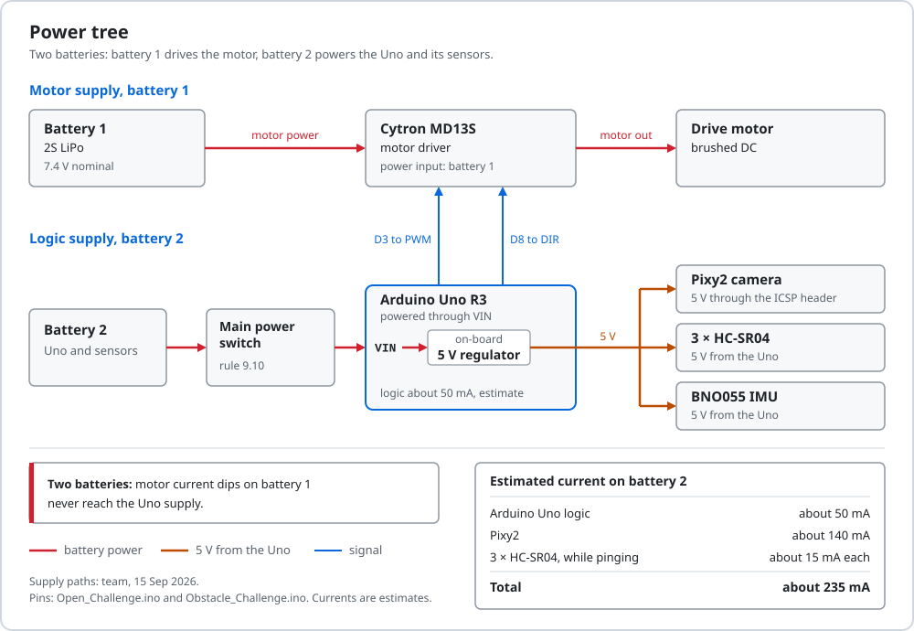

# Power and sensor architecture

A 2S LiPo powers the Cytron MD13S and an Arduino Uno with three HC-SR04 sonars, a BNO055 IMU and a Pixy2 camera. All current figures below are estimates.
The side sonars face about 40 degrees from the nose, which changed four parts of the code.

[Back to the README](../README.md) · Criterion 2 of 5 · Previous: [Mobility](01-mobility.md) · Next: [Software and strategy](03-software-and-strategy.md)

## Evidence

| Claim | Where to check |
|---|---|
| Power tree, with the parts still to confirm marked | [diagrams/power_tree.svg](diagrams/power_tree.svg) |
| Every signal pin | [diagrams/wiring_pinmap.svg](diagrams/wiring_pinmap.svg); constants in [Obstacle_Challenge.ino lines 51-56](../src/Obstacle_Challenge/Obstacle_Challenge.ino#L51-L56) |
| Side sonars at about 40 degrees from the nose axis | Team drawing, 14 Sep 2026; [diagrams/sensor_layout.svg](diagrams/sensor_layout.svg) |
| Pixy2 signature 1 red, 2 green, 3 magenta | [line 90](../src/Obstacle_Challenge/Obstacle_Challenge.ino#L90) |
| The BNO055 runs in NDOF fusion mode | `bno.begin()` with no argument, [line 302](../src/Obstacle_Challenge/Obstacle_Challenge.ino#L302); Adafruit BNO055 1.6.4 defaults to `OPERATION_MODE_NDOF` |
| Lost echoes, bad IMU reads and a missing IMU are handled | [lines 434-443](../src/Obstacle_Challenge/Obstacle_Challenge.ino#L434-L443), [241-253](../src/Obstacle_Challenge/Obstacle_Challenge.ino#L241-L253), [301-305](../src/Obstacle_Challenge/Obstacle_Challenge.ino#L301-L305) |

## Power

  

### What is confirmed and what is not

| Item | Status | Source |
|---|---|---|
| Battery | 2S LiPo, 7.4 V nominal (8.4 V full). Capacity not recorded | Team |
| Motor supply | Battery to the MD13S, the same in both June documents | June README and June Schemes page |
| Pixy2 supply | 5 V from the Uno through the ICSP header, the only header the Pixy2 SPI link uses | Pixy2 library `Link2SPI` |
| Uno supply | Not confirmed. The June README drew the battery straight to Vin; the June Schemes page drew a 5 V buck converter before Vin | The two June documents disagree |
| HC-SR04, servo, BNO055 supply rail | Not recorded for this car | - |
| Main switch | One switch turns the car on (rule 9.10, p.17). Type and position not recorded | Rule |

The two Uno paths are not equivalent. Vin feeds the Uno's own 5 V linear regulator, and Arduino gives 7-12 V as the recommended Vin input. A 5 V converter output on Vin would leave the 5 V rail below 5 V. Measuring the 5 V rail on the car settles which drawing is right.

If the steering servo takes its 5 V from the Uno, its current at full lock also passes through that regulator. That is one more reason to meter the servo before the final.

### Current budget

| Load | Supply | Current | Basis |
|---|---|---|---|
| Arduino Uno logic | 5 V | about 50 mA | Estimate in our audit notes |
| Pixy2 | 5 V through ICSP | about 140 mA | Estimate in our audit notes |
| 3 × HC-SR04 | 5 V, to confirm | about 15 mA each while pinging | Estimate in our audit notes |
| BNO055 breakout | not recorded | not estimated | - |
| Steering servo | not recorded | not measured; peaks at lock | - |
| Drive motor | battery through the MD13S | not measured | - |
| **Logic and sensors, without BNO055, servo and motor** | | **about 235 mA** | Sum of the rows above |

We cannot give a run time or a regulator margin until the battery capacity and the motor and servo currents are measured. The plan is four meter readings: standing, cruising at PWM 30, break-away, and servo held at full lock ([procedure](05-build-test-reproduce.md#how-to-reproduce-every-number)).

### Battery charge and speed

Our spec file assumes the car is 1.8 times faster on a full battery than on a flat one (range 1.3-2.2). The simulator varies speed by ±12 % per seed. Neither number is measured. Park arcs end on the IMU heading and park steps are measured before use, so charge should change move time more than end position. We have not tested this.

### Wiring rules we keep

- Motor current never returns through the Uno header. We once connected a black lead near the Uno power header and got heat and a burnt component. Only signal ground goes to the Uno.
- After any wiring fault we measure the resistance from 5 V to GND with the power off before switching on again.
- One power switch and one start input (rules 9.10 and 9.11). The start input is a switch or button from A2 to GND with the internal pull-up; [start logic](03-software-and-strategy.md#start-logic-and-rule-911) explains the code.

## Sensors

### What each sensor gives the Uno

| Sensor | Pins and link | What the code reads | Used for |
|---|---|---|---|
| HC-SR04 front | TRIG D6, ECHO D7, NewPing, 400 cm limit | Whole centimetres | Corner trigger at 48 cm, Open finish at 150 cm, park stop mark, pillar range check, stuck detection at 15 cm |
| HC-SR04 left | TRIG D4, ECHO D5 | Whole centimetres | Lane error left minus right, outer-wall pick, wall distance while parking |
| HC-SR04 right | TRIG D2, ECHO D9 | Whole centimetres | Same as left |
| BNO055 | I2C on A4/A5, address 0x28 | Euler heading only | Corner and lap count, U-turn guard, end of the lot exit, every park arc |
| Pixy2 | SPI on the ICSP header | Up to 8 colour blocks: signature, x, width, height | Pillar colour, bearing and range; limiter rejection |

The Pixy2 finds colour blobs on its own processor and sends only block records. One 316 × 208 frame is 65,728 pixels, and the Uno has 2,048 B of RAM, so the Uno could not hold even one frame.

### Placement and the 40-degree side sonars

  

| Sensor | Mounting | Pointing | Source |
|---|---|---|---|
| HC-SR04 front | Centred on the nose | Straight ahead | Team drawing, 14 Sep 2026 |
| HC-SR04 left | Slanted front-left corner | About 40 degrees left of the nose axis (drawn at 39) | Same |
| HC-SR04 right | Slanted front-right corner | About 40 degrees right of the nose axis (drawn at 41) | Same |
| Pixy2 | Forward-facing; pose not measured | Forward, 60 degrees horizontal view (Pixy2 2.0 figure) | - |
| BNO055 | On the chassis; heading must grow when the car turns clockwise | - | [line 171](../src/Obstacle_Challenge/Obstacle_Challenge.ino#L171) |

The field fixes the geometry the sensors work in: walls 100 mm high, Obstacle corridors 1000 mm wide, Open corridors 600 or 1000 mm, pillars 50 × 50 × 100 mm. The mounting heights of the sonars and the camera are not measured; each sonar must sit below the 100 mm wall top to see the wall.

Each side sonar also sees part of the wall ahead. That changed the code in four places:

1. Corner ties. At the 48 cm front trigger both side units see the same front wall, so left minus right is close to zero and its sign flips from loop to loop. `open_kuwait` broke ties by turning right, which made the turn a coin toss. The finals code decides the turn from a vote of the corners already driven ([Open Challenge](03-software-and-strategy.md#open-challenge)).
2. Drift toward the outer wall (simulation). Across a 1000 mm corridor the inner unit meets the wall at about 50 degrees incidence and often returns no echo. The code then copies the other side's reading, the error becomes zero, and the car rides about 250-300 mm off the outer wall instead of centred.
3. Late pillar sighting (simulation). After a corner that drift puts the first pillar at a 55-65 degree bearing, outside the Pixy2's 30 degrees each side, until it is close. This is the main reason our Obstacle code still misses inner-row pillars ([what failed](04-engineering-decisions.md#what-failed)).
4. Parking needs one fit per side (simulation). Near a parallel wall a 40-degree unit returns the edge of its beam, about 55 degrees in our simulator, not the axis. The two units map to wall distance differently, so the park keeps one linear fit for each: `mm = A × cm + B`, A 5.16 / B 202.5 on the left and A 13.02 / B -50.2 on the right ([lines 135-136](../src/Obstacle_Challenge/Obstacle_Challenge.ino#L135-L136)). Both come from the simulator and must be measured on the car.

We kept the cant because our lane law does not depend on the bearing. A PD law on left minus right sees equal readings when the car is centred, at any sensor angle.

Before we had a drawing of the nose, we tuned laws in simulation for 90-degree flank sonars. On the real car those laws drove into the walls. An older simulator study found that square side brackets would help the park; we have not changed the brackets.

### HC-SR04

- Minimum range about 34 mm. The module sends 8 cycles at 40 kHz, a 200 µs burst. Sound covers 68.6 mm in that time, so an echo from nearer than about 34 mm returns while the burst is still going out.
- Scale. NewPing converts at 57 µs per cm. At 20 °C the round trip takes 58.3 µs per cm, so readings are about 2.3 % long. Readings are whole centimetres.
- Timeout. A ping to the 400 cm limit can wait 400 × 57 µs ≈ 23 ms for an echo that never comes.
- Firing order. The code fires left, right, front one after another, with a 3 ms pause before each ([`getStableDistance()`, line 232](../src/Obstacle_Challenge/Obstacle_Challenge.ino#L232)). We have not measured crosstalk between units fired this close together.
- Filter. `lpf = 0.9 × new + 0.1 × old` ([lines 441-442](../src/Obstacle_Challenge/Obstacle_Challenge.ino#L441-L442)). 90 % of each new reading passes, so the smoothing is weak and the lane error follows each new reading closely.

### Pixy2

| Signature | Trained on | Rule colour | Use in the finals code |
|---|---|---|---|
| 1 | Red pillar | RGB (238, 39, 55), rule 13.21 | Pass on the pillar's right |
| 2 | Green pillar | RGB (68, 214, 44), rule 13.22 | Pass on the pillar's left |
| 3 | Magenta parking limiter | RGB (255, 0, 255), rule 13.27 | Declared as `SIG_PARK_WALL`, not read by v20 |

We train magenta as signature 3 so the limiters are labelled apart from red pillars. As a second guard, a block in signature 1 or 2 is rejected if it is shaped like a limiter: area of 600 px or more and width/height of 1.4 or more ([`looksLikeBarrier()`, line 276](../src/Obstacle_Challenge/Obstacle_Challenge.ino#L276)).

The colour-connected-components frame is 316 × 208 px, and the Pixy2 2.0 lens covers about 60 × 40 degrees. That gives bearing and range from the image:

- bearing ≈ (x - 158) × 60 / 316 = (x - 158) × 0.19 degrees;
- focal length 158 / tan 30° = 273.7 px across and 104 / tan 20° = 285.7 px down;
- range = focal length × real size / size in pixels. For a 50 mm wide, 100 mm tall pillar: 273.7 × 50 = 13683 / width px and 285.7 × 100 = 28574 / height px. The code takes the smaller of the two ([`signDistance()`, line 268](../src/Obstacle_Challenge/Obstacle_Challenge.ino#L268)).

In a simulator probe this range read about 5 % short straight ahead and up to 37 % short for a pillar 150-300 mm to the side, because a square pillar seen obliquely shows its diagonal.

When a pillar is within 45 px of the image centre, the front sonar may replace the camera range if it reads under 1.5 m, no more than 60 mm further, and less than 400 mm nearer ([lines 518-524](../src/Obstacle_Challenge/Obstacle_Challenge.ino#L518-L524)). It can only make a pillar nearer. A ping can miss a 50 mm pillar a few degrees off the axis and return the wall behind it, which would make the pillar look far and weaken the steering just before the pass.

The box in our June parts photo reads Pixy2 version 2.1; the camera mounted on the car is not confirmed. The constants above assume the 2.0 lens. The check takes one minute: a pillar 500 mm straight ahead is 13683 / 500 ≈ 27 px wide in PixyMon on a 2.0, and about 19 px on a 2.1 (our simulator's lens model). If it is a 2.1, both range constants change.

### BNO055

- Mode. `bno.begin()` is called without an argument ([line 302](../src/Obstacle_Challenge/Obstacle_Challenge.ino#L302)). In Adafruit BNO055 1.6.4 that selects `OPERATION_MODE_NDOF`, which fuses accelerometer, gyroscope and magnetometer. The code never reads the calibration status. The chip's IMUPLUS mode fuses only the accelerometer and gyroscope, so a magnetic field from the motor or the building could not move the heading. The finals code does not use IMUPLUS, and we have not tested it.
- What is read. The Euler heading only, with the external crystal enabled ([line 307](../src/Obstacle_Challenge/Obstacle_Challenge.ino#L307)).
- Lap count. Each heading change is wrapped to ±180 degrees and added to a total that is never reset. A corner counts when the total reaches 90 × n + 70 degrees, 20 degrees before the corner is complete ([`lapsCount()`, line 418](../src/Obstacle_Challenge/Obstacle_Challenge.ino#L418)). Those 20 degrees are the margin for drift.
- Direction. The Obstacle sketch checks the sign during the lot exit: if the exit turned 20 degrees or more the wrong way on the heading, it flips `headingSign` ([line 378](../src/Obstacle_Challenge/Obstacle_Challenge.ino#L378)).

## Calibration procedures

Rule 9.9 (p.17) forbids sensor calibration in preparation time, and rule 13.18 (p.27) gives teams the testing rounds to tune to the venue colours. We do all of this in practice time. The serial monitor runs at 115200 baud; the Obstacle sketch prints `WAIT L .. R .. F .. yaw ..` every 400 ms while it waits.

| # | Check | How | Pass |
|---|---|---|---|
| 1 | Pixy2 signatures | In PixyMon, under the venue light: signature 1 on a red pillar, 2 on a green pillar, 3 on a magenta limiter | Each object shows one box with the right signature at 900 mm, the range at which pillars start to steer the car |
| 2 | Pixy2 version | Pillar 500 mm straight ahead, read its width in PixyMon | About 27 px (2.0) or about 19 px (2.1); record which |
| 3 | IMU direction | Obstacle sketch waiting; turn the car clockwise by hand | `yaw` increases. If it decreases, the BNO055 is mounted the other way up |
| 4 | Front range | Car square to a wall; tape from the nose | `F` matches the tape within about 3 %; NewPing reads about 2.3 % long |
| 5 | Side sonars | Hand in front of each side unit | `L` and `R` change |
| 6 | Outer-wall pick | Car in the lot about 40 mm from the outer wall, facing the driving direction; start | Prints `outer wall = LEFT` or `RIGHT`, matching the real wall. In simulation the pick was right in 30 of 30 starts at that gap |

### Park constants

These were set in simulation. The first four rows are marked MEASURE in the source, and `PARK_LANE_MM` is on our test-day list. Each takes a few minutes on a mat:

| Constant | Now | Procedure |
|---|---|---|
| `LOT_RIGHT_MM` | 980 | Tape from the far wall to the far face of the downstream limiter, lot on the car's right. `LOT_LEFT_MM` follows as 3000 - 340 - `LOT_RIGHT_MM` |
| `R_PARK_MM` | 170 | Servo at 170, push the car slowly through a full circle, mark the rear-axle centre, halve the diameter. Repeat at servo 10 |
| `SIDE_A_L`, `SIDE_B_L`, `SIDE_A_R`, `SIDE_B_R` | sim fits | Car parallel to a wall with the rear axle 300 mm and then 400 mm from it; read that side's sonar in cm. A = 100 / (cm400 - cm300), B = 300 - A × cm300 |
| `CAR_NOSE_MM` | 168 | Rear-axle centre to the front bumper, steel rule |
| `PARK_LANE_MM` | 320 | Rear axle to the outer wall during the approach; check that it clears the limiter tips at 200 mm |

The formulas are in the sketch header ([lines 31-38](../src/Obstacle_Challenge/Obstacle_Challenge.ino#L31-L38)).

## Failure modes and how the code handles them

| Failure | How the code notices | What it does | Where |
|---|---|---|---|
| One side sonar returns no echo | NewPing returns 0 | Copies the other side's reading; if both are silent, keeps the last filtered value, or 60 cm at the start. Side effect: the outer-wall drift above | [lines 434-437](../src/Obstacle_Challenge/Obstacle_Challenge.ino#L434-L437) |
| I2C read fails | Heading reads exactly 0.0 while the previous heading was more than 20 degrees from 0 | Keeps the previous heading; `Wire.setWireTimeout(25000, true)` resets a stuck bus | [line 249](../src/Obstacle_Challenge/Obstacle_Challenge.ino#L249), [line 299](../src/Obstacle_Challenge/Obstacle_Challenge.ino#L299) |
| BNO055 missing at power-up | `bno.begin()` fails 3 times, 300 ms apart | Servo wiggles twice, repeating, and the car never drives. One wiggle means ready | [lines 301-305](../src/Obstacle_Challenge/Obstacle_Challenge.ino#L301-L305) |
| IMU mounted upside down | Obstacle only: sign of the exit rotation, if 20 degrees or more | Flips `headingSign`, so corners and arcs keep the right sense | [line 378](../src/Obstacle_Challenge/Obstacle_Challenge.ino#L378) |
| Pillar cut off at the frame edge reads far | x outside 20-300 px | Block ignored; the steering scale has a 0.35 floor; the front sonar can shorten the range | [line 498](../src/Obstacle_Challenge/Obstacle_Challenge.ino#L498), [lines 534-538](../src/Obstacle_Challenge/Obstacle_Challenge.ino#L534-L538) |
| Parking limiter seen as a pillar | Width/height ≥ 1.4 with area ≥ 600 px | Block rejected | [line 495](../src/Obstacle_Challenge/Obstacle_Challenge.ino#L495) |
| Limiter tip echo while approaching the lot | Reading far from the tracked wall range | Rejected by the far-wall tracker; two readings of 250 mm or less force a reverse onto the mark | [lines 762-800](../src/Obstacle_Challenge/Obstacle_Challenge.ino#L762-L800) |
| Magnetometer moves the NDOF heading | Not detected | None specific; the corner count keeps 20 degrees of margin | Not measured on the car |
| Wrong Pixy2 lens for the range constants | Not detected | None; the version check in the calibration table | - |

## Sensing bugs we fixed

- Nearest pillar, not the first block. `blocks[0]` is the largest blob, not the nearest pillar. The code now ranges every block and steers on the nearest one within 900 mm.
- Area as `long`. A pillar filling the frame at about 30 cm overflowed a 16-bit `int`: a serial log printed `area=-9646` and the pillar was thrown away.
- Signatures red 1, green 2. The car passed pillars on the wrong side. Our fix notes give the likely cause: signature 1 trained on red while the code treated 1 as green. The code now reads red as 1 and green as 2, and we train to match.
- A visible IMU fault. A BNO055 that did not answer used to hang the code silently in `while(1)`, which was one reason the car did not move on 14 Sep 2026. The code now wiggles the servo.

Dates, versions and the rest of the history: [version history](04-engineering-decisions.md#version-history).

[Back to the README](../README.md) · Previous: [Mobility](01-mobility.md) · Next: [Software and strategy](03-software-and-strategy.md)
