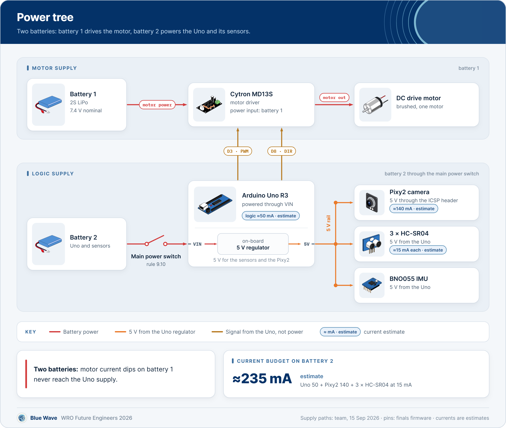

# Power and sensor architecture

The car has two batteries. Battery 1 feeds the Cytron MD13S and the drive motor only. Battery 2 feeds the Arduino Uno, which powers three HC-SR04 sonars, a BNO055 IMU and a Pixy2 camera.
The side sonars face about 40 degrees from the nose, which changed four parts of the code.

[Back to the README](../README.md) · Criterion 2 of 5 · Previous: [Mobility](01-mobility.md) · Next: [Software and strategy](03-software-and-strategy.md)

## Evidence

| Claim | Where to check |
|---|---|
| Two batteries: battery 1 to the MD13S, battery 2 through the main switch to the Uno's VIN | [diagrams/power_tree.png](diagrams/power_tree.png); team wiring record, 15 Sep 2026 |
| Every signal pin | [diagrams/wiring_pinmap.png](diagrams/wiring_pinmap.png); constants in [Obstacle_Challenge.ino lines 51-56](https://github.com/BllueWave/WRO-Future-Engineers-2026/blob/v2.0-asia-final/src/Obstacle_Challenge/Obstacle_Challenge.ino#L51-L56) |
| Side sonars at about 40 degrees from the nose axis | Team drawing, 14 Sep 2026; [diagrams/sensor_layout.png](diagrams/sensor_layout.png) |
| Pixy2 signature 1 red, 2 green, 3 magenta | [line 90](https://github.com/BllueWave/WRO-Future-Engineers-2026/blob/v2.0-asia-final/src/Obstacle_Challenge/Obstacle_Challenge.ino#L90) |
| The BNO055 runs in NDOF fusion mode | `bno.begin()` with no argument, [line 302](https://github.com/BllueWave/WRO-Future-Engineers-2026/blob/v2.0-asia-final/src/Obstacle_Challenge/Obstacle_Challenge.ino#L302); Adafruit BNO055 1.6.4 defaults to `OPERATION_MODE_NDOF` |
| Lost echoes, bad IMU reads and a missing IMU are handled | [lines 434-443](https://github.com/BllueWave/WRO-Future-Engineers-2026/blob/v2.0-asia-final/src/Obstacle_Challenge/Obstacle_Challenge.ino#L434-L443), [241-253](https://github.com/BllueWave/WRO-Future-Engineers-2026/blob/v2.0-asia-final/src/Obstacle_Challenge/Obstacle_Challenge.ino#L241-L253), [301-305](https://github.com/BllueWave/WRO-Future-Engineers-2026/blob/v2.0-asia-final/src/Obstacle_Challenge/Obstacle_Challenge.ino#L301-L305) |

## Power

  

### Supply

| Item | What it is | Source |
|---|---|---|
| Battery 1 | 2S LiPo, 7.4 V nominal, 8.4 V full. Connected straight to the Cytron MD13S power input, it powers only the drive motor | Team |
| Battery 2 | Goes through the main power switch to the Arduino Uno's VIN | Team |
| Uno 5 V | The Uno's on-board regulator makes 5 V from VIN | Team |
| Sensor supply | 5 V from the Uno for the three HC-SR04 sonars and the BNO055 | Team |
| Pixy2 supply | 5 V from the Uno through the ICSP header, the only header the Pixy2 SPI link uses | Team; Pixy2 library `Link2SPI` |
| Motor commands | The Uno drives the MD13S PWM input from D3 and DIR from D8 | [line 55](https://github.com/BllueWave/WRO-Future-Engineers-2026/blob/v2.0-asia-final/src/Obstacle_Challenge/Obstacle_Challenge.ino#L55) |
| Main switch | One switch, between battery 2 and the Uno's VIN, turns the car on | Rule 9.10 (p.17); team |

The motor's current flows only between battery 1, the MD13S and the motor. When the motor starts, including the 70 ms kick at PWM 55, the current dip it pulls on battery 1 never reaches the Uno's supply.

Battery 1 has no switch in its line, so the MD13S has power whenever battery 1 is connected. Its speed and direction come from the Uno on D3 and D8.

### Current budget

**Battery 2: the Uno and everything on its 5 V rail**

| Load | Current | Basis |
|---|---|---|
| Arduino Uno logic | about 50 mA | Estimate for an Uno R3 board: ATmega328P, USB-serial chip and power LED |
| Pixy2 | about 140 mA | Pixy2 datasheet, typical |
| 3 × HC-SR04 | about 45 mA | 15 mA each, HC-SR04 datasheet |
| BNO055 | about 12 mA | Bosch datasheet, fusion mode |
| Steering servo | about 10 mA holding, 150-250 mA moving, about 650 mA stalled | 9 g class micro servo |
| **Average in a round** | **about 350 mA** | Servo moving about a third of the time |
| **Peak** | **about 900 mA** | Servo stalled at full lock |

**Battery 1: the drive motor only**

| Load | Current | Basis |
|---|---|---|
| Cruise at PWM 30 | about 0.5 A | Estimate for a 130 motor at 12 % duty on 7.4 V |
| PWM 55 kick, 70 ms | about 1.5-2 A | Estimate |
| Motor stalled against a wall | about 3 A | 130 motor at 7.4 V |
| Cytron MD13S rating | 13 A continuous, 30 A peak | MD13S datasheet |

**Run time and margins**

| Item | Value | Basis |
|---|---|---|
| Battery 1, 2S LiPo 400 mAh at 0.5 A | about 40 min of driving | 90 % of the capacity used |
| Battery 2, 2S LiPo 400 mAh at 350 mA | about 60 min | 90 % of the capacity used |
| One round | at most 3 min | Rules |
| Motor driver headroom | more than 4 × the stall current | 13 A against 3 A |
| Uno regulator heat at 350 mA | about 0.8 W at 7.4 V, 1.2 W on a full 8.4 V pack | (V in − 5 V) × I |

The Uno's 5 V regulator is the tightest point of the supply: the Pixy2 is 40 % of its average load, and a servo stall adds up to 650 mA for as long as the wheels are forced. Steering is limited to servo 30-160 while driving, which keeps the linkage off its end stops. If the regulator ever runs hot, the fix is a separate 5 V regulator for the servo on battery 2.

### When a battery runs down

| Battery | What happens | What the car does |
|---|---|---|
| Battery 1, motor | At the same PWM the motor turns slower, so the car drives slower. The Uno, the sensors and the Pixy2 are on battery 2 and keep running. | Nothing in the lap law is dead-reckoned: the car steers on what it measures, the left-right sonar balance, the Pixy2 position and the front range. Park arcs end on the IMU heading, and the park measures its own step length before it uses it ([lines 978-985](https://github.com/BllueWave/WRO-Future-Engineers-2026/blob/v2.0-asia-final/src/Obstacle_Challenge/Obstacle_Challenge.ino#L978-L985)). |
| Battery 2, Uno | The Uno's 5 V drops and the Uno resets. The sensors and the Pixy2 lose their 5 V with it. Battery 1 and the MD13S supply are unaffected. | When `setup()` runs again it sets the motor to 0 and the servo to 90 ([lines 293-295](https://github.com/BllueWave/WRO-Future-Engineers-2026/blob/v2.0-asia-final/src/Obstacle_Challenge/Obstacle_Challenge.ino#L293-L295)), then waits for a new change on the start input ([line 322](https://github.com/BllueWave/WRO-Future-Engineers-2026/blob/v2.0-asia-final/src/Obstacle_Challenge/Obstacle_Challenge.ino#L322)). The round does not continue. |

The code does not read either battery. Our simulator varies the car's speed by ±12 % per seed. Step 10 of the [bench check](05-build-test-reproduce.md#ten-minute-bench-check) writes both battery voltages on the [test sheet](test-sheet.md) before a session.

### Wiring rules we keep

- Motor current stays on battery 1 and never returns through the Uno header. Only signal ground goes to the Uno. We once connected a black lead near the Uno power header and got heat and a burnt component.
- Battery 2 reaches the Uno at VIN, after the main power switch.
- After any wiring fault we measure the resistance from 5 V to GND with the power off before switching on again.
- One power switch and one start input (rules 9.10 and 9.11). The start input is a switch or button from A2 to GND with the internal pull-up; [start logic](03-software-and-strategy.md#start-logic-and-rule-911) explains the code.

## Sensors

### Why HC-SR04 sonars

- The walls are black (rules 13.4 and 13.6, p.26). A sonar times an echo of sound, so it returns the distance to a black wall whatever the colour or the light in the hall.
- The datasheet rates it from 2 to 400 cm, and our code uses the full 400 cm (`MAX_DISTANCE`, [line 89](https://github.com/BllueWave/WRO-Future-Engineers-2026/blob/v2.0-asia-final/src/Obstacle_Challenge/Obstacle_Challenge.ino#L89)).
- Each unit needs only two digital pins, TRIG and ECHO, and NewPing reads it in whole centimetres.
- Three units cover the front and both front corners. The corner units point about 40 degrees from the nose, so each sees the wall beside the car and part of the wall ahead.

### Why a Pixy2

- The Pixy2 finds the red, green and magenta signatures on its own processor. It sends only each block's signature, position and size over SPI.
- The Uno never handles images. One 316 × 208 frame is 65,728 pixels, and the Uno has 2,048 B of RAM, so it could not hold even one frame.
- A block's x position gives the pillar's bearing, and its width grows as the pillar gets closer, which gives its distance ([Pixy2](#pixy2)).
- We train the three signatures in PixyMon under the venue light, in the testing time that rule 13.18 (p.27) gives for colour tuning.

### What each sensor gives the Uno

| Sensor | Pins and link | What the code reads | Used for |
|---|---|---|---|
| HC-SR04 front | TRIG D13, ECHO D7, NewPing, 400 cm limit | Whole centimetres | Corner trigger at 48 cm, Open finish at 150 cm, park stop mark, pillar range check, stuck detection at 15 cm |
| HC-SR04 left | TRIG D4, ECHO D5 | Whole centimetres | Lane error left minus right, outer-wall pick, wall distance while parking |
| HC-SR04 right | TRIG D2, ECHO D9 | Whole centimetres | Same as left |
| BNO055 | I2C on A4/A5, address 0x28 | Euler heading only | Corner and lap count, U-turn guard, end of the lot exit, every park arc |
| Pixy2 | SPI on the ICSP header | Up to 8 colour blocks: signature, x, width, height | Pillar colour, bearing and range; limiter rejection |

The front trigger is on D13. Until 15 September 2026 it was on D6. D13 is also the SPI clock the Pixy2 uses through the ICSP header, so we checked it on the mat before keeping it: with both sketches reading the Pixy2 in every loop, the front sonar still gave the corner trigger and the pillar ranges, and the Obstacle build drove its laps.

### Placement and the 40-degree side sonars

  

| Sensor | Mounting | Pointing | Source |
|---|---|---|---|
| HC-SR04 front | Centred on the nose | Straight ahead | Team drawing, 14 Sep 2026 |
| HC-SR04 left | Slanted front-left corner | About 40 degrees left of the nose axis (drawn at 39) | Same |
| HC-SR04 right | Slanted front-right corner | About 40 degrees right of the nose axis (drawn at 41) | Same |
| Pixy2 | Facing forward | 60 degrees horizontal view in the range constants | [line 77](https://github.com/BllueWave/WRO-Future-Engineers-2026/blob/v2.0-asia-final/src/Obstacle_Challenge/Obstacle_Challenge.ino#L77) |
| BNO055 | On the chassis; heading must grow when the car turns clockwise | - | [line 171](https://github.com/BllueWave/WRO-Future-Engineers-2026/blob/v2.0-asia-final/src/Obstacle_Challenge/Obstacle_Challenge.ino#L171) |

The field fixes the geometry the sensors work in: walls 100 mm high, Obstacle corridors 1000 mm wide, Open corridors 600 or 1000 mm, pillars 50 × 50 × 100 mm. Each sonar has to sit below the 100 mm wall top to see the wall.

Each side sonar also sees part of the wall ahead. That changed the code in four places:

1. Corner ties. At the 48 cm front trigger both side units see the same front wall, so left minus right is close to zero and its sign flips from loop to loop. `open_kuwait` broke ties by turning right, which made the turn a coin toss. The finals code decides the turn from a vote of the corners already driven ([Open Challenge](03-software-and-strategy.md#open-challenge)).
2. Drift toward the outer wall (simulation). Across a 1000 mm corridor the inner unit meets the wall at about 50 degrees incidence and often returns no echo. The code then copies the other side's reading, the error becomes zero, and the car rides about 250-300 mm off the outer wall instead of centred.
3. Late pillar sighting (simulation). After a corner that drift puts the first pillar at a 55-65 degree bearing, outside the Pixy2's 30 degrees each side, until it is close. This is the main mechanism behind the inner-row pillar misses we traced in simulation ([what failed](04-engineering-decisions.md#what-failed)).
4. Parking needs one fit per side (simulation). Near a parallel wall a 40-degree unit returns the edge of its beam, about 55 degrees in our simulator, not the axis. The two units map to wall distance differently, so the park keeps one linear fit for each: `mm = A × cm + B`, A 5.16 / B 202.5 on the left and A 13.02 / B -50.2 on the right ([lines 135-136](https://github.com/BllueWave/WRO-Future-Engineers-2026/blob/v2.0-asia-final/src/Obstacle_Challenge/Obstacle_Challenge.ino#L135-L136)). Both are simulator fits, and the [park constants](#park-constants) table gives the mat procedure.

We kept the cant because our lane law does not depend on the bearing. A PD law on left minus right sees equal readings when the car is centred, at any sensor angle.

Before we had a drawing of the nose, we tuned laws in simulation for 90-degree flank sonars. On the real car those laws drove into the walls.

### HC-SR04

- Minimum range. The datasheet says 2 cm, but the module sends 8 cycles at 40 kHz, a 200 µs burst. Sound covers 68.6 mm in that time, so an echo from nearer than about 34 mm returns while the burst is still going out.
- Scale. NewPing converts at 57 µs per cm. At 20 °C the round trip takes 58.3 µs per cm, so readings are about 2.3 % long. Readings are whole centimetres.
- Timeout. A ping to the 400 cm limit can wait 400 × 57 µs ≈ 23 ms for an echo that never comes.
- Firing order. The code fires left, right, front one after another, with a 3 ms pause before each ([`getStableDistance()`, line 232](https://github.com/BllueWave/WRO-Future-Engineers-2026/blob/v2.0-asia-final/src/Obstacle_Challenge/Obstacle_Challenge.ino#L232)). Each ping waits for its echo or its timeout before the next one starts.
- Filter. `lpf = 0.9 × new + 0.1 × old` ([lines 441-442](https://github.com/BllueWave/WRO-Future-Engineers-2026/blob/v2.0-asia-final/src/Obstacle_Challenge/Obstacle_Challenge.ino#L441-L442)). 90 % of each new reading passes, so the smoothing is weak and the lane error follows each new reading closely.

### Pixy2

| Signature | Trained on | Rule colour | Use in the finals code |
|---|---|---|---|
| 1 | Red pillar | RGB (238, 39, 55), rule 13.21 | Pass on the pillar's right |
| 2 | Green pillar | RGB (68, 214, 44), rule 13.22 | Pass on the pillar's left |
| 3 | Magenta parking limiter | RGB (255, 0, 255), rule 13.27 | Declared as `SIG_PARK_WALL`; the finals code skips it |

We train magenta as signature 3 so the limiters are labelled apart from red pillars. As a second guard, a block in signature 1 or 2 is rejected if it is shaped like a limiter: area of 600 px or more and width/height of 1.4 or more ([`looksLikeBarrier()`, line 276](https://github.com/BllueWave/WRO-Future-Engineers-2026/blob/v2.0-asia-final/src/Obstacle_Challenge/Obstacle_Challenge.ino#L276)).

The colour-connected-components frame is 316 × 208 px, and the range constants use a field of view of about 60 × 40 degrees. That gives bearing and range from the image:

- bearing ≈ (x - 158) × 60 / 316 = (x - 158) × 0.19 degrees;
- focal length 158 / tan 30° = 273.7 px across and 104 / tan 20° = 285.7 px down;
- range = focal length × real size / size in pixels. For a 50 mm wide, 100 mm tall pillar: 273.7 × 50 = 13683 / width px and 285.7 × 100 = 28574 / height px. The code takes the smaller of the two ([`signDistance()`, line 268](https://github.com/BllueWave/WRO-Future-Engineers-2026/blob/v2.0-asia-final/src/Obstacle_Challenge/Obstacle_Challenge.ino#L268)).

In a simulator probe this range read about 5 % short straight ahead and up to 37 % short for a pillar 150-300 mm to the side, because a square pillar seen obliquely shows its diagonal.

When a pillar is within 45 px of the image centre, the front sonar may replace the camera range if it reads under 1.5 m, no more than 60 mm further, and less than 400 mm nearer ([lines 518-524](https://github.com/BllueWave/WRO-Future-Engineers-2026/blob/v2.0-asia-final/src/Obstacle_Challenge/Obstacle_Challenge.ino#L518-L524)). It can only make a pillar nearer. A ping can miss a 50 mm pillar a few degrees off the axis and return the wall behind it, which would make the pillar look far and weaken the steering just before the pass.

We check both range constants with one pillar 500 mm straight ahead. PixyMon should show it about 13683 / 500 ≈ 27 px wide and 28574 / 500 ≈ 57 px tall. If the camera shows other sizes, each constant is the size in px × 500.

### BNO055

- Mode. `bno.begin()` is called without an argument ([line 302](https://github.com/BllueWave/WRO-Future-Engineers-2026/blob/v2.0-asia-final/src/Obstacle_Challenge/Obstacle_Challenge.ino#L302)). In Adafruit BNO055 1.6.4 that selects `OPERATION_MODE_NDOF`, which fuses accelerometer, gyroscope and magnetometer.
- What is read. The Euler heading only, with the external crystal enabled ([line 307](https://github.com/BllueWave/WRO-Future-Engineers-2026/blob/v2.0-asia-final/src/Obstacle_Challenge/Obstacle_Challenge.ino#L307)).
- Lap count. Each heading change is wrapped to ±180 degrees and added to a total that is never reset. A corner counts when the total reaches 90 × n + 70 degrees, 20 degrees before the corner is complete ([`lapsCount()`, line 418](https://github.com/BllueWave/WRO-Future-Engineers-2026/blob/v2.0-asia-final/src/Obstacle_Challenge/Obstacle_Challenge.ino#L418)). Those 20 degrees are the margin for drift.
- Direction. The Obstacle sketch checks the sign during the lot exit: if the exit turned 20 degrees or more the wrong way on the heading, it flips `headingSign` ([line 378](https://github.com/BllueWave/WRO-Future-Engineers-2026/blob/v2.0-asia-final/src/Obstacle_Challenge/Obstacle_Challenge.ino#L378)).

## Calibration procedures

Rule 9.9 (p.17) forbids sensor calibration in preparation time, and rule 13.18 (p.27) gives teams the testing rounds to tune to the venue colours. We do all of this in practice time. The serial monitor runs at 115200 baud; the Obstacle sketch prints `WAIT L .. R .. F .. yaw ..` every 400 ms while it waits.

| # | Check | How | Pass |
|---|---|---|---|
| 1 | Pixy2 signatures | In PixyMon, under the venue light: signature 1 on a red pillar, 2 on a green pillar, 3 on a magenta limiter | Each object shows one box with the right signature at 900 mm, the range at which pillars start to steer the car |
| 2 | Pixy2 range | Pillar 500 mm straight ahead; read its width and height in PixyMon | About 27 px wide and 57 px tall, matching `DIST_K_W` 13683 and `DIST_K_H` 28574 |
| 3 | IMU direction | Obstacle sketch waiting; turn the car clockwise by hand | `yaw` increases. If it decreases, the BNO055 is mounted the other way up |
| 4 | Front range | Car square to a wall; tape from the nose | `F` matches the tape within about 3 %; NewPing reads about 2.3 % long |
| 5 | Side sonars | Hand in front of each side unit | `L` and `R` change |
| 6 | Outer-wall pick | Car in the lot about 40 mm from the outer wall, facing the driving direction; start | Prints `outer wall = LEFT` or `RIGHT`, matching the real wall. In simulation the pick was right in 30 of 30 starts at that gap |

### Park constants

These constants set the park geometry. Their values come from our simulator, and each takes a few minutes to set on a mat:

| Constant | Now | Procedure |
|---|---|---|
| `LOT_RIGHT_MM` | 980 | Tape from the far wall to the far face of the downstream limiter, lot on the car's right. `LOT_LEFT_MM` follows as 3000 - 340 - `LOT_RIGHT_MM` |
| `R_PARK_MM` | 170 | Servo at 170, push the car slowly through a full circle, mark the rear-axle centre, halve the diameter. Repeat at servo 10 |
| `SIDE_A_L`, `SIDE_B_L`, `SIDE_A_R`, `SIDE_B_R` | 5.16, 202.5, 13.02, -50.2 | Car parallel to a wall with the rear axle 300 mm and then 400 mm from it; read that side's sonar in cm. A = 100 / (cm400 - cm300), B = 300 - A × cm300 |
| `CAR_NOSE_MM` | 168 | Rear-axle centre to the front bumper, steel rule |
| `PARK_LANE_MM` | 320 | Rear axle to the outer wall during the approach; check that it clears the limiter tips at 200 mm |

The formulas are in the sketch header ([lines 31-38](https://github.com/BllueWave/WRO-Future-Engineers-2026/blob/v2.0-asia-final/src/Obstacle_Challenge/Obstacle_Challenge.ino#L31-L38)).

## Failure modes and how the code handles them

| Failure | How the code notices | What it does | Where |
|---|---|---|---|
| One side sonar returns no echo | NewPing returns 0 | Copies the other side's reading; if both are silent, keeps the last filtered value, or 60 cm at the start. Side effect: the outer-wall drift above | [lines 434-437](https://github.com/BllueWave/WRO-Future-Engineers-2026/blob/v2.0-asia-final/src/Obstacle_Challenge/Obstacle_Challenge.ino#L434-L437) |
| I2C read fails | Heading reads exactly 0.0 while the previous heading was more than 20 degrees from 0 | Keeps the previous heading; `Wire.setWireTimeout(25000, true)` resets a stuck bus | [line 249](https://github.com/BllueWave/WRO-Future-Engineers-2026/blob/v2.0-asia-final/src/Obstacle_Challenge/Obstacle_Challenge.ino#L249), [line 299](https://github.com/BllueWave/WRO-Future-Engineers-2026/blob/v2.0-asia-final/src/Obstacle_Challenge/Obstacle_Challenge.ino#L299) |
| BNO055 missing at power-up | `bno.begin()` fails 3 times, 300 ms apart | Servo wiggles twice, repeating, and the car never drives. One wiggle means ready | [lines 301-305](https://github.com/BllueWave/WRO-Future-Engineers-2026/blob/v2.0-asia-final/src/Obstacle_Challenge/Obstacle_Challenge.ino#L301-L305) |
| IMU mounted upside down | Obstacle only: sign of the exit rotation, if 20 degrees or more | Flips `headingSign`, so corners and arcs keep the right sense | [line 378](https://github.com/BllueWave/WRO-Future-Engineers-2026/blob/v2.0-asia-final/src/Obstacle_Challenge/Obstacle_Challenge.ino#L378) |
| Pillar cut off at the frame edge reads far | x outside 20-300 px | Block ignored; the steering scale has a 0.35 floor; the front sonar can shorten the range | [line 498](https://github.com/BllueWave/WRO-Future-Engineers-2026/blob/v2.0-asia-final/src/Obstacle_Challenge/Obstacle_Challenge.ino#L498), [lines 534-538](https://github.com/BllueWave/WRO-Future-Engineers-2026/blob/v2.0-asia-final/src/Obstacle_Challenge/Obstacle_Challenge.ino#L534-L538) |
| Parking limiter seen as a pillar | Width/height ≥ 1.4 with area ≥ 600 px | Block rejected | [line 495](https://github.com/BllueWave/WRO-Future-Engineers-2026/blob/v2.0-asia-final/src/Obstacle_Challenge/Obstacle_Challenge.ino#L495) |
| Limiter tip echo while approaching the lot | Reading far from the tracked wall range | Rejected by the far-wall tracker; two readings of 250 mm or less force a reverse onto the mark | [lines 762-800](https://github.com/BllueWave/WRO-Future-Engineers-2026/blob/v2.0-asia-final/src/Obstacle_Challenge/Obstacle_Challenge.ino#L762-L800) |
| Heading drift during a round | Built into the corner count | Counts each corner at 70 of its 90 degrees, so a drift under 20 degrees cannot add or drop a corner | [line 418](https://github.com/BllueWave/WRO-Future-Engineers-2026/blob/v2.0-asia-final/src/Obstacle_Challenge/Obstacle_Challenge.ino#L418) |
| Battery 2 runs flat | The code does not read the battery; the Uno resets, and battery 1 is unaffected | `setup()` sets the motor to 0 and waits for a new start input, so the round does not continue ([when a battery runs down](#when-a-battery-runs-down)) | [line 293](https://github.com/BllueWave/WRO-Future-Engineers-2026/blob/v2.0-asia-final/src/Obstacle_Challenge/Obstacle_Challenge.ino#L293), [line 322](https://github.com/BllueWave/WRO-Future-Engineers-2026/blob/v2.0-asia-final/src/Obstacle_Challenge/Obstacle_Challenge.ino#L322) |

## Sensing bugs we fixed

- Nearest pillar, not the first block. `blocks[0]` is the largest blob, not the nearest pillar. The code now ranges every block and steers on the nearest one within 900 mm.
- Area as `long`. A pillar filling the frame at about 30 cm overflowed a 16-bit `int`: a serial log printed `area=-9646` and the pillar was thrown away.
- Signatures red 1, green 2. The car passed pillars on the wrong side. Our fix notes give the likely cause: signature 1 trained on red while the code treated 1 as green. The code now reads red as 1 and green as 2, and we train to match.
- A visible IMU fault. A BNO055 that did not answer used to hang the code silently in `while(1)`, which was one reason the car did not move on 14 Sep 2026. The code now wiggles the servo.

Dates, versions and the rest of the history: [version history](04-engineering-decisions.md#version-history).

[Back to the README](../README.md) · Previous: [Mobility](01-mobility.md) · Next: [Software and strategy](03-software-and-strategy.md)
