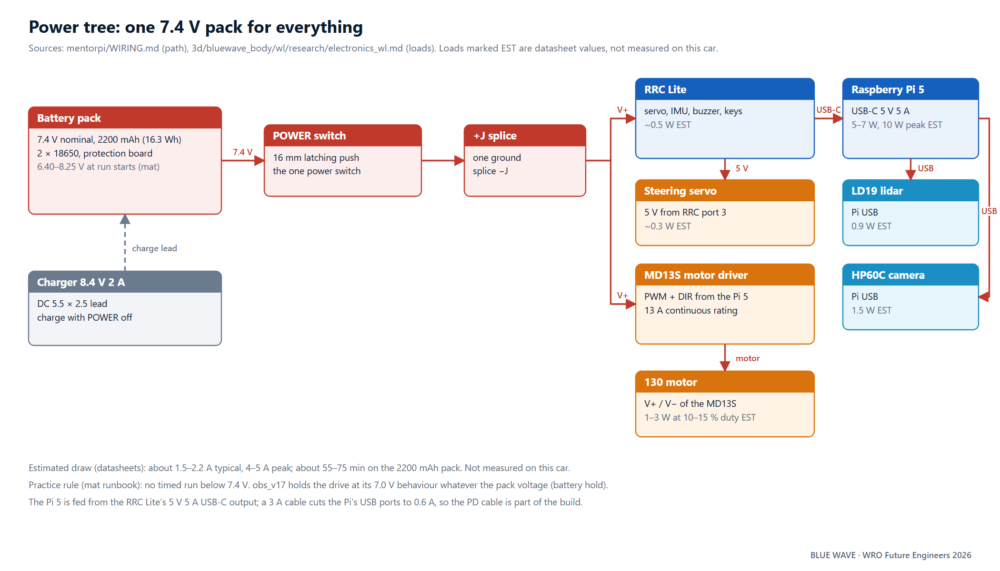
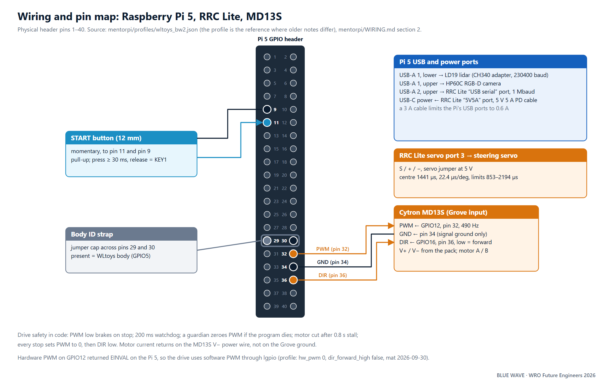
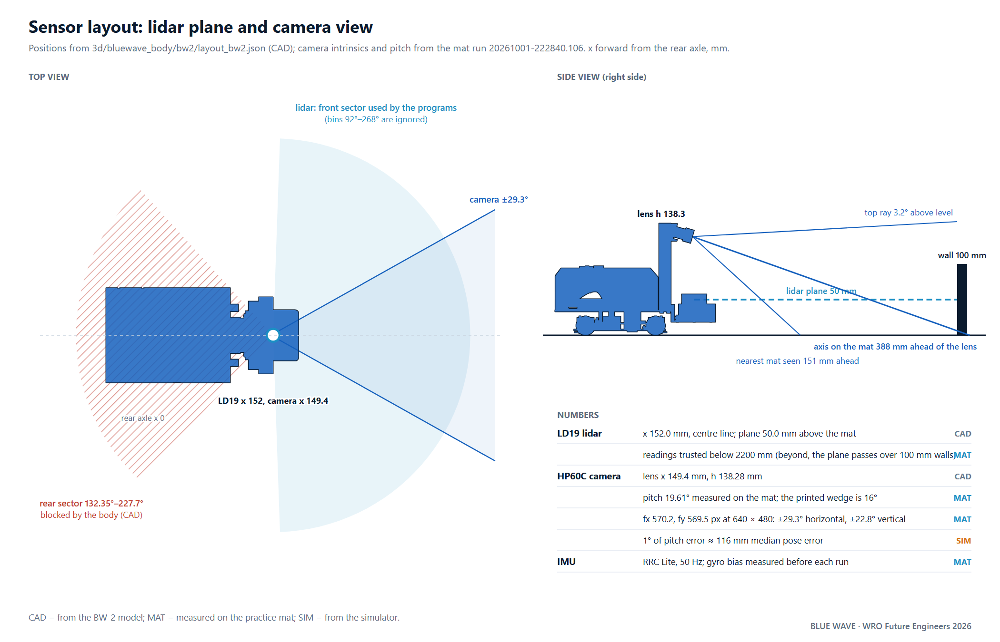

# Power and sensor architecture

Appendix C criterion 2. Where the power goes, what each sensor gives the car, where it sits and why, how we calibrate
it, and what the code does when a part fails.

Tags: **MAT** measured on the car; **FIT** fitted from mat run logs; **CAD** from the body model; **EST** estimate or
datasheet value; **SIM** simulator.

## Summary

- One 7.4 V pack feeds everything through one power switch: the RRC Lite board (which powers the Pi 5 over USB-C) and
  the MD13S motor driver.
- Sensors: an LD19 lidar 50 mm above the mat, an HP60C colour camera pitched 19.61° down, and the RRC Lite's IMU.
  There is no wheel encoder.
- The lidar gives the position: walls and sign pillars from one revolution, about ten times a second. The camera only
  gives colour. The IMU gives the heading between scans.
- Speed comes from a model of the motor, corrected by the lidar at every scan; in the 14.7 s Open run its median error
  against the lidar was 0.01 m/s (MAT).

## Power

  

| Element | Detail | Tag |
|---|---|---|
| Pack | Hiwonder 7.4 V, 2200 mAh, 10C (two 18650 cells with a protection board), 16.3 Wh | EST (listing) |
| Charging | 8.4 V 2 A charger on a DC 5.5 × 2.5 mm lead, with the power switch off | |
| Power switch | 16 mm latching push switch on the pack's positive lead: the only switch (rule 9.10) | |
| Distribution | after the switch, one positive splice to the RRC Lite power input and the MD13S V+; one negative splice for both | |
| Pi 5 supply | from the RRC Lite's 5 V 5 A USB-C output, with a 5 A cable: a 3 A cable cut the Pi's USB ports to 0.6 A | |
| Motor current | returns on the MD13S power negative, not on the Pi's signal ground | |

Wiring rule we keep: never unplug the MD13S negative alone while its signal lines are connected to the Pi, because the
motor current would then look for a path through the Pi and the RRC Lite.

### Load budget

| Load | Power | Tag |
|---|---|---|
| Raspberry Pi 5 | 5–7 W, 10 W peak | EST (datasheet) |
| LD19 lidar | 0.9 W | EST (datasheet) |
| HP60C camera | 1.5 W | EST (datasheet) |
| RRC Lite with IMU | about 0.5 W | EST |
| Steering servo | 0.3 W | EST |
| Drive motor | 1–3 W at 10–15 % duty | EST |

Total current is about 1.5–2.2 A in normal driving and 4–5 A at peaks (EST), which puts the run time of the 2200 mAh
pack at about 55–75 min (EST). A round lasts at most three minutes, so the limit in practice is the pack voltage, not
its capacity.

### Pack voltage

We start mat runs at 7.4 V or more and charge below that. The first logged pack voltage of the finished runs of
2026-09-30 and 2026-10-01 ranges from 6.40 V to 8.25 V (MAT), because some development runs were made on a low pack.

The motor driver code scales the duty by v_ref / V_pack (v_ref = 8.0 V) to keep the speed the same on any pack. The
mat fit found that this car's speed per duty does not fall with the pack (FIT, exponent 0.0), so the scaling made the
car faster on a low pack: × 1.31 at 6.1 V. The Obstacle program `obs_v17` therefore holds the scaling at its 7.0 V
value for the whole run. Run IDs and the effect on the park: [Engineering decisions](04-engineering-decisions.md#battery-compensation-that-over-corrected).

## Pin map

Pin numbers are the Raspberry Pi 5 header pins (1–40). Values from `src/profiles/wltoys_bw2.json`.

| Signal | Pi 5 pin | GPIO or port | Other end | Setting |
|---|---|---|---|---|
| Motor PWM | 32 | GPIO12 | MD13S PWM | 490 Hz, software PWM (`lgpio`) |
| Motor direction | 36 | GPIO16 | MD13S DIR | low = forward |
| Signal ground | 34 | GND | MD13S GND | |
| Start button | 11 and 9 | GPIO17 and GND | 12 mm push button | internal pull-up; press at least 30 ms, then release |
| Body ID strap | 29 and 30 | GPIO5 and GND | jumper | present = this chassis; read by the code at start |
| Steering servo | | RRC Lite PWM port 3, jumper at 5 V | servo | centre 1441 µs, 22.4 µs per degree, 853–2194 µs |
| RRC Lite | USB-A | serial, 1,000,000 baud | RRC Lite USB-C | |
| Lidar | USB-A | CH340 serial, 230,400 baud | LD19 | |
| Camera | USB-A | | HP60C USB-C | |

  

Full schematic: [Schemes](../Schemes/README.md).

## Sensors

  

### LD19 lidar

| Quantity | Value | Tag |
|---|---|---|
| Position | centre line, 152.0 mm ahead of the rear axle | CAD |
| Scan plane | 50.0 mm above the mat; the field walls are 100 mm high | CAD |
| Rate | 598–599 rpm (about 10 scans/s), 1° bins | MAT |
| Mounting in the code | clockwise, offset 180° (scan index 0 is the car's rear) | MAT |
| Range used | readings up to 2200 mm; beyond that the plane can pass over a far wall | MAT |
| Sector used | the front half of the scan; the tower blocks part of the rear (132.35°–227.7°, CAD) | MAT, CAD |

Why 50 mm: on the kit's own mount (2026-09-22) the LD19 scanned above the walls and the sign pillars. A green pillar
25 cm and then about 70 cm ahead never appeared, and a wall 40 cm to the left was missing; the lidar read 2.5–4.3 m,
the room behind the field. The body puts the plane at half the wall height, so walls and pillars are both in it.

What the lidar gives the programs (module `lidar_perc.py`): wall segments, pillar clusters (the signs are 50 × 50 mm),
and the parking-lot limitations, all from one revolution. The Open program reads the wall ahead, both side walls and
the island's inner corner. The Obstacle program fits the wall points to the field map for its position: 551 fits in
the 55.8 s run, 6 rejected, median fit error 5.5 mm (MAT, run `20261001-222840.106-obs_v17`).

### HP60C camera

| Quantity | Value | Tag |
|---|---|---|
| Colour stream | 640 × 480 at 14.2–14.3 frames/s in the runs | MAT |
| Intrinsics | fx 570.169, fy 569.464, cx 325.87, cy 238.096 px | MAT |
| Horizontal field of view | ±29.3° | MAT (from fx) |
| Latency | 0.09 s from exposure to the program | MAT |
| Lens | 149.4 mm ahead of the rear axle, 138.28 mm above the mat | CAD |
| Pitch | 19.61° down | MAT, 2026-10-01 |

The camera is read through Hiwonder's driver, which runs in the vendor's ROS 2 container on the Pi; our code reads its
colour stream on the same machine.

The camera does one job: colour. A pillar the lidar has found is paired with a red or green blob at the same bearing,
at the pose the frame was taken. Pairing by bearing does not depend on the pitch. Hue limits (OpenCV, 0–180) set on the
mat of 2026-10-01: red 10–180 wrapping through 0, green 38–92, magenta 135–180. The parking limitations on that mat
read hue 173–178, which is why the red and magenta ranges overlap and the program tells a limitation from a sign by
its distance from the outer wall (a limitation stands 200 mm out, signs 400 or 600 mm).

The ±29.3° field of view decides what the camera can read. A sign 30–60° off the camera axis is not seen until it is
about 250 mm away, beside the car: how we found that and what we changed is in
[Engineering decisions](04-engineering-decisions.md#the-camera-could-not-see-the-sign).

Why we do not use the depth stream: on 2026-09-22 it gave no returns from the white mat, missed most of the black
walls, and over-read a pillar at 1.25 m as 1.43 m. The lidar measures the same things better.

### IMU

The RRC Lite reports its 6-axis IMU at 50 Hz (MAT). The gyro bias is measured with the car still at the start of each
session (−0.2991 °/s before the 55.8 s run, MAT) and subtracted. The heading sums every sample × 0.02 s.

### Speed without an encoder

| Program | Speed source | Accuracy |
|---|---|---|
| Open (`BEST_OPEN_14s`) | observer: the fitted duty line run on the duty the motor really gets, corrected at every scan by the rate at which the wall ahead approaches | median error 0.01 m/s, 90th percentile 0.058 m/s, scale 1.014 (MAT, run `20261001-161301.412-open_v7`) |
| Obstacle (`obs_v17`) | the lidar wall fit for position; gyro and duty model between scans | median fit error 5.5 mm (MAT) |

The lidar speed alone goes stale in arcs: there the wall ahead turns away. In SIM laps 2 and 3 it was not fresh about
70 % of the time, which is why the Open program runs the motor model and uses the lidar to correct it.

### Timing

| Loop | Value | Tag |
|---|---|---|
| Open control loop | 40 Hz; loop time median 26.6 ms, 99th percentile 32.0 ms | MAT |
| Age of the lidar scan used | median 14.2 ms, 99th percentile 26.8 ms | MAT |

## Calibration

| Calibration | How | When |
|---|---|---|
| Camera pitch | car still, one pillar centred with its near face 500 mm from the front bumper; the test fits the pitch and must answer GO | before each session and after any knock |
| Gyro bias | car still, averaged | start of each session |
| Colours | hues of red, green and the magenta limitations read under the venue light | on arrival at a new field |
| Lidar direction | the lidar direction test | after any lidar work |
| Motor start and speed line | duty sweep from standstill; speed line fitted from run logs | after a motor or driver change |
| Steering | servo sweep and turn-radius test at 0.2 m/s; straight-line trim | after any steering work |
| Field check | car still at the start; the scan must match the standard field | before a round |

One degree of camera pitch error moved the pose by a median 116 mm in SIM for our camera-only localisation, and the
kit's camera mount moved about 10° in one day. The keyed wedge on the tower and the pitch check are the answer.

## Failure modes and how the code handles them

| Failure | Detection | Response |
|---|---|---|
| Lidar mounted or configured differently from the calibration | direction and offset check at start | the Open program halts before the car moves |
| Program thread stalls | each motion command carries a dead-man time; 200 ms motor watchdog | the motor stops |
| Program dies | a guardian in the motor driver code | PWM to zero, DIR low |
| Motor stalled | no movement for 0.8 s | motor cut |
| RRC Lite stops streaming (seen at full lock on a standing car with a low pack) | IMU data older than 0.35 s | hold, reopen the board; standing steering limited to 12° |
| Servo stops following commands after a full-lock corner | wall ahead closing by 150 mm or more in 0.4 s while the yaw is under 30 % of what the steering asks; or the gyro turning against the steering for 0.35 s | reopen the board |
| Wall or sign too close for the command | the lidar shield projects every command | slow, steer away or brake (16, 5 and 1 times in the 55.8 s run) |
| Sign found by the lidar but no colour read | sign seat without a camera vote | turn the nose toward it and read where the map puts it |
| Parking limitation read as a red sign | blob within 270 mm of an outer wall | ignored as a sign |

## Sensing bugs we fixed

| Date | Symptom | Cause | Fix |
|---|---|---|---|
| 2026-09-30 | centring pushed the car toward the walls; the shield braked on walls that were not there | lidar direction set to counter-clockwise: left and right were mirrored against the steering and the gyro. The proof: at every corner stop the open side in the scan was opposite the side the car turned to | clockwise, offset 180°, and the start-up check above |
| 2026-09-30 | a corner exited 17° off and the car drove into the island | the heading used only the latest gyro value and dropped any gap of 0.2 s or more: a 0.26 s stall lost about 20° | sum every IMU sample × 0.02 s |
| 2026-09-30 | the whole program froze for 0.5 s every 5.4 s | the body-ID strap opened and closed the GPIO chip on the main loop | read the strap once and keep it |
| 2026-10-01 | the route went into the parking lot | the lot's limitations (hue 173–178) passed the red mask | the 270 mm outer-wall band and the measured hue ranges |

[Back to the README](../README.md)
