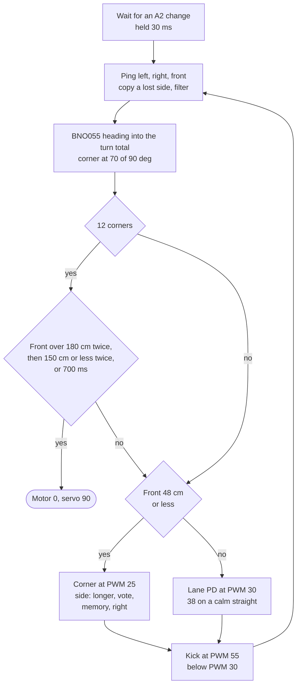
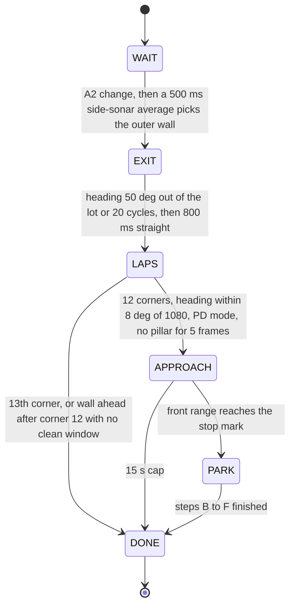
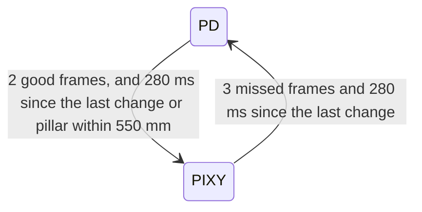
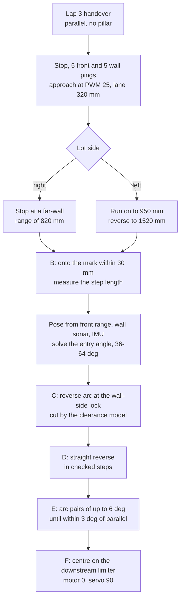

# Software architecture and obstacle strategy

We run one sketch per challenge on the Uno: Open is a lane law plus a corner counter, and Obstacle is a six-state machine that leaves the lot, drives three laps past pillars and parks on IMU-closed arcs.
The Open sketch has 283 lines. The Obstacle build we race is in [`src/`](../src/Obstacle_Challenge/Obstacle_Challenge.ino) (598 lines, fixes 1-12, mat-tested); this page also documents the v20 development build (1,103 lines, lot exit and park), and its line links point to the tag `v2.0-asia-final`.

[Back to the README](../README.md) · Criterion 3 of 5 · Previous: [Power and sensors](02-power-and-sensors.md) · Next: [Engineering decisions](04-engineering-decisions.md)

## Evidence

| Claim | Where to check |
|---|---|
| Each function is tied to the parts it reads or drives | [Module maps](#module-maps); sketches in [`src/`](../src/README.md) |
| Obstacle is a six-state machine | `enum` at [Obstacle_Challenge.ino line 165](https://github.com/BllueWave/WRO-Future-Engineers-2026/blob/v2.0-asia-final/src/Obstacle_Challenge/Obstacle_Challenge.ino#L165), `loop()` at [lines 1079-1103](https://github.com/BllueWave/WRO-Future-Engineers-2026/blob/v2.0-asia-final/src/Obstacle_Challenge/Obstacle_Challenge.ino#L1079-L1103) |
| Six-step pillar ladder with a 0.35 commit floor | [lines 93-94](https://github.com/BllueWave/WRO-Future-Engineers-2026/blob/v2.0-asia-final/src/Obstacle_Challenge/Obstacle_Challenge.ino#L93-L94), [lines 525-538](https://github.com/BllueWave/WRO-Future-Engineers-2026/blob/v2.0-asia-final/src/Obstacle_Challenge/Obstacle_Challenge.ino#L525-L538) |
| Park stop mark from the front-wall range | `markMm()` at [line 714](https://github.com/BllueWave/WRO-Future-Engineers-2026/blob/v2.0-asia-final/src/Obstacle_Challenge/Obstacle_Challenge.ino#L714), `parkRun()` at [line 962](https://github.com/BllueWave/WRO-Future-Engineers-2026/blob/v2.0-asia-final/src/Obstacle_Challenge/Obstacle_Challenge.ino#L962) |
| The car waits for the A2 start input (rule 9.11) | `#define PRACTICE 0` at [Open line 36](../src/Open_Challenge/Open_Challenge.ino#L36) and [Obstacle line 62](https://github.com/BllueWave/WRO-Future-Engineers-2026/blob/v2.0-asia-final/src/Obstacle_Challenge/Obstacle_Challenge.ino#L62) |
| The corner vote took Open from 21/40 to 37/40 (simulation) | [Simulation results](05-build-test-reproduce.md#simulation-results) |

## Structure

Both sketches are single `.ino` files with no local libraries, because we upload from the Arduino IDE ([build and upload](05-build-test-reproduce.md#build-and-upload)). Each is one `loop()` that runs top to bottom:

1. ping the left, right and front HC-SR04, one after another, with a 3 ms pause before each;
2. read the BNO055 heading over I2C and update the corner count;
3. poll the Pixy2 over SPI;
4. choose a servo angle and a motor PWM;
5. print one debug line at 115200 baud.

The Open sketch calls `pixy.ccc.getBlocks()` every loop and ignores the result ([line 212](../src/Open_Challenge/Open_Challenge.ino#L212)). `open_kuwait` makes the same call and steers on the largest block. v20 drops that steering but keeps the call, so each loop takes as long as it did in the `open_kuwait` runs on the mat.

## Module maps

### Open_Challenge.ino

| Module | Code | Parts | Job |
|---|---|---|---|
| Setup | [`setup()`](../src/Open_Challenge/Open_Challenge.ino#L117), [`signalServo()`](../src/Open_Challenge/Open_Challenge.ino#L109) | BNO055, Pixy2, servo, MD13S | Motor off, servo 90, I2C timeout, IMU start with 3 retries, servo wiggle codes |
| Start | [`waitStart()`](../src/Open_Challenge/Open_Challenge.ino#L140) | Start switch on A2 | Starts on any level change held 30 ms |
| Sensing | [`getStableDistance()`](../src/Open_Challenge/Open_Challenge.ino#L91), [lines 161-173](../src/Open_Challenge/Open_Challenge.ino#L161-L173) | 3 × HC-SR04 | Pings, lost-echo copy, 0.9 filter |
| Heading and corners | [lines 175-184](../src/Open_Challenge/Open_Challenge.ino#L175-L184), [`wrap180()`](../src/Open_Challenge/Open_Challenge.ino#L103) | BNO055 | Never-reset turn total, corner at 70 of 90 degrees, zero-read guard |
| Finish | [lines 191-202](../src/Open_Challenge/Open_Challenge.ino#L191-L202) | Front HC-SR04, MD13S, servo | Stop after 12 corners on the front-range rule or the 700 ms backstop |
| Corner avoid | [lines 218-238](../src/Open_Challenge/Open_Challenge.ino#L218-L238) | Front and side HC-SR04, servo | Urgency law, direction order, U-turn guard |
| Lane law and map | [lines 239-258](../src/Open_Challenge/Open_Challenge.ino#L239-L258) | Side HC-SR04, servo, MD13S | PD on left minus right, lap-1 calm record, PWM 38 in laps 2-3 |
| Motor output | [`runMotor()`](../src/Open_Challenge/Open_Challenge.ino#L98), [lines 264-274](../src/Open_Challenge/Open_Challenge.ino#L264-L274) | MD13S | Direction, PWM, stiction kick |
| Debug | [lines 277-282](../src/Open_Challenge/Open_Challenge.ino#L277-L282) | Serial | `L R F servo yaw corners PID/AVOID/FAST` every loop |

### Obstacle_Challenge.ino

| Module | Code | Parts | Job |
|---|---|---|---|
| State machine | [`loop()`](https://github.com/BllueWave/WRO-Future-Engineers-2026/blob/v2.0-asia-final/src/Obstacle_Challenge/Obstacle_Challenge.ino#L1079) | - | WAIT, EXIT, LAPS, APPROACH, PARK, DONE |
| Start and side pick | [`waitStart()`](https://github.com/BllueWave/WRO-Future-Engineers-2026/blob/v2.0-asia-final/src/Obstacle_Challenge/Obstacle_Challenge.ino#L316), [`parkPickSide()`](https://github.com/BllueWave/WRO-Future-Engineers-2026/blob/v2.0-asia-final/src/Obstacle_Challenge/Obstacle_Challenge.ino#L340) | A2, side HC-SR04 | Start input, 500 ms outer-wall average, direction seed |
| Lot exit | [`startTick()`](https://github.com/BllueWave/WRO-Future-Engineers-2026/blob/v2.0-asia-final/src/Obstacle_Challenge/Obstacle_Challenge.ino#L366) | Servo, MD13S, BNO055 | Ratchet out to 50 degrees, IMU sign check, turn-total seed |
| Heading and corners | [`readYaw()`](https://github.com/BllueWave/WRO-Future-Engineers-2026/blob/v2.0-asia-final/src/Obstacle_Challenge/Obstacle_Challenge.ino#L241), [`lapsCount()`](https://github.com/BllueWave/WRO-Future-Engineers-2026/blob/v2.0-asia-final/src/Obstacle_Challenge/Obstacle_Challenge.ino#L418) | BNO055 | Zero-read guard, never-reset total, corner count |
| Lap law | [`lapStep()`](https://github.com/BllueWave/WRO-Future-Engineers-2026/blob/v2.0-asia-final/src/Obstacle_Challenge/Obstacle_Challenge.ino#L430) | All sensors, servo, MD13S | Sensing, lap-1 map, pillar filter and ladder, mode manager, park handover, avoid, PD, scan weave, fast straights, kick, stuck recovery |
| Pillar geometry | [`signDistance()`](https://github.com/BllueWave/WRO-Future-Engineers-2026/blob/v2.0-asia-final/src/Obstacle_Challenge/Obstacle_Challenge.ino#L268), [`looksLikeBarrier()`](https://github.com/BllueWave/WRO-Future-Engineers-2026/blob/v2.0-asia-final/src/Obstacle_Challenge/Obstacle_Challenge.ino#L276) | Pixy2 | Range from blob size, limiter rejection |
| Approach | [`approachStep()`](https://github.com/BllueWave/WRO-Future-Engineers-2026/blob/v2.0-asia-final/src/Obstacle_Challenge/Obstacle_Challenge.ino#L726), [`laneHeading()`](https://github.com/BllueWave/WRO-Future-Engineers-2026/blob/v2.0-asia-final/src/Obstacle_Challenge/Obstacle_Challenge.ino#L717), [`lotMm()`, `markMm()`](https://github.com/BllueWave/WRO-Future-Engineers-2026/blob/v2.0-asia-final/src/Obstacle_Challenge/Obstacle_Challenge.ino#L712) | Front and wall-side HC-SR04, BNO055, servo, MD13S | Held-heading lane, far-wall tracker, stop mark |
| Park geometry | [`arcUpdate()`](https://github.com/BllueWave/WRO-Future-Engineers-2026/blob/v2.0-asia-final/src/Obstacle_Challenge/Obstacle_Challenge.ino#L860), [`bayClear()`](https://github.com/BllueWave/WRO-Future-Engineers-2026/blob/v2.0-asia-final/src/Obstacle_Challenge/Obstacle_Challenge.ino#L874), [`maxLeg()`](https://github.com/BllueWave/WRO-Future-Engineers-2026/blob/v2.0-asia-final/src/Obstacle_Challenge/Obstacle_Challenge.ino#L900), [`lotFar()`](https://github.com/BllueWave/WRO-Future-Engineers-2026/blob/v2.0-asia-final/src/Obstacle_Challenge/Obstacle_Challenge.ino#L858) | - | Car outline against both limiters and the wall; largest safe arc |
| Park motion | [`parkRun()`](https://github.com/BllueWave/WRO-Future-Engineers-2026/blob/v2.0-asia-final/src/Obstacle_Challenge/Obstacle_Challenge.ino#L962), [`parkArcTo()`](https://github.com/BllueWave/WRO-Future-Engineers-2026/blob/v2.0-asia-final/src/Obstacle_Challenge/Obstacle_Challenge.ino#L916), [`parkStep()`](https://github.com/BllueWave/WRO-Future-Engineers-2026/blob/v2.0-asia-final/src/Obstacle_Challenge/Obstacle_Challenge.ino#L951), [`frontMeanMm()`, `wallMeanMm()`, `sideToWallMm()`](https://github.com/BllueWave/WRO-Future-Engineers-2026/blob/v2.0-asia-final/src/Obstacle_Challenge/Obstacle_Challenge.ino#L829) | Front and wall-side HC-SR04, BNO055, servo, MD13S | Park steps B to F |

## Open Challenge

**Lane keeping.** The error is e = left - right in centimetres, after the filter. The servo command is 90 + 0.6·e + 0.05·Δe ([lines 240-246](../src/Open_Challenge/Open_Challenge.ino#L240-L246)), limited to 30-160 ([line 261](../src/Open_Challenge/Open_Challenge.ino#L261)). The integral gain is 0, so the 80-unit integral clamp has no effect. Why this law works with our 40-degree side units is in [placement](02-power-and-sensors.md#placement-and-the-40-degree-side-sonars).

**Corners.** When the front reads 48 cm or less the car slows to PWM 25 and turns. The turn grows with urgency = (48 - front) / (48 - 18), clamped between 0.25 and 1, so the car reaches full servo travel at 18 cm. At the 48 cm trigger both side units see the same front wall, so the direction is decided in this order ([lines 228-232](../src/Open_Challenge/Open_Challenge.ino#L228-L232)):

1. if left and right differ by more than 3 cm, the longer side;
2. otherwise the majority of the corners already counted this round;
3. before the first corner, the sign of a slow left-minus-right average from the loops before the trigger, if it is at least 4 cm;
4. otherwise right.

The vote never locks after the first avoid. A wall avoided in the start zone would otherwise become a wrong lock for the whole round. A U-turn guard holds the servo straight once the car has turned 100 degrees inside one avoid. In simulation the vote took Open from 21 to 37 successful rounds out of 40, against `open_kuwait` on the same seeds.

**Laps and the finish.** Each loop the heading change, wrapped to ±180 degrees, is added to a total that is never reset. Corner n+1 counts when the total reaches 90·n + 70 degrees.

After corner 12 the car keeps driving on the same law. Once the front has read more than 180 cm twice (it is looking down the start straight), it stops at the first two readings of 150 cm or less, which puts the nose in the start straight. A 700 ms backstop after corner 12 stops the car anyway. `open_kuwait` closed a lap at every 360 degrees instead, and in simulation it sometimes closed lap 3 only at corner 13.

**Faster straights.** In lap 1 the car records, for each straight, the largest error seen mid-straight: more than 700 ms after the corner, with the front over 150 cm. In laps 2 and 3, a straight whose lap-1 maximum stayed under 25 cm runs at PWM 38 while the error is under 18 cm and the front reads over 150 cm ([lines 248-258](../src/Open_Challenge/Open_Challenge.ino#L248-L258)). The fast speed is not timed: the car drops to PWM 30 when the front reads 150 cm or less, so every corner starts at PWM 30.

## Obstacle Challenge

### State machine

| State | Why it exists |
|---|---|
| WAIT | Rules 9.10 and 9.11: power on, then wait for the start input. Prints `WAIT L .. R .. F .. yaw ..` every 400 ms for the pre-run checks |
| EXIT | We start inside the lot for 7 points (item 1.8.1, p.21), so the car first has to leave a 300 mm lot |
| LAPS | The lane, pillar and corner law from our best mat build, plus the lap-1 pillar map |
| APPROACH | Hands over only when the car is parallel and clear of pillars, so the park starts from a known pose |
| PARK | The parallel park: 15 points for a full park, 7 for a partial one (items 1.8.2 and 1.8.3, p.21) |
| DONE | Motor 0, servo 90. If the park window is missed the car stops in the start section and never starts a fourth lap |

### Start and outer-wall pick

Standing still for 500 ms, the car averages both side sonars ([`parkPickSide()`](https://github.com/BllueWave/WRO-Future-Engineers-2026/blob/v2.0-asia-final/src/Obstacle_Challenge/Obstacle_Challenge.ino#L340)). The shorter side is the outer wall. That also seeds the corner vote with a weight of 2: outer wall on the left means the round is clockwise and the corners turn right. We place the car about 40 mm from the outer wall every time; in simulation the pick was right in 30 of 30 starts at that gap.

### Lot exit

One ratchet cycle is: pause 220 ms with the wheels at full lock toward the wall, reverse 200 ms at PWM 18, pause 220 ms at the opposite lock, forward 200 ms at PWM 18 ([`startTick()`](https://github.com/BllueWave/WRO-Future-Engineers-2026/blob/v2.0-asia-final/src/Obstacle_Challenge/Obstacle_Challenge.ino#L366)). Cycles repeat until the heading is 50 degrees out or 20 cycles have run, then the car drives straight for 800 ms at PWM 18. These are the values of the 6 September build whose exit worked on the mat.

The exit's rotation is carried into the turn total ([line 409](https://github.com/BllueWave/WRO-Future-Engineers-2026/blob/v2.0-asia-final/src/Obstacle_Challenge/Obstacle_Challenge.ino#L409)). On 6 September the old build zeroed its lap counter at this handover with the car still about 50 degrees rotated. The straightening then counted as -50 degrees, lap 3 never closed, and the park never armed. That was fix 26.

### Pillars

Each loop reads up to 8 Pixy2 blocks. A block counts as a pillar only if its signature is 1 (red) or 2 (green), it is not shaped like a magenta limiter, its area is at least 200 px, and its x position is between 20 and 300 ([lines 489-498](https://github.com/BllueWave/WRO-Future-Engineers-2026/blob/v2.0-asia-final/src/Obstacle_Challenge/Obstacle_Challenge.ino#L489-L498)). Its range comes from its size ([Pixy2](02-power-and-sensors.md#pixy2)). Only pillars within 900 mm steer the car. The nearest pillar wins, and the colour lock switches only if the other colour is at least 250 mm nearer.

Red means keep to the right of the lane and green to the left (p.6). So the car passes a red pillar on the pillar's right and a green pillar on its left.

| Pillar | Position in the 316 px frame | Servo target |
|---|---|---|
| Green | x < 120 | 140 (hard left) |
| Green | 120 ≤ x < 170 | 120 |
| Green | x ≥ 170 | 102 (soft left) |
| Red | x > 200 | 40 (hard right) |
| Red | 150 < x ≤ 200 | 60 |
| Red | x ≤ 150 | 78 (soft right) |

A green pillar on the left of the frame needs the hardest left turn, because the car has to reach its left side. A green pillar already right of centre needs only a soft left to keep it there.

Beyond 550 mm the target is pulled toward 90 by k = (900 - range) / 350, never below 0.35 ([lines 534-538](https://github.com/BllueWave/WRO-Future-Engineers-2026/blob/v2.0-asia-final/src/Obstacle_Challenge/Obstacle_Challenge.ino#L534-L538)). We removed that floor once, in fix 25, and the car stopped avoiding pillars: a pillar clipped by the frame edge reads far away, and without a floor the turn scaled to nothing.

In pillar mode ([lines 594-615](https://github.com/BllueWave/WRO-Future-Engineers-2026/blob/v2.0-asia-final/src/Obstacle_Challenge/Obstacle_Challenge.ino#L594-L615)):

- the servo slews at most 6 degrees per loop toward the target;
- a front reading of 25 cm or less snaps it to full travel on the target side;
- if the side sonar toward the turn reads under 25 cm, the command is capped at 90 + (target - 90) × (side - 16) / 9, so the car cannot steer hard into a wall it is already close to;
- a front reading of 48 cm or less slows the car to PWM 25.

### Lap-1 map

In lap 1 the car stores the colours of the first two pillars that put it into pillar mode on each straight ([lines 550-554](https://github.com/BllueWave/WRO-Future-Engineers-2026/blob/v2.0-asia-final/src/Obstacle_Challenge/Obstacle_Challenge.ino#L550-L554)). In laps 2 and 3, for up to 1.6 s after a corner and once the heading is within 12 degrees of the new straight, it moves the lane set-point from L - R = 0 to 20 cm toward the side the first mapped pillar needs. The camera then takes over.

A straight that showed no pillar in lap 1 runs at PWM 36 while the front reads over 130 cm and |L - R| is under 20 cm. With the lot on the right, the start straight is never mapped, because its pillars are behind the camera when the car leaves the lot.

### Corners, scan weave and stuck recovery

- Corners use the Open urgency law. A side difference over 3 cm picks the side, otherwise the vote decides. The vote counts each corner by the sign of its measured rotation, so corners driven in pillar mode count too. After a 100-degree turn inside one avoid, the car drives straight for 400 ms and starts a new avoid reference.
- Scan weave. With no pillar in view and |L - R| under 6 cm, a ±5 degree sine with a 1.3 s period sweeps the camera view across the frame edges.
- Stuck recovery. If the last front reading is 15 cm or less and the heading has not moved 3 degrees in 0.7 s, the car sets opposite lock and reverses: PWM 55 for 70 ms, then PWM 30 for 450 ms, then stops for 120 ms ([lines 682-697](https://github.com/BllueWave/WRO-Future-Engineers-2026/blob/v2.0-asia-final/src/Obstacle_Challenge/Obstacle_Challenge.ino#L682-L697)). The 6 September build never reversed, so a nose-on contact at a corner ended its round.

### Control priority inside `lapStep()`

1. Park handover, or a stop if the park window is missed.
2. Pillar mode, with the 25 cm full lock and the wall cap.
3. Front avoid at 48 cm.
4. Lane PD with the map bias, the scan weave and the fast straights.
5. Stiction kick on the chosen PWM.
6. Stuck recovery, which overrides everything above for 640 ms.

## The front-wall park

After three laps the front HC-SR04 measures the wall at the end of the start straight at near-normal incidence. The car stops at a mark computed from that distance, then reverses into the lot on IMU-closed arcs and measured straight steps.

### Why the front wall

We measured the distance from the far wall to the downstream limiter on a mat: about 1.0 m with the lot on the car's right and about 1.7 m with it on the left. That matches the rulebook, where the right limiter sits next to the dotted line (p.8).

Inside the bay the side units are near their 34 mm minimum range and lose the echo at oblique angles, and the camera faces forward, away from the lot the car reverses into. So while the car manoeuvres, the IMU heading is the only reading we trust. Our earlier parks that ended each leg on a sensor reading (versions 14-16) stalled or drove into the limiter.

### The stop mark

mark = lot distance - car length - `MARK_MARGIN_MM` = lot distance - 200 - (-40). With `LOT_RIGHT_MM` 980 the mark is 820 mm for a lot on the right. The lot-left distance is 3000 - 340 - 980 = 1680 mm, so that mark is 1520 mm. At the mark the rear bumper is 40 mm short of the downstream limiter's far face, so arc C clears the limiter tip.

### The far-wall tracker

During the approach the front sonar's beam also hears the limiter tips, which read about 900 mm short of the wall. The tracker predicts the next range from the closing speed and accepts only readings within 150 mm + 0.2 mm per ms of that prediction ([lines 762-784](https://github.com/BllueWave/WRO-Future-Engineers-2026/blob/v2.0-asia-final/src/Obstacle_Challenge/Obstacle_Challenge.ino#L762-L784)). Two readings of 250 mm or less force a reverse onto the mark. A wall-side reading that jumps more than 80 mm is ignored unless five in a row agree.

### The manoeuvre

The steps below are in [`parkRun()`](https://github.com/BllueWave/WRO-Future-Engineers-2026/blob/v2.0-asia-final/src/Obstacle_Challenge/Obstacle_Challenge.ino#L962).

- Steps. A step is 25 ms at PWM 55, 25 ms at PWM 22, then 380 ms to settle. The car measures its real step length from four reverse steps (default 45 mm) before it relies on it.
- Arcs. Every arc runs at PWM 18 and is closed on the IMU heading. The motor is cut early by the turn rate × 150 ms, because the car keeps turning while it coasts, and the heading is read again once the car is at rest. Arcs are capped at 2.6 s.
- Clearance model. Before each arc in C and E and each straight step in D, the 200 × 125 mm car outline is checked against both limiters and the wall with a 12 mm margin ([`bayClear()`](https://github.com/BllueWave/WRO-Future-Engineers-2026/blob/v2.0-asia-final/src/Obstacle_Challenge/Obstacle_Challenge.ino#L874)).

### Park results (simulation)

Our park results come from our simulator. From the lap-3 handover pose, 4 of 16 park-only runs ended in a full park. An earlier simulator model found the park succeeds only when its counter-steer leg starts inside a window about 37 mm wide, while open-loop positioning scattered with a standard deviation of about 24 mm. That is why v20 measures its step length and solves the entry angle from the real stop pose. A rear-facing HC-SR04 for the reverse leg is one of the [changes we test next](04-engineering-decisions.md#changes-we-test-next). The mat procedures for `R_PARK_MM`, `CAR_NOSE_MM`, the per-side sonar fits and `LOT_RIGHT_MM` are in [calibration procedures](02-power-and-sensors.md#calibration-procedures).

## Start logic and rule 9.11

Rule 9.10 (p.17) allows one switch to turn the car on. Rule 9.11 says the car must then wait for one start button, and rule 9.14 says pressing it must start the round.

[`waitStart()`](https://github.com/BllueWave/WRO-Future-Engineers-2026/blob/v2.0-asia-final/src/Obstacle_Challenge/Obstacle_Challenge.ino#L316) reads A2 with the internal pull-up. On its first call it stores the pin level. The round starts when the level has differed from that stored level for 30 ms, so a push button and a toggle switch both work.

`#define PRACTICE` sets `AUTO_START_MS`. With `PRACTICE 1` the car also starts 3 s after power-up. We use that on a practice table; in a round it would break rule 9.11. Both sketches in `src/` have `PRACTICE 0` (Open line 36, Obstacle line 62), so they start only on A2.

We changed the start after two failures:

- the June sketch, `open_kuwait` and `obstacle_kuwait` all drove off on power-up;
- a finals build on 14 September waited for a press followed by a release, so a toggle switch never started it.

Before the start, the servo reports the IMU: one wiggle means ready, two wiggles repeating means the BNO055 did not answer and the car will not drive. The 500 ms side-sonar average after the start is a measurement, not data entered by switches or by moving parts (rule 9.9).

## Edge cases the code handles

| Case | What would go wrong | What the code does | Where |
|---|---|---|---|
| Both side sonars read the same front wall at a corner | Turn direction flips between loops | Corner vote, lot-side seed in Obstacle | [Open 228-232](../src/Open_Challenge/Open_Challenge.ino#L228-L232), [Obstacle 629-631](https://github.com/BllueWave/WRO-Future-Engineers-2026/blob/v2.0-asia-final/src/Obstacle_Challenge/Obstacle_Challenge.ino#L629-L631) |
| A wall avoided in the start zone | Direction locked the wrong way for the round | The vote counts only corners that were counted by the IMU; nothing locks | [Open 205-210](../src/Open_Challenge/Open_Challenge.ino#L205-L210) |
| I2C read returns 0.0 | A phantom corner that never counts back | Previous heading kept | [Obstacle 249](https://github.com/BllueWave/WRO-Future-Engineers-2026/blob/v2.0-asia-final/src/Obstacle_Challenge/Obstacle_Challenge.ino#L249) |
| Exit ends about 50 degrees rotated | Lap 3 never closes, park never arms | Exit rotation seeded into the turn total | [Obstacle 409](https://github.com/BllueWave/WRO-Future-Engineers-2026/blob/v2.0-asia-final/src/Obstacle_Challenge/Obstacle_Challenge.ino#L409) |
| Pillar clipped by the frame edge | Reads far, turn scaled to nothing | x band 20-300, 0.35 floor | [Obstacle 498](https://github.com/BllueWave/WRO-Future-Engineers-2026/blob/v2.0-asia-final/src/Obstacle_Challenge/Obstacle_Challenge.ino#L498), [534-538](https://github.com/BllueWave/WRO-Future-Engineers-2026/blob/v2.0-asia-final/src/Obstacle_Challenge/Obstacle_Challenge.ino#L534-L538) |
| Front sonar misses a pillar and hears the wall | Pillar looks far just before the pass | Sonar may only shorten the camera range | [Obstacle 518-524](https://github.com/BllueWave/WRO-Future-Engineers-2026/blob/v2.0-asia-final/src/Obstacle_Challenge/Obstacle_Challenge.ino#L518-L524) |
| Two colours in view | Steering flips between pillars | Lock switches only if the other pillar is 250 mm nearer | [Obstacle 505-512](https://github.com/BllueWave/WRO-Future-Engineers-2026/blob/v2.0-asia-final/src/Obstacle_Challenge/Obstacle_Challenge.ino#L505-L512) |
| Nose against a wall or pillar | Round ends stuck | Stuck recovery | [Obstacle 682-697](https://github.com/BllueWave/WRO-Future-Engineers-2026/blob/v2.0-asia-final/src/Obstacle_Challenge/Obstacle_Challenge.ino#L682-L697) |
| Pillars block the whole start straight in lap 3 | Car starts a fourth lap | Stop at the next corner, still in the start section | [Obstacle 581-587](https://github.com/BllueWave/WRO-Future-Engineers-2026/blob/v2.0-asia-final/src/Obstacle_Challenge/Obstacle_Challenge.ino#L581-L587) |
| Car already level with or past the lot at the handover | Approach drives away from the lot | Measures front and wall first, then decides to reverse | [Obstacle 729-745](https://github.com/BllueWave/WRO-Future-Engineers-2026/blob/v2.0-asia-final/src/Obstacle_Challenge/Obstacle_Challenge.ino#L729-L745) |
| Limiter tip in the front sonar's beam | Approach stops about 900 mm early | Far-wall tracker | [Obstacle 762-784](https://github.com/BllueWave/WRO-Future-Engineers-2026/blob/v2.0-asia-final/src/Obstacle_Challenge/Obstacle_Challenge.ino#L762-L784) |
| BNO055 mounted upside down | Corners and arcs turn the wrong way | Sign detected during the exit | [Obstacle 378](https://github.com/BllueWave/WRO-Future-Engineers-2026/blob/v2.0-asia-final/src/Obstacle_Challenge/Obstacle_Challenge.ino#L378) |

## Tuning constants and where they came from

"Earlier mat build" means the value is unchanged from `obstacle_kuwait`, `open_kuwait` or the 6 September build, which all ran on the mat (the code marks these `[PROVEN]`). "Simulation" means we set it with seeded batches in our simulator. "Mat procedure" links to the [calibration procedures](02-power-and-sensors.md#calibration-procedures) that set the value on a mat.

Open_Challenge.ino constants (17 rows)

| Constant | Value | Line | Origin |
|---|---|---|---|
| `MOTOR_SPEED` | 30 | [40](../src/Open_Challenge/Open_Challenge.ino#L40) | Earlier mat build; the 23 s real run |
| `MOTOR_SPEED_AVOID` | 25 | [41](../src/Open_Challenge/Open_Challenge.ino#L41) | Break-away test on the car (fix 4) |
| `MOTOR_KICK`, `KICK_MS`, `REKICK_MS` | 55, 70 ms, 500 ms | [45-46](../src/Open_Challenge/Open_Challenge.ino#L45-L46) | Fix 4 |
| `FRONT_AVOID_CM`, `AVOID_FULL_CM`, `AVOID_MIN_URGENCY` | 48, 18, 0.25 | [43, 48-49](../src/Open_Challenge/Open_Challenge.ino#L43-L49) | Earlier mat build |
| `KP`, `KD`, `KI`, `I_MAX` | 0.6, 0.05, 0, 80 | [50-51](../src/Open_Challenge/Open_Challenge.ino#L50-L51) | Earlier mat build; KP and KD also match the June sketch |
| `CENTER_ANGLE`, servo limits | 90, 30-160 | [52](../src/Open_Challenge/Open_Challenge.ino#L52) | Checked on the car |
| `ALPHA`, `DEFAULT_SIDE_CM` | 0.9, 60 | [54, 44](../src/Open_Challenge/Open_Challenge.ino#L44) | Earlier mat build |
| `UTURN_LIMIT_DEG` | 100 | [47](../src/Open_Challenge/Open_Challenge.ino#L47) | Earlier mat build |
| `MOTOR_SPEED_FAST` | 38 | [57](../src/Open_Challenge/Open_Challenge.ino#L57) | Simulation; PWM 37 everywhere lost rounds (28/40 against 34/40) |
| `FAST_FRONT_CM`, `CALM_ERR_CM`, `FAST_ERR_CM` | 150, 25, 18 | [58-60](../src/Open_Challenge/Open_Challenge.ino#L58-L60) | Simulation |
| `FINISH_FRONT_CM`, `FINISH_MS` | 150, 700 ms | [61-62](../src/Open_Challenge/Open_Challenge.ino#L61-L62) | Simulation |
| Corner threshold | 90·n + 70 | [184](../src/Open_Challenge/Open_Challenge.ino#L184) | Fix 26 lineage; 20 degrees of drift margin |
| Tie margin, pre-trigger memory | 3 cm, 4 cm | [229, 231](../src/Open_Challenge/Open_Challenge.ino#L229-L231) | 3 cm from `open_kuwait`; 4 cm from simulation |
| `MAX_DISTANCE` | 400 cm | [53](../src/Open_Challenge/Open_Challenge.ino#L53) | NewPing limit |
| Start debounce | 30 ms | [148](../src/Open_Challenge/Open_Challenge.ino#L148) | Start fix after 14 Sep |
| `PRACTICE` | 0 | [36](../src/Open_Challenge/Open_Challenge.ino#L36) | Rule 9.11 |
| `FINISH` far latch | 180 cm | [193](../src/Open_Challenge/Open_Challenge.ino#L193) | Simulation |

Obstacle_Challenge.ino constants (28 rows)

| Constant | Value | Line | Origin |
|---|---|---|---|
| Speeds, kick, corner law, PD gains, filter | same as Open | [66-88, 100](https://github.com/BllueWave/WRO-Future-Engineers-2026/blob/v2.0-asia-final/src/Obstacle_Challenge/Obstacle_Challenge.ino#L66-L88) | Earlier mat build, fix 4 |
| `UTURN_STRAIGHT_MS` | 400 ms | [74](https://github.com/BllueWave/WRO-Future-Engineers-2026/blob/v2.0-asia-final/src/Obstacle_Challenge/Obstacle_Challenge.ino#L74) | Earlier mat build |
| `PIXY_URGENT_CM` | 25 | [75](https://github.com/BllueWave/WRO-Future-Engineers-2026/blob/v2.0-asia-final/src/Obstacle_Challenge/Obstacle_Challenge.ino#L75) | Fix 6 |
| `WALL_VETO_CM`, `WALL_LIMIT_CM` | 16, 25 | [76, 92](https://github.com/BllueWave/WRO-Future-Engineers-2026/blob/v2.0-asia-final/src/Obstacle_Challenge/Obstacle_Challenge.ino#L76) | Fixes 9 and 16 |
| `DIST_K_W`, `DIST_K_H` | 13683, 28574 | [77](https://github.com/BllueWave/WRO-Future-Engineers-2026/blob/v2.0-asia-final/src/Obstacle_Challenge/Obstacle_Challenge.ino#L77) | Pixy2 datasheet field of view and pillar size ([Pixy2](02-power-and-sensors.md#pixy2)) |
| `PIXY_ENGAGE_MM`, `SWITCH_MARGIN_MM`, `PIXY_FAST_ENTRY_MM` | 900, 250, 550 | [78-80](https://github.com/BllueWave/WRO-Future-Engineers-2026/blob/v2.0-asia-final/src/Obstacle_Challenge/Obstacle_Challenge.ino#L78-L80) | Earlier mat build |
| `SCAN_AMPLITUDE_DEG`, `SCAN_PERIOD_MS`, `SCAN_MAX_ERROR_CM` | 5, 1300 ms, 6 | [83-85](https://github.com/BllueWave/WRO-Future-Engineers-2026/blob/v2.0-asia-final/src/Obstacle_Challenge/Obstacle_Challenge.ino#L83-L85) | Earlier mat build |
| `SIG_GREEN`, `SIG_RED`, `SIG_PARK_WALL` | 2, 1, 3 | [90](https://github.com/BllueWave/WRO-Future-Engineers-2026/blob/v2.0-asia-final/src/Obstacle_Challenge/Obstacle_Challenge.ino#L90) | Signature swap after wrong-side passes |
| `PIXY_MIN_COMMIT` | 0.35 | [91](https://github.com/BllueWave/WRO-Future-Engineers-2026/blob/v2.0-asia-final/src/Obstacle_Challenge/Obstacle_Challenge.ino#L91) | Fix 15; removing it (fix 25) failed on the mat |
| Ladder | 140/120/102, 40/60/78 | [93-94](https://github.com/BllueWave/WRO-Future-Engineers-2026/blob/v2.0-asia-final/src/Obstacle_Challenge/Obstacle_Challenge.ino#L93-L94) | Earlier mat build |
| `ENTER_PIXY_FRAMES`, `EXIT_PIXY_MISS_FRAMES`, `MODE_MIN_HOLD_MS` | 2, 3, 280 ms | [95-96](https://github.com/BllueWave/WRO-Future-Engineers-2026/blob/v2.0-asia-final/src/Obstacle_Challenge/Obstacle_Challenge.ino#L95-L96) | Earlier mat build |
| `PIXY_MIN_AREA`, x band | 200 px, 20-300 | [97-98](https://github.com/BllueWave/WRO-Future-Engineers-2026/blob/v2.0-asia-final/src/Obstacle_Challenge/Obstacle_Challenge.ino#L97-L98) | Earlier mat build |
| `SERVO_SLEW_DEG_PER_STEP` | 6 | [99](https://github.com/BllueWave/WRO-Future-Engineers-2026/blob/v2.0-asia-final/src/Obstacle_Challenge/Obstacle_Challenge.ino#L99) | Earlier mat build |
| `WALL_ASPECT`, `WALL_MIN_AREA` | 1.4, 600 px | [101-102](https://github.com/BllueWave/WRO-Future-Engineers-2026/blob/v2.0-asia-final/src/Obstacle_Challenge/Obstacle_Challenge.ino#L101-L102) | Versions 17-18, limiter rejection; not in `obstacle_kuwait` |
| `PARK_SPEED`, `PARK_LOCK_L`, `PARK_LOCK_R` | 18, 170, 10 | [106-107](https://github.com/BllueWave/WRO-Future-Engineers-2026/blob/v2.0-asia-final/src/Obstacle_Challenge/Obstacle_Challenge.ino#L106-L107) | 6 September build; locks checked on the car |
| `EXIT_MAX_CYCLES`, `EXIT_TARGET_DEG`, exit timings | 20, 50, 200/200/220/800 ms | [108-110](https://github.com/BllueWave/WRO-Future-Engineers-2026/blob/v2.0-asia-final/src/Obstacle_Challenge/Obstacle_Challenge.ino#L108-L110) | 6 September build, exit worked on the mat |
| `BIAS_CM`, `BIAS_MS`, `BIAS_ALIGN_DEG` | 20, 1600 ms, 12 | [113-115](https://github.com/BllueWave/WRO-Future-Engineers-2026/blob/v2.0-asia-final/src/Obstacle_Challenge/Obstacle_Challenge.ino#L113-L115) | Simulation |
| `MOTOR_SPEED_FAST`, `FAST_FRONT_CM` | 36, 130 | [116-117](https://github.com/BllueWave/WRO-Future-Engineers-2026/blob/v2.0-asia-final/src/Obstacle_Challenge/Obstacle_Challenge.ino#L116-L117) | Simulation |
| `DIR_TRUST_CM` | 3 | [118](https://github.com/BllueWave/WRO-Future-Engineers-2026/blob/v2.0-asia-final/src/Obstacle_Challenge/Obstacle_Challenge.ino#L118) | Earlier mat build (the same 3 cm margin in `obstacle_kuwait`) |
| `STUCK_FRONT_CM`, `STUCK_MS`, `STUCK_REV_PWM`, `STUCK_REV_MS` | 15, 700 ms, 30, 450 ms | [121-124](https://github.com/BllueWave/WRO-Future-Engineers-2026/blob/v2.0-asia-final/src/Obstacle_Challenge/Obstacle_Challenge.ino#L121-L124) | Simulation |
| `R_PARK_MM` | 170 | [127](https://github.com/BllueWave/WRO-Future-Engineers-2026/blob/v2.0-asia-final/src/Obstacle_Challenge/Obstacle_Challenge.ino#L127) | Park model; mat procedure |
| `CAR_LEN_MM`, `CAR_WID_MM` | 200, 125 | [128](https://github.com/BllueWave/WRO-Future-Engineers-2026/blob/v2.0-asia-final/src/Obstacle_Challenge/Obstacle_Challenge.ino#L128) | Measured, 14 Sep 2026 |
| `CAR_NOSE_MM` | 168 | [129](https://github.com/BllueWave/WRO-Future-Engineers-2026/blob/v2.0-asia-final/src/Obstacle_Challenge/Obstacle_Challenge.ino#L129) | Simulator fit to the real exit; mat procedure |
| `LOT_LEN_MM`, `LOT_DEPTH_MM`, `LIM_T_MM` | 300, 200, 20 | [130](https://github.com/BllueWave/WRO-Future-Engineers-2026/blob/v2.0-asia-final/src/Obstacle_Challenge/Obstacle_Challenge.ino#L130) | Rulebook p.8 |
| `LOT_RIGHT_MM` | 980 | [131](https://github.com/BllueWave/WRO-Future-Engineers-2026/blob/v2.0-asia-final/src/Obstacle_Challenge/Obstacle_Challenge.ino#L131) | Rulebook geometry and our measurement of about 1.0 m; mat procedure |
| `SIDE_A_L`, `SIDE_B_L`, `SIDE_A_R`, `SIDE_B_R` | 5.16, 202.5, 13.02, -50.2 | [135-136](https://github.com/BllueWave/WRO-Future-Engineers-2026/blob/v2.0-asia-final/src/Obstacle_Challenge/Obstacle_Challenge.ino#L135-L136) | Simulator fits; mat procedure |
| `PARK_LANE_MM`, `APPROACH_KH`, `APPROACH_KL`, `MARK_MARGIN_MM` | 320, 2.2, 0.10, -40 | [137-142](https://github.com/BllueWave/WRO-Future-Engineers-2026/blob/v2.0-asia-final/src/Obstacle_Challenge/Obstacle_Challenge.ino#L137-L142) | Simulation |
| Arc and step timings, `PARK_MARGIN_MM`, `PARK_SHUF_DEG`, `PARK_SQUARE_DEG` | see lines | [147-153](https://github.com/BllueWave/WRO-Future-Engineers-2026/blob/v2.0-asia-final/src/Obstacle_Challenge/Obstacle_Challenge.ino#L147-L153) | Simulation |

## How we tune

Before we try a change we write down the input, the state, the computed value and the wrong action it fixes. We made this our rule after ten firmware versions (8-17) were worse on the mat and had to be reverted ([version history](04-engineering-decisions.md#version-history)).

KP 0.6 and KD 0.05 are unchanged from the June sketch, and the ladder thresholds (x 120 and 170 for green, 150 and 200 for red) come from fix 8 in `obstacle_kuwait`. We kept them because the builds that carried them drove on the mat.

In our simulator we compare a change against the previous version on the same seeds. The metrics we record per batch:

| Metric | Open | Obstacle |
|---|---|---|
| Rounds with the full score | 3 laps and a stop in the start section (30/30) | Exit, 3 laps, park type |
| Where it failed | Wall crash, wrong direction, first corner, stop outside the section | Wrong-side pass, reversed, limiter, stuck |
| Quality | Lap-3 median time, wall grazes per run | Sections completed, grazes per run |

On the mat we try a new sketch in practice time first; the fallback is in the [risk table](04-engineering-decisions.md#risks-and-mitigations). Results and the fidelity limits of the simulator are in [simulation results](05-build-test-reproduce.md#simulation-results).

[Back to the README](../README.md) · Previous: [Power and sensors](02-power-and-sensors.md) · Next: [Engineering decisions](04-engineering-decisions.md)
