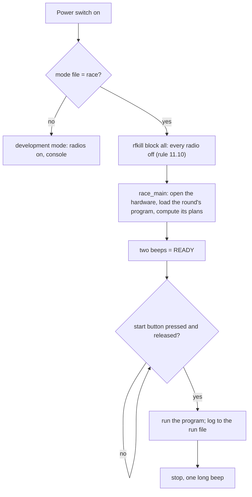
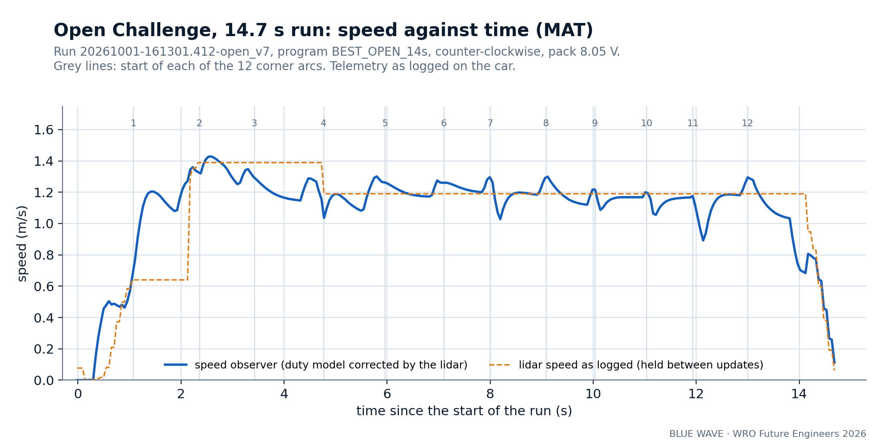
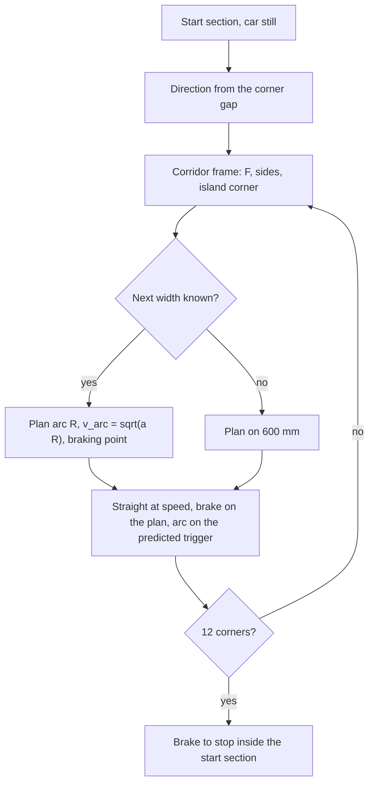
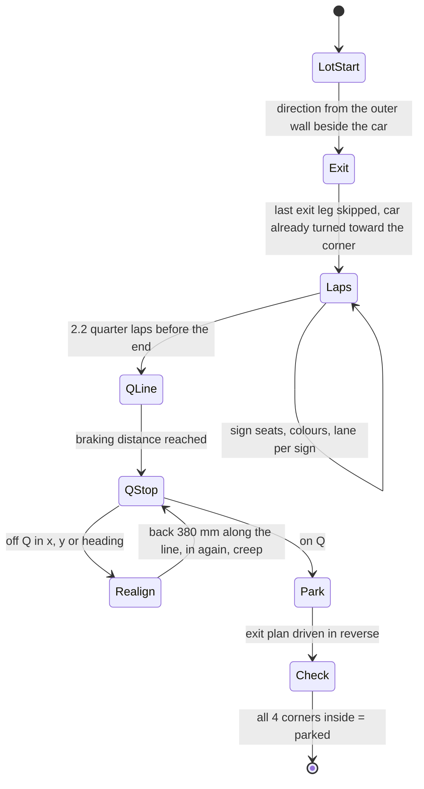

# Software architecture and obstacle strategy

Appendix C criterion 3. How the code is organised, how the two challenge programs drive, and where every constant
comes from.

Tags: **MAT** measured on the car; **FIT** fitted from mat run logs; **SIM** simulator; **CAD** body model.

## Summary

- All code runs on the Raspberry Pi 5 in Python. The RRC Lite keeps its stock firmware and only executes servo, buzzer
  and IMU commands sent over USB serial.
- One `Robot` interface (`bluewave/hw.py`) is the same on the car and in our simulator, so a program runs unchanged in
  both.
- Open Challenge, `programs/BEST_OPEN_14s.py`: lidar in the corridor frame, one constant-radius arc per corner, a
  braking speed plan on a speed observer, lap-1 corridor map replayed in laps 2 and 3. Mat: 14.7 s.
- Obstacle Challenge, `programs/obs_v17.py`: lidar wall fit for the pose, signs on the 24 legal seats with the colour
  from the camera, a lane per sign, the lot exit and the parallel park on the real steering lock of each side. Mat:
  55.8 s with a full park.
- Race mode blocks every radio, waits for the one start button, and runs the program chosen for the round.

## Where the code runs

| Place | What | Files (in `src/`) |
|---|---|---|
| Pi 5, the robot package | hardware drivers, perception, localisation, planning helpers, safety, logging | `bluewave/` (43 Python files) |
| Pi 5, the challenge programs | one file per program, each with `run(robot, params, log, stop)` | `programs/BEST_OPEN_14s.py` (1,998 lines), `programs/obs_v17.py` (1,945 lines) |
| Pi 5, race mode | start-up script and the race entry point | `os/bluewave-mode.sh`, `os/bluewave-race.service`, `race/race_main.py` |
| Pi 5, vendor container | Hiwonder's HP60C driver (ROS 2); our code reads its colour stream locally | vendor software, unchanged |
| RRC Lite (STM32F407) | servo pulses, IMU stream, buzzer, keys | Hiwonder firmware, unchanged |
| Laptop (development only) | deploy, run and pull logs; simulator; plant fit | `tools/` |

### Modules of the robot package

| Module | Role | Hardware |
|---|---|---|
| `hw.py` | the `Robot` object: drive, steer, IMU, lidar, camera, beeps, keys; speed envelope | all |
| `rrc.py` | RRC Lite serial protocol (frame, CRC, servo, IMU, keys, buzzer) | RRC Lite |
| `motor.py` | MD13S PWM and direction, brake, watchdog, stall cut, guardian | MD13S, motor |
| `speed.py` | speed without an encoder: lidar pose and duty model | LD19, motor |
| `lidar.py` | LD19 driver | LD19 |
| `lidar_perc.py` | walls, pillars and parking limitations from one revolution; pillar-to-blob pairing by bearing | LD19, HP60C |
| `camera.py`, `vision.py` | frame grabber; colour masks and blobs | HP60C |
| `field.py` | the field map: walls, island, the 24 sign seats, the lot | |
| `loc.py`, `seats.py` | localisation; sign seats from lidar position and camera colour | LD19, HP60C |
| `park.py` | lot exit and parallel-park legs on the car's true footprint | drive, steering |
| `shield.py` | lidar check of every drive command | LD19 |
| `blackbox.py` | 50 Hz IMU record into the run file | IMU |
| `analyze.py` | after a run: where and why the car touched something | |
| `params.py` | parameters with defaults; the car's calibration file over them | |
| `mock.py` | simulator with the same interfaces | |

### Parameters and logs

A program's settings are layered: the program's defaults, then a named preset, then the car's own values for that
program, then the values given for one run. The car's calibration is `profiles/wltoys_bw2.json`; the fitted motor and
steering model is `profiles/plant_mat1001.json`.

Every run writes one log file named `<date>-<time>-<program>.jsonl`: the parameters it ran with, every program event
(laps, sign reads, corner arcs, Q stops, park legs, the end), telemetry at 20 Hz and the IMU at 50 Hz. The run IDs on
these pages are those file names.

## Race mode

```mermaid
flowchart TD
    P["Power switch on"] --> M{"mode file = race?"}
    M -->|"no"| D["development mode: radios on, console"]
    M -->|"yes"| R["rfkill block all: every radio off (rule 11.10)"]
    R --> L["race_main: open the hardware, load the round's program, compute its plans"]
    L --> B["two beeps = READY"]
    B --> K{"start button pressed and released?"}
    K -->|"no"| K
    K -->|"yes"| X["run the program; log to the run file"]
    X --> E["stop, one long beep"]
```

The program for each challenge and the challenge of the round are set in the car's parameters before the round (`race.programs`, `race.challenge`). Plans that take seconds of
Python on the Pi, such as the lot exit, are computed before READY, so nothing slow sits between the start button and the
first metre. A long press of the board's second key returns the car to development mode.

## Open Challenge: `BEST_OPEN_14s`

  

### Perception in the corridor frame

Each lidar scan is rotated by the gyro heading at the scan's time into the frame of the present corridor. From it the
program reads F (the wall ahead), both side walls, and the island's inner corner. The width of the next corridor is
F minus the corner's distance, measured about 1.3 m before the corner. The direction (clockwise or counter-clockwise)
is chosen at the start from the gap at the first corner and checked again at the island's end.

### One arc per corner

A corner is one constant-radius 90° arc from this corridor's lane to the next corridor's lane. The radius is as large
as fits:

- the island corner stays at least 180 mm from the body along the rear-axle arc, plus the car's measured offset toward
  the island and a term that grows with speed;
- the straight after the arc keeps room for the next arc;
- in corridors of 800 mm or less the lane runs 45 mm toward the outer wall, which allows a larger radius.

The arc starts when its predicted end is right: the steering the car already has and the servo's 85.6 °/s slew are
taken into account. A fixed lead had coupled the old lane's offset into the new one (+149 / −190 mm alternating, SIM).

### Speed plan

| Element | Value in the 14.7 s run | Source |
|---|---|---|
| Straight speed asked | up to 1.8 m/s true speed | preset `l2` |
| Arc speed | √(2.6 m/s² × R) | preset `l2` |
| Braking to the arc speed | constant 1.8 m/s² plan, 0.10 s lag, motor command 0 (PWM-low brake) until the observer is on the plan | preset `fast7`, inherited |
| Arc speed hold | the command whose duty gives the arc speed on the fitted line | open_v7 change V7-3 |
| Steering in the arc | atan(L(v) / R), L from the measured effective-wheelbase curve | open_v7 change V7-4 |
| Below the asked speed | the drive is asked for more than the target, so the motor's 0.56 s lag closes the gap 2.5 times faster | open_v7 change V7-9 |

The speed in all of these is the observer's true speed, not the drive's command (see
[Power and sensors](02-power-and-sensors.md#speed-without-an-encoder)).

### Lap-1 map and replay

Lap 1 measures the width of every corridor and every next width. Laps 2 and 3 plan every corner from that map before
the corner is in sight (radius, arc speed, braking point) and keep measuring; a measurement seen twice that disagrees
with the map wins. A corner whose next width was not measured in time is planned on 600 mm, the narrower legal width:
the car then turns a little late in a 1000 mm corridor instead of early into a 600 mm one. This replaced a stop to
measure, which cost about 2.5 s.

### Finish

After 12 corners the car brakes to stop inside the start section on the planned distance to the wall ahead. In the
14.7 s run it stopped at F = 1541 mm, inside the start-section window of 1182–1957 mm (MAT).

### Safety

The lidar shield projects every command on the true speed and the steering, and slows, steers or brakes when the
projected footprint would reach a wall. A hold that lasts backs the car off and steers its nose back onto the lane.

```mermaid
flowchart TD
    S["Start section, car still"] --> D["Direction from the corner gap"]
    D --> C["Corridor frame: F, sides, island corner"]
    C --> W{"Next width known?"}
    W -->|"yes"| A["Plan arc R, v_arc = sqrt(a R), braking point"]
    W -->|"no"| U["Plan on 600 mm"]
    A --> G["Straight at speed, brake on the plan, arc on the predicted trigger"]
    U --> G
    G --> N{"12 corners?"}
    N -->|"no"| C
    N -->|"yes"| F["Brake to stop inside the start section"]
```

## Obstacle Challenge: `obs_v17`

  
   From the <a href="arena/README.md">obs_v17 replay</a>. The MAT path is the car's own lidar pose, logged twice a second, not external tracking.

```mermaid
stateDiagram-v2
    [*] --> LotStart
    LotStart --> Exit: direction from the outer wall beside the car
    Exit --> Laps: last exit leg skipped, car already turned toward the corner
    Laps --> Laps: sign seats, colours, lane per sign
    Laps --> QLine: 2.2 quarter laps before the end
    QLine --> QStop: braking distance reached
    QStop --> Realign: off Q in x, y or heading
    Realign --> QStop: back 380 mm along the line, in again, creep
    QStop --> Park: on Q
    Park --> Check: exit plan driven in reverse
    Check --> [*]: all 4 corners inside = parked
```

### Pose

The car's position comes from the lidar. Every scan's wall points (pillars, limitations and clutter removed) are
fitted to the field's walls, the outer square and the island, and to the lot's limitations once the lot is known. The
fit is a damped point-to-line ICP that starts from the gyro heading and the speed observer; a point farther than 70 mm
from any wall is not used. Along a direction no wall constrains, the odometry is kept. In the 55.8 s run: 551 fits,
6 rejected, median error 5.5 mm (MAT).

### Start in the lot

The outer wall about 45 mm beside the body tells the direction: on the car's right means counter-clockwise. The wall
and the island face give the lateral position and the heading. The position along the lot cannot be seen from inside
it (the front limitation hides the wall ahead), so the program starts from the nominal position and, once out, moves
the car and the lot together by a 1-D search on the wall ahead. The limitations seen on the last lap refine the lot.

### Lot exit

The exit plan is a wiggle plus an S-curve to a point Q at least 360 mm off the wall. It is planned and driven on the
real lock of each side: 30° left (radius 237 mm) and 22° right (339 mm), on the slow 137 mm effective wheelbase, with a
28 mm margin to the limitations. Counter-clockwise it has 7 legs, clockwise 9. The last leg of the S is not driven: the
car leaves the lot already turned toward the first corner (about 62°) and the lap path takes over.

Each leg ends on a measured quantity: a turning leg on the gyro's absolute heading, a straight leg on the lidar pose in
the lot's frame. A leg runs fast, stops 22 mm short and creeps the rest; a leg that closes on a limitation nearer than
12 mm ends there. Exit legs run at 0.16 m/s, park legs at 0.11 m/s, creeps at 0.06 m/s. The program does not use short
timed pulses: the motor's 0.56 s lag turns a 30–60 ms kick into about 1 mm.

### Signs

| Step | How |
|---|---|
| Find | lidar pillar clusters, snapped to the 24 seats the rules allow (within 120 mm) |
| Colour | camera blobs paired by bearing (within 4°) at the pose the frame was taken; two votes set the colour |
| Keep | seats and colours persist over the laps |
| Exclude | anything within 270 mm of an outer wall is the lot's limitation, not a sign |
| Rule | red: pass on its right; green: pass on its left |

When a seat has a lidar pillar but no colour, the program reads it on purpose:

- **Glance.** If the sign sits just past the frame's usable edge (27°), the nose turns toward it until it is 6° inside
  the frame, for signs up to 16° past the edge, 600–1750 mm away, at most 1.5 s per sign. No glance is made across a
  sign closer than 900 mm ahead.
- **Map look.** The program projects the sign's 50 mm face into the frame where the map puts it and counts pixels in a
  strip 20–80 mm above the mat, with looser saturation and value limits (70 and 26) than the normal masks. One colour
  must fill 30 % of the window and outnumber the other three times, in two frames.

In the 55.8 s run the camera gave 104 colour votes from 115 frames, the map look 4 more, and all six signs had a colour
by the end of lap 1 (MAT).

### Path and speed

The path planner puts a lane beside each sign on the side the colour demands, at least 85 mm from the sign to the body
and 45 mm from the walls, and moves at most 170 mm between neighbouring signs. Corner radii are chosen from
300–720 mm and checked against the known signs, the island and the lot. Pure pursuit from the rear axle follows it,
with a look-ahead of max(260 mm, 0.45 s × speed) and the effective wheelbase at the present speed. A guard sweeps the
car's footprint along candidate arcs and keeps 30 mm clear.

| Setting | Value |
|---|---|
| Lap 1 speed (signs not yet read) | 0.50 m/s |
| Laps 2 and 3 (map known) | 0.80 m/s |
| Near a sign without a colour | 0.30 m/s |
| Planned lateral acceleration | 1.1 m/s² |
| Lock kept in reserve by the speed profile | 6° |

Two signs 500 mm apart that ask for opposite sides need a lane shift of 330–530 mm. With a 339 mm right-turn radius
the car cannot always make that shift; after two shield holds beside such a pair the planner relaxes it from the next
straight on.

### Parallel park

1. **Q's line.** 2.2 quarter laps before the end, the start straight's lane moves onto the line through Q, the end of
   the exit plan. A sign within 900 mm before Q is passed on that line.
2. **Stop at Q.** The stop fires at the real braking distance, v² / (2 × 2.4 m/s²) + v × 0.08 s, from the lidar speed.
3. **Realign.** If the car is off Q by more than 8 mm along the line, 12 mm across it or 2.5° in heading, it backs
   380 mm along the line and comes in again, then creeps along the line onto Q at 0.06 m/s. At most 3 tries.
4. **Park.** The exit plan is driven in reverse, leg by leg, with the same measured leg ends.
5. **Check.** The final pose is checked against the lot; the run ends "parked" only when all four corners of the car
   are inside.

A three-move park does not fit: our planner's minimum in this lot is 5 legs with 30° on both sides and a 12 mm margin,
7 legs at a 20 mm margin, and 9 with the real 22° right lock. With 30° left and 22° right the counter-clockwise plan
has 7.

### Battery hold

For the whole run the drive's battery scaling is held at its 7.0 V value, so the park legs move the same distance on
any pack. Restored at the end of the run.

### The 55.8 s run, event by event

Run `20261001-222840.106-obs_v17`, counter-clockwise, pack 8.25 V. Times on the program's clock.

| Time (s) | Event |
|---|---|
| 8.1 | lot exit done |
| 20.3 | lap 1 done; seats 1.0 green, 1.2 red, 2.0 green, 2.2 red, 3.0 green, 3.2 green |
| 30.2 | lap 2 done |
| 40.0 | lap 3 done |
| 41.0 | first stop at Q: 59 mm off along the line, 4 mm across, 3.1° |
| 44.1, 44.7 | realigns: 35 mm / 9 mm / 1.6°, then 33 mm / 6 mm / 2.4° |
| 45.2 | park starts |
| 55.8 | parked: all 4 corners inside, final heading −0.7° |

Shield interventions: 16 slow-downs, 5 steering corrections, 1 brake. Highest horizontal acceleration 0.42 g.

## Edge cases the code handles

| Case | Handling |
|---|---|
| Next corridor width not measured in time (Open) | plan on 600 mm |
| Measurement disagrees with the lap-1 map (Open) | a measurement seen twice wins |
| Sign the camera cannot see in time (Obstacle) | glance and map look |
| Two signs that ask opposite sides close together | try; after two holds, relax the pair |
| Limitation read as a red sign | outer-wall band filter |
| Car off Q | realign along the line, then creep |
| Car held by the shield | back off 150 mm, nose onto the lane; at most 6 holds |
| Pose unconstrained along a corridor | keep the odometry along it |
| RRC Lite stream stops / servo stops following | reopen the board (see [failure modes](02-power-and-sensors.md#failure-modes-and-how-the-code-handles-them)) |
| Low or full pack | battery hold at 7.0 V (Obstacle) |

## Constants and where they come from

| Constant | Value | Program | Source |
|---|---|---|---|
| Speed line | 5.276 m/s per duty, intercept 0.1012 | both | FIT, 1599 samples |
| Motor lag | 0.56 s | both | FIT |
| PWM-low brake | 2.08 m/s² (model), 1.8 m/s² (Open plan), 2.4 m/s² (Q stop) | both | FIT; 2.4 fitted on the Q overshoot of run `20261001-203331.245-obs_v13` |
| Steering trim | −4° | both | MAT, 2026-10-01 |
| Lock | 30° left, 22° right | both | MAT |
| Effective wheelbase | 137 mm at 0.2 m/s to 281 mm at 1.7 m/s | both | FIT, 2694 samples |
| Servo slew | 85.6 °/s | both | MAT |
| Island clearance | 180 mm | Open | SIM: planned 130–150 mm became 63–98 mm executed at 1.1–1.52 m/s |
| Planned lateral acceleration | 2.6 m/s² | Open | mat ladder: 2.2 (16.0 s), 2.6 (14.7 s) |
| Unmeasured corridor | 600 mm | Open | the rules' narrow width |
| Lap speeds | 0.50 / 0.80 m/s | Obstacle | mat ladder |
| Lock reserve | 6° | Obstacle | MAT: 1.5° let lap 2 enter corner 2 at 0.69 m/s and pass the next green on the wrong side; 6° gave every sign right in 2 mat runs |
| Exit and park margin | 28 mm | Obstacle | planner; the first full park's nearest lot edge was 12.7 mm |
| Q off the wall | at least 360 mm | Obstacle | at the planner's own minimum, 303 mm, the body passed the limitations 47 mm off and the shield held it |
| Q tolerance | 8 mm along, 12 mm across, 2.5° | Obstacle | park accuracy |
| Battery hold | 7.0 V | Obstacle | MAT and FIT (see [decisions](04-engineering-decisions.md#battery-compensation-that-over-corrected)) |
| Outer-wall band | 270 mm | Obstacle | limitations stand 200 mm out, signs 400 or 600 mm |
| Camera field of view | ±29.3°, usable edge 27° | Obstacle | MAT intrinsics |

## How we tune

- One change per mat run, with the same start pose and a known pack voltage.
- Every program version is a new file with one named change and the mechanism it fixes written in its header; a
  version that is proven on the mat is frozen (its SHA-256 recorded) and never edited again.
- Changes are tried in the calibrated simulator first, then on the mat. A SIM result never decides alone.
- After each run the log is pulled and checked: the observer error, the arc entry speeds, the lane entry offsets, the
  finish position, the Q stops, the park result, and any board or steering fault.

[Back to the README](../README.md)
