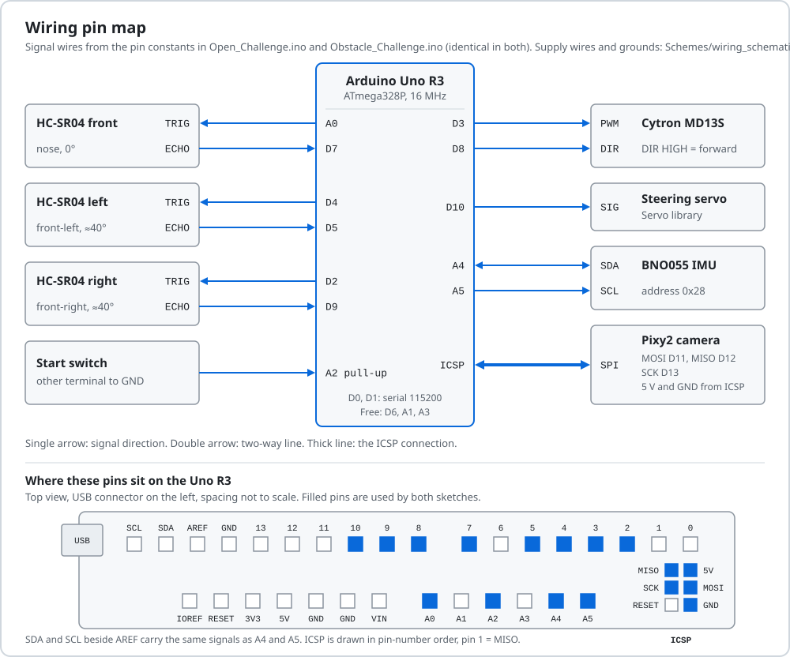

# Build, test and reproduce

Both sketches compile with Arduino IDE 2.3.10 to 15,136 B and 29,604 B of the Uno's 32,256 B flash.
Neither v20 sketch has run on the mat yet, so every v20 result below comes from our simulator.

<sub>[Back to the README](../README.md) · Criterion 5 of 5 · Previous: [Engineering decisions](04-engineering-decisions.md)</sub>

## Evidence

| Claim | Where to check |
|---|---|
| Both sketches compile with the Arduino IDE's compiler: 15,136 B and 29,604 B of 32,256 B | [Expected sizes](#expected-sizes); compiled on 15 Sep 2026 |
| Exact library versions | `arduino-cli lib list` on our development PC, 15 Sep 2026 |
| Every signal pin | [diagrams/wiring_pinmap.svg](diagrams/wiring_pinmap.svg); [Obstacle_Challenge.ino lines 51-56](../src/Obstacle_Challenge/Obstacle_Challenge.ino#L51-L56) |
| The car waits for the start input | `#define PRACTICE 0`, [Open line 36](../src/Open_Challenge/Open_Challenge.ino#L36), [Obstacle line 62](../src/Obstacle_Challenge/Obstacle_Challenge.ino#L62); step 7 of the [bench checklist](#ten-minute-bench-checklist) |
| Simulation results carry their fidelity limits | [Simulation results](#simulation-results) |
| Rulebook field model | [`docs/arena/`](arena/README.md) |

## Bill of materials

| Qty | Part | Job | Connection |
|---|---|---|---|
| 1 | Arduino Uno R3 (ATmega328P, 16 MHz) | Runs one challenge sketch at a time | USB for upload and serial |
| 1 | Cytron MD13S motor driver | Drives the motor from PWM and direction | PWM D3, DIR D8, battery supply |
| 1 | Brushed DC drive motor, part number not recorded | Propulsion through the chassis gearbox | MD13S output |
| 1 | Hobby steering servo, model not recorded | Ackermann steering | Signal D10 |
| 1 | WLtoys 1:28-class RC chassis with wheels, gearbox and steering linkage | Frame and drivetrain | - |
| 3 | HC-SR04 ultrasonic sensor | Front, left and right distance | D6/D7, D4/D5, D2/D9 |
| 1 | Pixy2 camera | Pillar colour, bearing and range | ICSP header (SPI) |
| 1 | BNO055 IMU breakout | Heading | A4 (SDA), A5 (SCL) |
| 1 | 2S LiPo battery, 7.4 V nominal, capacity not recorded | Power | See [power tree](02-power-and-sensors.md#power) |
| 1 | Main power switch | Rule 9.10: one switch turns the car on | Type and position not recorded |
| 1 | Start switch or push button | Rule 9.11: one start button | A2 to GND |
| 1 set | Printed body and sensor brackets | Mounting | [`Models/BlueWave_main_body_v2.3mf`](../Models/BlueWave_main_body_v2.3mf): main body, two ultrasonic brackets, one ultrasonic and Pixy2 bracket, one Pixy2 bracket |

We have not recorded prices or suppliers.

## Wiring

<p align="center">
  
</p>

<details>
<summary>Pin table (identical in both sketches)</summary>

| Function | Uno pin | Mode | Source line |
|---|---|---|---|
| HC-SR04 left TRIG / ECHO | D4 / D5 | NewPing | [51](../src/Obstacle_Challenge/Obstacle_Challenge.ino#L51) |
| HC-SR04 right TRIG / ECHO | D2 / D9 | NewPing | [52](../src/Obstacle_Challenge/Obstacle_Challenge.ino#L52) |
| HC-SR04 front TRIG / ECHO | D6 / D7 | NewPing, 400 cm limit | [53](../src/Obstacle_Challenge/Obstacle_Challenge.ino#L53) |
| Steering servo signal | D10 | Servo library | [54](../src/Obstacle_Challenge/Obstacle_Challenge.ino#L54) |
| MD13S PWM / DIR | D3 / D8, DIR HIGH = forward | `analogWrite` / `digitalWrite` | [55](../src/Obstacle_Challenge/Obstacle_Challenge.ino#L55) |
| Start switch | A2 to GND | `INPUT_PULLUP` | [56](../src/Obstacle_Challenge/Obstacle_Challenge.ino#L56) |
| BNO055 SDA / SCL | A4 / A5 | I2C, 25 ms bus timeout with reset | [299](../src/Obstacle_Challenge/Obstacle_Challenge.ino#L299) |
| Pixy2 | ICSP header: MOSI D11, MISO D12, SCK D13 | SPI | Pixy2 library `Link2SPI` |
| Serial debug | D0 / D1 | 115200 baud | [296](../src/Obstacle_Challenge/Obstacle_Challenge.ino#L296) |
| Free | A0, A1, A3 | - | - |

</details>

The June 2026 Fritzing drawing in [`Schemes/`](../Schemes/) is incomplete for this car; the diagram and table above are the reference. The supply side, including the part of it we still have to confirm, is on the [power tree](02-power-and-sensors.md#power). One rule applies to every wiring job: motor current never returns through the Uno header, and after any wiring fault we measure 5 V to GND with the power off.

## Build and upload

We upload from the Arduino IDE, so the IDE's compiler is our reference. An earlier park build fitted in flash with PlatformIO's flags but not in the IDE ([decision log](04-engineering-decisions.md#decision-log)).

### Software versions

Installed on our development PC on 15 September 2026:

| Item | Version | Used for |
|---|---|---|
| Arduino IDE | 2.3.10 (bundled `arduino-cli` 1.5.1) | Build and upload |
| Arduino AVR Boards core | 1.8.8 | Board `arduino:avr:uno` |
| Servo | 1.3.0 | Steering servo |
| Wire | bundled with the core | I2C to the BNO055 |
| Adafruit BNO055 | 1.6.4 | IMU |
| Adafruit Unified Sensor | 1.1.15 | Required by Adafruit BNO055 |
| Adafruit BusIO | 1.17.4 | Installed with the Adafruit libraries |
| NewPing | 1.9.7 | HC-SR04 timing |
| Pixy2 | no version metadata | Pixy2 Arduino library, installed by hand into the libraries folder |

The upload laptop must have the same versions; checking that is part of the bench checklist.

### Steps

1. **Board core.** In the Boards Manager install *Arduino AVR Boards* 1.8.8. Select *Arduino Uno*.
2. **Libraries.** In the Library Manager install the versions in the table. Copy the Pixy2 Arduino library folder into `Documents/Arduino/libraries/`, then rename `ZumoBuzzer.cpp` and `ZumoMotors.cpp` in that folder to `ZumoBuzzer.cpp.bak` and `ZumoMotors.cpp.bak`.
3. **Open a sketch.** `src/Open_Challenge/Open_Challenge.ino` for the Open Challenge or `src/Obstacle_Challenge/Obstacle_Challenge.ino` for the Obstacle Challenge. The folder name matches the file name, as the IDE requires.
4. **Check the start mode.** Line 36 in Open and line 62 in Obstacle must read `#define PRACTICE 0`. `PRACTICE 1` also starts the car 3 s after power-up, which breaks rule 9.11. We use it only on a practice table.
5. **Verify.** The output must match the sizes below.
6. **Upload.** Connect the Uno over USB, select its port, press *Upload*.
7. **Pixy2 signatures.** In PixyMon, train signature 1 on a red pillar, 2 on a green pillar and 3 on a magenta limiter, under the light where the car will run ([calibration](02-power-and-sensors.md#calibration-procedures)).
8. **Bench checklist** below.

### Expected sizes

Compiled on 15 Sep 2026 with the IDE's own `arduino-cli` 1.5.1 and AVR core 1.8.8, from the files in `src/`, each with a fresh build folder:

| Build | `Open_Challenge.ino` | `Obstacle_Challenge.ino` |
|---|---|---|
| Stock compiler flags, Zumo files renamed (steps 1-5) | 15,136 B (46 %), RAM 721 B | 29,604 B (91 %), RAM 818 B |
| Stock compiler flags, Pixy2 library as downloaded | 16,810 B (52 %), RAM 778 B | 31,278 B (96 %), RAM 875 B |
| Our PC's extra flags, Zumo files renamed | 14,630 B (45 %), RAM 721 B | 28,682 B (88 %), RAM 818 B |

The Pixy2 Arduino library ships two extra source files, `ZumoBuzzer.cpp` and `ZumoMotors.cpp`. Neither sketch calls them, but with the files in place each build is 1,674 B of flash and 57 B of RAM larger. Both sketches still fit either way.

Our development PC also has `platform.local.txt` in `Arduino15/packages/arduino/hardware/avr/1.8.8/`, which adds `-mcall-prologues -mrelax`. Neither sketch needs that file. If a build reports a different size on another PC, check the Zumo files and this file first.

### From a terminal

The same build with the `arduino-cli` bundled in the IDE (Windows path shown):

```sh
CLI="C:/Users/<you>/AppData/Local/Programs/Arduino IDE/resources/app/lib/backend/resources/arduino-cli.exe"
"$CLI" compile --fqbn arduino:avr:uno src/Obstacle_Challenge
"$CLI" upload  --fqbn arduino:avr:uno -p COM5 src/Obstacle_Challenge
```

Replace `COM5` with the Uno's port. To reproduce the stock-flag sizes on a PC that has `platform.local.txt`, add `--build-property "compiler.c.extra_flags=" --build-property "compiler.cpp.extra_flags=" --build-property "compiler.c.elf.extra_flags="` and a fresh `--build-path`.

## Ten-minute bench checklist

Car on a stand with all four wheels off the table, battery charged, serial monitor at 115200 baud.

| # | Time | Check | Pass |
|---|---|---|---|
| 1 | 1 min | Library versions on the upload laptop (Library Manager, or `arduino-cli lib list`) | Versions match the table above |
| 2 | 1 min | Verify the sketch | Sizes match the table above; `#define PRACTICE 0` |
| 3 | 1 min | Upload, then switch on with the main switch | One servo wiggle. Two wiggles repeating: BNO055 not answering, check A4/A5 |
| 4 | 1 min | Obstacle sketch: read the serial monitor | `WAIT L .. R .. F .. yaw ..` every 400 ms |
| 5 | 1 min | Hand 20 cm in front of each sonar in turn; nose square to a wall at a taped 50 cm | `L`, `R` and `F` each change; `F` reads about 51 |
| 6 | 1 min | Turn the car clockwise by hand | `yaw` increases |
| 7 | 1 min | Wait 5 s after power-on | Wheels do not turn |
| 8 | 1 min | Change the A2 switch | Obstacle: `outer wall = LEFT/RIGHT` prints, then the servo alternates full locks. Open: the drive wheels turn |
| 9 | 1 min | PixyMon with a red, a green and a magenta object at 900 mm | Boxes with signatures 1, 2 and 3 |
| 10 | 1 min | Battery voltage with a meter, written on the test sheet | A number, so speed results can be matched to charge |

## How we test

1. Bench checks above, before every session.
2. Seeded batches in our simulator, `real2`, each change compared against the previous version on the same seeds ([how we tune](03-software-and-strategy.md#how-we-tune)).
3. Webots replays of selected simulated runs, to watch a failure in 3D.
4. The mat. New sketches run in practice time first; the fallback rule is in the [risk table](04-engineering-decisions.md#risks-and-mitigations).

Our mat test plan is 20 Obstacle runs from legal random starts. For each we record the exit, laps, pillars touched and park result, and we report the success rate.

## Results on the mat

| Date | Code | What happened |
|---|---|---|
| June 2026 | National-round code | 1st place, Kuwait national round |
| 2 Sep 2026 | `obstacle_kuwait`, as listed in our notes | Three full Obstacle laps with one light touch on one pillar |
| 6 Sep 2026 | 6 September parking build | Lot exit worked (our notes: excellent), no attempt count; best Obstacle driving so far, with light scrapes; did not park (lap counter, fixed as fix 26) |
| By 11 Sep 2026 | `open_kuwait`, PWM 30 | Three Open laps in about 23 s |
| 14 Sep 2026 | Finals build of that day | The car did not move; four causes found and fixed ([version history](04-engineering-decisions.md#version-history)) |
| - | Motor test | PWM 15 does not start the car from rest, 18 creeps, 25 always moves it |
| - | `Open_Challenge.ino`, `Obstacle_Challenge.ino` (v20) | Not yet run on the mat |

None of the calibration measurements in our spec file has a recorded result yet.

## Simulation results

> The simulator fails two of its three fidelity gates (table below). We use its numbers only to compare code versions.

### What the simulator is

`real2` compiles the unchanged `.ino` with a PC compiler and runs it against a model of our car. Only `while(1);` is rewritten, to a halt. The model has:

- the 200 × 125 mm outline, side sonars at 39 and 41 degrees;
- HC-SR04 acoustics, including a 38-60 ms hold when no echo returns;
- a Pixy2 at 60 frames per second, a BNO055 with drift and noise, the time cost of serial printing;
- tyre grip and wall contact.

Each seed randomises the turning radius (±15 %), speed (±12 %), break-away (PWM 16-18), servo speed, start pose and sonar dropout. The wheelbase, turning radius, servo speed and camera pose in the model are guesses, because none is measured. The simulator lives in our development workspace, not in this repository.

### Fidelity gates

The gates test whether the model reproduces what the real car did (calibration F3, 60 seeds from 10,500,000).

| Gate | Real car | Target | Simulator | Verdict |
|---|---|---|---|---|
| `open_kuwait`, 3 laps | Reliable | ≥ 80 % | 33/60 = 55 % (clockwise 77 %, counter-clockwise 24 %) | Fail |
| `obstacle_kuwait`, 3 laps, no pillar moved | Three laps, one light touch, 2 Sep 2026 | ≥ 60 % | 1/60 = 2 % | Fail |
| 6 September build, lot exit | Worked on 6 Sep 2026 | ≥ 80 % | 58/60 = 97 % | Pass, but only with two unmeasured placement values |

Both failed gates score below the real car: 55 % for Open, 2 % for Obstacle.

### The v20 sketches

| Sketch | Test | Result (simulation) |
|---|---|---|
| Open v20 | Paired with `open_kuwait` on the same seeds | 37/40 against 21/40 |
| Open v20 | Final file, 40 fresh seeds from 9,100,000 | 36/40; lap-3 median 25.6 s; 0.1 wall grazes per run |
| Open v20 | All 32 draw cells (16 corridor combinations × 2 directions), 320 runs | 287/320 = 90 % scored 30/30; lap-3 median 26.0 s; 0.14 grazes per run |
| Open v20 | Calibration F3, 60 seeds | 55/60 = 92 % |
| Obstacle v20 | 60 lot starts from 9,200,000 | Exit 60/60; three laps 1/60; endings: wrong-side pass 35, reversed 8, limiter 10 |
| Obstacle v20 | 120 lot starts from 10,500,000, F3 | Exit 119/120; three laps 12/120; of those, 3 partial parks and 0 full |
| Obstacle v20 | Park only, from the lap-3 handover pose, 16 runs | 4 full parks; limiter touched in about half |

The 37/40 comes from the paired comparison during development; the final file on fresh seeds scored 36/40, and that is the number we quote for v20. The gap between 1/60 and 12/120 three-lap Obstacle rounds comes from the seed blocks, not from the calibration.

<details>
<summary>Where Open v20 fails: 33 of 320 runs</summary>

| Failure | Runs |
|---|---|
| Wall crash mid-round | 11 |
| Wrong turn direction | 8 |
| At the first corner (5 stuck, 1 crash) | 6 |
| Three laps but stopped outside the start section (27 points) | 6 |
| Other | 2 |

| Weakest corridor cell | Direction | Success |
|---|---|---|
| 600-1000-1000-600 | Counter-clockwise | 7/11 |
| 600-1000-1000-1000 | Clockwise | 7/10 |
| 600-1000-600-1000 | Counter-clockwise | 8/11 |

</details>

### Webots replays

Webots draws the rulebook field and moves the car along a path logged by `real2`. It is a kinematic replay with no physics, and the verdict on screen is copied from our arena scorer. The seven v20 replays:

1. Open, clockwise (seed 7100007)
2. Open, counter-clockwise (seed 7100003)
3. Obstacle, three laps, no park, counter-clockwise (seed 6200015)
4. Obstacle, three laps, no park, clockwise (seed 6200035)
5. Obstacle, the typical failure: inner-row pillar right after a corner (seed 6100004)
6. Park only, full park, clockwise (seed 8100000)
7. Park only, partial park, counter-clockwise (seed 8100007)

The replay worlds are in our development workspace, not in this repository.

## Arena page

[`docs/arena/`](arena/README.md) holds `index.html`, an interactive three.js model of the 2026 field, and a README. It builds random draws with the rulebook procedures, cites every dimension to its rulebook page, and checks our 200 × 125 mm footprint against the start zone and the 300 mm lot. It draws the field; it does not simulate driving and it is not a test result. Once GitHub Pages is enabled for this repository it opens at https://blluewave.github.io/WRO-Future-Engineers-2026/docs/arena/.

## Versioning and releases

The first 22 commits in this repository are dated 1-4 June 2026. The work from the national round to the v20 sketches of 15 September 2026 happened in our local workspace outside git, and we publish it in September 2026 on the `india-final` branch. We have not changed any commit dates.

Annotated tags record versions without rewriting history:

```sh
git tag -a v1.0-june-2026 87508ae -m "June 2026 repository"
git tag -a v2.0-asia-final <finals commit> -m "v20 sketches, PRACTICE 0"
git push origin v1.0-june-2026 v2.0-asia-final
```

Each tag gets a GitHub Release whose notes list the sketches it holds, their flash sizes, and what was tested on the mat and in simulation.

## How to reproduce every number

| Number | Page | How we got it | How to reproduce it |
|---|---|---|---|
| 200 × 125 mm | [Mobility](01-mobility.md#mass-and-dimensions) | Team measurement, 14 Sep 2026 | Steel rule across the widest points, brackets included |
| Lot 300 mm, 50 mm per end, 75 mm across | [Mobility](01-mobility.md#what-the-size-does-to-the-parking-lot) | Rulebook p.8 with our length | 1.5 × 200; (300 - 200) / 2; 200 - 125 |
| Break-away PWM 15, 18, 25 | [Mobility](01-mobility.md#break-away-and-the-stiction-kick) | Motor test on the car | From rest on the mat, raise PWM from 10 in steps of 1; record the first value that rolls, in both directions |
| Three Open laps in about 23 s | [Mobility](01-mobility.md#speed) | Stopwatch, `open_kuwait` at PWM 30 | Time three laps; write down the corridor draw and the direction |
| 998 mm/s at PWM 30 (867-1176) | [Mobility](01-mobility.md#speed) | Simulator fit to the 23 s run | Not reproducible from this repository. Direct check: time 1 m at PWM 18, 25, 30 and 55, forward and reverse, on a full and a flat battery |
| Turning radius | [Mobility](01-mobility.md#steering-and-ackermann-geometry) | Not measured | Servo at 170, push the car slowly through a full circle, mark the rear-axle centre, halve the diameter; repeat at servo 10. Or R = L / tan δ from the wheelbase and the inner-wheel angle |
| Height, mass, wheelbase, track, wheel diameter, centre of mass | [Mobility](01-mobility.md#mass-and-dimensions) | Not measured | Steel rule; kitchen scale; balance the car on a ruler edge along and across |
| Flash 15,136 B and 29,604 B, RAM 721 B and 818 B | [Expected sizes](#expected-sizes) | IDE `arduino-cli` 1.5.1, AVR core 1.8.8, stock flags, Pixy2 Zumo files renamed, 15 Sep 2026 | [From a terminal](#from-a-terminal) |
| About 235 mA logic and sensors | [Power and sensors](02-power-and-sensors.md#current-budget) | Estimate in our audit notes | Meter in series with the battery: standing, PWM 30, break-away, servo held at lock |
| HC-SR04 34 mm, 2.3 % long, 23 ms timeout | [Power and sensors](02-power-and-sensors.md#hc-sr04) | Datasheet burst and NewPing constants | 343 m/s × 200 µs / 2; 58.3 / 57; 400 × 57 µs |
| Side sonars at about 40 degrees | [Power and sensors](02-power-and-sensors.md#placement-and-the-40-degree-side-sonars) | Team drawing of the nose, 14 Sep 2026 | Protractor from the nose axis to each sensor face normal |
| Pixy2 13683, 28574 and 0.19 degrees per px | [Power and sensors](02-power-and-sensors.md#pixy2) | 60 × 40 degree lens, 316 × 208 px frame, 50 × 100 mm pillar | 158 / tan 30° × 50 and 104 / tan 20° × 100; check with a pillar at 500 mm: about 27 px wide on a 2.0 |
| Side-sonar fits A and B | [Power and sensors](02-power-and-sensors.md#calibration-procedures) | Simulator fits | Rear axle 300 mm and 400 mm from a parallel wall; A = 100 / (cm400 - cm300), B = 300 - A × cm300 |
| Outer-wall pick 30/30 at a 40 mm gap | [Power and sensors](02-power-and-sensors.md#calibration-procedures) | Simulation | 10 starts in the lot at 40 mm, count correct `outer wall` printouts |
| Front wall to limiter 1.0 m and 1.7 m | [Software and strategy](03-software-and-strategy.md#why-the-front-wall) | Team measurement on a mat | Tape from the far wall to the downstream limiter's far face, lot on each side |
| Stop marks 820 mm and 1520 mm | [Software and strategy](03-software-and-strategy.md#the-stop-mark) | `markMm()` | 980 - 200 + 40; (3000 - 340 - 980) - 200 + 40 |
| Every simulation rate: 37/40, 36/40, 287/320, 12/120, 4/16, 28/40, 22 to 5 of 30 | [Software and strategy](03-software-and-strategy.md), [Engineering decisions](04-engineering-decisions.md), [Simulation results](#simulation-results) | `real2`, seed blocks listed above | Not reproducible from this repository, because the simulator is not published here |
| Simulator trust | [Fidelity gates](#fidelity-gates) | Two of three gates fail | Log one real counter-clockwise Open round (left, right, front at every corner); read one side sonar alone against a wall at 150, 300, 450, 600 and 800 mm, 50 pings each, then again with all three firing |

<sub>[Back to the README](../README.md) · Previous: [Engineering decisions](04-engineering-decisions.md)</sub>
