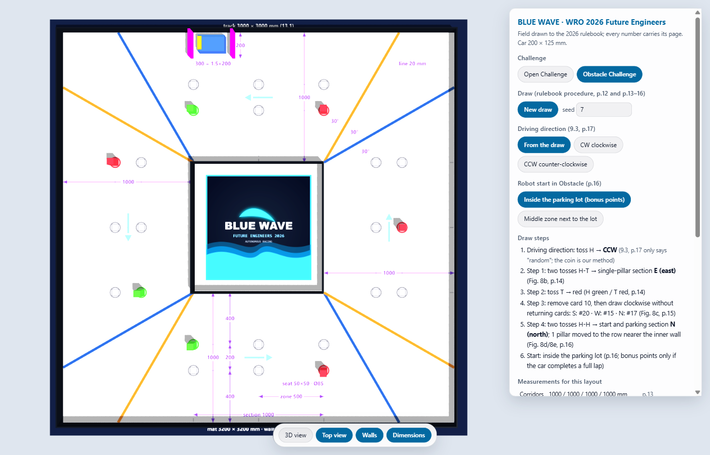
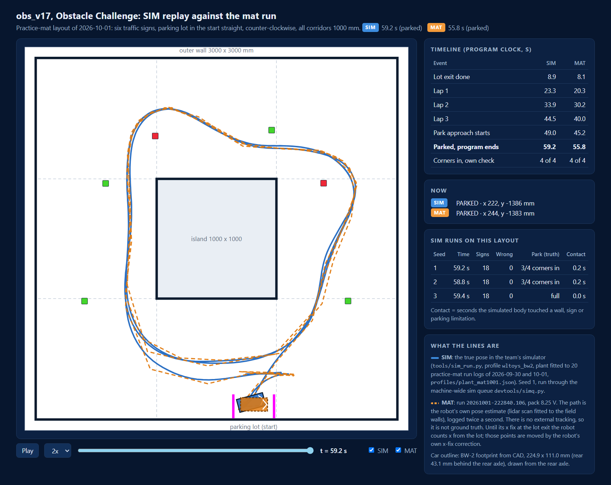

# 3D arena model (WRO 2026 rulebook dimensions)

`index.html` in this folder is an interactive three.js model of the WRO 2026 Future Engineers field. We use it to look at a legal random draw from any angle before we test a strategy on the mat, and to check how our 224.8 × 111.0 mm car (BW-2, from CAD) fits the start zone and its 337.2 mm parking lot. It draws the field. It does not simulate driving and it does not score a run.

*Top view of an Obstacle Challenge draw, seed 7: counter-clockwise, parking lot in the north straight, 4 red and 3 green pillars. To rebuild it, choose Obstacle Challenge, type 7 in the seed box and press Top view.*

## SIM replay of the Obstacle program on our practice-mat layout

`obs_v17_replay.html` replays our Obstacle Challenge program `obs_v17` on the layout of our practice mat of 1 October 2026: six traffic signs, the parking lot in the start straight, counter-clockwise, all corridors 1000 mm. It is a single self-contained file (no internet needed). Press Play, or drag the time slider.

It draws two runs of the same program on the same field:

- **SIM** (blue line): the true pose in our simulator (`tools/sim_run.py` with the car model fitted to 20 practice-mat run logs of 30 September and 1 October), seed 1.
- **MAT** (orange dashed line): run `20261001-222840.106` on the real mat, pack at 8.25 V. This is the robot's own pose estimate (lidar scan fitted to the field walls, logged twice a second). We had no external tracking, so it is not ground truth.

| Event (program clock) | SIM seed 1 | MAT |
|---|---|---|
| Lot exit done | 8.9 s | 8.1 s |
| Lap 1 / 2 / 3 | 23.3 / 33.9 / 44.5 s | 20.3 / 30.2 / 40.0 s |
| Park approach starts | 49.0 s | 45.2 s |
| Parked, program ends | **59.2 s** | **55.8 s** |

Three SIM seeds on this layout: 59.2 s, 58.8 s and 59.4 s, each with all 18 sign passes on the correct side and parked. The simulator's own check of the final position found 3 of 4 corners inside the lot for seeds 1 and 2 (0.2 s of contact with a parking limitation during the park) and the car fully inside for seed 3. On the mat the program's check reported all 4 corners inside. The SIM is about 3.4 s slower than the mat run on this layout; laps 2 and 3 take 10.6 s in the SIM and 9.8 to 9.9 s on the mat. All SIM runs went through our sim queue (at most three at a time, CPU load checked) and were marked TRUSTED. SIM numbers are simulator results; the mat run is the reference.

**Open it online:** https://blluewave.github.io/WRO-Future-Engineers-2026/docs/arena/

GitHub Pages serves it from the `main` branch.

**Open it locally:** open `docs/arena/index.html` in a desktop browser. The page loads three.js r128 from `cdnjs.cloudflare.com` and OrbitControls from `cdn.jsdelivr.net`, so it needs an internet connection. It remembers the last settings in the browser's local storage.

## What the page does

| Control | What it changes | Rule it follows |
|---|---|---|
| Challenge | Open or Obstacle field | Section 8, p.11 and p.13 |
| New draw / seed | A random layout from a seed number, so the same layout can be rebuilt later | Draw procedures on p.12-16 |
| Driving direction | From the draw, or forced clockwise / counter-clockwise | Rule 9.3, p.17 |
| Open corridors | All 1000 mm, all 600 mm, or each straight drawn separately | Section 8, p.11-12 |
| Obstacle start | Inside the parking lot, or in the middle zone next to it | p.16 |
| 3D / Top view, walls, dimensions | Camera and overlays only | - |

For every draw the side panel lists the steps taken (coin tosses, die roll, cards drawn), the corridor widths, the inner block size, the start section, and whether our car footprint fits inside the start zone. A second table lists every field dimension with its rulebook page.

### Open Challenge draw (p.12-13)

1. Two coin tosses pick the starting section (Figure 7a, p.12).
2. Four coin tosses, clockwise from the start section, set each corridor: heads 1000 mm, tails 600 mm (p.12).
3. A die roll picks the start zone; the page rolls again if the zone falls inside a wall (Figure 7c, p.13).

When the four corridors differ, the inner walls form a rectangle that is no longer centred. That matches rule 13.16 (p.27).

### Obstacle Challenge draw (p.13-16)

1. Two coin tosses pick the section with a single traffic sign (Figure 8b, p.14).
2. One coin toss sets its colour: heads green, tails red (p.14).
3. Card 9 or card 10 is removed from the 36 cards, and one card is drawn per remaining straight, clockwise, without returning cards (Figure 8c, p.14-15).
4. Two more coin tosses pick the starting section, which always holds the parking lot. Signs in that section move to the row nearer the inner wall (Figures 8d and 8e, p.16).

## Every dimension and where it comes from

All page numbers refer to *WRO Future Engineers Category - Game Rules 2026* (55 pages).

| Item | Value | Rule | Page |
|---|---|---|---|
| Game mat | 3200 × 3200 mm (±5 mm) | 13.1 | 26 |
| Racetrack inner size | 3000 × 3000 mm (±5 mm) | 13.1 | 26 |
| Track colour | white | 13.2 | 26 |
| Exterior and interior wall height | 100 mm | 13.3, 13.5 | 26 |
| Wall thickness | not defined by the rules; the page draws 10 mm | 13.7 | 26 |
| Corner lines | 20 mm wide, orange CMYK (0, 60, 100, 0), blue CMYK (100, 80, 0, 0) | 13.9 | 26 |
| Corner line angle | 30 degrees | Figure 11 | 27 |
| Start zone dashed lines | 1 mm, CMYK (0, 0, 0, 30) | 13.10 | 26 |
| Start zone | 200 × 500 mm | 13.11 | 26 |
| Traffic sign seat | 50 × 50 mm, 1 mm line | 13.12, 13.13 | 26 |
| Sign evaluation circle | 85 mm diameter, 0.5 mm line, CMYK (20, 0, 100, 0) | 13.14, 13.15 | 26 |
| Seat rows across a 1000 mm corridor | 400 mm / 200 mm / 400 mm from the inner wall | Figure 11 | 27 |
| Seats per straight | 4 T-intersections and 2 X-intersections | Section 5, Figure 3 | 7 |
| Centre artwork square | 800 mm (the page shows the Blue Wave logo there) | Figure 11 | 27 |
| Open corridor width | 1000 mm or 600 mm (±100 mm at the International Final) | Section 8 | 11 |
| Obstacle corridor width | always 1000 mm (±10 mm at the International Final) | Section 8 | 13 |
| Traffic sign (pillar) | 50 × 50 × 100 mm | 13.19 | 28 |
| Pillars per colour | up to 7 | 13.20 | 28 |
| Red / green pillar colour | RGB (238, 39, 55) / RGB (68, 214, 44) | 13.21, 13.22 | 28 |
| Meaning of the colours | red: keep to the right side of the lane; green: keep to the left | Section 5 | 6 |
| Parking lot limiter | 200 × 20 × 100 mm, magenta RGB (255, 0, 255) | 13.25, 13.27 | 28 |
| Parking lot width | 200 mm | Section 5 | 8 |
| Parking lot length | 1.5 × robot length; 337.2 mm for our 224.8 mm car | Section 5 | 8 |
| Parking lot position | in the starting section, right limiter next to the dotted line | Section 5, Figure 4 | 8 |
| Car placement | footprint fully inside the start zone | 9.7 | 17 |
| Car orientation | front axle toward the next corner in the driving direction | 9.8 | 17 |
| Round length | 3 minutes for each challenge | 9.1, 9.2 | 17 |

With our car the lot leaves (337.2 - 224.8) / 2 = 56.2 mm at each end when the car is centred, and 200 - 111.0 = 89.0 mm across the lot. The panel shows both numbers for the current draw.

## What is not taken from the rulebook

- **Wall thickness.** Rule 13.7 leaves it undefined. The page uses 10 mm.
- **How the direction is drawn.** Rule 9.3 only says the direction is random. The page tosses a coin.
- **Die numbering in the other three sections.** Figure 7c (p.13) draws one section. The page rotates that numbering for the others.
- **Seat of the single sign.** The page places it in the middle column, outer row (the positions on cards 9 and 10). The rules text does not state it.
- **Our car.** The 224.8 × 111.0 × 157.2 mm envelope is the BW-2 car's CAD model (WLtoys 1:28 chassis with the printed body). The built car has not been measured yet; the page will take the measured numbers when we have them.

## Related

- [Arena page](../05-build-test-reproduce.md#arena-page) in Build, test and reproduce explains how this page fits with our simulator and the Webots replays.
- The rulebook: https://wro-association.org/wp-content/uploads/WRO-2026-Future-Engineers-Self-Driving-Cars-General-Rules.pdf
