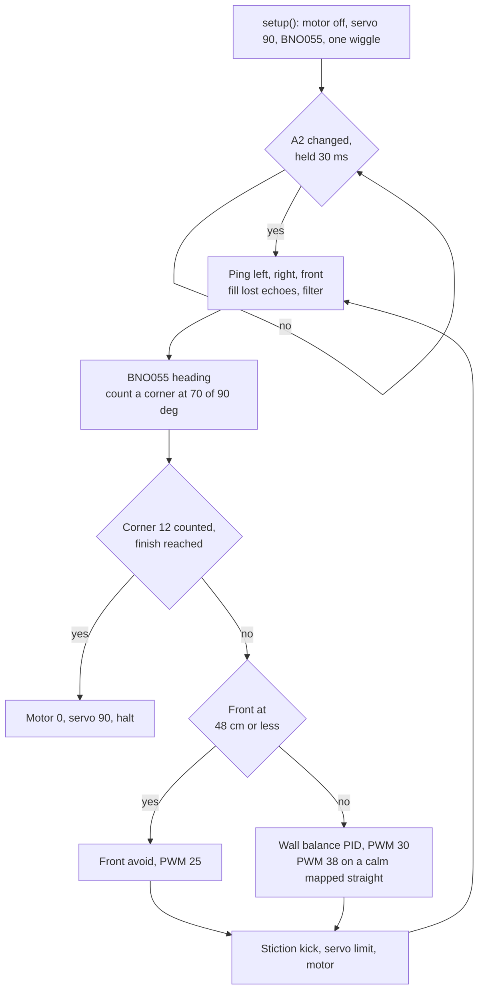
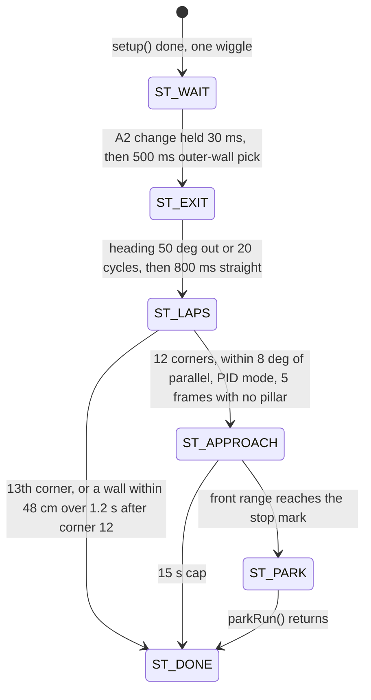

# Source code

`src/` holds the two sketches our car runs on its Arduino Uno, one per challenge. Both use the same pins and the same wall-balance steering law. The reasoning behind the laws is in [docs/03-software-and-strategy.md](../docs/03-software-and-strategy.md); test results and the simulator's limits are in [docs/05-build-test-reproduce.md](../docs/05-build-test-reproduce.md).

- [`Open_Challenge/Open_Challenge.ino`](Open_Challenge/Open_Challenge.ino): 283 lines, working name `open_v20b`, built on `open_kuwait` (named in its header).
- [`Obstacle_Challenge/Obstacle_Challenge.ino`](Obstacle_Challenge/Obstacle_Challenge.ino): 1,103 lines, working name `obstacle_v20b`, built on the 6 September 2026 build, which is `obstacle_kuwait` plus FIX 15, 16 and 17.

`v20b` is v20 with the front sonar trigger on A0. These files differ from our development copies in `#define PRACTICE 0`, in comment wording, and in a compile-time check the development copies add, which refuses any sonar pin on D11-D13 (the Pixy2's SPI lines): `#define PRACTICE 0` ([Open line 36](Open_Challenge/Open_Challenge.ino#L36), [Obstacle line 62](Obstacle_Challenge/Obstacle_Challenge.ino#L62)). With 0 the car waits for the start switch after power-up, as rule 9.11 requires. With 1 it also starts by itself 3 s after power-up, which we use only on the practice mat.

## Build and upload

We compile with Arduino IDE 2.3.10 (its bundled arduino-cli 1.5.1), the Arduino AVR Boards 1.8.8 package and the board Arduino Uno (`arduino:avr:uno`).

| Library | Version we build with | Used for |
|---|---|---|
| Servo | 1.3.0 | Steering servo on D10 |
| Wire (in the AVR core) | 1.0 | BNO055 over I2C |
| Adafruit BNO055 | 1.6.4 | Heading |
| Adafruit Unified Sensor | 1.1.15 | `sensors_event_t`, needed by Adafruit BNO055 |
| Adafruit BusIO | 1.17.4 | Needed by Adafruit BNO055 |
| NewPing | 1.9.7 | The three HC-SR04 sensors |
| Pixy2 | Arduino library ZIP from pixycam.com | Pixy2 camera |
| SPI (in the AVR core) | 1.0 | Pixy2 link |

1. In Boards Manager, install Arduino AVR Boards 1.8.8.
2. In Library Manager, install `Adafruit BNO055` (it offers Unified Sensor and BusIO with it), `NewPing` and `Servo`.
3. Add the Pixy2 Arduino library zip from the Pixy2 downloads on pixycam.com with Sketch > Include Library > Add .ZIP Library. Then rename `ZumoBuzzer.cpp` and `ZumoMotors.cpp` in the library folder to `.cpp.bak`. Neither sketch calls them. With both files left in, each build grows by 1,674 B: Open to 16,810 B, Obstacle to 31,278 B (96 %).
4. Open the sketch folder, choose the board and the port, and upload.
5. Open Serial Monitor at 115200 baud. What each line means is under [Serial output](#serial-output).

The same build from a terminal:

```sh
arduino-cli compile --fqbn arduino:avr:uno src/Open_Challenge
arduino-cli compile --fqbn arduino:avr:uno src/Obstacle_Challenge
```

Measured on 15 September 2026 with the IDE's own arduino-cli. The Uno has 32,256 B of flash and 2,048 B of RAM.

| Sketch | Flash, standard IDE flags, Zumo files renamed | Flash, our PC's extra flags | RAM used by globals |
|---|---|---|---|
| Open_Challenge | 15,136 B (46 %) | 14,630 B (45 %) | 721 B (35 %) |
| Obstacle_Challenge | 29,604 B (91 %) | 28,682 B (88 %) | 818 B (39 %) |

Our development PC has a `platform.local.txt` in the AVR core folder that adds `-mcall-prologues -mrelax`. An earlier park build needed it to fit in flash. Both v20 sketches build without it, so another PC needs no extra file.

Two Uno details matter if a pin is moved. The Servo library takes Timer1, which removes PWM from D9 and D10: the servo is on D10, D9 is only an echo input, and the motor PWM is on D3 (Timer2, about 490 Hz). Pixy2 talks SPI at 2 MHz through the ICSP header, which shares D11, D12 and D13, and the sketches use those pins for nothing else.

## Pin map

The pins are the same in both sketches ([Open lines 30-35](Open_Challenge/Open_Challenge.ino#L30-L35), [Obstacle lines 51-56](Obstacle_Challenge/Obstacle_Challenge.ino#L51-L56)). The drawing is [docs/diagrams/wiring_pinmap.svg](../docs/diagrams/wiring_pinmap.svg).

| Part | Signal | Pin | Code object |
|---|---|---|---|
| HC-SR04, left front corner | TRIG / ECHO | D4 / D5 | `sonarLeft` (NewPing, 400 cm limit) |
| HC-SR04, right front corner | TRIG / ECHO | D2 / D9 | `sonarRight` |
| HC-SR04, nose | TRIG / ECHO | A0 / D7 | `sonarFront` |
| Steering servo | Signal | D10 | `steeringServo` |
| Cytron MD13S motor driver | PWM / DIR | D3 / D8, DIR HIGH = forward | `runMotor()` |
| Start switch, other side to GND | Input with internal pull-up | A2 | `waitStart()` |
| BNO055 IMU | SDA / SCL | A4 / A5 | `bno`, I2C address 0x28 |
| Pixy2 camera | SPI | ICSP header | `pixy` |
| USB serial | RX / TX | D0 / D1 | Debug print |

Every law uses one servo convention: above 90 steers left, below 90 steers right. The lap laws stay within 30 to 160. The Obstacle lot exit and park use full lock at 10 (right) and 170 (left).

## Open_Challenge.ino

There is one `loop()` and no state machine beyond the `started` flag.



### Functions by job

| Job | Function | Parts and pins |
|---|---|---|
| Motor output | [`runMotor()`](Open_Challenge/Open_Challenge.ino#L98-L101) | MD13S: D8 direction, D3 PWM |
| One distance reading | [`getStableDistance()`](Open_Challenge/Open_Challenge.ino#L91-L96): 3 ms pause, one `ping_cm()`; no echo or over 400 cm returns -1 | Any HC-SR04 |
| Angle wrap to ±180° | [`wrap180()`](Open_Challenge/Open_Challenge.ino#L103-L107) | None |
| Ready and fault signal | [`signalServo()`](Open_Challenge/Open_Challenge.ino#L109-L115): n wiggles of ±25°, 180 ms each way | Servo, D10 |
| Start-up | [`setup()`](Open_Challenge/Open_Challenge.ino#L117-L138) | All |
| Start switch | [`waitStart()`](Open_Challenge/Open_Challenge.ino#L140-L152) | A2 |
| Lap law | [`loop()`](Open_Challenge/Open_Challenge.ino#L154-L283) | All |

### Start-up and start

- `setup()` turns the motor off, centres the servo, opens Serial at 115200 and starts I2C with a 25 ms timeout that resets a stuck bus.
- `bno.begin()` gets 3 tries, 300 ms apart. If the BNO055 never answers, the servo wiggles twice, forever. Otherwise: 1 s pause, external crystal on, `pixy.init()` (the library waits up to 5 s for the camera), then one wiggle means ready.
- `waitStart()` reads the A2 level on its first call and starts the round on any change that holds for 30 ms, so a push button and a toggle both work. That first call comes right after the ready wiggle, so the switch must be changed after the wiggle.

### What one pass of `loop()` does

1. Sensing ([lines 161-173](Open_Challenge/Open_Challenge.ino#L161-L173)). Left, right and front are pinged in turn. A silent side copies the other side. If both are silent, the last filtered value stays (60 cm before any reading). The filter is `lpf = 0.9 * new + 0.1 * lpf`, so 90 % of each new reading passes.
2. Heading and corners ([lines 175-184](Open_Challenge/Open_Challenge.ino#L175-L184)). The BNO055 Euler heading is read. A value of exactly 0.0 while the previous heading was more than 20° from 0 is treated as a failed I2C read and replaced. Wrapped heading changes add up in `turnAccum`, which is never reset. Corner `quad` counts when `|turnAccum| >= 90 * quad + 70`, at 70 of its 90°.
3. Finish ([lines 191-202](Open_Challenge/Open_Challenge.ino#L191-L202)). After corner 12 the front must read more than 180 cm twice in a row (looking down the start straight), then 150 cm or less twice in a row. The car stops there, or 700 ms after corner 12 if that comes first: motor 0, servo 90, `3 laps completed`, halt.
4. Corner vote ([lines 204-210](Open_Challenge/Open_Challenge.ino#L204-L210)). When a corner counts, its section timer restarts and it votes +1 if the last front avoid turned left, -1 if right.
5. Camera call ([line 212](Open_Challenge/Open_Challenge.ino#L212)). `pixy.ccc.getBlocks()` waits for the next camera frame. Open ignores the blocks; the call keeps the loop timing of the build it came from.
6. Steering and speed ([lines 214-259](Open_Challenge/Open_Challenge.ino#L214-L259)), below.
7. Output ([lines 261-275](Open_Challenge/Open_Challenge.ino#L261-L275)). The servo command is limited to 30-160. Any motor command from 1 to 29 PWM becomes 55 for its first 70 ms, then for 70 ms of every 500 ms (the stiction kick). Then the motor runs forward.
8. Debug print ([lines 277-282](Open_Challenge/Open_Challenge.ino#L277-L282)).

### Steering law

**Front avoid**, when the front reads 1 to 48 cm ([lines 218-238](Open_Challenge/Open_Challenge.ino#L218-L238)). The motor runs at PWM 25. Urgency `u = (48 - front) / 30`, limited to 0.25-1. The servo goes to `90 + 70u` for a left turn or `90 - 60u` for a right turn. The side is chosen again on every pass:

1. If `|lpfLeft - lpfRight| > 3` cm, turn to the longer side.
2. Otherwise, if the corner vote is not tied, turn the way most corners have turned.
3. Otherwise, if `|sideMem| >= 4` cm, turn to the side `sideMem` favours. `sideMem` is a slow average of L - R (`0.9 * old + 0.1 * new`) kept in wall-balance mode, so before the first corner it holds the loops just before the trigger.
4. Otherwise turn right.

Once the car has turned 100° inside one avoid, the servo returns to 90. The PID memory is cleared.

**Wall balance PID** in all remaining passes ([lines 239-247](Open_Challenge/Open_Challenge.ino#L239-L247)). Error `e = lpfLeft - lpfRight` in cm, servo `= 90 + 0.6 e + 0.05 * (e - last e)`. KI is 0, so `I_MAX` 80 has no effect.

**Straight map** ([lines 248-258](Open_Challenge/Open_Challenge.ino#L248-L258)). "Mid-straight" means more than 700 ms after the corner and the front reading over 150 cm. In lap 1 (corners 0-3) each straight records its largest `|e|` while mid-straight. In laps 2-3 (corners 4-11) the car runs at PWM 38 while mid-straight, if that straight's lap-1 maximum stayed under 25 cm and `|e|` is under 18 cm now. The command drops back to PWM 30 as soon as the front reads 150 cm or less.

## Obstacle_Challenge.ino

`loop()` ([lines 1079-1103](Obstacle_Challenge/Obstacle_Challenge.ino#L1079-L1103)) dispatches on `state` (enum at [line 165](Obstacle_Challenge/Obstacle_Challenge.ino#L165)).



In `ST_DONE` the motor stays at 0 and the servo at 90. The car never starts a fourth lap.

### Functions by job

| Job | Functions | Parts and pins |
|---|---|---|
| Hardware access | [`runMotor`](Obstacle_Challenge/Obstacle_Challenge.ino#L227-L230), [`getStableDistance`](Obstacle_Challenge/Obstacle_Challenge.ino#L232-L237), [`readYaw`](Obstacle_Challenge/Obstacle_Challenge.ino#L241-L253), [`signalServo`](Obstacle_Challenge/Obstacle_Challenge.ino#L280-L286) | MD13S D3/D8, the 3 HC-SR04, BNO055 A4/A5, servo D10 |
| Heading math | [`wrap180`](Obstacle_Challenge/Obstacle_Challenge.ino#L259-L263), [`rightTurnSince`](Obstacle_Challenge/Obstacle_Challenge.ino#L266), [`parkHeading`](Obstacle_Challenge/Obstacle_Challenge.ino#L854) | BNO055 |
| Camera helpers | [`signDistance`](Obstacle_Challenge/Obstacle_Challenge.ino#L268-L274), [`looksLikeBarrier`](Obstacle_Challenge/Obstacle_Challenge.ino#L276-L278) | Pixy2 |
| Start | [`setup`](Obstacle_Challenge/Obstacle_Challenge.ino#L289-L313), [`waitStart`](Obstacle_Challenge/Obstacle_Challenge.ino#L316-L337), [`parkPickSide`](Obstacle_Challenge/Obstacle_Challenge.ino#L340-L362) | A2, left and right HC-SR04 |
| Lot exit | [`startTick`](Obstacle_Challenge/Obstacle_Challenge.ino#L366-L415) | Servo, MD13S, BNO055 |
| Lap count | [`lapsCount`](Obstacle_Challenge/Obstacle_Challenge.ino#L418-L425) | BNO055 |
| Lap law | [`lapStep`](Obstacle_Challenge/Obstacle_Challenge.ino#L430-L707) | All sensors, servo, MD13S |
| Approach to the lot | [`lotMm`](Obstacle_Challenge/Obstacle_Challenge.ino#L712), [`markMm`](Obstacle_Challenge/Obstacle_Challenge.ino#L714), [`laneHeading`](Obstacle_Challenge/Obstacle_Challenge.ino#L717-L724), [`approachStep`](Obstacle_Challenge/Obstacle_Challenge.ino#L726-L823) | Front and wall-side HC-SR04, BNO055, servo, MD13S |
| Averaged ranges for the park | [`frontMeanMm`](Obstacle_Challenge/Obstacle_Challenge.ino#L829-L837), [`wallMeanMm`](Obstacle_Challenge/Obstacle_Challenge.ino#L839-L847), [`sideToWallMm`](Obstacle_Challenge/Obstacle_Challenge.ino#L849-L851) | Front and wall-side HC-SR04 |
| Park geometry, no hardware | [`lotFar`](Obstacle_Challenge/Obstacle_Challenge.ino#L858), [`arcUpdate`](Obstacle_Challenge/Obstacle_Challenge.ino#L860-L865), [`segLimClear`](Obstacle_Challenge/Obstacle_Challenge.ino#L867-L871), [`bayClear`](Obstacle_Challenge/Obstacle_Challenge.ino#L874-L896), [`maxLeg`](Obstacle_Challenge/Obstacle_Challenge.ino#L900-L912) | None |
| Park motion | [`parkArcTo`](Obstacle_Challenge/Obstacle_Challenge.ino#L916-L949), [`parkStep`](Obstacle_Challenge/Obstacle_Challenge.ino#L951-L960), [`parkRun`](Obstacle_Challenge/Obstacle_Challenge.ino#L962-L1076) | Servo at lock, MD13S, BNO055, front and wall-side HC-SR04 |

### Start and outer-wall pick

`setup()` and `waitStart()` work as in Open. While waiting, `waitStart()` also prints the three ranges and the heading every 400 ms. After the start, `parkPickSide()` stops the car for 500 ms and averages both side sensors. The shorter side is the outer wall (`parkWallLeft`). It seeds the turn vote `dirVote` with 2 votes: wall on the left means clockwise, so right turns. It also stores the start heading `startYaw0`, which the approach and the park use as "parallel to the lot".

### Lot exit: `startTick()`

One cycle is 4 steps: 220 ms pause with the wheels at the wall-side lock, 200 ms reverse at PWM 18, 220 ms pause at the other lock, 200 ms forward at PWM 18. Cycles repeat until the heading is 50° from the start or 20 cycles have run. Then the car drives 800 ms straight at PWM 18.

If the exit turned at least 20°, it sets `headingSign`. The nose must have turned away from the wall, so the sign of the measured turn shows whether the heading grows clockwise (+1) or the BNO055 is mounted the other way up (-1). The exit's rotation is copied into `turnAccum`, so the lap counter includes it (FIX 26).

### Lap law: one pass of `lapStep()`

1. Sensing ([lines 431-443](Obstacle_Challenge/Obstacle_Challenge.ino#L431-L443)), the same as Open.
2. Heading and corners ([lines 445-446](Obstacle_Challenge/Obstacle_Challenge.ino#L445-L446)). `readYaw()` has Open's 0.0 guard. `lapsCount()` counts a corner at 70 of its 90° and never resets the total.
3. Which straight ([lines 449-457](Obstacle_Challenge/Obstacle_Challenge.ino#L449-L457)). The straight number is `(|turnAccum| + 45) / 90`, and the car counts as lined up with it within 30°. With the lot on the right, straight 0 is never mapped: its pillars are behind the camera when lap 1 leaves the lot.
4. New corner ([lines 459-478](Obstacle_Challenge/Obstacle_Challenge.ino#L459-L478)). The corner votes by its measured rotation: -1 for right, +1 for left. In laps 2-3, if lap 1 recorded a pillar colour for this straight, the first colour becomes a side bias for up to 1.6 s.
5. Pixy2 pipeline ([lines 480-539](Obstacle_Challenge/Obstacle_Challenge.ino#L480-L539)), below.
6. Mode manager ([lines 541-564](Obstacle_Challenge/Obstacle_Challenge.ino#L541-L564)). PID mode switches to PIXY mode after 2 frames in a row with a pillar, if 280 ms have passed since the last switch or the pillar is 550 mm or nearer. PIXY mode returns to PID after 3 frames without one and 280 ms. At the switch into PIXY mode in lap 1, the colour is stored for the current straight (up to 2 colours).
7. End of the laps ([lines 566-587](Obstacle_Challenge/Obstacle_Challenge.ino#L566-L587)): the two exits of `ST_LAPS` in the diagram.
8. Control output ([lines 589-665](Obstacle_Challenge/Obstacle_Challenge.ino#L589-L665)). The first matching branch runs.
   - PIXY mode with a pillar this frame:
     - the servo moves toward the ladder target by at most 6° per pass;
     - a front reading of 25 cm or less snaps it to full lock on the target side (FIX 6);
     - if the side sensor on the turn side reads under 25 cm, the command may go no further than `90 + (target - 90) * room`, with `room = (side - 16) / 9` limited to 0-1 (FIX 9 and FIX 16);
     - PWM 25 when the front reads 48 cm or less, else PWM 30.
   - Front avoid, front 1 to 48 cm:
     - the same urgency law as Open;
     - `|L - R| > 3` cm picks the longer side, otherwise the sign of `dirVote`;
     - after 100° of turn inside one avoid, the servo holds 90 for 400 ms, then the avoid counts again from the new heading.
   - Wall balance PID:
     - the same gains as Open;
     - the mapped bias holds `L - R = +20` cm for red (right of the lane centre) and `-20` cm for green, while the heading is within 12° of the straight and until the camera takes a pillar;
     - with no pillar in view and `|e|` under 6 cm, a ±5° sine weave with a 1.3 s period sweeps the camera;
     - in laps 2-3, a straight where lap 1 saw no pillar runs at PWM 36 while the front reads over 130 cm, `|e|` is under 20 cm and no pillar is in view.
9. Output ([lines 667-699](Obstacle_Challenge/Obstacle_Challenge.ino#L667-L699)). Servo limit 30-160, the stiction kick as in Open, then the stuck check: if the last valid front reading (under 200 ms old) was 15 cm or less and the heading has not moved 3° for 0.7 s, the car steers the other way (servo 30 or 160) and reverses (PWM 55 for 70 ms, PWM 30 for 450 ms, 120 ms stop).

### Pixy2 pipeline

For up to 8 blocks per frame ([lines 486-513](Obstacle_Challenge/Obstacle_Challenge.ino#L486-L513)):

- Only signature 1 (red) and 2 (green) count. Signature 3 is declared and not used.
- A red or green blob with an area of at least 600 px and a width/height ratio of at least 1.4 has the shape of a barrier, not a pillar, and is skipped.
- Blobs with an area under 200 px, or with x outside 20-300, are skipped.
- Range in mm is `min(13683 / width, 28574 / height)`, capped at 4,000. The two constants are the 50 × 100 mm pillar times the focal length in pixels from Pixy2's 60 × 40° field of view on its 316 × 208 frame.
- Only pillars at 900 mm or nearer engage. The nearest wins, and a locked colour changes only if the other pillar is more than 250 mm nearer.

If the pillar is within 45 px of the image centre, the front HC-SR04 may replace the camera range when it reads under 1.5 m, at most 60 mm farther and less than 400 mm nearer. So the sonar can shorten the range but not push it out.

Steering ladder ([lines 525-533](Obstacle_Challenge/Obstacle_Challenge.ino#L525-L533)). Red is passed on its right, so the car steers right of it; green on its left.

| Pillar | Pixy x (centre 158) | Servo target |
|---|---|---|
| Green | under 120 / 120-169 / 170 and over | 140 / 120 / 102 |
| Red | over 200 / 151-200 / 150 and under | 40 / 60 / 78 |

Beyond 550 mm the target is scaled toward 90 by `k = (900 - range) / 350`, with a floor of 0.35 (FIX 15), so a far pillar still gets at least 35 % of the turn.

### Approach: `approachStep()`

The approach starts with the car stopped. It has no pillar logic; the laps hand over only after 5 frames with no pillar.

- Stop mark. The front range at which to stop is `lot distance - 200 - (-40)` mm. With `LOT_RIGHT_MM` 980 that is 820 mm for a lot on the right. With `LOT_LEFT_MM` = 3000 - 340 - 980 = 1,680, it is 1,520 mm for a lot on the left.
- First measurement. Five front and five wall-side pings, 30 ms apart. If the front already reads less than 100 mm beyond the first stop point (the mark, or 950 mm with the lot on the left), the car reverses onto the mark. With the lot on the right this also needs more than 1 s of straight since corner 12, because a short reading right after the corner is the limiter tip.
- Lane keeping. Target heading = `0.10 deg/mm x (wall distance - 320 mm)`, limited to ±10°. Servo = 90 ± 2.2 × heading error. PWM 25, with 55 for the first 70 ms of each leg. A side reading more than 80 mm from the lane estimate is ignored unless 5 in a row disagree.
- Far-wall tracker. Each front reading must fall within `150 + 0.2 dt` mm of the range predicted from the closing speed (0.2-1.5 mm/ms). This rejects limiter-tip echoes. Two readings of 250 mm or less force a reverse onto the mark.
- Lot on the right. Drive on until the tracked wall is within 60 mm of the mark with the heading within 12°, or 120 mm past it. Then `ST_PARK`.
- Lot on the left. Drive on to 950 mm, then reverse until two readings reach the mark (60 mm lead). Then `ST_PARK`.

### Park: `parkRun()`

Every arc is closed on the BNO055 heading. The arcs of steps C and E and the straight steps of D are sized in a clearance model before they are driven. The model is the 200 × 125 mm car rectangle against the wall and the two 20 mm limiters of the 300 × 200 mm lot, sampled 6 points per edge ([`bayClear()`](Obstacle_Challenge/Obstacle_Challenge.ino#L874-L896)).

<details>
<summary>The park, step by step (B to F)</summary>

| Step | Lines | What the car does |
|---|---|---|
| B, mark | [970-985](Obstacle_Challenge/Obstacle_Challenge.ino#L970-L985) | Up to 10 straight steps until the front range is within 30 mm of the mark. Then 4 steps back and 4 forward measure the real step length from the front range (kept if 5-150 mm, default 45 mm) |
| Pose | [987-997](Obstacle_Challenge/Obstacle_Challenge.ino#L987-L997) | x from the front range and the lot distance, y from `wallMeanMm()` (or the approach's lane estimate), heading from the IMU relative to `startYaw0` |
| Target | [999-1004](Obstacle_Challenge/Obstacle_Challenge.ino#L999-L1004) | The nominal end of the entry: from the 320 mm lane and the mark, a 50° reverse arc of radius 170 mm plus a 160 mm straight, with 12 mm biases along and into the lot |
| Entry angle | [1005-1017](Obstacle_Challenge/Obstacle_Challenge.ino#L1005-L1017) | Tries 36-64° in 1° steps from the measured pose and keeps the angle whose arc plus straight lands closest to the target along the lot |
| C, arc in | [1019-1024](Obstacle_Challenge/Obstacle_Challenge.ino#L1019-L1024) | Reverse at the wall-side lock to the entry angle, cut to what keeps 12 mm clearance in the model, minus 2.5° slack when cut |
| D, straight in | [1026-1040](Obstacle_Challenge/Obstacle_Challenge.ino#L1026-L1040) | Up to 10 reverse steps until the depth target is reached, each checked for 12 mm clearance first |
| E, square up | [1042-1060](Obstacle_Challenge/Obstacle_Challenge.ino#L1042-L1060) | Up to 14 cycles of a forward and a reverse arc of at most 6° each, until the heading is within 3° of parallel. The leg with more room in the model goes first |
| F, centre | [1062-1070](Obstacle_Challenge/Obstacle_Challenge.ino#L1062-L1070) | With the heading within 8°, up to 4 steps to bring the downstream limiter to 30-75 mm from the front sensor |

`parkArcTo()` sets the lock, waits 220 ms, drives at PWM 18 and stops when `heading + turn rate x 150 ms` reaches the target, or after 2.6 s. If the heading has not moved 0.3° after 150 ms, it kicks once at PWM 55 for 60 ms. After the stop it waits until the heading changes by less than 0.15° in 70 ms and returns the measured rotation.

`parkStep()` centres the servo (220 ms settle if it was at a lock), drives 25 ms at PWM 55 and 25 ms at PWM 22, stops, and settles for 380 ms.

</details>

## Constants to calibrate

### Before every official round, both sketches

- `PRACTICE` must be 0. With 0, the car must stay still after power-up until A2 changes.
- Train Pixy2 in PixyMon under the venue light: signature 1 red, 2 green, 3 magenta.
- Place the Obstacle car about 40 mm from the outer wall, the same gap every attempt. `parkPickSide()` decides the lot side from the two side sensors at rest; in simulation the pick was right in 30 of 30 runs at that gap.
- With the car on the bench, turn it clockwise by hand: `yaw` in the `WAIT` line should rise. Obstacle can correct the sign during the exit, but only if the exit turns at least 20°.

### Park geometry, Obstacle

The [source header](Obstacle_Challenge/Obstacle_Challenge.ino#L31-L38) gives the mat procedure for the first five constants.

| Constant | Line | Value | Basis | How to set it on a mat |
|---|---|---|---|---|
| `R_PARK_MM` | [127](Obstacle_Challenge/Obstacle_Challenge.ino#L127) | 170 | Park model | Rear-axle turning radius at servo 170 and at 10: drive one slow full-lock circle and halve the diameter. One constant serves both locks, so check that the two agree |
| `CAR_NOSE_MM` | [129](Obstacle_Challenge/Obstacle_Challenge.ino#L129) | 168 | Simulator fit of the real exit | Rear axle centre to the front bumper |
| `SIDE_A_L`, `SIDE_B_L` | [135](Obstacle_Challenge/Obstacle_Challenge.ino#L135) | 5.16, 202.5 | Simulator fit | Car parallel to the wall, rear axle 300 mm and then 400 mm from it; read the left sensor in the `WAIT` line. `A = 100 / (cm400 - cm300)`, `B = 300 - A * cm300` |
| `SIDE_A_R`, `SIDE_B_R` | [136](Obstacle_Challenge/Obstacle_Challenge.ino#L136) | 13.02, -50.2 | Simulator fit | The same with the right sensor. The two corner sensors map differently, so both need their own fit |
| `LOT_RIGHT_MM` | [131](Obstacle_Challenge/Obstacle_Challenge.ino#L131) | 980 | Set from our measurement of about 1.0 m | Tape from the far wall to the far face of the downstream limiter, lot on the car's right. `LOT_LEFT_MM` follows from it |
| `PARK_LANE_MM` | [137](Obstacle_Challenge/Obstacle_Challenge.ino#L137) | 320 | Set in code; the limiter tips are 200 mm from the wall | Check on the mat that the approach clears the limiters at this rear-axle distance from the outer wall |
| `FRONT_SETBACK_MM` | [133](Obstacle_Challenge/Obstacle_Challenge.ino#L133) | 0 | 0 means flush with the nose | How far the front sensor face sits behind the nose |
| `CAR_LEN_MM`, `CAR_WID_MM` | [128](Obstacle_Challenge/Obstacle_Challenge.ino#L128) | 200, 125 | Our measurement | Remeasure if the body changes. The lot length is 1.5 × the car length |

### Camera range, Obstacle

`DIST_K_W` 13683 and `DIST_K_H` 28574 ([line 77](Obstacle_Challenge/Obstacle_Challenge.ino#L77)) come from the datasheet field of view. To check them on the car, put a pillar 500 mm straight ahead: PixyMon should show a blob about 27 px wide and 57 px tall. If it does not, set `K = measured px x true distance in mm`.

<details>
<summary>Values carried over from earlier builds that ran on the mat</summary>

| Constant | Open | Obstacle | Meaning |
|---|---|---|---|
| `MOTOR_SPEED` | 30 | 30 | Lap PWM out of 255 |
| `MOTOR_SPEED_AVOID` | 25 | 25 | Avoid PWM. On this car PWM 15 does not start from rest, 18 creeps, 25 always moves |
| `MOTOR_KICK`, `KICK_MS`, `REKICK_MS` | 55, 70, 500 | 55, 70, 500 | Stiction kick |
| `FRONT_AVOID_CM`, `AVOID_FULL_CM` | 48, 18 | 48, 18 | Avoid starts at 48 cm, full urgency at 18 cm |
| `KP`, `KD`, `KI` | 0.6, 0.05, 0 | 0.6, 0.05, 0 | Wall balance gains |
| `ALPHA` | 0.9 | 0.9 | Weight of each new sonar reading |
| `CENTER_ANGLE`, limits | 90, 30-160 | 90, 30-160 | Wheels must point straight at 90 |
| `UTURN_LIMIT_DEG` | 100 | 100 | Turn inside one avoid before the servo centres |
| `PARK_SPEED`, `PARK_LOCK_L`, `PARK_LOCK_R` | - | 18, 170, 10 | Lot exit PWM and locks |
| `EXIT_TARGET_DEG`, `EXIT_MAX_CYCLES` | - | 50, 20 | Lot exit end |
| `PIXY_ENGAGE_MM`, `PIXY_FAST_ENTRY_MM`, `PIXY_MIN_COMMIT` | - | 900, 550, 0.35 | Camera engagement and FIX 15 floor |
| `WALL_LIMIT_CM`, `WALL_VETO_CM` | - | 25, 16 | FIX 16 wall clamp |
| `SERVO_SLEW_DEG_PER_STEP` | - | 6 | Servo slew in PIXY mode |
| `DIR_TRUST_CM` | 3 (inline) | 3 | Side difference that decides a corner; the kuwait sketches used the same 3 cm |

Set in simulation: Open `MOTOR_SPEED_FAST` 38, `CALM_ERR_CM` 25, `FAST_ERR_CM` 18, `FAST_FRONT_CM` 150, `FINISH_FRONT_CM` 150, `FINISH_MS` 700; Obstacle `BIAS_CM` 20, `BIAS_MS` 1600, `MOTOR_SPEED_FAST` 36, `FAST_FRONT_CM` 130, the `STUCK_*` group and every approach and park constant above.

</details>

## Serial output

Both sketches print at 115200 baud. A range of -1 means no echo.

| Sketch | Line | When | Fields |
|---|---|---|---|
| Open | `lpfLeft lpfRight front servo yaw quad mode` | Every pass | Filtered side ranges (cm), front (cm), servo (°), heading (°), corners counted, `PID` / `AVOID` / `FAST` |
| Open | `3 laps completed` | At the stop | |
| Obstacle | `WAIT L .. R .. F .. yaw ..` | Every 400 ms before the start | Raw ranges (cm) and heading; use it for the heading check and the side-sensor fits |
| Obstacle | `outer wall = LEFT L=.. R=..` | After the 500 ms pick | Chosen side and the two averages (cm) |
| Obstacle | `SECTION n map n=.. first=.. seen=..` | Each counted corner | Corner number, pillars mapped for this straight, first colour (1 red, 2 green), whether lap 1 saw a pillar there |
| Obstacle | `lpfLeft lpfRight front servo yaw quad mode` | Every lap pass | As Open, mode `PID` / `PIXY` / `AVOID` |
| Obstacle | `APPROACH phase F .. wall .. rt ..` | Every approach pass | 0 forward / 1 reverse, front range (mm), lane estimate (mm), heading from parallel (°) |
| Obstacle | `PARK pose x .. y .. h .. step ..` | After step B | Pose in the lot frame (mm, °) and the measured step (mm) |
| Obstacle | `PARKED` | End of the park | |
