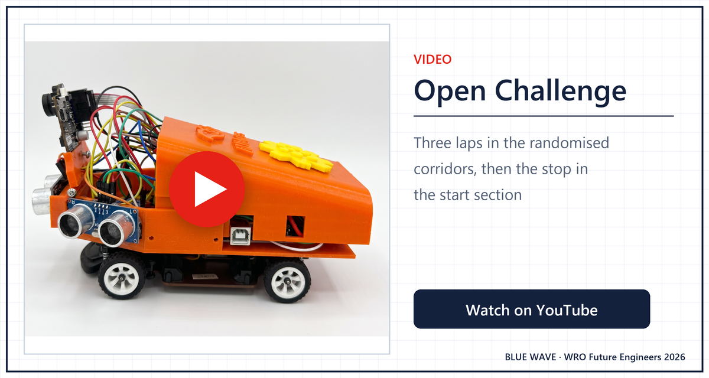
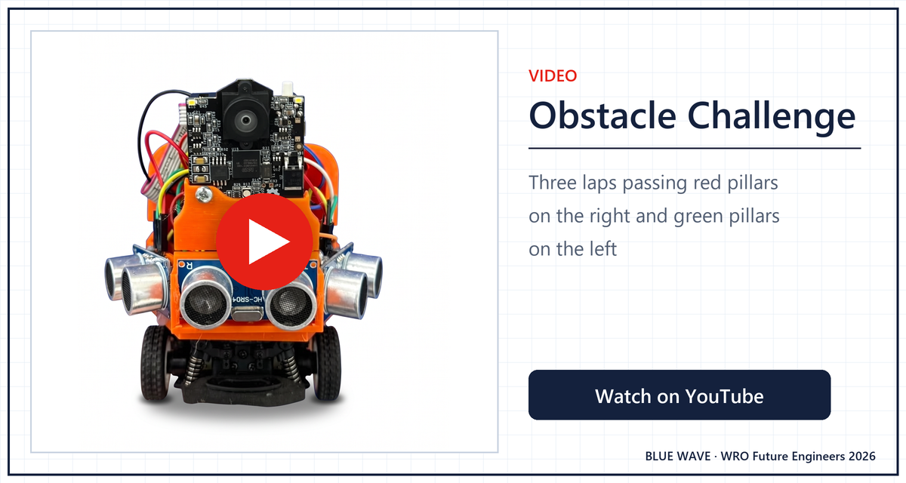

# Videos

Rule 7 (p.9 of the 2026 rules) asks for one YouTube video per challenge, public or unlisted, in which the part showing autonomous driving lasts at least 30 s. The YouTube links below are the videos we submit.

## Challenge videos

  
  

| Challenge | YouTube | Local copy | Clip length | Autonomous driving |
|---|---|---|---|---|
| Open Challenge | https://youtube.com/shorts/v20ntV0ojf4 | - | - | September 2026, the finals car |
| Obstacle Challenge | https://youtube.com/shorts/thUZArGaG4c | - | - | September 2026, the finals car |

## How we film a challenge video

| Challenge | Sketch | What the video shows |
|---|---|---|
| Open Challenge | [`Open_Challenge.ino`](../src/Open_Challenge/Open_Challenge.ino), `PRACTICE 0` | The A2 start switch, three laps, and the stop in the start section |
| Obstacle Challenge | [`Obstacle_Challenge.ino`](../src/Obstacle_Challenge/Obstacle_Challenge.ino), `PRACTICE 0` | The start, three laps, and every pillar passed on its correct side |

Before upload we time the autonomous part with a stopwatch and name the sketch version in the video description. Each link goes in the table above and in the [Results](../README.md#results) section of the main README.
